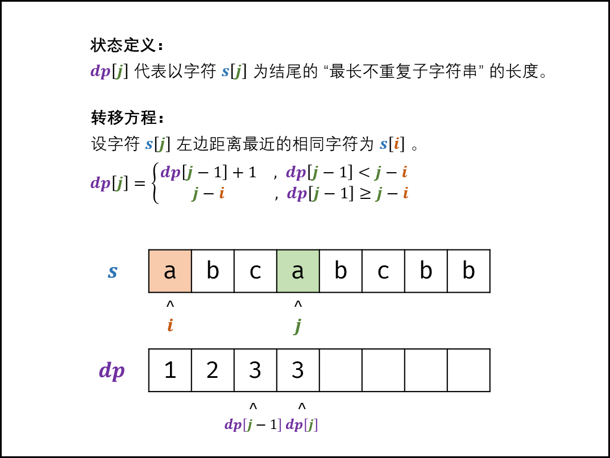

# [最长不含重复字符的子字符串](https://leetcode.cn/problems/zui-chang-bu-han-zhong-fu-zi-fu-de-zi-zi-fu-chuan-lcof/description/)

## 题目

请从字符串中找出一个最长的不包含重复字符的子字符串，计算该最长子字符串的长度

**示例 1:**

```
输入: "abcabcbb"
输出: 3 
解释: 因为无重复字符的最长子串是 "abc"，所以其长度为 3。
```

**示例 2:**

```
输入: "bbbbb"
输出: 1
解释: 因为无重复字符的最长子串是 "b"，所以其长度为 1。
```

**示例 3:**

```
输入: "pwwkew"
输出: 3
解释: 因为无重复字符的最长子串是 "wke"，所以其长度为 3。
     请注意，你的答案必须是 子串 的长度，"pwke" 是一个子序列，不是子串。
```

## 思路

DP问题

**状态定义：**dp[i]代表第i个字符为结尾的最长不重复字符子串的长度

**状态转移：**固定右边界j，设字符串s[j]左边距离最近的相同字符s[i]，即s[i] === s[j]，则

1. 当i<0时，说明s[i]左边没有相同字符，dp[j] = dp[j-1]
2. 当dp[j-1] < j - i，说明字符s[i]**不存在在**dp[j-1]的那个最长字串里面,dp[j] = dp[j-1] 
3. 当dp[j-1] >= j - i，说明字符s[i]**存在在**dp[j-1]的那个最长字串里面，dp[j] = j - i (j-i+1-1)

> 因为i<0时，由于dp[j-1] <= j 恒成立，dp[j-1] <= j - i恒成立(i是负数)，所以情况1和2可以合并

​							dp[j] = dp[j-1]+1, dp[j-1] < j - i

​								  = j-i, dp[j-1] >= j - i



## 简单理解

**dp[j]其实就是看上一个最长字符串dp[j-1]里面，有没有字符s[j]**，如果有，那肯定dp[j]的长度只能是j - i，i是上次s[j]出现的位置，如果存在，那就是取上次出现的位置+1，长度也就是j - (i + 1) + 1，也就是j - i，如果之前不存在相同字符，那长度就是dp[j-1] + 1。

## 代码实现

动态规划+哈希表，哈希表存储字符上次最后出现的位置

```js
    function lengthOfLongestSubstring(s: string): number {
        let dic = new Map<string,number>()
        let tmp = 0,res = 0;
        let j = 0;
        for(let i = 0; i < s.length;i++) {
            if(dic.has(s[i])) {
                j = dic.get(s[i]);
            } else {
                j = -1;
            }
            dic.set(s[i],i);
            tmp = tmp < i - j ? tmp + 1 : i - j
            res = Math.max(tmp,res);
        }
        return res;
    };
```

这里使用`tmp`来代替dp数组，可以节省O(n)的空间，因为只用到了dp[j-1]

## 时间复杂度

时间O(n)

空间O(1)