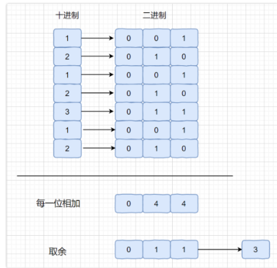

# [数组中出现的数字II](https://leetcode.cn/problems/shu-zu-zhong-shu-zi-chu-xian-de-ci-shu-ii-lcof/description/)

# 题目

在一个数组 `nums` 中除一个数字只出现一次之外，其他数字都出现了三次。请找出那个只出现一次的数字。

**示例 1：**

```
输入：nums = [3,4,3,3]
输出：4
```

**示例 2：**

```
输入：nums = [9,1,7,9,7,9,7]
输出：1
```

# 思路

一个数字都出现了三次，那么这个数字某一位上的1出现的次数应该是3的倍数，获取所有位数上1出现的次数，对3取余之后得到的就是多出来的那个数字。



# 代码

```typescript
function singleNumber(nums: number[]): number {
    let res = 0;
    for (let i = 0; i < 32; i++) {
        let count = 0;
        for(let num of nums) {
            if( (num >> i) & 1) {
                count++;
            }
        }
        if(count %3 !== 0) {
            res = res | 1 << i; // 因为<<的优先级比|高
        }
    }
    return res;
};
```

# 注意点

js中，按位左移 << 的优先级比按位或 | 的优先级高

https://developer.mozilla.org/zh-CN/docs/Web/JavaScript/Reference/Operators/Operator_Precedence

`res = res | 1 << i`这么写，就是把从右边数第i+1位的位数置为1

比如，res = 4 二进制为0100，res = res | 1 << 1 就是 res = 0100 | 0010，就是把从右数第二位的数置为1变为0110