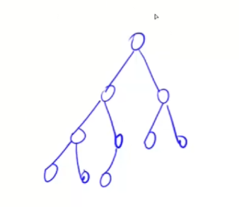

- 58 翻转单词顺序，学到API trim()

- 剑指 Offer 14- II. 剪绳子 II 学到了，js中在整数末尾+n，就是创建一个[BigInt](https://developer.mozilla.org/zh-CN/docs/Web/JavaScript/Reference/Global_Objects/BigInt)

- 382 链表随机节点 整数小数>> 0 || >>> 0可以向下取整

- 295 数据流中的中位数 堆是一个完全二叉树(除了叶子节点，其他节点子节点非空，并且叶子节点从左到右依次排布)，并且以小根堆为例：每个节点都 <= 左右子节点。

堆可以用一个一维数组来存，根节点是1，依次 2 3，每个节点➗2向下取整，就可以得到父节点索引(假设节点索引为X，左儿子为2X，右儿子为2X+1)



- 460 LFU 缓存: set如何获取第一个值

```ts
let s = new Set()
s.keys().next().value // 或者
s.values().next().value
```

- 300 最长上升子序列，如果用new Array(n)方法来声明数组，就会有n个空元素，数组length初始化就是n
