# 1.JS的数据类型有哪些

- 基础数据类型(值类型)：
  - Number
  - String
  - Boolean
  - Undefined
  - Null
  - Symbol(创建后独一无二且不可变的数据类型)
  - BigInt(数字类型的数据，可以表示任意精度格式的整数，使用BigInt可以安全的存储和操作大整数，即使这个数已经超过了Number所能表示的安全整数范围)

- 复杂数据类型(引用类型)

  - Object
  - Function
  - Array
  - RegExp
  - Date
  - 以及单体内置对象(Global Math)等

  基本数据类型的值存放在**栈**中，可直接访问它的值；

  引用数据类型保存在**堆**中，栈中存放的是地址，通过栈中的地址来访问堆中的值

> 栈可以改变原始值
>
> 栈中的数据会被自动清理，堆中的需要手动清除
>
> Symbol.for可以公用同一个Symbol对象

## 1.1 为什么JS要区分两种类型？

**因为它们在内存中的存储方式是不一样的**。 引用数据类型由于占用空间大、占用空间大小不稳定，如果频繁创建会造成性能问题，所以实体数据将存放到**堆(heap)**数据结构中，而在栈中只记录该数据的堆地址即可，使用的时候再根据堆地址去堆内存中查找。

# 2.null和undefined的区别

首先null和undefined都是基本数据类型，两个数据类型分别都只有一个值，就是undefined和null

- null表示一个值被定义了，但是值为**空值**，用法：

  - 作为函数的参数，表示该函数的参数不是对象
  - 作为对象原型链的终点
  - 释放对象内存

- undefined表示不存在这个值，意思此处应该有个值，但是还没有定义，试图读取时就会返回undefined

  - 函数没有返回值时，默认返回undefined
  - 变量声明，但是没有赋值时，值为undefined
  - 对象中没有赋值的属性，值为undefined
  - 使用函数时，该传入的参数没有传入，该参数为undefined

  > 如何安全的获取undefined？ 可以使用void 0
  >
  > 表达式void ___ 没有返回值，所以返回结果是undefined

# 3.如何判断JS的数据类型

1. typeof

typeof可以判断出除了`null`以外的所有基础数据类型，还能从引用类型中判断出函数`function`

typeof的返回值有

- number
- string
- boolean
- undefined
- symbol
- bigint
- function
- object(typeof null的返回值就是object)

```js
typeof 1 // 'number'
typeof '1' // 'string'
typeof true // 'boolean'
typeof undefined // 'undefined'
typeof Symbol() // 'symbol'
typeof null // 'object'
typeof [] // 'object'
typeof {} // 'object'
typeof console // 'object'
typeof console.log // 'function'
```

2. instanceof

一般是用来判断复杂数据类型，**不能正确判断基础数据类型**，根据**构造函数的原型对象是否出现在对象的原型链上来进行判断**

```js
1 instanceof Number; // false
true instanceof Boolean; // false
'str' instanceof String; // false
[] instanceof Array; // true
function(){} instanceof Function; // true
{} instanceof Object; // true
let date = new Date();
date instance of Date; // true
```

```js
function myInstanceof(left,right) {
    let proto = Object.getPrototypeOf(left) // 获取对象的原型
    prototype = right.prototype // 获取构造函数的原型对象 
    // 判断构造函数的原型对象在不在检测对象的原型链上
   	while(true) {
        if(!proto) return false
        if(proto === prototype) return true
        	
        proto = Object.getPrototypeOf(proto)
    } 
}
```

3. Object.prototype.toString().call

```js
Object.prototype.toString({}) // "[object Object]"
Object.prototype.toString.call({}) // 同上结果，加上call也ok
Object.prototype.toString.call(1) // "[object Number]"
Object.prototype.toString.call('1') // "[object String]"
Object.prototype.toString.call(true) // "[object Boolean]"
Object.prototype.toString.call(function () {}) // "[object Function]"
Object.prototype.toString.call(null) //"[object Null]"
Object.prototype.toString.call(undefined) //"[object Undefined]"
Object.prototype.toString.call(/123/g) //"[object RegExp]"
Object.prototype.toString.call(new Date()) //"[object Date]"
Object.prototype.toString.call([]) //"[object Array]"
Object.prototype.toString.call(document) //"[object HTMLDocument]"
Object.prototype.toString.call(window) //"[object Window]"
```

4. Array.isArray()

专门用来判断是否是数组

```js
Array.isArray([]); // true
Array.isArray({}); // false
Array.isArray(1); // false
Array.isArray('string'); // false
Array.isArray(true); // false
```

# 4. == 和 === 的区别

- `==`称为等值符，当等号两边的值为相同类型时比较值是否相同；当类型不同时会发生类型的自动转换，转换成相同的类型后再进行比较
- `===`称为全等符，当等号两边的值为相同类型时比较值是否相同；当类型不同时直接返回false，也就是意味着不仅进行值比较，还进行类型比较

# 5.如何遍历对象的属性

- 遍历自身**可枚举的属性**(可枚举、非继承属性):`Object.keys`,返回一个由给定对象的自身可枚举属性组成的数组
- 遍历自身**除Symbol值作为名称的属性之外的所有属性**(可枚举、不可枚举、非继承属性):`Object.getOwnPropertyNames()`方法返回一个由指定对象的所有自身属性的属性名组成的数组,Symbol以外的非继承属性（包括不可枚举属性**但不包括 Symbol 值作为名称的属性**）

- 遍历自身的**所有属性**：`Reflect.ownkeys()`方法返回一个由目标对象的自身属性键(包括Symbol值作为名称的属性)组成的数组，也就等价于`Object.getOwnPropertyNames(target).concat(Object.getOwnPropertySymbols(target))`

- 遍历**可枚举的自身属性和继承属性**：for...in...(for in还会遍历到原型链上的属性，所有看到很多代码上，for in之后还要用hasOwnProterty来判断一下是否是自身属性，才进行下一步逻辑)

# 6.如何判断两个对象是否相等

1.`Object.is(obj1,obj2)`，判断两个对象的引用地址是否一致

2.判断两个对象内容是否一致：思路是遍历对象的所有键名和键值是否一致

​	1 判断两个对象引用地址是否一致

​	2 使用`Object.getOwnPropertyNames()`得到两个对象的键名数组

​	3 对比键名数组是否一致

​	4 对比键值是否一致

```js
function isObjectEqual(obj1,obj2){
    if(obj1 === obj2) return true;
    
    let aProps = Object.getOwnPropertyNames(obj1)
    let bProps = Object.getOwnPropertyNames(obj2)
    
    if(aProps.length !== bProps.length) return false
    for(let prop in obj1) {
        if(obj2.hasOwnProperty(prop)) {
            if(typeof a[prop] === 'object') {
                if(!isObjectEqual(a[prop],b[prop])) return false
            }else if(a[prop] !== b[prop]){
                return false
            }
        } else {
            return false
        }
    }
	return true
}
```

# 7.var，let，const区别

> https://www.bookstack.cn/read/es6-3rd/spilt.1.docs-let.md

1. let/const是ES6提出来的，而var是ES5提出来的
2. let/const在声明变量/常量之前，该变量都是不可用的，称为**暂时性死区(temporal dead zone，简称TDZ)**

> var存在变量提升，即提升声明到当前作用域的最前面。let和const其实也存在，就是因为暂时性死区的存在导致变量不可获取

3. var没有块级作用域，var只有函数和全局作用域，而let/const有块级作用域的概念

4. const声明的是常量，而let/var声明的是变量

5. const在声明时必须赋值，而let/var不必

6. let/const不允许在相同作用域内，重复声明同一个变量。而var是可以的，最后一个var声明的值会覆盖之前的，比如

```js
let a = 1; let a = 2; // 报错
var a = 1; var a = 2; // 最后a的值为2
```

> 补充：
>
> 1. for循环有个特别之处，设置循环变量的部分是一个父作用域，而循环体内不是一个单独的子作用域
>
> ```js
> for (let i = 0; i < 3; i++) {
>     let i = 'abc';
>     console.log(i);
> }
> // abc
> // abc
> // abc
> ```
>
> 该代码正常运行，输出了3次abc，表明函数内部的变量i和循环变量i不在同一个作用域，有各自单独的作用域
>
> 2. 暂时性死区的a本质就是，只要一进入当前作用域，所要使用的变量就已经存在了，但是不可获取，只有等到声明变量的那一行代码出现，才可以获取和使用该变量。

# 8.作用域

**作用域：**变量和函数生效的区域和集合，作用于决定了代码区块中资源的可见性，一般分为`全局作用域` 和`局部作用域`（函数作用域、块级作用域(ES6新增)）

- 全局作用域：任何不在函数或者大括号中声明的变量，都处在全局作用域中，全局作用域下的变量可以在代码的任意位置访问
- 函数作用域：在函数内部声明的变量，就处在函数作用域下，这些变量只能在函数内部访问
- 块级作用域：用{}划分的作用域，需要使用let/const来声明

**作用域链：**当JS中使用一个变量时，JS引擎会尝试在当前作用域下寻找该变量，如果没有找到，就会到他的上层作用域寻找，以此类推，直到找到该变量或者查找到全局作用域仍然找不到该变量，在非严格模式下会隐式声明该变量，或者直接报错

**静态作用域：**JS采用的是词法作用域(静态作用域)，也就是说，**函数作用域在定义时候就决定了**，例如下面

```js
var value = 1;
function foo() {
    console.log(value);
}
function bar() {
    var value = 2;
    foo();
}
bar();
// 结果是 1
```

## 个人总结

作用域规定了代码块中资源的可见性，一般分为全局作用域、函数作用域、块级作用域；

全局作用域：在最外层函数以及最外层大括号外声明的变量，都处在全局作用域中，全局作用域下的变量可以在代码的任意位置访问；

函数作用域：在函数内部所拥有的作用域；

块级作用域：用大括号划分的作用域，需要用let/const来声明变量

作用域链：JS是词法作用域，也就是静态作用域，作用域在代码层面以及确定好了，在执行上下文中有一个[[Scope]]属性保存着对父级作用域的引用，会用这个属性链接上执行上下文的活动对象形成作用域链，类似于`活动对象.concat([[Scope]])`。当js查找变量时，先在当前作用域中查找，如果没找到，就会沿着作用域链向外层作用域寻找，直到找到或者在全局作用域依然找不到，在严格模式下就会报错，非严格模式下会隐式的生成该全局变量

# 9.JS的预解析

当HTML解析器遇到Script标签时，因为觉得Script内的脚本可能会修改DOM，所以会停止文档的解析，脚本执行完成之后才会继续解析后续的内容。如果script标签是引用类型，那么会让网络进程去下载这段代码，并且在下载过程中，也会让HTML解析器停止解析。

而且因为下载的过程因为网络的原因可能会非常长，所以chrome会做一个优化：**预解析操作**


渲染引擎一开始收到字节流的时候，会先开启一个预解析线程，用来查找HTML文件中有关JS和CSS文件，解析到相关文件之后，预解析线程会提前进行下载

# 10.事件监听


# 11.onClick和addEventListener区别

1. onClick默认只捕获冒泡事件，addEventListener由传入的第二个参数控制(默认false为冒泡阶段，true为捕获阶段)
2. onClick重复绑定会覆盖，addEventListener可以同一事件绑定多个回调
3. onClick取消事件，重新赋值为null，addEventListener用removeEventListener

# 12.Array.from()和Array.of()的使用

`Array.from()`：将伪数组或可遍历对象转化为真数组，接受三个参数，input、map、context

- input：待转换的伪数组或者可遍历对象
- map：类似于数组中的map方法，一个函数，对每个元素进行处理后加入到新数组中
- 绑定map中的this

`Array.of()`：将一系列值转换为数组，会创建一个包含所有传入参数的数组，而不管参数的类型和数量，解决了new Array()行为不统一的问题：比如new Array(1)就是创建一个长度为1的数组，而new Array(1,2,3)就是创建一个[1,2,3]数组。

# 13.原型和原型链

**原型：**

在js中，每一个构造函数内部都显示的有一个`prototype`属性，称为函数的原型，该属性的值是一个对象，称为该构造函数的原型对象。这个对象包含了该构造函数生成的实例所共享的属性和方法。

每一个对象都有私有属性`[[prototype]]`，称为对象原型，指向构造函数的原型对象，但是我们不能直接使用这个私有属性，浏览器环境提供了`__proto__`属性来访问这个属性，但最好不要使用这个属性，因为不是规范中规定的，ES5中新增`Obeject.getPrototypeOf()`方法可以获取对象的原型。

**原型链：**

当我们访问一个对象的属性时，如果对象内部不存在这个属性，就会到它的原型(也就是构造函数的原型对象)中去寻找，原型对象也是个对象，它又有自己的原型，就会这么一直找下去，直到找到或者查到`Object.prototype.__proto__`也就是null。就形成了原型链的概念。

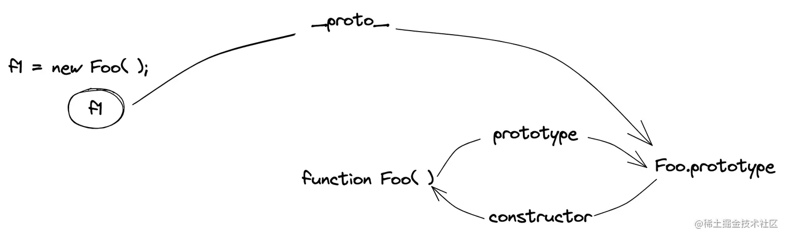

**特点：**

JS对象是通过引用类型，创建的每个新对象并没有属于自己的原型副本，当原型修改时，所有与之相关的对象都会继承这一改变

## 可能的追问

- `Function.__proto__`

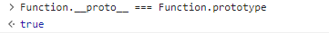

- `Function.prototype.__proto__`


- `Array.__proto__是什么？`

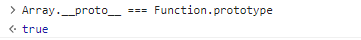

- `Object.__proto__呢？`

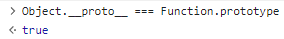

​	因为`Array和Object都是构造函数，所以原型自然是Function.protoype`

- 你觉得JS为什么要有原型这种机制？
  - JavaScript采用原型编程，所有对象都能共享原型上的方法，**节省内存**;
  - 同时基于原型这一实现思想，JavaScript通过找对原型链，**方便地实现了继承**。

# 14.new操作符的实现

1. 首先新建一个空对象
2. 将新建空对象的原型指向构造函数的原型对象
3. 更改this指向新建对象，执行一次构造函数(为新对象增加属性)
4. 判断构造函数的返回值类型，如果是引用类型，就返回这个引用类型的对象，如果是值类型，就返回第一步新建的对象

```js
	function myNew(context) {
        if(typeof constructor !== 'function'){
            console.error("type error");
            return;
        }
        let newObj = null;
        let constructor = Array.prototype.shift.call(arguments);
        let result = null;
        newObj = Object.create(constructor.prototype);
        result = constructor.apply(newObj,arguments);
        let flag = result && (typeof result ==='object' || typeof result === 'function')
        return flag?result:newObj;
    }
	// 使用
	myNew(构造函数，参数)
```

# 15.闭包

在 JavaScript 中，每当创建一个函数，闭包就会在函数创建的同时被创建出来。可以在一个内层函数中访问到其外部的作用域。

当函数被创建出来，内部的[[environment]]属性,ES5之前是[[Scope]]属性,保存着对父级词法环境的引用，就算父级执行上下文销毁了，它的词法环境还存在在内存中并且依然被内部函数的词法环境引用着，所以不会被垃圾回收机制回收，变量属性依然保存在内存中，内部函数依然可以直接从内存中取值，也就形成了闭包。可以说JS中每一个函数都是一个闭包

优点作用就是可以保护私有变量，延长局部变量的生命周期；避免全局变量污染。一开始的模块化就有用过这种方式，还有JQuery库也是这么实现的，还有各种JS事件也利用了闭包，节流防抖等等。

# 16.this的理解

(JS的this是执行上下文中一个特殊的属性，表明了调用者的信息)总的原则就是谁调用的就指向谁。

js里函数调用有4种方法。第一个是作为对象函数调用，这时候就指向调用的对象。还有一个是作为函数调用，这时候this指向全局对象。箭头函数又比较特别，箭头函数的this某种程度上就规避了一开始的设计缺陷，箭头函数没有自己的this，他的this和外层词法环境的this指向一致，它的取值规范和变量类似，沿着作用域链一层一层向上找。

第三种是作为构造函数，这时候this指向新的实例对象。

最后一个是显式调用，就是call/apply/bind，this就指向显式调用的对象。

JS的this指向我觉得是个设计缺陷，js是静态作用域，而this指向是运行时绑定的，它的指向取决于调用时的条件，更偏向于动态作用域(我感觉是挺万恶的)。

# 17.箭头函数和普通函数的区别

1. 箭头函数比普通函数更加简洁
	1. 如果没有参数，只写一个()即可
	2. 如果只有一个参数，可以省去参数的括号
	3. 如果函数体的返回值只有一句，可以省略大括号
	4. 如果函数体不需要返回值，且只有一句话，可以在语句前面加一个void `let fun = () => void doseNotReturn()`
2. 箭头函数没有自己的this、prototype、super、new.target、arguments(使用rest代替)
3. 箭头函数不能作构造函数，也就是不能使用new命令(箭头函数没有prototype)
4. 箭头函数没有自己的this，他的this和外层词法环境的this指向一致，它的取值规范和变量类似，沿着作用域链一层一层向上找。使用call、apply、bind并不能改变箭头函数中的this指向，前两者只会传入参数并调用函数，bind方法只会返回一个预设参数的新函数
# 18.JS中内存泄露的几种情况

内存泄漏一般指系统进程中不再使用的内存，如果没有及时释放，就造成资源浪费，导致程序运行减慢乃至系统崩溃。

程序认为一个变量已经没用了，但是垃圾回收机制认为他还有用，没有及时回收，就会造成内存泄漏

原因一般有

1. **意外全局变量**：在局部作用域中，垃圾回收机制可以做出判断回收资源；但是对于全局变量，很难判断什么时候不用这些变量，无法正常回收。
  1. 尽量少使用全局变量
  2. 使用严格模式
2. **闭包引起的内存泄漏**：闭包可以延长局部变量的生命周期，如果在使用完毕后没有清理闭包，可能会引起内存泄漏
3. **被遗忘的定时器**：定时器和延时器不再需要使用，且没有被清理时，导致定时器回调函数及内部变量没有被回收就会造成内存泄漏。
    解决方法：当不需要定时器时，及时使用clearInterval或者clearTimeout手动清理
4. **事件监听**：垃圾回收机制不好判断事件是否需要被接触，导致回调函数不能被释放，需要手动接触
    解决方法：即使使用removeEventListener移除事件监听
5. **元素引用没有清理**
    解决方法：手动设置元素的引用为null
6. **console**：传递给console.log的对象不能被垃圾回收，可能会出现内存泄漏

## 18.1 如何查找内存泄漏

通过浏览器开发者工具Performance(性能)、Memory(内存)选项卡查看

通过性能选项卡录制页面，等待页面加载完成后，点击stop按钮，面板上就会显示内存占用情况

如果内存占用基本平稳，接近水平，就说明不存在内存泄漏。反之，就是内存泄漏了。

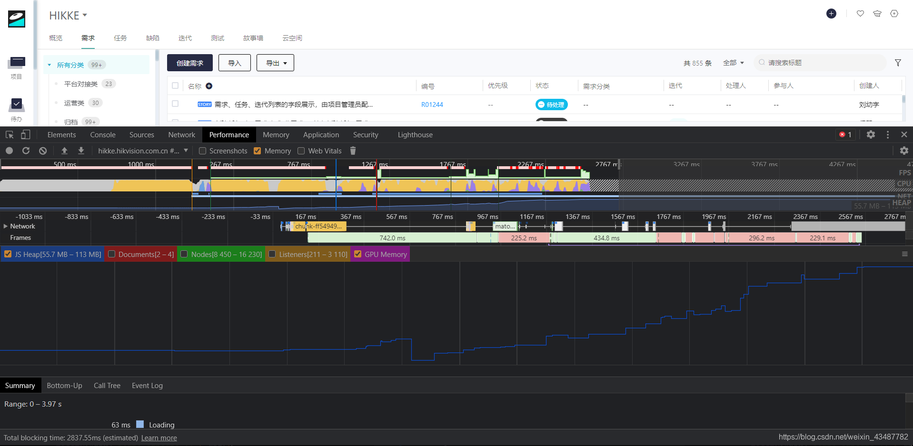

还可以查看Memory选项卡，这里显示了每一项的内存占用情况，查看是哪些部分内存占用率高

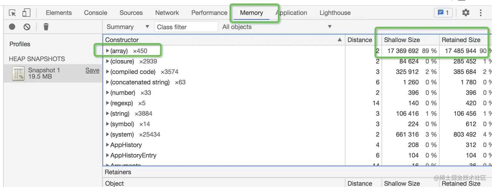


# 19.浅拷贝

**浅拷贝：**指的是一个新的对象对原始对象进行精确的拷贝，如果拷贝的是基础数据类型，就会拷贝基础数据类型的值，如果拷贝的是引用数据类型，就会拷贝内存地址。浅拷贝只会拷贝一层。

**对象浅拷贝常见方法：**

1. 使用`Object.assign()`方法

assign方法是ES6提供的拷贝方法，传入的第一个参数是目标对象，后续参数为需要拷贝的对象

- 如果对象和源对象有同名属性，或者源对象之间有同名属性，后面的会覆盖前面的
- 如果函数只有一个参数，该参数是对象就返回该对象，不是对象就会将对象包装成一个对象返回
- 但是null和undefined不能转化为对象，第一个参数不能为null或者undefined

```js
let target = {a: 1};
let object2 = {b: 2};
let object3 = {c: 3};
Object.assign(target,object2,object3);  
console.log(target);  // {a: 1, b: 2, c: 3}
```

2. 使用拓展运算符

`let cloneObj = {...obj1}`

```js
let obj1 = {a:1,b:{c:1}}
let obj2 = {...obj1};
obj1.a = 2;
console.log(obj1); //{a:2,b:{c:1}}
console.log(obj2); //{a:1,b:{c:1}}
obj1.b.c = 2;
console.log(obj1); //{a:2,b:{c:2}}
console.log(obj2); //{a:1,b:{c:2}}
```

3. Object.defineProperties

```js
function shallowCopy(obj) {
    return Object.defineProperties({}, Object.getOwnPropertyDescriptors(obj));
}
```

**数组进行浅拷贝:**

1. `Array.prototype.slice(start,end)`

- 从原数组中返回特定的元素，不会改变原数组
- 传入两个可选参数，代表返回数组的开始索引和结束索引，都不传可以实现数组的浅拷贝

```js
let arr = [1,2,3];
let cloneArr = arr.slice();
arr === cloneArr // false
```

2. `Array.prototype.concat()`

- 用于合并多个数组，不会改变原数组，只会返回一个新数组

```js
let arr = [1,2,3]
let cloneArr = arr.concat()
arr === cloneArr // false
```

3. 展开运算符

```js
let arr3 = [...arr];
```

# 20.深拷贝

- 浅拷贝：如果属性是基础类型，拷贝的就是基础类型的值；如果是引用类型，拷贝的就是引用地址，即拷贝一层，深层次的引用类型则共享内存地址
- 深拷贝：开辟一个新的空间，两个对象的属性完全相同，但是对应两个不同的地址，修改一个对象的属性，不会改变另一个对象的属性。

**深拷贝：**相较于浅拷贝，当深拷贝遇到引用类型的时候，会新建一个引用类型并将相应的属性赋值给它，因此拷贝出来的是一个新的对象。和源对象对比内容一样，但是地址不一样。修改一个对象的属性，另一个不会跟着修改。

具体代码在手写md文件里

> [使用json.stringify会出现的问题](https://blog.csdn.net/qq_36566924/article/details/123766241)
>
> 如果obj里有函数，undefined，则序列化的结果会把函数、undefined丢失。
> 如果obj里面存在时间对象,JSON.parse(JSON.stringify(obj))之后，时间对象变成了字符串。
> 如果obj里有NaN、Infinity和-Infinity，则序列化的结果会变成null。
> JSON.stringify()只能序列化对象的可枚举的自有属性。如果obj中的对象是有构造函数生成的，则使用JSON.parse(JSON.stringify(obj))深拷贝后，会丢弃对象的constructor。如果对象中存在循环引用的情况也无法正确实现深拷贝。
> 如果obj里有RegExp、Error对象，则序列化的结果将只得到空对象。

# 21.点击刷新按钮或者按 F5、按 Ctrl+F5 （强制刷新）、地址栏回车有什么区别？

**点击刷新按钮或者按 F5：**强缓存和协商缓存都有效

**用户按 Ctrl+F5（强制刷新）：** 强缓存和协商缓存都失效，相当于第一次请求，返回状态码200

地址栏回车： 浏览器发起请求，按照正常流程，本地检查是否过期，然后服务器检查新鲜度，最后返回内容。

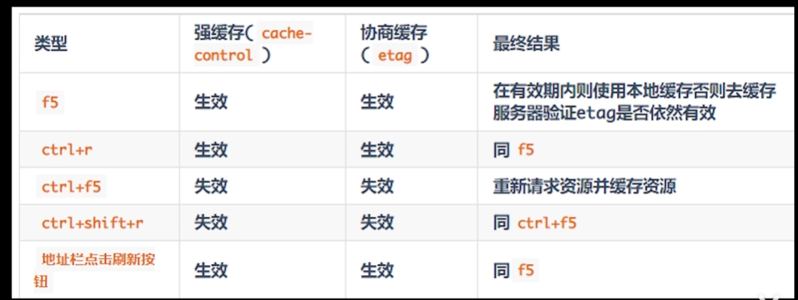

# 22.ES5的继承

使用原型来进行继承，举例

下面是一个Shape构造函数，要让Rectangle构造函数继承Shape

```ts
function Shape() {
  this.x = 0;
  this.y = 0;
}

Shape.prototype.move = function (x, y) {
  this.x += x;
  this.y += y;
  console.info('Shape moved.');
};
```

总的分为两步

```js
// 第一步，子类继承父类的实例
function Rectangle() {
  Shape.call(this); // 调用父类构造函数
}
// 另一种写法
function Rectangle() {
  this.base = Shape;
  this.base();
}

// 第二步，子类继承父类的原型
Rectangle.prototype = Object.create(Shape.prototype);
Rectangle.prototype.constructor = Rectangle;
```

**其中`Object.create()` 静态方法以一个现有对象作为原型，创建一个新对象。**

采用这样的写法以后，`instanceof`运算符会对子类和父类的构造函数，都返回`true`。

```
var rect = new Rectangle();

rect instanceof Rectangle  // true
rect instanceof Shape  // true
```

上面代码中，子类是整体继承父类。有时只需要单个方法的继承，这时可以采用下面的写法。

```
ClassB.prototype.print = function() {
  ClassA.prototype.print.call(this);
  // some code
}
```

上面代码中，子类`B`的`print`方法先调用父类`A`的`print`方法，再部署自己的代码。这就等于继承了父类`A`的`print`方法。

# 23.变量提升/函数提升

## 1.变量提升

在ES6出来之前，JS并没有块级作用域这一说，只有全局作用域和局部作用域。

变量提升指的是使用var声明的变量提升到他所在的作用域的最顶端。

> 只提升变量，不提升赋值

举个例子

```
console.log(a)   //undefined
var a='我是谁'
console.log(a)   //'我是谁'
```

过程相当于

```js
var a;
console.log(a);
a='我是谁'
console.log(a)
```

## 2.函数提升

js中创建函数有两种方式：
- 函数声明式 function fn() {}
- 函数表达式。var fn = function() => {} //这种更像是变量提升
**只有函数声明才存在函数提升**；而对于赋值的匿名函数，并不会存在函数提升。
```js
console.log(a);    // f a()
console.log(b);    //undefined     

function a(){
    console.log('hello')
}

var b = function(){
    console.log('world')
}

```
就相当于
```js
function a(){
    console.log('hello')
}
var b;
console.log(a);   
console.log(b);
b = function{
    console.log('world')
}
```
### 2.1块级作用域中的函数提升

在ES6浏览器运行下面的代码会报错
```js
// 浏览器的 ES6 环境
function f() { console.log('I am outside!'); }
(function () {
  if (false) {
    // 重复声明一次函数f
    function f() { console.log('I am inside!'); }
  }
  f();
}());
// Uncaught TypeError: f is not a function
```
原来，如果改变了块级作用域内声明的函数的处理规则，显然会对老代码产生很大影响。为了减轻因此产生的不兼容问题，ES6 在[附录 B](https://www.ecma-international.org/ecma-262/6.0/index.html#sec-block-level-function-declarations-web-legacy-compatibility-semantics)里面规定，浏览器的实现可以不遵守上面的规定，有自己的[行为方式](https://stackoverflow.com/questions/31419897/what-are-the-precise-semantics-of-block-level-functions-in-es6)。
- 允许在块级作用域内声明函数。
- 函数声明类似于`var`，即会提升到全局作用域或函数作用域的头部。
- 同时，函数声明还会提升到所在的块级作用域的头部。

注意，上面三条规则只对 ES6 的浏览器实现有效，其他环境的实现不用遵守，还是将块级作用域的函数声明当作`let`处理。
根据这三条规则，浏览器的 ES6 环境中，块级作用域内声明的函数，行为类似于`var`声明的变量。上面的例子实际运行的代码如下。

```javascript
// 浏览器的 ES6 环境
function f() { console.log('I am outside!'); }
(function () {
  var f = undefined;
  if (false) {
    function f() { console.log('I am inside!'); }
  }
  f();
}());
// Uncaught TypeError: f is not a function
```

所以如果要在块级作用域中声明函数，尽量写成函数表达式

```javascript
// 块级作用域内部的函数声明语句，建议不要使用
{
  let a = 'secret';
  function f() {
    return a;
  }
}

// 块级作用域内部，优先使用函数表达式
{
  let a = 'secret';
  let f = function () {
    return a;
  };
}
```

## 3.变量提升和函数提升的优先级

函数是一等公民，**函数提升优先级高于变量提升，且不会被同名变量声明覆盖，但是会被变量赋值后覆盖。**而且存在同名函数与同名变量时，优先执行函数。

```js
    console.log(typeof fn); // function

    function fn() {
        console.log('Hello World');
    }

    console.log(typeof fn); // function 

    var fn = 1;

    console.log(typeof fn); // number
```

实际相当于

```js
	function fn() {
        console.log('Hello World');
    }
	var fn; // 注意，同名变量声明不会覆盖函数声明

	console.log(typeof fn); // function

	// ...原函数定义被剪切走了

	console.log(typeof fn); // function

	fn = 1; // 但是会被变量赋值覆盖

	console.log(typeof fn); // number
```

# 24.cookie和localStorage的区别

1. 大小：cookie的存储容量较小，在4K左右，Storage要大得多，5M左右
2. cookie会在同源的http请求中自动携带，还可以通过path属性来限制在特定的路径中才能使用，storage只是存在本地，不会自动携带
3. 有效期不同：sessionStorage在会话窗口关闭前都有效，localStorage始终有效，可以持久化保存数据，除非手动清除。cookie会在设置的时间过期前有效，有max-age和expire属性来设置过期时间。
4. 作用域不同，sessionStorage不能在不同的浏览器窗口中共享，localStorage和cookie可以在同源的窗口中共享

# 25.cookie的属性

> cookie的诞生是为了解决http的无状态特点产生的，不用于存储数据
>
> [这个讲的相当不错](https://www.bilibili.com/video/BV1uG4y1t7dm/?spm_id_from=333.880.my_history.page.click&vd_source=7dcb6c648b7faefd7170d0fc0494d4ad)

- Name:cookie名称
- value:cookie的值
- size:cookie的大小
- max-age：cookie生效的秒数
- expire：最长有效时间
- domain:cookie在哪个域下可以被接受，并且子域名也可以访问父域名的cookie

> 子域名可以设置父域名的cookie，但是父域名不能给子域名设置cookie
>
> 当设置为`.a.com`时候，子域名就可以访问该cookie，表明该cookie作用于当前域和子域
>
> 如果手动设置cookie的时候没手动设置domain，就只会在当前域生效，而手动设置了`a.com`，最后结果还是`.a.com`，非常神奇

- path：cookie可以在哪个路径下可以被接受
- httpOnly：是否可以通过js访问该cookie
- secure：标记为 secure 的 Cookie 只应通过被 Https 协议加密过的请求发送给服务端
- someSite：设置跨站策略
  - someSize:None: 浏览器在同站请求、跨站请求下都会发送 Cookies
  - someSize:Strict: 浏览器只会在相同站点下发送 Cookies
  - someSize:Lax: 默认值，只允许部分跨站请求携带cookie
  
  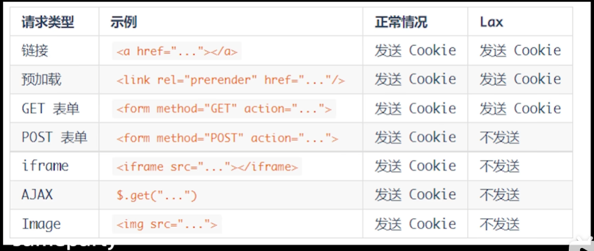

# 26.对防抖节流的认识

## 防抖

一般使用防抖需要满足三个条件

- 频繁的调用某个函数
- 造成了页面卡顿或者性能损失
- 以最后一次函数调用结果为准

# 27.事件循环

它是JS的执行机制，JS是单线程语言，一次只能执行一个任务，遇到一些高耗时的任务就会堵塞页面。所以JS将任务分为两种

- 同步任务
- 异步任务

(JS是单线程的，但是浏览器不是单线程的)。两种任务分别进入不同场所，同步任务进入主线程依次调用执行，而异步任务先到Event Table中注册回调函数，由专门的线程进行控制，当指定事情完成后，会将回调函数移入Event Queue回调队列中，当主线程任务为空了，(JS引擎有额外的进程进行监督)，就会从Event Queue依次读取回调函数执行。这个过程不断往复，称为事件循环。

而异步任务也分为两种，微任务和宏任务。两者的回调函数会移入不同的任务队列中。微任务会比宏任务先执行。

常见的宏任务有，整个script代码块，setTimeout，setInterval，ajax，DOM事件等等。

常见的微任务有Promise.then、queueMicroTask,MutationObserver，node环境有process.nextTick()

在一次事件循环中，当主线程同步任务执行完了，执行栈为空了，就会从微任务队列中依次取出函数执行，如果有新增的微任务，也会一直执行。然后微任务执行完了，会执行一次渲染函数。然后会去从宏任务队列中再取出一个任务来执行。依次不断往复。

这是JS一个很显著的特点吧。它的设计目的决定了它不可能多线程，就有了事件循环机制来模拟出多线程。

# 28. 继承

## 原型链继承

```js
//原型链继承
function Parent() {
  this.name = 'Jerry'
  this.food = ['apple'];
}
Parent.prototype.say = function () {
  console.log('hello');
}

Son.prototype = new Parent() 

function Son() {
  this.age=18
}

let s1 = new Son()

console.log(s1.name);  //Jerry
console.log(s1.say());  //hello
```

优点

- 父类方法可以复用
- 可以访问到父类原型对象上的属性

缺点

- 子类继承而来的引用类型数据(对象、数组)是被子类共享的，更改了一个子类实例对象的数据，其他子类实例对象都会受到影响，因为他们继承的都是同一份

  - ```js
    let s1 = new Son()
    console.log(s1.name) // 'Jeerry'
    s1.name = 'TOM' // 会给s1对象自身新增一个属性name
    s1.food.push('juice');
    let s2 = new Son()
    console.log(s2.name) // 'jerry' // 原型上的name
    console.log(s2.food) // ['apple','juice']; 收到了影响
    ```

- 子类不能给父类传参

## 构造函数继承

```js
//经典继承
function Parent(name) {
  this.name = name
}
Parent.prototype.say = function () {
  console.log('hello');
}

function Son(name) {
  Parent.call(this,name)   //this.name = name
  this.age=18
}

let s1= new Son('Jerry')

console.log(s1.name);   //Jerry
console.log(s1.say());  //TypeError: s1.say is not a function
```

优点

- 父类的引用数据类型数据不会被子类共享，不会互相影响
- 子类可以给父类传参

缺点

- 子类不能访问父类原型对象上的方法和参数

## 组合继承

将前两种方案组合一下

```js
//组合继承
function Parent(name) {
  this.name = name
}

Parent.prototype.say = function () {
  console.log('hello');
}

Son.prototype = new Parent();

function Son(name) {
  Parent.call(this, name)   //继承到父类实例属性
  this.age = 18

}

let s1 = new Son('Jerry')

console.log(s1.name);   //Jerry
console.log(s1.say());  //hello
```

优点

- 父类可以复用
- 父类构造函数中的引用类型数据不会被共享
- 可以访问父类原型对象上的方法

缺点

- 会调用两次父类的构造函数，会有两份一样的属性,浪费空间，影响性能

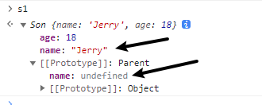

## 寄生组合继承(也是第22条的继承方式)

非常完美

```js
//组合继承
function Parent(name) {
  this.name = name
}

Parent.prototype.say = function () {
  console.log('hello');
}

Son.prototype = Object.create(Parent.prototype) // 拷贝一份Parent的原型对象
Son.prototype.constructor = Son // 这一步很重要

// 如果没有Object.create方法，这是ES5的，可以用一个函数作为过渡
//function F() {}
//F.prototype = Parent.prototype
//Son.prototype = new F();
//Son.prototype.constructor = Son

function Son(name) {
  Parent.call(this, name)   //继承到父类实例属性
  this.age = 18
}

let s1 = new Son('Jerry')

console.log(s1.name);   //Jerry
console.log(s1.say());  //hello
```

- 解决了组合继承会有两份同样属性的问题

## ES6的extends语法

```js
class Parent {
  constructor (value) {
    this.val = value
  }
  getValue() { 
    console.log(this.val);
  }
}

class Child extends Parent {
  constructor (value) {
    super(value)
    //super(); this.val = value
  }
}

let c = new Child(1)
c.getValue()
// console.log(c);
```

# 29.进程和线程的区别

从本质上说，进程和线程都是对 CPU 工作时间片的一个描述：

- 进程描述了 CPU 在运行指令及加载和保存上下文所需的时间，放在应用上来说就代表了一个程序。
- 线程是进程中的更小单位，描述了执行一段指令所需的时间。

**进程是资源分配的最小单位，线程是CPU调度的最小单位。**

一个进程就是一个程序的运行实例。启动一个程序的时候，操作系统会为该程序创建一块内存，用来存放代码、运行中的数据，并开辟一条或多条线程进行执行，我们把这样的一个运行环境叫**进程**。。而线程我个人理解为进程的进程，进程的出现是为了解决多进程资源消耗太大的问题，以及提高响应速度，比如一个文本编译器进程，就需要有线程进行编辑操作，有线程进行保存操作。有线程进行渲染操作。线程之间可以共享进程的资源，相比之下，进程之间通信就麻烦的多，有管道通信， 消息队列通信，信号通信，共享内存通信等等。

两者区别:

- 进程可以看做独立应用，线程不能

- 资源：进程是cpu资源分配的最小单位（是能拥有资源和独立运行的最小单位）；线程是cpu调度的最小单位（线程是建立在进程的基础上的一次程序运行单位，一个进程中可以有多个线程）。

- 通信方面：线程间可以通过直接共享同一进程中的资源，而进程通信需要借助进程间通信。

- 调度：进程切换比线程切换的开销要大。线程是CPU调度的基本单位，线程的切换不会引起进程切换，但某个进程中的线程切换到另一个进程中的线程时，会引起进程切换。

- 系统开销：由于创建或撤销进程时，系统都要为之分配或回收资源，如内存、I/O 等，其开销远大于创建或撤销线程时的开销。同理，在进行进程切换时，涉及当前执行进程 CPU 环境还有各种各样状态的保存及新调度进程状态的设置，而线程切换时只需保存和设置少量寄存器内容，开销较小。

## 个人总结

从本质来说，进程和线程都是对CPU工作时间片的一种描述，**进程是资源调度的最小单位，线程是CPU调度的最小单位。**

一个进程就是一个程序的运行实例，启动一个程序，OS会为程序分配内存空间存放运行代码所需要的数据，并开辟一条或多条线程进行执行代码，这么一个在内存里的程序实例就是进程，而线程我个人理解为进程的进程，或者叫进程的控制单元，它的出现是为了解决多进程资源消耗过大的问题。因为线程的切换比进程的切换开销要小，线程之间可以共享进程内的数据。此外还能提高响应速度，比如一个文本编译器进程，可能有编辑线程，渲染线程，保存线程等等，他们都可以共享进程中的资源，并行或并发工作提高响应速度。

但是也有问题，一个线程出现问题，整个进程就会崩溃。

> 可能会问区别，看上面
>
> 为什么进程的切换开销更大？
>
> 1. 线程上下文切换和进程上下问切换一个最主要的区别是线程的切换[虚拟内存](https://so.csdn.net/so/search?q=虚拟内存&spm=1001.2101.3001.7020)空间依然是相同的，但是进程切换是不同的。这两种上下文切换的处理都是通过操作系统内核来完成的。内核的这种切换过程伴随的最显著的性能损耗是将寄存器中的内容切换出。
>
> 2. 另外一个隐藏的损耗是上下文的切换会扰乱处理器的缓存机制。简单的说，一旦去切换上下文，处理器中所有已经缓存的内存地址一瞬间都作废了。还有一个显著的区别是当你改变虚拟内存空间的时候，处理的页表缓冲（processor's Translation Lookaside Buffer (TLB)）或者相当的神马东西会被全部刷新，这将导致内存的访问在一段时间内相当的低效。但是在线程的切换中，不会出现这个问题。

# 30.浏览器多个页面之间的通信

实现多个标签页之间的通信，本质上都是通过中介者模式来实现的。因为标签页之间没有办法直接通信，因此我们可以找一个中介者，让标签页和中介者进行通信，然后让这个中介者来进行消息的转发。通信方法如下：

- **使用 websocket 协议**，因为 websocket 协议可以实现服务器推送，所以服务器就可以用来当做这个中介者。标签页通过向服务器发送数据，然后由服务器向其他标签页推送转发。
- **使用 ShareWorker 的方式**，shareWorker 会在页面存在的生命周期内根据js文件名创建一个唯一的线程，并且开启多个页面也只会使用同一个线程。这个时候共享线程就可以充当中介者的角色。标签页间通过共享一个线程，然后通过这个共享的线程来实现数据的交换。
- **使用 localStorage 的方式**，我们可以在一个标签页对 localStorage 的变化事件进行监听，然后当另一个标签页修改数据的时候，我们就可以通过这个监听事件来获取到数据。这个时候 localStorage 对象就是充当的中介者的角色。
- **使用 postMessage 方法**，如果我们能够获得对应标签页的引用，就可以使用postMessage方法，进行通信。

# 31.serviceWorker

Service Worker 是运行在浏览器背后的**独立线程**，一旦创建完成，就和页面没关系了，会作为浏览器的一个常驻后台线程，一般可以用来实现缓存功能。相较于强缓存/协商缓存这种由后端主导的缓存，ServiceWorker是纯前端来控制。使用 Service Worker的话，传输协议必须为 **HTTPS**。因为 Service Worker 中涉及到请求拦截，所以必须使用 HTTPS 协议来保障安全。

Service Worker 实现缓存功能一般分为三个步骤：首先需要先注册 Service Worker，然后监听到 `install` 事件以后就可以缓存需要的文件，那么在下次用户访问的时候就可以通过拦截请求的方式查询是否存在缓存，存在缓存的话就可以直接读取缓存文件，否则就去请求数据。

# 32.addEventListener和on事件区别

- addEventListener可以添加多个回调函数，执行顺序由上而下，onclick同一个元素只能绑定一次，后面赋值的会取代前面的
- addEventListener的第三个参数为布尔类型，默认为false，也就是执行的冒泡机制，如为true，则执行捕获机制。而onclick只会在冒泡阶段触发
- addEventListener的取消需要用removeEventListener，而onclick用onclick=null来取消
- addEventListener为DOM2级事件绑定，onclick为DOM0级事件绑定。

# 33. 事件委托

## 33.1 事件委托的概念

事件委托本质上是利用了**浏览器事件冒泡**的机制。因为事件在冒泡过程中会上传到父节点，父节点可以通过事件对象获取到目标节点，因此可以把子节点的监听函数定义在父节点上，由父节点的监听函数统一处理多个子元素的事件，这种方式称为事件委托（事件代理）。

使用事件委托可以不必要为每一个子元素都绑定一个监听事件，这样减少了内存上的消耗。并且使用事件代理还可以实现事件的动态绑定，比如说新增了一个子节点，并不需要单独地为它添加一个监听事件，它绑定的事件会交给父元素中的监听函数来处理。

## 33.2 事件委托的特点

- **减少内存消耗**

如果有一个列表，列表之中有大量的列表项，需要在点击列表项的时候响应一个事件：

```html
html复制代码<ul id="list">
  <li>item 1</li>
  <li>item 2</li>
  <li>item 3</li>
  ......
  <li>item n</li>
</ul>
```

如果给每个列表项一一都绑定一个函数，那对于内存消耗是非常大的，效率上需要消耗很多性能。因此，比较好的方法就是把这个点击事件绑定到他的父层，也就是 ul 上，然后在执行事件时再去匹配判断目标元素，所以事件委托可以减少大量的内存消耗，节约效率。

- **动态绑定事件**

给上述的例子中每个列表项都绑定事件，在很多时候，需要通过 AJAX 或者用户操作动态的增加或者去除列表项元素，那么在每一次改变的时候都需要重新给新增的元素绑定事件，给即将删去的元素解绑事件；如果用了事件委托就没有这种麻烦了，因为事件是绑定在父层的，和目标元素的增减是没有关系的，执行到目标元素是在真正响应执行事件函数的过程中去匹配的，所以使用事件在动态绑定事件的情况下是可以减少很多重复工作的。

# 34.nodejs的事件循环

代码自上而下执行，同步代码阻塞执行，异步代码进入异步模块以非阻塞方式执行，对应的事件完成之后会将回调函数移入到不同的任务队列当中。当调用栈为空，先会检查nextTick队列，然后执行微任务队列，最后是事件循环里的队列，timer队列，poll队列，check队列

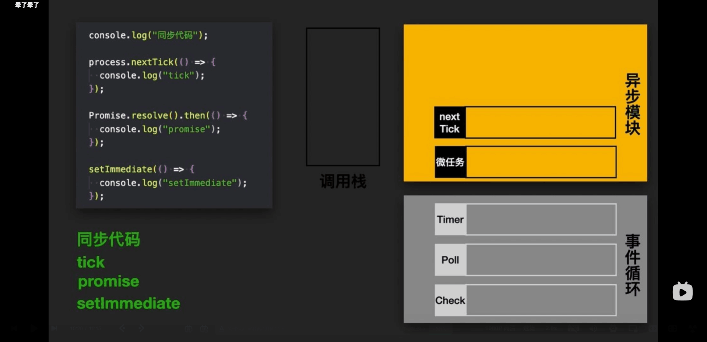

# 35.ES6新特性

1. let/const
2. 解构赋值
3. 字符串拓展方法：codePointAt startsWith endsWith includes trimStart trimEnd
4. 数组拓展方法：Array.of find findIndex keys values entries fill includes
5. 对象拓展方法：Object.getPrototypeOf Reflect.ownKeys Object.keys Object.assign
6. Set Map Symbol WeakMap WeakSet
7. Proxy Reflect
8. Class
9. Promise
10. 箭头函数
11. 拓展运算符
12. Iterator遍历器，提供了一种通用的遍历手段

# 36. 高阶函数

参数或者返回值是函数的函数

- filter
- map
- sort
- some
- every
- reduce

# 37.判断一个对象是否为空

```js
function isEmpty1(obj) {
    return JSON.stringify(obj) === '{}';
}

// 可枚举属性，不包括Symbol属性
function isEmpty2(obj) {
    return Object.keys(obj).length === 0;
}

// 可枚举、不可枚举属性，不包括Symbol属性
function isEmpty3(obj) {
    return Object.getOwnPropertyNames(obj).length === 0 && Object.getOwnPropertySymbols(obj).length === 0;
}

function isEmpty4(obj) {
    let flag = true;
    for (let key in obj) {
        if (flag) {
            flag = false;
            break;
        }
    }
    return flag && Object.getOwnPropertySymbols(obj).length === 0;
}

// Reflect.ownKeys()返回所有属性，包括Symbol属性 等价于 Object.getOwnPropertyNames(obj).concat(Object.getOwnPropertySymbols(obj))
function isEmpty5(obj) {
    return Reflect.ownKeys(obj).length === 0;
}
```

# 38.判断对象里是否有某个属性

```js
// 会到原型上去找，也能判断Symbol
function hasProperty(obj, key) {
    return key in obj;
}

// 无法判断不可枚举属性，无法判断Symbol！
function hasProperty2(obj, key) {
    return Object.keys(obj).includes(key);
}

// 可枚举，不可枚举，Symbol值都能判断！
function hasProperty3(obj, key) {
    return Object.prototype.hasOwnProperty.call(obj, key);
}
```

# 39.性能优化

1. 路由懒加载：有效拆分 `App` 尺寸，访问时才异步加载

```js
js复制代码const router = createRouter({
    routes: [
        { path : '/foo', component: () => import('./foo.vue)}
    ]
})
```

2. `keep-alive` 缓存页面：避免重复创建组件实例，且能保存缓存组件状态

```html
html复制代码<keep-alive>
  <router-view v-if="$route.meta.keepAlive == true"></router-view>
</keep-alive>
<router-view v-if="$route.meta.keepAlive != true"></router-view>
```

3. 使用 `v-show` 复用 `DOM`：避免重复创建组件

4. `v-for` 遍历避免同时使用 `v-if`（实际上这在 Vue3 中是错误的写法）

5. `v-once` 和 `v-memo`: 不再变化的数据使用 `v-once`；按条件跳过更新时使用 `v-memo`

6. 长列表性能优化：如果是大数据长列表，可采用虚拟滚动，只渲染少部分区域的内容。一些开源库（`vue-virtual-scroller` / `vue-virtual-scroll-grid`）
7. 事件的销毁：Vue组件销毁时，会自动解绑它的全部指令以及事件监听器，但是仅限于组件本身的事件。
8. 图片懒加载，自定义 `v-lazy` 指令 （参考项目：`vue-lazyload`）
9. 第三方插件按需引入 `element-plus` 避免体积太大
10. 子组件分割策略：较重的状态组件适合拆分
11. `SSR` 服务端渲染 解决首屏渲染慢的问题

# 40.JS异步编程的方式

1. 回调函数

函数里面嵌套函数，容易写成回调地狱

2. 事件监听

使用事件驱动模式，任务的执行不取决于代码的顺序，而是某个事件是否发生，可以为第一个函数绑定一个事件，第二个函数监听这个事件，然后第一个函数执行完成之后触发事件，开始执行后面的。

采用这个方式，整个应用会变成事件驱动模式，运行流程变得不清晰

3. 发布订阅模式

用一个信号中心，某个任务完成，就像中心发送一个信号，其他任务可以订阅信号，从而知道自己什么时候开始执行。

这种模式是对事件监听的一种改良吧。

4. Promise

背一下Promise八股。

有了`Promise`对象，就可以将异步操作以同步操作的流程表达出来，避免了层层嵌套的回调函数。此外，`Promise`对象提供统一的接口，使得控制异步操作更加容易。

`Promise`也有一些缺点。

- 无法取消`Promise`，一旦新建它就会立即执行，无法中途取消。
- 其次，如果不设置回调函数，`Promise`内部抛出的错误，不会反应到外部。
- 第三，当处于`Pending`状态时，无法得知目前进展到哪一个阶段（刚刚开始还是即将完成）。

5. Generator函数

**Generator函数是ES6提供的一种异步编程解决方案**，语法行为与传统函数完全不同

Generator函数有多种理解角度。从语法上，首先可以把它理解成，**Generator函数是一个状态机，封装了多个内部状态**。

**执行Generator函数会返回一个遍历器对象**，也就是说，Generator函数除了状态机，还是一个遍历器对象生成函数。返回的遍历器对象，**可以依次遍历Generator函数内部的每一个状态**。它最大的特点就是可以交出函数的执行权，暂停执行

形式上，Generator函数是一个普通函数，但是有两个特征。一是，`function`关键字与函数名之间有一个星号；二是，函数体内部使用`yield`语句，定义不同的内部状态（yield语句在英语里的意思就是“产出”）。

```js
function* helloWorldGenerator() {
  yield 'hello';
  yield 'world';
  return 'ending';
}

var hw = helloWorldGenerator();
hw.next()
// { value: 'hello', done: false }

hw.next()
// { value: 'world', done: false }

hw.next()
// { value: 'ending', done: true }

hw.next()
// { value: undefined, done: true }
```

6. async/await

`async`函数就是Generator函数的语法糖。

`async`函数对 Generator 函数的改进，体现在以下四点

（1）内置执行器。Generator函数的执行必须靠执行器，所以才有了`co`模块，而`async`函数自带执行器。也就是说，`async`函数的执行，与普通函数一模一样，只要一行。

（2）更好的语义。`async`和`await`，比起星号和`yield`，语义更清楚了。`async`表示函数里有异步操作，`await`表示紧跟在后面的表达式需要等待结果。

（3）更广的适用性。 `co`模块约定，`yield`命令后面只能是Thunk函数或Promise对象，而`async`函数的`await`命令后面，可以是Promise对象和原始类型的值（数值、字符串和布尔值，但这时等同于同步操作）。

（4）返回值是Promise。`async`函数的返回值是Promise对象，这比Generator函数的返回值是Iterator对象方便多了。你可以用`then`方法指定下一步的操作。

进一步说，`async`函数完全可以看作多个异步操作，包装成的一个Promise对象，而`await`命令就是内部`then`命令的语法糖

# 41.setTimeout VS setInterval

```js
setInterval(() => {
    // do someting
},1000)
```

```js
function fn() {
    setTimeout(() => {
        //do something
        fn();
    },1000);
}
```

第一个每隔一秒生成一个任务，第二个每隔一秒执行一个任务

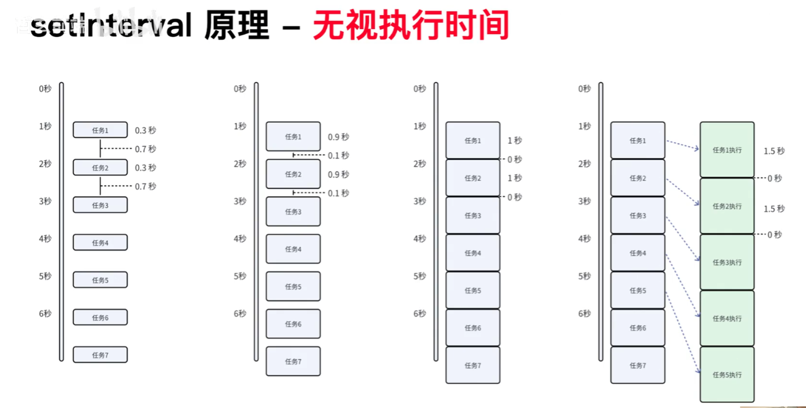

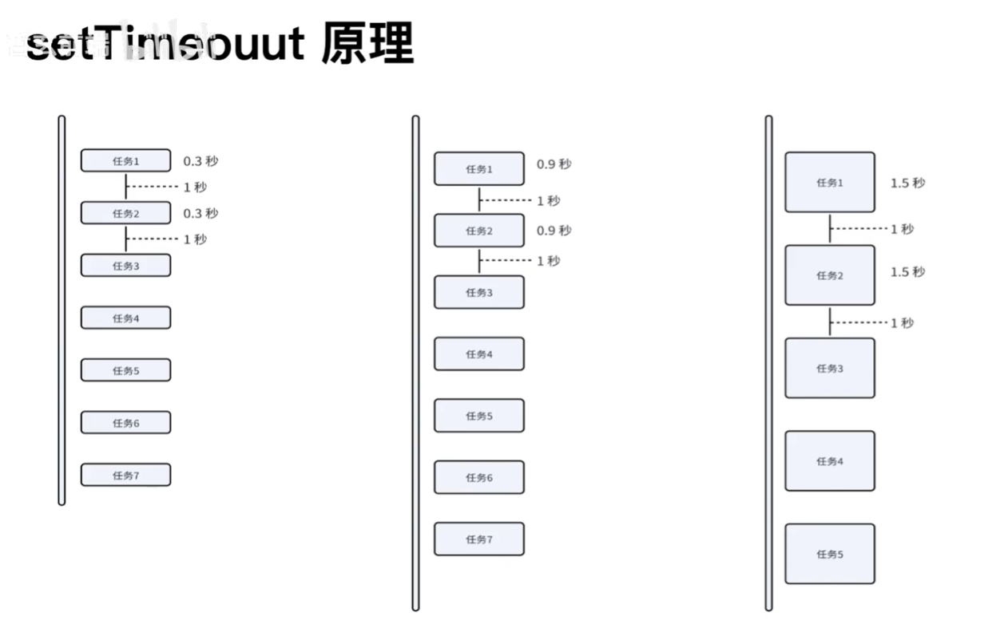

setInterval每隔1s生成一个回调任务，如果回调任务的执行时间大于1s了，那么就会出现任务的“消费效率”追不上任务的“生产效率”，导致任务队列挤压。

setTimeout保证只有一个任务执行完了，过了1s才会执行下一个

# 42 class和function主要区别是什么

1. class构造函数必须使用new操作符
2. class声明不可以提升
3. class是不可以使用call、apply、bind来更改this指向
