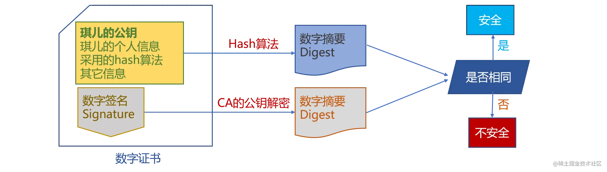
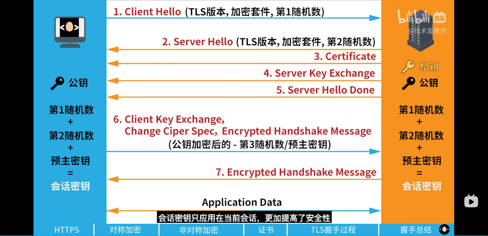
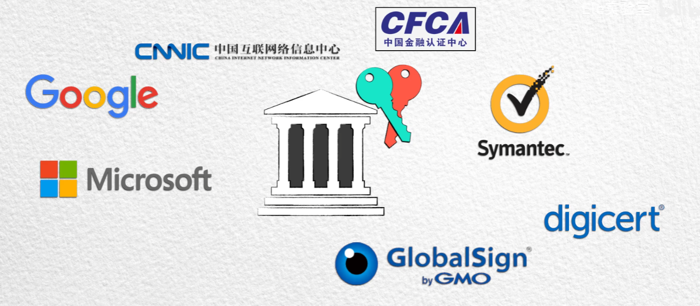

# HTTPS

> [这个视频讲的很详细，还讲了CT](https://www.bilibili.com/video/BV1uY4y1D7Ng/?spm_id_from=..search-card.all.click&vd_source=7dcb6c648b7faefd7170d0fc0494d4ad)
>
> [蛋老师视频](https://www.bilibili.com/video/BV1KY411x7Jp/?spm_id_from=..search-card.all.click)

超文本传输安全协议（Hypertext Transfer Protocol Secure，简称：HTTPS）是一种通过计算机网络进行安全通信的传输协议。它并不是一个单独的协议，HTTPS经由HTTP进行通信，利用SSL/TLS来加密数据包。可以理解为HTTPS = HTTP + SSL/TLS.HTTPS的主要目的是提供对网站服务器的身份认证，保护交换数据的隐私与完整性。

SSL 即安全套接层（Secure Sockets Layer），在 OSI 七层模型中处于**会话层**(第 5 层)。之前 SSL 出过三个大版本，当它发展到第三个大版本的时候才被标准化，成为 TLS（传输层安全，Transport Layer Security），并被当做 TLS1.0 的版本，准确地说，**TLS1.0 = SSL3.1**。

现在主流的版本是 TLS/1.2, 之前的 TLS1.0、TLS1.1 都被认为是不安全的，在不久的将来会被完全淘汰。因此我们接下来主要讨论的是 TLS1.2, 当然在 2018 年推出了更加优秀的 TLS1.3，大大优化了 TLS 握手过程。

TLS/SSL的功能实现主要依赖三类基本算法：**散列函数hash**、**对称加密**、**非对称加密**。这三类算法的作用如下：

- 基于散列函数验证信息的完整性
- 对称加密算法采用协商的秘钥对数据加密
- 非对称加密实现身份认证和秘钥协商

> 使用非对称加密安全的计算出对称加密，因为非对称加密相较于对称加密，十分耗时

# 对称加密

解密加密使用同样的密钥，问题是如果第三方知道了密钥，加密就毫无意义了。

# 非对称加密

非对称加密有两把，私密的私钥和公开的公钥，每把密钥只能解密另一把密钥加密的信息。也就是公钥加密的信息只能用私钥解密，私钥加密的信息只能用公钥解密。两把钥匙都不能解密自己加密的信息。

1. 因为通信双⽅的⼿⾥都有⼀套⾃⼰的密钥对,通信之前双⽅会先把⾃⼰的公钥都先发给对⽅
2. 然后对⽅再拿着这个公钥来加密数据响应给对⽅,等到到了对⽅那⾥,对⽅再⽤⾃⼰的私钥进⾏解密
3. ⾮对称加密虽然安全性更⾼，但是带来的问题就是速度很慢，影响性能。

> 公钥加密私钥解，任何人都可以加密信息发给持有私钥的对方。
私钥签名公钥验签，私钥签名出来的东西任何人都可以验证是否合法，不可抵赖。

## 加密方式的应用

实际LTS协议是两个加密一起使用，因为单纯的对称加密不够安全，单纯的非对称加密太过耗时。客户端和服务端就使用非对称加密来计算对称加密的密钥。

# CA证书

## 中间人攻击

黑客在服务器传递给客户端公钥的过程中把它拦截，并传给浏览器黑客自己的公钥，然后浏览器没办法辨别真伪，仍然使用它来加密后续作为加密密钥的随机数，黑客接收到使用自己的密钥解密，再使用服务器的公钥加密发送给服务器。黑客就像个黑中介在中间欺骗双方

## CA第三方机构

本质原因就是**公钥不能表面自己属于谁**，所以解决的方式就是让其拥有表明自身身份的能力，就需要第三方信任机构。

首先使用一种 Hash 算法来对公钥和其他信息进行加密，生成一个**数字摘要**，然后让有公信力的认证中心（Certificate Authority证书授权 简称 CA ）用它的私钥对数字摘要加密，形成**数字签名**。最后将原始的信息和签名合在一起，称为**数字证书**，颁发给服务端。这个证书就是能表明自己身份的证书。

当接收方收到数字证书的时候，先从证书中读取与之前相同Hash算法对原始信息使用生成一个摘要，然后使用公证处的公钥来对数字证书中的签名进行解密，最后将解密的摘要和生成的摘要进行对比，就能发现得到的信息是否被更改了。

> 如果浏览器也从CA机构申请了证书，并拦截正确的证书，把自己的证书发给了客户端，客户端接收到，证书是对应上了，但是很明显证书中的域名和浏览器正在访问的域名对不上了，也会报安全错误

这个方法最要的是认证中心的可靠性，一般浏览器里会内置一些顶层的认证中心的证书，相当于我们自动信任了他们，只有这样才能保证数据的安全。也只有这些系统内置CA机构颁发的证书才能被浏览器认可。

谷歌浏览器内置的证书可以在设置中找到

# TLS1.2握手过程

1. 客户端向服务器发起请求，请求中包含使用的TLS协议版本号、生成的一个随机数(即图中的第1随机数)、以及客户端支持的加密方法。

2. 服务器端接收到请求后，确认双方使用的加密方法、并给出服务器的证书、以及一个服务器生成的随机数(即图中的第二随机数)。

3. 客户端确认服务器证书有效后，生成一个新的随机数(即图中的预主密钥)，并使用数字证书中的公钥，加密这个随机数，然后发给服 务器。并且还会提供一个前面所有内容的 hash 的值，用来供服务器检验。

4. 服务器使用自己的私钥，来解密客户端发送过来的随机数，并提供前面所有内容的 hash 值来供客户端检验。

5. 客户端和服务器端根据约定的加密方法使用前面的三个随机数，生成对话秘钥，以后的对话过程都使用这个秘钥来加密信息。

# TLS1.3

# 补充，CA问题

> [视频8:50秒开始](https://www.bilibili.com/video/BV1uY4y1D7Ng/?spm_id_from=..search-card.all.click&vd_source=7dcb6c648b7faefd7170d0fc0494d4ad)

在上诉的过程中，CA机构至关重要，如果CA把证书颁发给了错误的人，还是会造成泄密问题。

现在有一种 Certificate Transparency 证书透明简称CT的方案。CA机构没颁发一个证书，都需要向一个叫做日志服务的机构提交证书的详情，日志服务机构记录下来，并且向CA返回一个SCT数据，CA把SCT加入到数字证书的拓展中，把这个携带SCT信息的证书颁发给站点服务器，在TLS握手的时候，浏览器拿到这个证书，除了要验证证书外，还需要向日志服务验证SCT，日志服务机构有自己的私密钥对，而SCT中包含被私钥签名的数据，浏览器使用SCT的公钥对SCT信息中的签名要验证其真实性，套娃操作，也就是CA的CA。

而为了防止日志服务和CA一样出错，使用区块链去中心化思想，使用默克尔树(Merkle Tree)数据结构来进行记录。具体看视频。相应的证书办法记录两两哈希，一直哈希到只有一个哈希值，大家只要监督这个根哈希值就可以保证数据无法被篡改。

 

# 白话总结

HTTPS协议是HTTP协议的安全版本，是为了解决HTTP明文传输导致的不安全的特性，为了安全使用SSL/TLS协议进行加密，主要使用哈希算法，对称加密和非对称加密技术以及数字证书技术。

哈希算法具有单项不可逆性，用来防止信息被篡改以及验证完整性。对称加密是双方都使用同一种密钥进行加密解密，如果被黑客知道了密钥，就失去了作用。非对称加密是有两个密钥，私钥和公钥，一把密钥加密的信息只能用另一把密钥才能解密，实现了一对多的加密效果，但是耗时更多，所以TLS协议就采用了两者相结合的方式，使用非对称加密算法来计算出两者的对称加密密钥。但是因为**公钥并不能表明自己属于谁**，所以会有中间人攻击的问题。这时候就需要第三方机构，证书颁发机构CA的介入，服务端把自己的域名，IP信息等等和公钥用HASH算法生成数字摘要，然后让权威的CA机构用自己的私钥对数字摘要进行加密，生成数字签名，再把原始信息和数字签名合在一起称为数字证书颁发给服务器，这个证书就可以用来表明服务器的身份。客户端收到证书之后，使用之前相同的HASH算法对原始信息使用生成一个数字摘要，再和CA结构对应的公钥解密数字签名得到正确的数字摘要，两者对比就知道有没有对信息进行篡改。

TLS1.2建立的过程，首先是Client_Hello，客户端告诉服务端自己支持的TLS版本，加密方法，还有生成第一个随机数；然后服务器发送Service_Hello,确认双方使用的加密方法，并生成第二个随机数和证书一起发给客户端；客户端确定证书有效了，生成预主密钥并用公钥加密发给服务端，服务器接收到之后用私钥解密。两者都用三个随机数和规定的加密算法生成对称加密密钥，之后交流都使用这个对称加密密钥来加密信息。

现在我知道的也有一个方法是CT，证书透明方案来更加完善，因为CA机构的权力太大了，就用区块链的去中心化技术来对CA机构颁发的证书再套一层类似CA机制的验证。

# 一些面试题

### HTTP 和 HTTPS 的区别？

`HTTPS`是`HTTP`协议的安全版本。`HTTPS`的出现主要是为了解决`HTTP`明文传输内容导致其不安全的特性。为保证数据加密传输，让`HTTP`运行安全的`SSL/TLS`协议上，即 `HTTPS = HTTP + SSL/TLS`。通过`SSL`证书来验证服务器的身份，并为浏览器和服务器之间的通信进行加密。

二者的区别：

- 安全性：`HTTP`协议的数据传输是明文的，是不安全的；`HTTPS` 使用了`SSL/TLS`协议进行加密处理，相对更加安全。
- 连接方式：二者使用的连接方式不同，`HTTP`是三次握手，`HTTPS`是三次握手+数字证书。
- 默认端口：`HTTP`的默认端口是`80`；`HTTPS`的默认端口是`443`。
- 响应速度：由于`HTTPS`需要进行加解密过程，因此速度不如`HTTP`。
- 费用：`HTTPS`需要使用`SSL`证书，功能越强大的证书其费用越高；`HTTP`不需要。

### 为什么非对称加密比对称加密速度慢？

对称加密主要的运算是**位运算**，速度非常快，电路实现也容易。

非对称加密计算一般都比较复杂，涉及到大数运算，比如 RSA，它里面涉及到大数乘法、大数模等等运算。运算起来更加耗时

### 如何提高https的速度

> [文章](https://www.cnblogs.com/wxcx/p/12839586.html)
