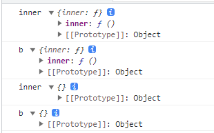

# this

> this指向最后一次调用这个方法的对象
>
> [这篇文章讲的不错](https://segmentfault.com/a/1190000042552418)

## this是什么

this 到底是一种什么样的机制

1. this **是在运行时进行绑定的**，并不是在编写时绑定，它的上下文取决于函数调用时的各种条件；
2. this 的绑定和函数声明的位置没有任何关系，只取决于函数的调用方式；
3. 当一个函数被调用时，JavaScript 会创建一执行上下文，携带所有的信息（包括 this、词法环境、变量环境）。this 就是执行上下文（context）中的一条信息，它代表是谁调用它

> this 是万恶之源，大家都是（词法）静态作用域，就它玩动态。
>
> this 指向存在的问题是公认的

## 调用方式

正如上面所讲，this 是在运行时绑定的，它的上下文取决于函数调用时的各个条件。在 JavaScript 中函数的调用有以下几种方式：

- 作为对象方法调用
- 作为函数调用
- 作为构造函数调用
- 使用 call / apply / bind调用。

### 1. 作为对象方法调用

在 JavaScript 中，函数也是对象，因此函数可以作为一个对象的属性，此时该函数被称为该对象的方法，在调用这种调用方式时，this 被自然绑定到该对象

```javascript
var people = {
    name: 'lsy',
    age: 28,
    sayName: function () {
        console.log(this.name);
    },
};
people.sayName(); // lsy
```

### 2. 作为函数调用

函数也可以直接被调用，此时 this 绑定到全局对象。在浏览器中，window 就是该全局对象。比如下面的例子：函数被调用时，this 被绑定到全局对象，接下来执行赋值语句，相当于隐式的声明了一个全局变量，这显然不是调用者希望的

```javascript
function sayAge(age) {
    this.age = age;
}
sayAge(5); // age 已经成为一个值为 5 的全局变量
```

对于内部函数，即声明在另外一个函数体内的函数，这种绑定到全局对象的方式会产生另外一个问题。我们以前文所写的 people 对象为例，这次我们希望在 sayName 方法内定义一个函数，函数打印年龄。发现people.age 没有改变，而全局多了一个 age 变量

```javascript
var people = {
    name: 'elaine',
    age: 28,
    sayName: function (age) {
        var sayAge = function (age) {
            this.age = age;
        };
        sayAge(age);
    },
};
people.sayName(5);
people.age; // 28
age; // 5
```

这属于 JavaScript 的设计缺陷，正确的设计方式是内部函数的 this 应该绑定到其外层函数对应的对象上，为了规避这一设计缺陷，我们的办法是变量代替的方式，约定俗成，该变量一般被称为 that

```javascript
var people = {
    name: 'elaine',
    age: 28,
    sayName: function (age) {
        var that = this;
        var sayAge = function (age) {
            that.age = age;
        };
        sayAge(age);
    },
};
people.sayName(5);
people.age; // 5
age; // 没有定义
```

#### 2.1 箭头函数

箭头函数和我们之前说作用域时谈到的动态作用域和静态作用域（词法作用域）有关系。this本身的机制和动态作用域很像，而箭头函数的出现，某种程度上规避了 JavaScript的设计缺陷（理想中的设计方式应该是内部函数的this应该绑定到其外层函数对应的对象上）

```javascript
var people = {
    name: 'eliane',
    age: 28,
    sayName: () => console.log(this.name, this),
    sayName2: function () {
        console.log(this.name, this);
    },
};
people.sayName(); //  '', Window
people.sayName2(); // elaine, {name: 'eliane', age: 28}
```

**使用箭头函数后，就不用管调用者是谁，它只关心在哪里定义；箭头函数没有自己的this，它的this和语法层面上外部词法环境的this一样，与谁调用无关。它的取值遵循普通普通变量一样的规则，沿着作用域链一层一层往上找**

> 下文，bar里面的a也只是foo对象的一个属性，还是全局执行上下文的词法环境里的一个属性,

```javascript
var foo = {
    bar: {
        a: () => console.log(this),
    },
};
foo.bar.a(); // window
```

看接下来这个例子

```js
			let obj = {
				inner: function () {
					console.log("inner", this);
					let a = {
						b: () => {
							console.log("b", this);
						},
					};
					a.b();
				},
			};
			let obj2 = {};
			obj.inner();
			obj.inner.call(obj2);
```

如下面一段代码，打印结果如下，第一行`obj.inner()`里的this指向`obj`，第二行`obj.inner.call(obj2)`指向`obj2`；inner函数里的a对象函数b()是个箭头函数，没有this指向。语法层面上，inner函数执行时候就会创造一个函数执行上下文，它的this指向它的调用者`obj`这点毫无疑问，而b函数创建执行上下文但是没有创建自己的this，就会找外部词法作用域找到inner的执行上下文里的词法变量里的this，也就是指向`obj`了(因为inner的执行上下文的this就是指向`obj`，他俩保持一致)。

**简单来说就是箭头函数的this和的(词法层面)外部作用域this保持一致**



```js
			let a = {
				fn: () => {
					console.log("fn", this);
				},
			};
			let b = {
				name: "objB",
				test: function () {
					a.fn();
				},
			};
			b.test();
```

打印结果为Window全局对象

### 3. 作为构造函数调用

JavaScript 支持面向对象编程，与主流的面向对象编程语言不同， JavaScript 并没有类（Class）的概念，而是使用基于原型（prototype-base）的继承方式。同样约定俗称，首字母大写的函数被称为构造函数，我们使用 new 调用时，this 会绑定到实例对象上

```javascript
function People(name, age) {
    this.name = name;
    this.age = age;
}
var elaine = new People('elaine', 28)
console.log(elaine) // {name: "elaine", age: 28}
```

### 4. 使用 call / apply / bind 调用

在 JavaScript 中函数也是对象，对象则有方法，call 、 apply 、 bind 就是函数对象的方法。这三个方法异常强大，他们允许切换函数执行的上下文环境（context），即 this 绑定的对象。

```js
function Person(name, age) {
    this.name = name;
    this.age = age;
    this.sayName = function(name, age) {
        this.name = name;
        this.age = age;
    }
}
var elaine = new Person('elaine', 28);
var johan = {name: 'johan', age: 28};
elaine.sayName('elaine1', 281);
elaine.sayName.apply(johan, ['johan1', 281])
// 如果用call elaine.sayName.call(johan, 'johan1', 281)
console.log(elaine.name) // elaine1;
console.log(elaine.age) // 281
console.log(johan) // { name: "johan1", age: 281 }
```

在上面的例子中，我们使用构造函数生成了一个对象 elaine，该对象同时具有 sayName 方法；使用对象字面量创建了另一个对象 johan，我们看到使用 apply 可以将 elaine 上的方法应用到 johan 上，这时候 this 也被绑定到对象 johan 上，另一个 call 也具备相同的功能，不同的是最后的参数不是作为一个数组统一传入，而是分开传入的

回过头来看，apply 和 call 的语义就是 elaine 的方法 sayName 作用于 johan ，sayName 需要传入的参数，我从第二个参数开始传值；或者说 johan 调用 elaine 的 sayName 方法，从第二个参数开始传值

## 补充

1. 定时任务：setTimeout:this指向window，因为是由window来调用回调函数，不论是普通函数还是箭头函数

2. 数组的方法中，forEach、findIndex、map：this指向window

3. 一些触发方法:onclick等等，普通函数指向dom元素，箭头函数指向window

```js
<div id="demo">这是demo<div/>
let el = document.getElementById('demo');
el.onclick = function() {
    console.log(this) // <div id="demo">这是demo<div/>
}

el.onclick = () => {
    console.log(this) // window
}
```

4. 当用`new`运算符调用构造函数时，`this`指向返回的这个对象。

## 优先级问题

1. 有哪几种方式可以绑定this？

   1. new方式
   2. 显式绑定-call、apply、bind
   3. 隐式绑定（默认绑定）

2. 几种方式的优先级

   new > 显式绑定 > 默认绑定

## 个人总结

(JS的this是执行上下文中一个特殊的属性)

JS的this指向我觉得是个设计缺陷，js是静态作用域，而this指向是运行时绑定的，它的指向取决于调用时的条件，更偏向于动态作用域(我感觉是挺万恶的)。总的原则就是谁调用的就指向谁。

js里函数调用有4种方法。第一个是作为对象函数调用，这时候就指向调用的函数。还有一个是作为函数调用，这时候this指向全局对象。箭头函数又比较特别，箭头函数的this某种程度上就规避了一开始的设计缺陷，箭头函数没有自己的this，他的this和外层词法环境的this指向一致，它的取值规范和变量类似，沿着作用域链一层一层向上找。

第三种是作为构造函数，这时候this指向新的实例对象，最后一个是显式调用，就是call/apply/bind，this就指向手动指定的对象。