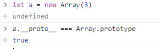
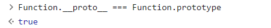
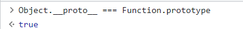
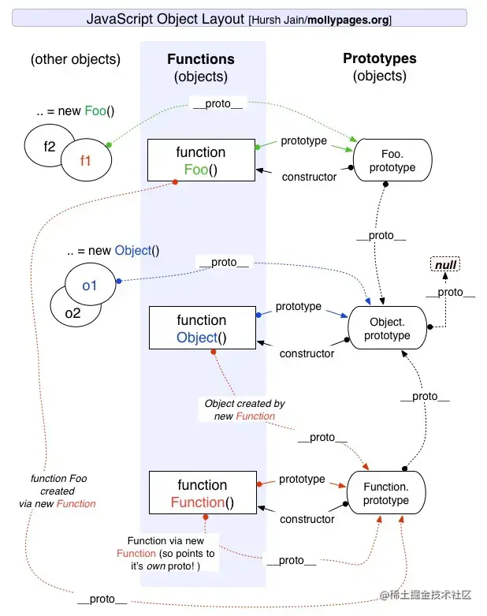
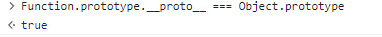

# 原型

1. **构造函数**内部都有一个显式的`prototype`属性，称之为函数的原型，这个属性的值为一个对象，称为原型对象。

作用：

- 原型对象上有很多属性和方法供实例共享使用
- 在JS中实现继承

2. **每个对象**都有一个私有`__proto__`属性（由浏览器提供），它是一个指针，被称为对象的原型，它指向构造函数的原型对象。

如图，`a.__proto__ === Array.prototype`，说明他们指向同一个对象，也就是构造函数`Array`的原型对象

> 构造函数内部有prototype和`__proto__`
>
> **函数的`__proto__`指向`Function.prototype`，因为函数都是Function构造来的**，符合定义，而且非常有意思的一点，Function的原型指向自己的原型对象
>
> 
>
> Object也是构造函数，他的`__proto__`也指向Function的原型对象
>
> 
>
> 而实例对象只有`__proto__`这个属性

## 原型的获取

- `p.__proto__`
- `p.constructor.prototype`
- `Object.getPrototypeOf(p)`

上面三种方法之中，前两种都不是很可靠。`__proto__`属性只有浏览器才需要部署，其他环境可以不部署。而`obj.constructor.prototype`在手动改变原型对象时，可能会失效。

# 原型链

原型对象也是个对象，所以他也有`__proto__`属性，内置函数Array的原型对象(`Array.prototype`)的原型(`__proto__`)就指向Object的原型对象，而Object的原型对象的原型就指向null了。

当我们访问一个对象的属性时，如果对象内部不存在这个属性，就会到他的原型对象中寻找(就是他构造函数的原型对象)，原型对象也有自己的原型，于是就这么一直找下去，也就是原型链的概念。原型链的尽头一般是`Object.prototype.__proto__`，这也就是为什么我们创建对象可以使用`toString()`方法。

# 补充

1. 原型对象里还有个`constructor`属性，就指向构造函数，如图所示

2. 函数本身也有一个`__proto__`属性，指向`Function.prototype`

3. `Function.prototype.__proto__`

## 自己的话

在JavaScript中是使用构造函数来新建一个对象的，每一个构造函数的内部都有一个 prototype 属性，它的属性值是一个对象，这个对象包含了可以由该构造函数的所有实例共享的属性和方法。当使用构造函数新建一个对象后，在这个对象的内部将包含一个指针，这个指针指向构造函数的 prototype 属性对应的值，在 ES5 中这个指针被称为对象的原型。一般来说不应该能够获取到这个值的，但是现在浏览器中都实现了 **proto** 属性来访问这个属性，但是最好不要使用这个属性，因为它不是规范中规定的。ES5 中新增了一个 Object.getPrototypeOf() 方法，可以通过这个方法来获取对象的原型。

当访问一个对象的属性时，如果这个对象内部不存在这个属性，那么它就会去它的原型对象里找这个属性，这个原型对象又会有自己的原型，于是就这样一直找下去，也就是原型链的概念。原型链的尽头一般来说都是 `Object.prototype.__proto__` 所以这就是新建的对象为什么能够使用 toString() 等方法的原因。

