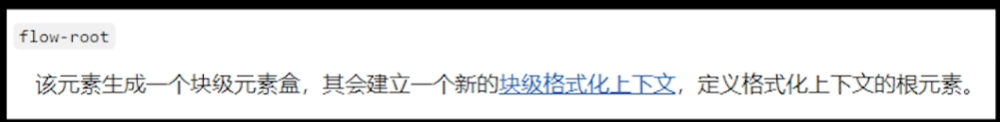

# 1.CSS选择器以及优先级

| 选择器         | 格式                 | 权重 |
| -------------- | -------------------- | ---- |
| id选择器       | #id                  | 0100 |
| 类选择器       | .className           | 0010 |
| 属性选择器     | a[ref='bb']          | 0010 |
| 伪类选择器     | a:hover,b::nth-child | 0010 |
| 标签选择器     | div                  | 0001 |
| 伪元素选择器   | a::after             | 0001 |
| 相邻兄弟选择器 | h1 + p               | 0000 |
| 子选择器       | ul > li              | 0000 |
| 后代选择器     | li a                 | 0000 |
| 通配符选择器   | *                    | 0000 |

- !important
- 内联样式(1000)
- ID选择器(0100)
- 类选择器、伪类选择器、属性选择器(0010)
- 标签选择器、伪元素选择器(0001)
- 关系选择器、通配符选择器(0000)

> !important优先级最高
>
> 当样式重复时，!important > 行内样式 > id选择器 > 类选择器.. > 标签.. > 关系选择器.. > 继承 > 浏览器默认样式 

# 2.隐藏元素的方法，区别

1. `display:none`
   1. DOM结构: 浏览器不会渲染diplay为none的元素，**元素不会出现在渲染树上**，脱流，渲染的时候不占据任何空间
   2. 事件监听:无法进行DOM事件监听，不能点击
   3. 性能:回流+重绘
   4. 继承:非继承属性，元素会从渲染树上消失，造成子孙节点的消失，即使修改子孙节点属性子孙节点也无法显示。
   5. 场景:显示出原来不存在的结构
   6. transition:不支持display

1. `visibility:hidden`
   1. DOM结构: 不会让元素从渲染树上消失，**渲染元素继续占据空间**，只是内容不可见
   2. 事件监听:无法进行DOM事件监听，不能点击
   3. 性能:重绘
   4. 继承:继承属性，子元素可以设置`visibility:visible`来取消隐藏
   5. 场景:显示不会导致页面结构发生变化变动，不会撑开
   6. transition:支持`visibility`，立即显示，隐藏时会延迟
2. `opacity:0`
   1. DOM结构:透明度为100%，不会让元素从渲染树上消失，**渲染元素继续占据空间**，只是内容不可见
   2. 事件监听:可以进行DOM事件监听，可以点击
   3. 性能:应用了transition或者animation的 opacity 元素，浏览器会将渲染层提升为合成层，不会触发重绘。否则就会触发重绘
   4. 继承:继承属性，但子元素不能设置`opacity:1`来取消隐藏
   5. 场景:和transition搭配
   6. transition:支持`opacity`，opacity可以延时显示和隐藏

> WebKit 内核的浏览器中，具有 transition 或 animation 的 opacity 元素，渲染层被提升为合成层。
> translateZ(0) 或 translate3d(0,0,0)可以人为强制创建合成层。
>
> 而元素提升为合成层后，transform 和 opacity 不会触发重绘制。如果不是合成层，则会触发重绘。
>
> 因为透明度改变后，GPU在绘制页面时可以改变之前画好的页面的透明值，而无需整体的重绘。
> 但是这个被修改的opacity必须为一个单独的图层，否则图层中的其他节点也会被重绘。

- **transform: scale(0,0)**：将元素缩放为 0，来实现元素的隐藏。这种方法下，元素仍在页面中占据位置，但是不会响应绑定的监听事件。

# 3.BFC

Block formatting context 块级格式化上下文

拥有BFC的元素会形成独立的渲染区域，内部元素的渲染不会影响到外界元素，即便是浮动元素，反之也一样。

形成BFC的常见方法有

- 根元素HTML
- 设置float属性且不为none
- 设置position属性为absolute或者fixed
- 设置display为inline-block、table-cell、table-caption、flex、grid，**flow-root**不为block或者inline即可
- 设置overflow为visible之外的

> flow-root这个属性副作用最小
>
> 

常见的应用场景有

- margin重合(上下两个div，margin-top和bottom取最大者，给两个元素的父元素之一或都设置BFC，因为BFC本质是内部元素不会影响到外部元素)
- margin塌陷(父子元素，给子元素设置margin-top，结果是父元素移动，给父元素设置BFC，因为子元素影响到父元素了)
- 高度坍塌(父子元素，给子元素设置float，父元素高度坍塌，设置BFC之后，为了不影响到父元素外边的元素，父元素就需要连浮动的子元素也一起计算，也可以用清除浮动(带来的影响))

# 4.元素垂直水平居中

1. 绝对定位 + transfrom (不限宽高)

```css
.father {
  position: relative;
}
.son {
  position: absolute;
  left: 50%;
  top: 50%;
  transform: translate(-50%, -50%);
}
```

2. 绝对定位 + 负的margin-top和margin-left(必须设置宽高)

```css
.father {
  position: relative;
}
.son {
  position: absolute;
  left: 50%;
  top: 50%;
  width: 200px;
  height: 200px;
  margin-left: -100px;
  margin-top: -100px;
}
```

3. 绝对定位 + 四个方向都为0 + margin:auto(必须设置宽高)

```css
.father {
  position: relative;
}
.son {
  position: absolute;
  top: 0;
  left: 0;
  right: 0;
  bottom: 0px;
  margin: auto;
  height: 100px;
  width: 100px;
}
```

4. flex

```css
.father {
  display: flex;
  justify-content: center;
  align-items: center;
}
```

# 自适应正方形

1. 使用rem

```css
<div class="rem">rem</div>

body {
    font-size: 16px;
}

.rem {
    width: 10rem;
    height: 10rem;
    background: pink;
}

@media only screen and (max-width: 1200px) {
    body {
        font-size: 12px;
    }
}
```

2. vw/vh

```css
<div class="vw">vw</div>
.vw {
    width: 10vw;
    height: 10vw;
    background: yellow;
}
```

3. 百分比+padding

使用 **百分比+padding**，这里有一个很细的知识点；**当padding、margin取值为百分比时，百分比的值是以父元素的width为参考**。

```js
<div class="padding"></div>
.padding {
    width: 20%;
    padding-top: 20%;
    /* padding-top或padding-bottom都可以 */
    background: #696969;
}
```

但是高度被占满了，没法放内容，**解决办法：再嵌套一层内容盒子，外层方形盒为相对定位，内层内容盒为绝对定位；内层盒宽高基于外层方形盒，代码如下**

```css
<div class="box-wrap">
    <div class="box-content">我是内容区域</div>
</div>

.box-wrap {
    position: relative;
    width: 20%;
    padding-top: 20%;
}

.box-content {
    position: absolute;
    width: 100%;
    height: 100%;
    top: 0;
    left: 0;
    z-index: 1;
    background: burlywood;
}

```

4. **aspect-ratio**简言之就是宽高比

```css
<div class="box-square">我是内容</div>

.box-square {
    aspect-ratio: 1 / 1;
    /* aspect-ratio: 1; 可简写 */
    width: 20%;
    background: chocolate;
}

```

# 高度height:100%

- 要想要元素的`height：百分比;`生效，父元素的高度必须有固定值，这个固定值可以是继承上个元素的高度，但继承的最外层元素高度必须要有固定值。
- 这个`height：百分比;`不会被其它子元素的`height`影响，也就是说，`height：百分比;`只按父元素的固定的`height`分配；

# 两栏布局

- 利用浮动，将左边元素宽度设置为200px，并且设置向左浮动。将右边元素的margin-left设置为200px，宽度设置为auto（默认为auto，撑满整个父元素）。

```css
css复制代码.outer {
  height: 100px;
}
.left {
  float: left;
  width: 200px;
  background: tomato;
}
.right {
  margin-left: 200px;
  width: auto;
  background: gold;
}
```

- 利用浮动，左侧元素设置固定大小，并左浮动，右侧元素设置overflow: hidden; 这样右边就触发了BFC，BFC的区域不会与浮动元素发生重叠，所以两侧就不会发生重叠。

```css
css复制代码.left{
     width: 100px;
     height: 200px;
     background: red;
     float: left;
 }
 .right{
     height: 300px;
     background: blue;
     overflow: hidden;
 }
```

- 利用flex布局，将左边元素设置为固定宽度200px，将右边的元素设置为flex:1。

```css
css复制代码.outer {
  display: flex;
  height: 100px;
}
.left {
  width: 200px;
  background: tomato;
}
.right {
  flex: 1;
  background: gold;
}
```

- 利用绝对定位，将父级元素设置为相对定位。左边元素设置为absolute定位，并且宽度设置为200px。将右边元素的margin-left的值设置为200px。

```css
css复制代码.outer {
  position: relative;
  height: 100px;
}
.left {
  position: absolute;
  width: 200px;
  height: 100px;
  background: tomato;
}
.right {
  margin-left: 200px;
  background: gold;
}
```

- 利用绝对定位，将父级元素设置为相对定位。左边元素宽度设置为200px，右边元素设置为绝对定位，左边定位为200px，其余方向定位为0。

```css
css复制代码.outer {
  position: relative;
  height: 100px;
}
.left {
  width: 200px;
  background: tomato;
}
.right {
  position: absolute;
  top: 0;
  right: 0;
  bottom: 0;
  left: 200px;
  background: gold;
}
```

