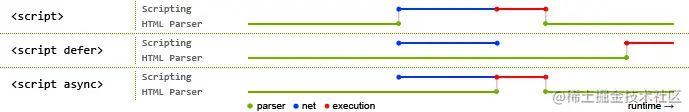

# 1.H5语义化的作用

语义化是根据内容的结构化，选择合适的标签，简单来说就是用正确的标签做正确的事情。

作用：

- 方便程序员读懂代码(增加代码可读性)
- 搜索引擎的爬虫也依赖于HTML标记来确定上下文和关键字(有利于SEO)
- 在没有CSS样式的情况下，也能呈现出很好的内容结构和代码结构

常见的语义化标签：

```html
<header></header>  头部

<nav></nav>  导航栏

<section></section>  区块（有语义化的div）

<main></main>  主要区域

<article></article>  主要内容

<aside></aside>  侧边栏

<footer></footer>  底部
```

# 2.DOCTYPE(文档类型)的作用

DOCTYPE是H5中一种标准通用标记语言的文档类型声明，**它的目的是告诉浏览器以什么模式来解析文档**，不同的渲染模式会影响浏览器对CSS甚至JS代码的解析，必须位于HTML文档的第一行。

浏览器渲染页面的两种模式(可以通过`document.compatMode`获取)

1. CSS1Compat：标准模式(Strick mode)，默认模式，浏览器使用最新的W3C标准解析渲染页面，在标准模式中，浏览器以其支持的最高标准呈现页面。
2. BackCompat：怪异模式(混杂模式，Quick mode)，在怪异模式中，页面以一种比较宽松的向后兼容的方式显示。

> 补充 DTD(document type definition,文档类型定义)是一系列的语法规则，用来定义XML或(X)HTML的文件类型，浏览器会使用他来判断文档类型，决定使用何种协议来解析，以及切换浏览器模式
>
> 在 html5 之后不再需要指定 DTD 文档，因为 html5 以前的 html 文档都是基于 SGML 的，所以需要通过指定 DTD 来定义文
> 档中允许的属性以及一些规则。而 html5 不再基于 SGML 了，所以不再需要使用 DTD。

# 3.script标签中defer和async的区别



> 绿色parser代表html解析
>
> 蓝色net代表js脚本加载时间
>
> 红色execution代表js执行时间

script:会阻止html文档的解析，只有**加载、执行**完后继续解析HTML

defer:完全不会阻碍HTML的解析，解析过程中进行脚本的异步加载，然后**等待HTML解析完后**再**按顺序执行脚本**

async:解析HTML时进行脚本的异步加载，**加载完后立即执行**，有可能会阻断HTML的解析

# 4.SGML,HTML,XML,XHTML的区别

- `SGML`是标准通用标记语言，是一种定义电子文档结构和描述其内容的国际标准语言，是所有电子文档标记语言的起源。
- `HTML`是超文本标记语言，主要是规定怎么样显示网页
- `XML`是可拓展标记语言，是未来标记语言的发展方向。XML和HTML最大的区别在于，XML的标签可以自定义，且数量无限，而HTML的标签是固定的且数量有限
- `XHTML`是基本上现在所有的网页都在使用的标记语言，和HTML没有本质的区别，标签和用法都一样，只是限制更多，更严格，比如标签必须用小写，标签必须有闭合标签等

# 5.src和href的区别

- src: 表示对资源的引入，它指向的内容会嵌入到当前标签所在的位置，src会将其指向的资源下载并应用到文档中。当浏览器解析到src，会暂停其他资源的下载和处理，直到将该资源加载或者执行完毕。**src常用作“拿取(引入)”**
- href: 表示超文本引用，它指向一些网络资源，建立资源和当前元素的链接关系。**href常用作“链接前往(引用)”**

# 6.link和@import的区别

- **从属关系区别：**link是XHTML语法，除了可以加载CSS，还可以定义RSS、引入网站图标等，而@import是CSS范畴，只能用来加载CSS
- **加载顺序区别：**link引入CSS，在加载页面时并行加载，而@import会在页面加载完之后再加载
- **兼容性区别：**link是HTML标签，无兼容性问题，而@import是CSS2.1之后提出，可能会有兼容性问题
- **DOM可控性区别：**link支持通过JS来改变样式，而@import不支持

# 7.行内元素有哪些？块级元素有哪些？空元素？

- 行内元素(不能设置宽高，多个元素占用一行，占满自动换行)
  - `a span button input select strong label img`  
- 块级元素(可以设置宽高，一个元素占用一行)
  - `div ul li h1/h2/h3/h4/h5 p table`

- 行内块元素(可以设置宽高，多个元素占用一行，占满自动换行)

# 8.label标签的作用

label标签来定义表单控件的关系：当用户选择label标签时，浏览器会自动将焦点转到和label标签相关的表单控件上

- 使用1

```html
<label for="mobile">Number:</label>
<input type="text" id="mobile"/>
```

- 使用2

```html
<label>Date:<input type="text"/></label>
```

# 9.对浏览器内核的理解

主要分为两部分：渲染引擎和JS引擎

- 渲染引擎：其职责就是渲染，即在浏览器窗口中显示所请求的内容。默认情况下，渲染引擎可以显示HTML、XML文档和图片，也可以借助插件显示其他类型的数据，比如PDF格式
- JS引擎：解析和执行JS代码来实现网页的动态效果

一开始两者区分的很明显，后来JS引擎越来越独立，内核也就偏向指渲染引擎了

# 10.什么是文档的预解析？

一般情况下，HTML文档解析时，遇到js脚本就会暂停，等待脚本的下载、执行。针对这个情况，一些浏览器就做了一些优化，其中一个优化就是预解析。

当执行JS脚本时，另一个线程解析剩下的文档，提前加载需要网络加载的资源，这种方法可以使资源并行加载，提高效率。预解析不改变DOM树，只是解析外部资源的引用，比如外部脚本、样式、图片等。

# 11.浏览器的渲染原理

简述：生成DOM树 -> 生成CSS规则树 -> 生成渲染树 -> 布局 -> 绘制

1. 首先解析收到的文档，根据文档定义生成一棵DOM树，DOM树是由DOM节点和属性节点组成的。
2. 然后对CSS解析，生成CSS规则树
3. 根据DOM树和CSS树构建渲染树。渲染树的节点被称为渲染对象，它是一个包含颜色等属性的矩形。渲染对象和DOM元素相对应，但这种对象并不是一一对应的，不可见的DOM元素不会插入到渲染树。还有一些DOM元素对应多个可见对象，它们是一些具有复杂结构的元素，无法用一个矩形来描述。
4. 当渲染对象被创建并加入到树中，它们没有具体的位置和大小。所以当浏览器生成渲染树之后，就会根据渲染树进行布局(回流)，这一阶段浏览器会计算各个节点具体的位置和大小，通常这一行为也被称为自动重排。
5. 布局之后是绘制阶段，遍历渲染树并调用渲染对象的paint方法将它们的内容显示到屏幕上。这个过程是逐步完成的，渲染引擎会尽早的将内容呈现到屏幕上，不会等到所有HTML内容都解析完再去构建和布局渲染树，解析完一部分就显示一部分。

# 12.浏览器乱码的原因是什么？解决方法

原因：

- 网页源代码是GBK格式的，内容中的文字是UTF-8编码，就会出现乱码，反之亦然
- HTML网页是GBK格式的，但是从后端调用的是UTF-8编码的内容也会造成乱码
- 浏览器不能自动检测网页编码，造成乱码

解决方法：

- 使用软件编辑HTML内容格式
- 如果网页编码是GBK格式，数据库中存储的格式是UTF-8，需要开发者进行转码
- 使用浏览器转化编码的功能进行转换

# 13.iframe的优缺点

优点：

1. iframe可以原封不动的把嵌入的网页展示出来
2. 如果有多个网页引用iframe，只需要修改iframe中的内容，就可以实现调用的每一个页面的更改

缺点：

1. iframe会阻止主页面的onload事件

2. iframe和主页面共享链接池，而浏览器对相同域的链接有限制，**会影响页面的并行加载**
3. 不利于SEO，代码复杂，无法一下被搜索引擎搜到
4. iframe框架页面会增加服务器的http请求
5. 很多移动设备无法完全显示框架，设备兼容性差

(可以通过动态给iframe添加src属性，解决前两个问题)

# 14.什么是回流和重绘？

**回流(reflow)：**当DOM的变化影响到了元素的几何位置，浏览器需要重新计算元素的几何属性，将其安放在正确的位置。这个过程叫做回流(或者**重排**)，表现为重新生成布局，重新排列元素

- 添加或删除可见的DOM元素

- 元素尺寸变化

- 浏览器尺寸变化

- 元素字体大小变化

- 激活CSS伪类(比如:hover)

- 查询某些属性(比如clientWidth，clientHeight等)或方法(scrollIntoView())

  一些常用且会导致回流的属性和方法：

  - `clientWidth`、`clientHeight`、`clientTop`、`clientLeft`
  - `offsetWidth`、`offsetHeight`、`offsetTop`、`offsetLeft`
  - `scrollWidth`、`scrollHeight`、`scrollTop`、`scrollLeft`
  - `scrollIntoView()`、`scrollIntoViewIfNeeded()`
  - `getComputedStyle()`
  - `getBoundingClientRect()`
  - `scrollTo()`

**重绘(repaint)：**当一个元素的外观发生变化但并不影响它在文档流中的位置，例如color，visibility等，浏览器重新把元素外观绘制出来的过程称为重绘。

任何会改变元素几何信息的操作都会触发回流，**回流一定会引起重绘，重绘不一定会引起回流**

回流所需的成本比重绘高

# 15.如何减少回流和重绘

- 动画使用transform或者opacity实现
- 不要把节点当作变量放在循环里
- 不要使用table布局
- 把DOM离线后修改，如使用documentFragment对象在内存中操作DOM(操作完一整个进行替换，不要一个一个替换)
- 不要一条条的操作样式，提前定义好class
- 使用absolute或fixed使元素脱流，减少父元素的回流
- 使用GPU加速，使用transform、opacity、filters这些属性，不会引起回流重绘
- 现代浏览器也有一定的策略，会有一个队列缓存回流重绘操作，攒到一定数量或者到了一定时间再执行，但是访问某些属性就会导致强制清空这个队列，所以可以保存想要用的属性，避免重复访问。