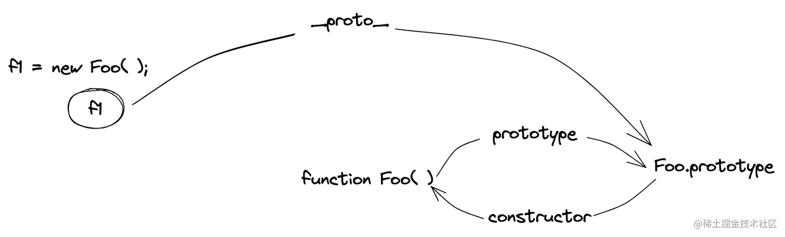
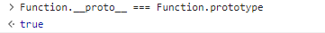
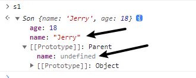

# 1.JS的数据类型有哪些

- 基础数据类型(值类型)：
  - Number
  - String
  - Boolean
  - Undefined
  - Null
  - Symbol(创建后独一无二且不可变的数据类型)
  - BigInt(数字类型的数据，可以表示任意精度格式的整数，使用BigInt可以安全的存储和操作大整数，即使这个数已经超过了Number所能表示的安全整数范围)

- 复杂数据类型(引用类型)

  - Object
  - Function
  - Array
  - RegExp
  - Date
  - 以及单体内置对象(Global Math)等

  基本数据类型的值存放在**栈**中，可直接访问它的值；

  引用数据类型保存在**堆**中，栈中存放的是地址，通过栈中的地址来访问堆中的值

> 栈可以改变原始值
>
> 栈中的数据会被自动清理，堆中的需要手动清除

# 2.null和undefined的区别

首先null和undefined都是基本数据类型，两个数据类型分别都只有一个值，就是undefined和null

- null表示一个值被定义了，但是值为**空值**，用法：

  - 作为函数的参数，表示该函数的参数不是对象
  - 作为对象原型链的终点
  - 释放对象内存

- undefined表示不存在这个值，意思此处应该有个值，但是还没有定义，试图读取时就会返回undefined

  - 函数没有返回值时，默认返回undefined
  - 变量声明，但是没有赋值时，值为undefined
  - 对象中没有赋值的属性，值为undefined
  - 使用函数时，该传入的参数没有传入，该参数为undefined

  > 如何安全的获取undefined？ 可以使用void 0
  >
  > 表达式void ___ 没有返回值，所以返回结果是undefined

# 3.如何判断JS的数据类型

1. typeof

typeof可以判断出除了`null`以外的所有基础数据类型，还能从引用类型中判断出函数`function`

typeof的返回值有

- number
- string
- boolean
- undefined
- symbol
- bigint
- function
- object(typeof null的返回值就是object)

```js
typeof 1 // 'number'
typeof '1' // 'string'
typeof true // 'boolean'
typeof undefined // 'undefined'
typeof Symbol() // 'symbol'
typeof null // 'object'
typeof [] // 'object'
typeof {} // 'object'
typeof console // 'object'
typeof console.log // 'function'
```

2. instanceof

一般是用来判断复杂数据类型，**不能正确判断基础数据类型**，根据**构造函数的原型对象是否出现在对象的原型链上来进行判断**

```js
1 instanceof Number; // false
true instanceof Boolean; // false
'str' instanceof String; // false
[] instanceof Array; // true
function(){} instanceof Function; // true
{} instanceof Object; // true
let date = new Date();
date instance of Date; // true
```

```js
function myInstanceof(left,right) {
    let proto = Object.getPrototypeOf(left) // 获取对象的原型
    prototype = right.prototype // 获取构造函数的原型对象 
    // 判断构造函数的原型对象在不在检测对象的原型链上
   	while(true) {
        if(!proto) return false
        if(proto === prototype) return true
        	
        proto = Object.getPrototypeOf(proto)
    } 
}
```

3. Object.prototype.toString()

```js
Object.prototype.toString({}) // "[object Object]"
Object.prototype.toString.call({}) // 同上结果，加上call也ok
Object.prototype.toString.call(1) // "[object Number]"
Object.prototype.toString.call('1') // "[object String]"
Object.prototype.toString.call(true) // "[object Boolean]"
Object.prototype.toString.call(function () {}) // "[object Function]"
Object.prototype.toString.call(null) //"[object Null]"
Object.prototype.toString.call(undefined) //"[object Undefined]"
Object.prototype.toString.call(/123/g) //"[object RegExp]"
Object.prototype.toString.call(new Date()) //"[object Date]"
Object.prototype.toString.call([]) //"[object Array]"
Object.prototype.toString.call(document) //"[object HTMLDocument]"
Object.prototype.toString.call(window) //"[object Window]"
```

4. Array.isArray()

专门用来判断是否是数组

```js
Array.isArray([]); // true
Array.isArray({}); // false
Array.isArray(1); // false
Array.isArray('string'); // false
Array.isArray(true); // false
```

# 4. == 和 === 的区别

- `==`称为等值符，当等号两边的值为相同类型时比较值是否相同；当类型不同时会发生类型的自动转换，转换成相同的类型后再进行比较
- `===`称为全等符，当等号两边的值为相同类型时比较值是否相同；当类型不同时直接返回false，也就是意味着不仅进行值比较，还进行类型比较

# 5.如何遍历对象的属性

- 遍历自身**可枚举的属性**(可枚举、非继承属性):`Object.keys`,返回一个由给定对象的自身可枚举属性组成的数组
- 遍历自身**除Symbol值作为名称的属性之外的所有属性**(可枚举、不可枚举、非继承属性):`Object.getOwnPropertyNames()`方法返回一个由指定对象的所有自身属性的属性名组成的数组（包括不可枚举属性**但不包括 Symbol 值作为名称的属性**）

- 遍历自身的**所有属性**：`Reflect.ownkeys()`方法返回一个由目标对象的自身属性键(包括Symbol值作为名称的属性)组成的数组，也就等价于`Object.getOwnPropertyNames(target).concat(Object.getOwnPropertySymbols(target))`

- 遍历**可枚举的自身属性和继承属性**：for...in...(for in还会遍历到原型链上的属性，所有看到很多代码上，for in之后还要用hasOwnProterty来判断一下是否是自身属性，才进行下一步逻辑)

# 6.如何判断两个对象是否相等

1.`Object.is(obj1,obj2)`，判断两个对象的引用地址是否一致

2.判断两个对象内容是否一致：思路是遍历对象的所有键名和键值是否一致

​	1 判断两个对象引用地址是否一致

​	2 使用`Object.getOwnPropertyNames()`得到两个对象的键名数组

​	3 对比键名数组是否一致

​	4 对比键值是否一致

```js
function isObjectEqual(obj1,obj2){
    if(obj1 === obj2) return true;
    
    let aProps = Object.getOwnPropertyNames(obj1)
    let bProps = Object.getOwnPropertyNames(obj2)
    
    if(aProps.length !== bProps.length) return false
    for(let prop in obj1) {
        if(obj2.hasOwnProperty(prop)) {
            if(typeof a[prop] === 'object') {
                if(!isObjectEqual(a[prop],b[prop])) return false
            }else if(a[prop] !== b[prop]){
                return false
            }
        } else {
            return false
        }
    }
	return true
    
}
```

# 7.var，let，const区别

> https://www.bookstack.cn/read/es6-3rd/spilt.1.docs-let.md

1. let/const是ES6提出来的，而var是ES5提出来的
2. let/const在声明变量/常量之前，该变量都是不可用的，称为**暂时性死区(temporal dead zone，简称TDZ)**

> var存在变量提升，即提升声明到当前作用域的最前面。let和const其实也存在，就是因为暂时性死区的存在导致变量不可获取

3. var没有块级作用域，var只有函数和全局作用域，而let/const有块级作用域的概念

4. const声明的是常量，而let/var声明的是变量

5. const在声明时必须赋值，而let/var不必

6. let/const不允许在相同作用域内，重复声明同一个变量。而var是可以的，最后一个var声明的值会覆盖之前的，比如

```js
let a = 1; let a = 2; // 报错
var a = 1; var a = 2; // 最后a的值为2
```

> 补充：
>
> 1. for循环有个特别之处，设置循环变量的部分是一个父作用域，而循环体内不是一个单独的子作用域
>
> ```js
> for (let i = 0; i < 3; i++) {
>     let i = 'abc';
>     console.log(i);
> }
> // abc
> // abc
> // abc
> ```
>
> 该代码正常运行，输出了3次abc，表明函数内部的变量i和循环变量i不在同一个作用域，有各自单独的作用域
>
> 2. 暂时性死区的a本质就是，只要一进入当前作用域，所要使用的变量就已经存在了，但是不可获取，只有等到声明变量的那一行代码出现，才可以获取和使用该变量。

# 8.作用域

**作用域：**变量和函数生效的区域和集合，作用于决定了代码区块中资源的可见性，一般分为`全局作用域` 和`局部作用域`（函数作用域、块级作用域(ES6新增)）

- 全局作用域：任何不在函数或者大括号中声明的变量，都处在全局作用域中，全局作用域下的变量可以在代码的任意位置访问
- 函数作用域：在函数内部声明的变量，就处在函数作用域下，这些变量只能在函数内部访问
- 块级作用域：用{}划分的作用域，需要使用let/const来声明

**作用域链：**当JS中使用一个变量时，JS引擎会尝试在当前作用域下寻找该变量，如果没有找到，就会到他的上层作用域寻找，以此类推，直到找到该变量或者查找到全局作用域仍然找不到该变量，在非严格模式下会隐式声明该变量，或者直接报错

**静态作用域：**JS采用的是词法作用域(静态作用域)，也就是说，**函数作用域在定义时候就决定了**，例如下面

```js
var value = 1;
function foo() {
    console.log(value);
}
function bar() {
    var value = 2;
    foo();
}
bar();
// 结果是 1
```

# 9.JS的预解析

JS代码的执行由浏览器中的JS解析器来执行，JS执行JS代码时，分为两个部分:`预解析过程`和`代码执行过程`。而预解析分为`变量预解析(变量提升)`和`函数预解析(函数提升)`;

- `变量提升:`把变量的声明提升到当前作用域的最前面，**只提升声明，不提升赋值**
- `函数提升`：把函数的声明提升到当前作用的最前面，只提升生命，不提升调用

**注意：**

- 函数表达式(  let fun = funcion(){ console.log(123)} )的方式不存在函数提升
- 函数提升优先级高于变量提升，且不会被同名变量覆盖，但是会被同名变量赋值后覆盖

# 10.事件监听


# 11.onClick和addListener区别

1. onClick默认只捕获冒泡事件，addlistener由传入的第二个参数控制(默认false为捕获冒泡阶段，true为捕获阶段)
2. onClick重复绑定会覆盖，addListener可以同一事件绑定多个回调

# 12.Array.from()和Array.of()的使用

`Array.from()`：将伪数组或可遍历对象转化为真数组，接受三个参数，input、map、context

- input：待转换的伪数组或者可遍历对象
- map：类似于数组中的map方法，一个函数，对每个元素进行处理后加入到新数组中
- 绑定map中的this

`Array.of()`：将一系列值转换为数组，会创建一个包含所有传入参数的数组，而不管参数的类型和数量，解决了new Array()行为不统一的问题：比如new Array(1)就是创建一个长度为1的数组，而new Array(1,2,3)就是创建一个[1,2,3]数组。

# 13.原型和原型链

**原型：**

在js中，每一个构造函数内部都显示的有一个`prototype`属性，称为函数的原型，该属性的值是一个对象，称为该构造函数的原型对象。这个对象包含了该构造函数生成的实例所共享的属性和方法。

每一个对象都有私有属性`[[prototype]]`，称为对象原型，指向构造函数的原型对象，但是我们不能直接使用这个私有属性，浏览器环境提供了`__proto__`属性来访问这个属性，但最好不要使用这个属性，因为不是规范中规定的，ES5中新增`Obeject.getPrototypeOf()`方法可以获取对象的原型。

**原型链：**

当我们访问一个对象的属性时，如果对象内部不存在这个属性，就会到它的原型(也就是构造函数的原型对象)中去寻找，原型对象也是个对象，它又有自己的原型，就会这么一直找下去，直到找到或者查到`Object.prototype.__proto__`也就是null。就形成了原型链的概念。



**特点：**

JS对象是通过引用类型，创建的每个新对象并没有属于自己的原型副本，当原型修改时，所有与之相关的对象都会继承这一改变

## 可能的追问

- `Function.__proto__`



# 14.new操作符的实现

1. 首先新建一个空对象
2. 将新建空对象的原型指向构造函数的原型对象
3. 更改this指向新建对象，执行一次构造函数(为新对象增加属性)
4. 判断构造函数的返回值类型，如果是引用类型，就返回这个应用类型的对象，如果是值类型，就返回第一步新建的对象

```js
	function myNew(context) {
        let newObj = null;
        let constructor = Array.prototype.shift.call(arguments);
        let result = null;
        if(typeof constructor !== 'function'){
            console.error("type error");
            return;
        }
        newObj = Object.create(constructor.prototype);
        result = constructor.apply(newObj,arguments);
        let flag = result && (typeof result ==='object' || typeof result === 'function')
        return flag?result:newObj;
    }
	// 使用
	myNew(构造函数，参数)
```

# 15.闭包

在 JavaScript 中，每当创建一个函数，闭包就会在函数创建的同时被创建出来。可以在一个内层函数中访问到其外部的作用域。

当函数被创建出来，内部的[[environment]]属性,ES5之前是[[Scope]]属性,保存着父级的词法环境，就算父级上下文销毁了，它的词法环境还存在在内存中并且依然被内部函数的词法环境引用着，所以不会被垃圾回收机制回收，变量属性依然保存在内存中，内部函数依然可以直接从内存中取值，也就形成了闭包。可以说JS中每一个函数都是一个闭包

优点作用就是可以保护私有变量，避免全局变量污染，延长局部变量的生命周期。一开始的模块化就有用过这种方式，还有JQuery库也是这么实现的，还有各种JS事件也利用了闭包，节流防抖等等。

# 16.this的理解

(JS的this是执行上下文中一个特殊的属性)

JS的this指向我觉得是个设计缺陷，js是静态作用域，而this指向是运行时绑定的，它的指向取决于调用时的条件，更偏向于动态作用域(我感觉是挺万恶的)。总的原则就是谁调用的就指向谁。

js里函数调用有4种方法。第一个是作为对象函数调用，这时候就指向调用的函数。还有一个是作为函数调用，这时候this指向全局对象。箭头函数又比较特别，箭头函数的this某种程度上就规避了一开始的设计缺陷，箭头函数没有自己的this，他的this和外层词法环境的this指向一致，它的取值规范和变量类似，沿着作用域链一层一层向上找。

第三种是作为构造函数，这时候this指向新的实例对象。

最后一个是显式调用，就是call/apply/bind，this就指向手动指定的对象。

# 17.箭头函数和普通函数的区别

1. 箭头函数比普通函数更加简洁
	1. 如果没有参数，只写一个()即可
	2. 如果只有一个参数，可以省去参数的括号
	3. 如果函数体的返回值只有一句，可以省略大括号
	4. 如果函数体不需要返回值，且只有一句话，可以在语句前面加一个void `let fun = () => void doseNotReturn()`
2. 箭头函数没有自己的this、prototype、super、new.target、arguments(使用rest代替)
3. 箭头函数不能作构造函数，也就是不能使用new命令(箭头函数没有prototype)
4. 使用call、apply、bind并不能改变箭头函数中的this指向，前两者只会传入参数并调用函数，bind方法只会返回一个预设参数的新函数

18. 深浅拷贝
- 浅拷贝：如果属性是基础类型，拷贝的就是基础类型的值；如果是引用类型，拷贝的就是引用地址，即拷贝一层，深层次的引用类型则共享内存地址
- 深拷贝：开辟一个新的栈，两个对象的属性完全相同，但是对应两个不同的地址，修改一个对象的属性，不会改变另一个对象的属性。

# 18.JS中内存泄露的几种情况
内存泄漏一般指系统进程中不再使用的内存，如果没有及时释放，就造成资源浪费，导致程序运行减慢乃至系统崩溃。
原因一般有
1. **全局变量**：在局部作用域中，垃圾回收机制可以做出判断回收资源；但是对于全局变量，很难判断什么时候不用这些变量，无法正常回收。
	1. 尽量少使用全局变量
	2. 使用严格模式
2. **闭包引起的内存泄漏**：闭包可以延长局部变量的生命周期，如果在使用完毕后没有清理闭包，可能会引起内存泄漏
3. **被遗忘的定时器**：定时器和延时器不再需要使用，且没有被清理时，导致定时器回调函数及内部变量没有被回收就会造成内存泄漏。
	解决方法：当不需要定时器时，及时使用clearInterval或者clearTimeout手动清理
4. **事件监听**：垃圾回收机制不好判断事件是否需要被接触，导致回调函数不能被释放，需要手动接触
	解决方法：即使使用removeEventListener移除事件监听
5. **元素引用没有清理**
	解决方法：手动设置元素的引用为null
6. **console**：传递给console.log的对象不能被垃圾回收，可能会出现内存泄漏

# 19.浅拷贝

**浅拷贝：**指的是一个新的对象对原始对象进行精确的拷贝，如果拷贝的是基础数据类型，就会拷贝基础数据类型的值，如果拷贝的是引用数据类型，就会拷贝内存地址。浅拷贝只会拷贝一层。

**对象浅拷贝常见方法：**

1. 使用`Object.assign()`方法

assign方法是ES6提供的拷贝方法，传入的第一个参数是目标对象，后续参数为需要拷贝的对象

- 如果对象和源对象有同名属性，或者源对象之间有同名属性，后面的会覆盖前面的
- 如果函数只有一个参数，该参数是对象就返回该对象，不是对象就会将对象包装成一个对象返回
- 但是null和undefined不能转化为对象，第一个参数不能为null或者undefined

```js
let target = {a: 1};
let object2 = {b: 2};
let object3 = {c: 3};
Object.assign(target,object2,object3);  
console.log(target);  // {a: 1, b: 2, c: 3}
```

2. 使用拓展运算符

`let cloneObj = {...obj1}`

```js
let obj1 = {a:1,b:{c:1}}
let obj2 = {...obj1};
obj1.a = 2;
console.log(obj1); //{a:2,b:{c:1}}
console.log(obj2); //{a:1,b:{c:1}}
obj1.b.c = 2;
console.log(obj1); //{a:2,b:{c:2}}
console.log(obj2); //{a:1,b:{c:2}}
```

**数组进行浅拷贝:**

1. `Array.prototype.slice(start,end)`

- 从原数组中返回特定的元素，不会改变原数组
- 传入两个可选参数，代表返回数组的开始索引和结束索引，都不传可以实现数组的浅拷贝

```js
let arr = [1,2,3];
let cloneArr = arr.slice();
arr === cloneArr // false
```

2. `Array.prototype.concat()`

- 用于合并多个数组，不会改变原数组，只会返回一个新数组

```js
let arr = [1,2,3]
let cloneArr = arr.concat()
arr === cloneArr // false
```

# 20.深拷贝

**深拷贝：**相较于浅拷贝，当深拷贝遇到引用类型的时候，会新建一个引用类型并将相应的属性赋值给它，因此拷贝出来的是一个新的对象。和源对象对比内容一样，但是地址不一样。修改一个对象的属性，另一个不会跟着修改。

具体代码在手写md文件里

# 21.sessionStorage、localStorage、Cookie的区别

# 22.ES5的继承

使用原型来进行继承，举例

下面是一个Shape构造函数，要让Rectangle构造函数继承Shape

```ts
function Shape() {
  this.x = 0;
  this.y = 0;
}

Shape.prototype.move = function (x, y) {
  this.x += x;
  this.y += y;
  console.info('Shape moved.');
};
```

总的分为两步

```js
// 第一步，子类继承父类的实例
function Rectangle() {
  Shape.call(this); // 调用父类构造函数
}
// 另一种写法
function Rectangle() {
  this.base = Shape;
  this.base();
}

// 第二步，子类继承父类的原型
Rectangle.prototype = Object.create(Shape.prototype);
Rectangle.prototype.constructor = Rectangle;
```

**其中`Object.create()` 静态方法以一个现有对象作为原型，创建一个新对象。**

采用这样的写法以后，`instanceof`运算符会对子类和父类的构造函数，都返回`true`。

```
var rect = new Rectangle();

rect instanceof Rectangle  // true
rect instanceof Shape  // true
```

上面代码中，子类是整体继承父类。有时只需要单个方法的继承，这时可以采用下面的写法。

```
ClassB.prototype.print = function() {
  ClassA.prototype.print.call(this);
  // some code
}
```

上面代码中，子类`B`的`print`方法先调用父类`A`的`print`方法，再部署自己的代码。这就等于继承了父类`A`的`print`方法。

# 23.变量提升/函数提升

## 1.变量提升

在ES6出来之前，JS并没有块级作用域这一说，只有全局作用域和局部作用域。

变量提升指的是使用var声明的变量提升到他所在的作用域的最顶端。

> 只提升变量，不提升赋值

举个例子

```
console.log(a)   //undefined
var a='我是谁'
console.log(a)   //'我是谁'
```

过程相当于

```js
var a;
console.log(a);
a='我是谁'
console.log(a)
```

## 2.函数提升

js中创建函数有两种方式：
- 函数声明式 function fn() {}
- 函数表达式。var fn = function() => {} //这种更像是变量提升
**只有函数声明才存在函数提升**；而对于赋值的匿名函数，并不会存在函数提升。
```js
console.log(a);    // f a()
console.log(b);    //undefined     

function a(){
    console.log('hello')
}

var b = function(){
    console.log('world')
}

```
就相当于
```js
function a(){
    console.log('hello')
}
var b;
console.log(a);   
console.log(b);
b = function{
    console.log('world')
}
```
### 2.1块级作用域中的函数提升

在ES6浏览器运行下面的代码会报错
```js
// 浏览器的 ES6 环境
function f() { console.log('I am outside!'); }
(function () {
  if (false) {
    // 重复声明一次函数f
    function f() { console.log('I am inside!'); }
  }
  f();
}());
// Uncaught TypeError: f is not a function
```
原来，如果改变了块级作用域内声明的函数的处理规则，显然会对老代码产生很大影响。为了减轻因此产生的不兼容问题，ES6 在[附录 B](https://www.ecma-international.org/ecma-262/6.0/index.html#sec-block-level-function-declarations-web-legacy-compatibility-semantics)里面规定，浏览器的实现可以不遵守上面的规定，有自己的[行为方式](https://stackoverflow.com/questions/31419897/what-are-the-precise-semantics-of-block-level-functions-in-es6)。
- 允许在块级作用域内声明函数。
- 函数声明类似于`var`，即会提升到全局作用域或函数作用域的头部。
- 同时，函数声明还会提升到所在的块级作用域的头部。

注意，上面三条规则只对 ES6 的浏览器实现有效，其他环境的实现不用遵守，还是将块级作用域的函数声明当作`let`处理。
根据这三条规则，浏览器的 ES6 环境中，块级作用域内声明的函数，行为类似于`var`声明的变量。上面的例子实际运行的代码如下。

```javascript
// 浏览器的 ES6 环境
function f() { console.log('I am outside!'); }
(function () {
  var f = undefined;
  if (false) {
    function f() { console.log('I am inside!'); }
  }
  f();
}());
// Uncaught TypeError: f is not a function
```

所以如果要在块级作用域中声明函数，尽量写成函数表达式

```javascript
// 块级作用域内部的函数声明语句，建议不要使用
{
  let a = 'secret';
  function f() {
    return a;
  }
}

// 块级作用域内部，优先使用函数表达式
{
  let a = 'secret';
  let f = function () {
    return a;
  };
}
```

## 3.变量提升和函数提升的优先级

函数是一等公民，**函数提升优先级高于变量提升，且不会被同名变量声明覆盖，但是会被变量赋值后覆盖。**而且存在同名函数与同名变量时，优先执行函数。

```js
    console.log(typeof fn); // function

    function fn() {
        console.log('Hello World');
    }

    console.log(typeof fn); // function 

    var fn = 1;

    console.log(typeof fn); // number
```

实际相当于

```js
	function fn() {
        console.log('Hello World');
    }
	var fn; // 注意，同名变量声明不会覆盖函数声明

	console.log(typeof fn); // function

	// ...原函数定义被剪切走了

	console.log(typeof fn); // function

	fn = 1; // 但是会被变量赋值覆盖

	console.log(typeof fn); // number
```

# 24.cookie和localStorage的区别

1. 大小：cookie的存储容量较小，在4K一下，Storage要大得多，5M左右
2. cookie会在同源的http请求中自动携带，还可以通过path属性来限制在特定的路径中才能使用，storage只是存在本地，不会自动携带
3. 有效期不同：sessionStorage在会话窗口关闭前都有效，storage始终有效，可以持久化保存数据，除非手动清除。cookie会在设置的时间过期前有效，有max-age和expire属性来设置过期时间。
4. 作用域不同，sessionStorage不能在不同的浏览器窗口中共享，localStorage和cookie可以在同源的窗口中共享

# 25.cookie的属性

- max-age：cookie生效的秒数
- expire：最长有效时间
- domain:cookie在哪个域下可以被接受，并且子域名也可以访问父域名的cookie
- path：cookie可以在哪个路径下可以被接受
- httpOnly：是否可以通过js访问该cookie
- secure：标记为 secure 的 Cookie 只应通过被 Https 协议加密过的请求发送给服务端
- someSite：
  - someSize:None: 浏览器在同站请求、跨站请求下都会发送 Cookies
  - someSize:Strict: 浏览器只会在相同站点下发送 Cookies
  - someSize:Lax: 与 strict 类似，不同的是它可以从外站通过链接导航到该站。

# 26.对防抖节流的认识

## 防抖

一般使用防抖需要满足三个条件

- 频繁的调用某个函数
- 造成了页面卡顿或者性能损失
- 以最后一次函数调用结果为准

# 27.事件循环

它是JS的执行机制，JS是单线程语言，一次只能执行一个任务，遇到一些高耗时的任务就会堵塞页面。所以JS将任务分为两种

- 同步任务
- 异步任务

JS是单线程的，但是浏览器不是单线程的。同步任务进入主线程依次调用执行，而异步任务先到Event Table中注册回调函数，由专门的线程进行控制，当指定事情完成后，会将回调函数移入Event Queue回调队列中，当主线程任务为空了，(JS引擎有额外的进程进行监督)，就会从Event Queue依次读取回调函数执行。这个过程不断往复，称为事件循环。

而异步任务也分为两种，微任务和宏任务。两者的回调函数会移入不同的回调队列中。微任务会比宏任务先执行。

常见的宏任务有，整个script代码块，setTimeout，setInterval，ajax，DOM事件等等。

常见的微任务有Promise.then、queueMicroTask,MutationObserver，node环境有process.nextTick()

在一次事件循环中，当主线程同步任务执行完了，执行栈为空了，就会从微任务队列中依次取出函数执行，如果有新增的微任务，也会一直执行。然后微任务执行完了，会执行一次渲染函数。然后会去从宏任务队列中再取出一个任务来执行。依次不断往复。

这是JS一个很显著的特点吧。它的设计目的决定了它不可能多线程，就有了事件循环机制来模拟出多线程。

# 28. 继承

## 原型链继承

```js
//原型链继承
function Parent() {
  this.name = 'Jerry'
  this.food = ['apple'];
}
Parent.prototype.say = function () {
  console.log('hello');
}

Son.prototype = new Parent() 

function Son() {
  this.age=18
}

let s1 = new Son()

console.log(s1.name);  //Jerry
console.log(s1.say());  //hello
```

优点

- 父类方法可以复用

缺点

- 父类的所有引用类型数据(对象、数组)会被子类共享，更改了一个字类的数据，其他数据都会受到影响
- 子类不能给父类传参

## 构造函数继承

```js
//经典继承
function Parent(name) {
  this.name = name
}
Parent.prototype.say = function () {
  console.log('hello');
}

function Son(name) {
  Parent.call(this,name)   //this.name = name
  this.age=18
}

let s1= new Son('Jerry')

console.log(s1.name);   //Jerry
console.log(s1.say());  //TypeError: s1.say is not a function
```

优点

- 父类的引用数据类型数据不会被子类共享，不会互相影响

缺点

- 字类不能访问父类原型对象上的方法和参数

## 组合继承

将前两种方案组合一下

```js
//组合继承
function Parent(name) {
  this.name = name
}

Parent.prototype.say = function () {
  console.log('hello');
}

Son.prototype = new Parent();

function Son(name) {
  Parent.call(this, name)   //继承到父类实例属性
  this.age = 18

}

let s1 = new Son('Jerry')

console.log(s1.name);   //Jerry
console.log(s1.say());  //hello
```

优点

- 父类可以复用
- 父类构造函数中的引用类型数据不会被共享

缺点

- 会调用两次父类的构造函数，会有两份一样的属性,影响性能



## 寄生组合继承(也是第22条的继承方式)

非常完美

```js
//组合继承
function Parent(name) {
  this.name = name
}

Parent.prototype.say = function () {
  console.log('hello');
}

Son.prototype = Object.create(Parent.prototype) // 拷贝一份Parent的原型对象
Son.prototype.constructor = Son // 这一步很重要

// 如果没有Object.create方法，这是ES5的，可以用一个函数作为过渡
//function F() {}
//F.prototype = Parent.prototype
//Son.prototype = new F();
//Son.prototype.constructor = Son

function Son(name) {
  Parent.call(this, name)   //继承到父类实例属性
  this.age = 18

}

let s1 = new Son('Jerry')

console.log(s1.name);   //Jerry
console.log(s1.say());  //hello
```

## ES6的extends语法

```js
class Parent {
  constructor (value) {
    this.val = value
  }
  getValue() { 
    console.log(this.val);
  }
}

class Child extends Parent {
  constructor (value) {
    super(value)
    //super(); this.val = value
  }
}

let c = new Child(1)
c.getValue()
// console.log(c);
```
