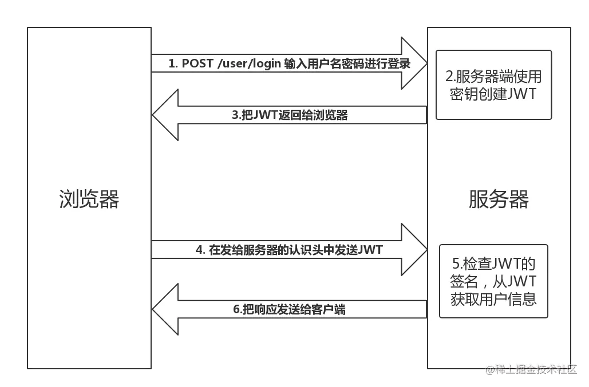

# Cookie、Session、Token区别

> 老是忘记，现在给他记下来，后续再更新代码
>
> 取自[视频1](https://www.bilibili.com/video/BV1yW4y1s7eW/?spm_id_from=333.880.my_history.page.click&vd_source=7dcb6c648b7faefd7170d0fc0494d4ad)、[视频2](https://www.bilibili.com/video/BV1ob4y1Y7Ep/?spm_id_from=333.788.recommend_more_video.2&vd_source=7dcb6c648b7faefd7170d0fc0494d4ad)、[掘金](https://juejin.cn/post/7090503270447185951)

# 背景：Http是无状态协议

Http的 HTTP 协议是无状态的，所谓的无状态就是客户端每次想要与服务端通信，都必须重新与服务端链接，意味着请求一次客户端和服务端就连接一次，下一次请求与上一次请求是没有关系的。

这种无状态的方式就会存在一个问题：如何判断两次请求的是同一个人？就好比用户在页面 A 发起请求获取个人信息，然后在另一个页面同样发起请求获取个人信息，我们如何确定这俩个请求是同一个人发的呢？或者如何保持登录状态？

为了解决这个问题，cookie、session、token技术就出现了。它们就好比让客户端有了自己的身份证，可以通过这个身份证来确定发请求的人是谁。服务器与浏览器为了进行会话跟踪（知道是谁在访问我），就必须主动的去维护一个状态，这个状态用于告知服务端前后两个请求是否来自同一浏览器。而这个状态需要通过 cookie 或者 session 去实现。

# 1. Cookie

## 1.1 Cookie是什么

很简单，不要想复杂，Cookie就是浏览器将服务器返回的数据**保存在本地**的**一小块数据**(一般小于4KB)，每一条Cookie记录，本质上就是一个键值对。当浏览器发送请求且浏览器存在 Cookie 时，浏览器会自动在请求头携带上 Cookie 数据。以前很多开发人员通常用 cookie 来存储各种数据，后来随着更多浏览器存储方案的出现，cookie 存储数据这种方式逐渐被取代，主要原因有如下：

- cookie有存储大小限制，4KB左右
- 浏览器每次请求都会携带Cookie在请求头中，Cookie大了，降低访问效率
- 字符编码为Unicode，不支持直接存储中文
- 数据可以被轻易查看

> 其实cookie就是一种存储手段，或者一小块数据，不要想太复杂

注意：**Cookie是不可跨域的**：每个Cookie都会绑定单一的域名，无法在别的域名下获取使用，一级域名和二级域名之间是允许共享使用的，靠的是domain属性

下图是百度的cookie，可以看到，就是一堆键值对，附带一些属性而已。


下面是百度页面随便找的一个请求，可见，发送请求会把服务器传回来的cookie数据又自动附加，传回了服务器，好让服务器可以根据信息来识别自己的身份(比如例子里的SessionId)


## 1.2 属性

| 属性名称 | 属性含义                                                     |
| -------- | ------------------------------------------------------------ |
| name     | Cookie的名称                                                 |
| value    | cookie的值                                                   |
| comment  | cookie的描述信息                                             |
| domain   | 可以访问该cookie的域名                                       |
| expires  | cookie的过期时间，具体某一时间                               |
| maxAge   | cookie的过期时间，比如多少秒后cookie过期                     |
| path     | cookie的使用路径                                             |
| secure   | cookie是否使用安全协议传输，比如SSL                          |
| version  | cookie的使用版本号                                           |
| httpOnly | 指定该 Cookie 无法通过 JavaScript 脚本拿到，比如 Document.cookie 属性、XMLHttpRequest 对象和 Request API 都拿不到该属性。这样就防止了该 Cookie 被脚本读到，只有浏览器发出 HTTP 请求时，才会带上该 Cookie。 |

## 1.3 用来干什么

Cookie主要用于以下三个目的

- 会话管理：登录、购物车、游戏得分或者服务器应该记住的其他内容
- 个性化：用户偏好、主题或者其他设置
- 追踪：记录和分析用户行为

Cookie曾经用于一般的客户端存储，这是合法的，因为它们是那时候客户端上存储数据的唯一方法，但是现在不一样了，有了新的现代化存储API。

## 1.4 例子介绍

以一个普通网站的用户登录和后续操作(Cookie+Session)为例子，简单的过程如下


1. 客户端发送请求到服务端，比如登录请求
2. 服务端收到请求后生成一个session会话
3. 服务端响应客户端，并在响应头中设置Set-Cookie，里面可以包含SessionId
4. 客户端收到该请求，如果服务器设置了Set-Cookie，客户端接收到响应后会自动保存下Cookie，之后浏览器对该服务器的每一次请求中都会通过请求头把 Cookie 信息发送给服务器
5. 客户端发送其他请求，自动携带了Cookie，Cookie这一段信息中就有用户信息等
6. 服务段收到请求，验证Cookie信息，比如这里通过SessionId来判断是否存在会话，存在则正常响应

# 2. Session

## 2.1 Session是什么

上面我们提到了Session，字面意思是`会话`。当客户端请求服务端，==服务端==会为这次请求开辟一块==内存空间==(创建了Session对象)，同时生成一个唯一标识符SessionId，并像上面说的那样，通过`Set-Cookie：JSESSIONID=XXXXXXX`命令，向客户端发送要求设置Cookie的响应，客户端再将SessionId存到cookie中。

> session 由服务端创建，当一个请求发送到服务端时，服务器会检索该请求里面有没有包含 sessionId 标识，如果包含了 sessionId，则代表服务端已经和客户端创建过 session，然后就通过这个 sessionId 去查找真正的 session，如果没找到，则为客户端创建一个新的 session，并生成一个新的 sessionId 与 session 对应，然后在响应的时候将 sessionId 给客户端，通常是存储在 cookie 中。如果在请求中找到了真正的 session，验证通过，正常处理该请求。


## 2.2 注意事项

- 通常情况下，我们 cookie 和 session 都是结合着来用，但是只用session不用cookie，或是只用cookie，不用session在理论上都可以保持会话状态。可是实际中因为多种原因，一般不会单独使用
- **但Cookie只是实现Session的其中一种方案。**虽然是最常用的，但**并不是唯一的方法**。禁用cookie后还有其他方法存储，比如放在url中

## 2.3 Cookie和Session区别

其实我感觉两个东西是两种完全不同的技术，两者通过SessionId关联起来。

或者说，**Session是基于/依赖于Cookie来实现的**，两者有以下特点

- session 比 cookie 更加安全，因为它是存在服务端的，cookie 是存在客户端的。

- cookie 只支持存储字符串数据，session 可以存储任意数据。

- cookie 的有效期可以设置较长时间，session 有效期都比较短。

- session 存储空间很大，cookie 有限制。

如果只是想实现鉴权，单独使用cookie，单独使用session都可以，但是建议配合使用

## 2.4 Session缺点

Session机制是有缺点的，如果同时有百万级别的请求访问服务端，服务端就得开辟百万级别的内存空间，对服务器压力太大，就需要做负载均衡了，但这是后端的事情了。

## 2.5 CSRF攻击

此外，Cookie和Session认证还有个问题，==CSRF攻击==(Cross Sit Requset Forgery)，即**跨站请求伪造**

如图的场景，b.com在访问a.com，前面我们提到过，浏览器发送请求会自动携带cookie，服务器就会认为这是合法的请求，所以就会形成CSRF攻击，这里利用了WEB中用户认证的小漏洞：**简单的身份验证仅仅能保证请求发自某个用户的浏览器，却不能保证请求本身是用户自愿发出的。**


但是cookie其实也是有自己的防御机制的，服务器发送的cookie数据中，有一个属性`SameStie`，浏览器会根据这个属性的值，来采取不同的安全策略

| 属性值 | 说明                                                         | 备注        |
| ------ | ------------------------------------------------------------ | ----------- |
| Strict | 此时，浏览器会采用严格禁止的策略。b.com访问a.com想携带a.com的cookie，任何条件下都不允许 |             |
| Lax    | 浏览器采取适当禁止的策略。b.com访问a.com想携带a.com的cookie，超链接、预加载、表单get提交是允许的。但如果是图片地址、ajax、iframe这种访问，是禁止携带cookie的 | 默认就是Lax |
| None   | 浏览器将没有任何限制                                         |             |


# 3. Token

## 3.1 什么是Token

### 3.1.1 Acesss Token

- 访问令牌，访问资源接口(API)时所需的资源凭证
- 简单Token的组成有：**uid** + **time** + **sign** 其中uid为用户唯一的身份标识、time为当前时间的时间戳、sign为签名，由token的前几位以哈希算法压缩成的一定长度的十六进制字符串
- 特点是
  - 服务端无状态化、可拓展性好
  - 支持移动端设备
  - 安全
  - 支持跨程序调用
- 身份验证流程


1. 客户端使用用户名和密码请求登录
2. 服务端收到请求后，验证用户名、密码
3. 验证成功后，服务端签发一个token并发给客户端
4. 客户端收到Token后，会把它存储起来，比如放到**cookie**或者**localStorage**中(放到cookie中会自动发送，但是不能跨域)
5. 客户端每次向服务器请求资源时都需要带着服务端签发的token
6. 服务端收到请求，去验证客户端请求中携带的token，如果验证成功，就向客户端返回请求的数据

- 注意点
  - 每一次请求都需要携带token，需要把token放到http的Header里
  - 基于token的用户认证是一种服务端无状态的认证方式，服务端不需要存放token数据，用解析token的计算时间换取session的存储空间，减轻服务器的压力
  - token不属于浏览器的技术规范，浏览器不会对token做任何处理，也不会自动携带，可以避开CSRF问题
  - token完全由应用管理，由程序员自己来维护，可以避开同源策略。

### 3.1.2 Refresh Token

- 刷新令牌，是一个用来获取acesss token的凭证，用专门用来刷新accesss token的token。如果没有refresh token，也可以刷新acesss token，但是每次刷新都要用户输入用户名和密码，很麻烦。有了refresh token可以减少这个问题，客户端直接使用refresh token来更新acesss token，无需用户额外的操作。

- Acesss token的有效期比较短，过期失效时，使用Refresh Token可以获取到新的token，如果Refresh Token也失效了，用户智能重新登录了。

- Refresh Token及过期时间是存储在服务器的数据库中，只有在申请新的Acess Token时才会验证，不会对业务接口响应时间造成影响，也不需要像Session一样一直保持在内存中以应对大量请求。

  

## 3.2 Token和Session的区别

- Session 是一种**记录服务器和客户端会话状态的机制，使服务端有状态化，可以记录会话信息**。而 Token 是**令牌**，**访问资源接口（API）时所需要的资源凭证**。Token **使服务端无状态化，不会存储会话信息。**
- **Session 和 Token 并不矛盾**，作为身份认证 Token 安全性比 Session 好，因为每一个请求都有签名还能防止监听以及重放攻击，而 Session 就必须依赖链路层来保障通讯安全了。**如果你需要实现有状态的会话，仍然可以增加 Session 来在服务器端保存一些状态。**
- 安全性方面：
  - Session认真只是简单的把User信息存储到Session对象中，因为SeesionId的不可预测性，姑且可以认为是安全的。
  - 而Token，如果指的是OAuth机制(OAuth是一个开放标准,提供了一种简单和标准的安全授权方法,允许用户无需将某个网站的用户名密码提供给第三方应用就可以让该第三方应用访问该用户在某网站上的某些特定信息,如简单的个人信息),提供的就是 **认证** 和 **授权**, 认证是针对用户，授权是针对App，目的是让某App有权访问某用户的信息。这里的Token是唯一的，不可以转移到其他App上，也不可以转移到其他用户上。
  - Session只提供一种简单的认证，即只要有此SessionID，就可以认为有了对应User的全部权力，所以需要严格保密，这个ID应该只保存在站方，不应该共享给其他的网站或第三方App。
  - 所以总的来说：**如果需要用户数据和第三方共享，或者允许第三方调用API接口，就需要使用Token，如果只是自己的网站封闭使用，就无所谓用哪个了**

## 3.3 JWT

全称**JSON Web Tokens**，这是**一个开放的标准**,**规定了一种Token实现方式**,以JSON为格式。是目前最流行的民间跨域认证解决方案。

- 是一种认证授权机制
- JWT是为了在网络应用环境中传递声明而执行的一种基于JSON的开放标准[RFC 7519](https://www.rfc-editor.org/rfc/rfc7519)
- JWT的声明一般被用来在身份提供者和服务提供者之间传递被认证的用户身份信息，以便从资源服务器上获取资源，比如用来用户登录上。
- 可以使用 HMAC 算法或者是 RSA 的公/私秘钥对 JWT 进行签名。因为数字签名的存在，这些传递的信息是可信的。

### 3.3.1 组成

通常由（.）分割的三部分组成，通常如下展示


1. **Header(头部)**：存放Token类型和加密的方法，是一个对象
2. Payload(负载)：包含一些用户身份信息，也是一个对象
3. **Signature(签名)**：签名是将前面的Header、Payload信息以及利用一个只有服务器知道的密钥，使用Header里面指定的签名算法产生签名

算出签名后，把三部分拼成一个字符串，每个部分之间用（.）分割

```json
	JWT = Base64(Header) + "." + Base64(Payload) + "." + $Signature
```

### 3.3.2 使用流程



1. 用户输入用户名、密码进行登录，服务端认证成功后，会返回客户端一个JWT
2. 客户端将token保存到本地(通常使用localStorage，也可以使用cookie，但不能跨域)
3. 当用户希望访问一个受保护的路由或者资源的时候，需要请求头的 Authorization 字段中使用Bearer 模式添加 JWT，其内容看起来是下面这样

```xml
	Authorization: Bearer <token>
```

4. 服务端的保护路由将会检查请求头中的`Authorization`中的JWT信息，如果合法，则允许用户的请求

### 3.3.2 特点

- 因为JWT是自包含的(内部包含了一些会话信息)，可以减少需要查询数据库的需要(相比于普通的token方式)
- 如果JWT不使用Cookie来存储，就可以像任何域名提供API服务而不需要担心跨域资源共享问题(CORS)
- 因为用户的状态不再存储在服务端的内存中，所以这是一种无状态的认证机制

### 3.3.3 JWT的使用方式

#### 方式一

客户端收到服务器返回的 JWT，可以储存在 Cookie 里面，也可以储存在 localStorage。此后，客户端每次与服务端通信，都要带上这个JWT。你可以把它放在Cookie里面自动发送，但是这样不能跨域，所以更好的做法是放在HTTP请求的头信息 Authorization 字段里面。

```js
	Authorization: Bearer <token>
```

#### 方式二

跨域的时候，可以把 JWT 放在 POST 请求的数据体里。

#### 方式三

通过 URL 传输

```html
	http://www.example.com/user?token=xxx
```

### 3.3.4 JWT的作用

JWT最开始的初衷是为了实现授权和身份认证作用的，可以实现无状态，分布式的Web应用授权。大致实现的流程如下


1. 客户端需要携带用户名/密码等可证明身份的的内容去授权服务器获取JWT信息；
2. 每次服务都携带该Token内容与Web服务器进行交互，由业务服务器来验证Token是否是授权发放的有效Token，来验证当前业务是否请求合法。

这里需要注意：不是每次请求都要申请一次Token，这是需要注意，如果不是对于安全性要求的情况，不建议每次都申请，因为会增加业务耗时；比如只在登陆时申请，然后使用JWT的过期时间或其他手段来保证JWT的有效性；

## 3.4 Token和JWT的区别

使用token时，服务端不用存放token，而是解析token数据，然后用解析出来的数据再去数据库查询用户信息。使用JWT时，解析jwt出来的数据已经包含了用户信息，不用再查询数据库。

JWT只是Token的一种实现标准。

- **相同**：
  - 都是访问资源的令牌
  - 都可以记录用户的信息
  - 都是使服务端无状态化
  - 都是只有验证成功后，客户端才能访问服务端上受保护的资源

- **区别**：

  - Token：服务端验证客户端发送过来的Token时，还需要查询数据库获取用户信息，然后验证Token是否有效。

  - JWT： 将Token和Payload加密后存储于客户端，服务端只需要使用密钥解密进行校验（校验也是 JWT 自己实现的）即可，不需要查询或者减少查询数据库，**因为JWT自包含了用户信息和加密的数据。**

    

# 4.需要考虑的问题

## Cookie

- 因为存储在客户端，容易被客户端篡改，使用前需要验证合法性

- 不要存储敏感数据，比如用户密码，账户余额

- 使用 httpOnly 在一定程度上提高安全性

- 尽量减少 cookie 的体积，能存储的数据量不能超过 4kb

- 设置正确的 domain 和 path，减少数据传输

- **cookie 无法跨域**

- 一个浏览器针对一个网站最多存 20 个Cookie，浏览器一般只允许存放 300 个Cookie

- **移动端对 cookie 的支持不是很好，而 session 需要基于 cookie 实现，所以移动端常用的是 token**

## Session

- 将 session 存储在服务器里面，当用户同时在线量比较多时，这些 session 会占据较多的内存，需要在服务端定期的去清理过期的 session

- 当网站采用**集群部署**的时候，会遇到多台 web 服务器之间如何做 session 共享的问题。因为 session 是由单个服务器创建的，但是处理用户请求的服务器不一定是那个创建 session 的服务器，那么该服务器就无法拿到之前已经放入到 session 中的登录凭证之类的信息了。

- 当多个应用要共享 session 时，除了以上问题，还会遇到跨域问题，因为不同的应用可能部署的主机不一样，需要在各个应用做好 cookie 跨域的处理。

- **sessionId 是存储在 cookie 中的，假如浏览器禁止 cookie 或不支持 cookie 怎么办？** 一般会把 sessionId 跟在 url 参数后面即重写 url，所以 session 不一定非得需要靠 cookie 实现

- **移动端对 cookie 的支持不是很好，而 session 需要基于 cookie 实现，所以移动端常用的是 token**

## Token

- 如果你认为用数据库来存储token会导致查询时间太长，可以选择放在内存当中。

- **token 完全由应用管理，所以它可以避开同源策略**

- **token 可以避免 CSRF 攻击(因为可以不需要 cookie 了)**

  
