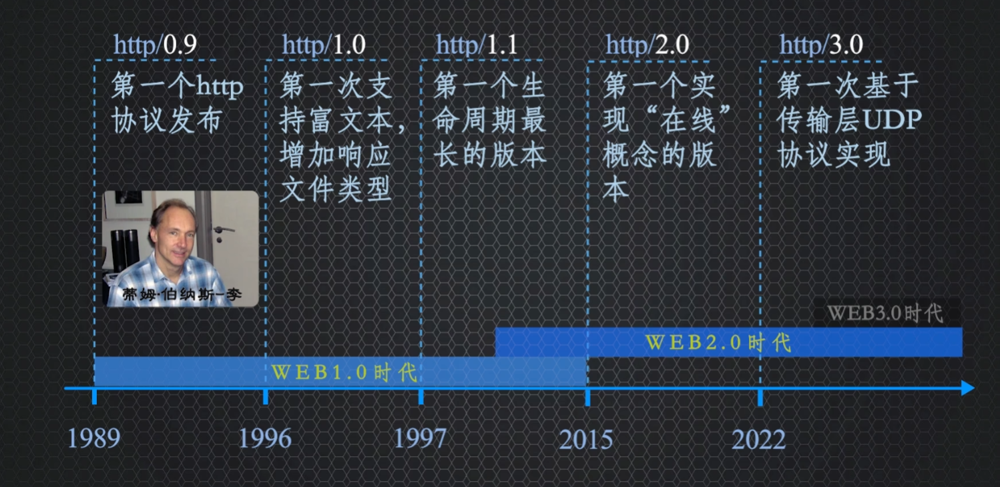

# Http

> [这个视频非常详细](https://www.bilibili.com/video/BV1Ee4y1c7Wq/?vd_source=7dcb6c648b7faefd7170d0fc0494d4ad)

## http 0.9

第一个http协议，特点就是简陋，经过三次握手建立连接，客户端发起GET请求，服务器仅能响应HTML文本类型的数据，想要显示图片播放音频更是不可能；客户端收到数据后，立即四次挥手关闭连接，所以也叫单线协议。

0.9版本没有http标头，没有状态码，没有错误码

## http 1.0

1.0请求加入了http协议标头，响应增加了状态码和传输的内容类型(Content-Type)

但是和0.9一样，一个连接只能处理一个请求一次响应，每次建立物理连接的成本很高，而且服务器压力很大

## http 1.1

### 持久连接

引入了重要概念，就是持久连接：建立连接后指定时间内不会关闭这个TCP连接，可以在保持这个连接上发送多个请求。

节省了每次握手挥手的时间

### 流水线概念

客户端可一次发送多个请求，客户端收到请求后，按顺序将准备好的数据再**按顺序**一个个的回复给客户端

#### 问题一：线头阻塞

但是会出现会造成head of line blocking问题，即线头阻塞

比如客户端一次发送3个请求，第一个请求处理的事件过长，第二第三个请求就需要依次排队，等待第一个请求完成，就造成了流水线的阻塞现象。

在这个版本，浏览器解决的办法就是保持多个连接，以缓解一个连接堵塞，客户端可以通过其他连接继续发送请求

#### 问题二：HTTP标头冗余问题

在连续发送请求的情况下，每次请求都会带上相同基本不会变化的http标头，并且http1.1发送的数据是纯文本的，传输数据庸长

## http 2.0

http2协议是1.1协议的拓展，不是替代，她只是更好的解决了1.1版本遗留的问题和功能补充。

http2在应用层增加了一个二进制帧数据处理层，将http标头和数据明文消息拆分成二进制数据帧进行传输，每个数据帧包含自己携带的数据并用stream id做标识。将数据拆解成数据帧，单独打包成独立流传输到目的地后再按照stream id将他们组装起来还原成原始数据。

这么做好处一是提高了传输速度，因为底层的协议对二进制处理变少，速度变快。二是可以将大文件拆分，规避了大文件传输大小的限制。

客户端以流的方式请求，服务端以流的方式响应，形成了双向数据流，数据帧使用stream id做标识，然后按照stream id将多个数据帧识别为一个消息，保证了数据的完整性。

### 多路复用

http2协议是一个客户端与服务器建立一个连接，再加上双向数据流，客户端服务器交互就可以重用建立的单个连接传递数据，就形成了**多路复用**

> 一个客户端和一个服务器保持一个连接，在该连接上并发传输，就是多路复用

#### 解决HTTP线头阻塞问题

> 而 HTTP/2 便从 HTTP 协议本身解决了`队头阻塞`问题。注意，这里并不是指的`TCP队头阻塞`，而是`HTTP队头阻塞`，两者并不是一回事。TCP 的队头阻塞是在`数据包`层面，单位是`数据包`，前一个报文没有收到便不会将后面收到的报文上传给 HTTP，而HTTP 的队头阻塞是在 `HTTP 请求-响应`层面，前一个请求没处理完，后面的请求就要阻塞住。两者所在的层次不一样。

数据帧标注了stream id，那么传输数据流的顺序可以是乱序的，无论是客户端还是服务器端接收到的流数据，先到的在缓冲区先组装，不用等待前一个请求数据处理完成，再处理下一个，就解决了线头阻塞问题

> 并没有完全解决TCP层的线头阻塞问题，因为TCP协议为了保证消息可靠，对于消息同样是按照顺序传递的，就有可能造成塞车问题，详细例子可以看视频12:13秒，传输层的线头阻塞问题没有解决
>
> 比如传输层接收缓存区接收到如下数据包，且数据包2在传输过程中丢失了，哪怕数据包1和3中的stream id为1的数据帧已经可以合成完整的消息了，还是需要等待TCP重发数据包2的副本。丢失的TCP数据包2阻塞了TCP数据包3，导致了TCP的线头阻塞
>
> 

### 服务器推送功能

因为http2具有双向数据流和多路复用的特点，有利于http2提供服务器推送功能，比如打开B战首页，B战服务器可以将首页所需的JS CSS文件直接推送给我们。

该功能也进一步减少了网络请求的数量，提高了交互的效率

### 标头压缩

> HTTP/2 当中废除了起始行的概念，将起始行中的请求方法、URI、状态码转换成了头字段，不过这些字段都有一个":"前缀，用来和其它请求头区分开。

http2使用HPACK来编解码http标头

HPACK就是双方都维护着相同的61个条目的只读静态表和可动态添加条目的空白的动态表

当请求发送的时候先查找表中的键值，键值完全匹配的，直接提取该标头的整数索引，用于表示该键值对，如果只匹配名称，则使用索引表示名称，值使用霍夫曼算法进行编码后表示。表中没有的则按照顺序添加到动态表中，再使用霍夫曼算法编码键值后将字符传递给服务器，服务器使用表中的索引解码，或者使用霍夫曼算法解码后添加到服务器动态表中，保证双方的表中保存的数据和整数索引一致。

这样后续的请求标头会越来越小。

#### 思考1：了解了HPACK原理以后，是不是可以更好的优化网络请求？

客户端对同一个网站交互越多，动态表中积累的http标头条目越多，压缩效果就越好。所以交互最好是同域名，或者同域名下不同二级域名指向的服务器IP一样，而且使用同一个加密证书，这样确保使用的是相同的静动态标头表

#### 思考2：HPACK按照顺序编解码标头，会不会造成线头阻塞？

会。因为http2数据流可以是无序的，如果有个请求标头索引比服务器解码动态表头中的最大索引值还大，无法解码，而导致使用该标头相关的数据流都会被阻塞，直到携带该索引表示的正确霍夫曼编码的数据流到达后，才解码之前请求流数据

#### 思考3：使用多路复用比之前版本的按顺序传输更快吗？不会有其他线头阻塞问题吗？

http2相较于之前版本强制使用https加密，HTTP2加密交换密钥的过程中，至少增加了两个往返时间RTT减慢了交互速度

此外，乱序传输数据帧不一定比顺序快，所以实际情况需要考虑优先级进行优化。如果还有数据包丢失，还会阻塞自身

## http 3.0

是基于QUIC协议的升级版本

使用QUIC协议替代TCP协议，作为位于应用层的通用传输协议，一种基于UDP构建的多路复用传输协议，可以通俗的理解为基于UDP协议的更好的TCP协议，3.0解决了2.0的一些问题，提高效率并保留了TCP协议的所有优点。

  HTTP2基于传输层的TCP协议传输，仅仅解决了应用层的http线头阻塞问题，但是传输层的协议基本由系统实现，应用层无法做太多干涉，所以直接舍弃TCP协议，就使用了UDP协议

UDP不保证消息的可靠性，但HTTP2已经解决了应用程序层http的线头阻塞问题，推动了HTTP3直接优化一个协议，在应用程序层适配UDP，保证数据传输的可靠性。QUIC协议实现了TCP的可靠性、拥塞控制、流量控制、排序等功能和保留了http2基于流的多路复用和http2优化的其他功能。

###  http2.0和http3.0数据流处理的区别

- 动态表头编码http2使用HPACK，http3.0使用QPACK，QPACK增加了静态表中的表头条目至98个

  

- 第二个是解决HPACK按顺序解码会造成线头阻塞问题，QPACK会使用指令独立流，提前将需要增加的标头项使用添加指令发送给解码方，解码方收到了发送确认标头指令，从而双方利用标头动态表中的标头项的状态，确认标头是否完成同步

- 第三个，QUIC协议优化了帧的组成部分，解决了之前TCP的线头阻塞问题。QUICK协议优化了帧的组成部分，脱掉了TCP外衣，直接在数据帧中加入了数据的Offset字节范围帧头，就可以根据stream id和offset判断哪些数据包中的帧属于同一个消息

  

### http3.0的优点

1. UDP相较于TCP的头部，大小更小，提高了传输效率
2. 不需要三次握手，0往返时间建立连接。 HTTP3直接将加密协商信息和请求数据一起发送给服务器，只需要一个RTT就可以完成建立连接
3. TCP协议基于连接，而UDP协议是基于报文的，TCP协议通过四元组信息来确认一个连接，即源IP 源端口 目标IP 目标端口。而QUIC协议使用的是随机数作为connection ID即连接ID，来识别客户端和同域名服务器建立的连接，通过连接ID来确认连接，实现多路复用

# 面试题

> [讲的很细](https://juejin.cn/post/6844904100035821575#heading-90)
>
> [讲个大概](https://juejin.cn/post/7192869386955259959#heading-6)