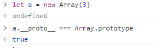
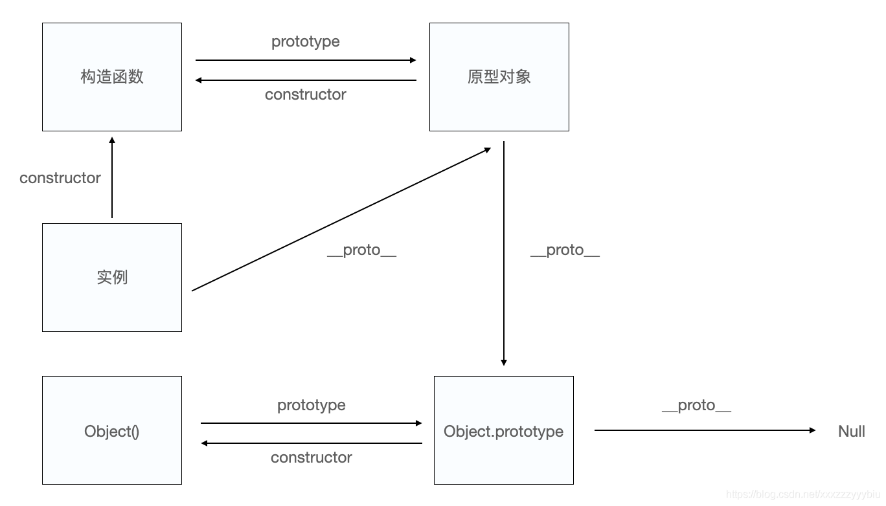
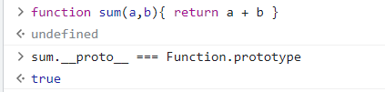

# 原型

1. 大部分**函数**内部都有一个显式的`prototype`属性，称之为函数的原型，这个属性的值为一个对象，称为原型对象。

> 构造函数也是函数，且在js中要靠构造函数来新建一个对象。

作用：

- 原型对象上有很多属性和方法
- 在JS中实现继承

2. 每个**对象**都有一个私有`__proto__`属性（由浏览器提供），它是一个指针，被称为对象的原型，它指向构造函数的原型对象。

如图，`a.__proto__ === Array.prototype`，说明他们指向同一个对象，也就是构造函数`Array`的原型对象

## 获取

- `p.__proto__`
- `p.constructor.prototype`
- `Object.getPrototypeOf(p)`

# 原型链

要知道，原型对象也是个对象，所以他也有`__proto__`属性，内置函数Array的原型对象(`Array.prototype`)的原型(`__proto__`)就指向Object的原型对象，而Object的原型对象的原型就指向null了。

当我们访问一个对象的属性时，如果对象内部不存在这个属性，就会到他的原型对象中寻找(就是他构造函数的原型对象)，原型对象也有自己的原型，于是就这么一直找下去，也就是原型链的概念。原型链的尽头一般是`Object.prototype.__proto__`，这也就是为什么我们创建对象可以使用`toString()`方法。

# 补充

1. 原型对象里还有个`constructor`属性，就指向构造函数，如图所示

2. 函数本身也有一个`__proto__`属性，指向`Function.prototype`

