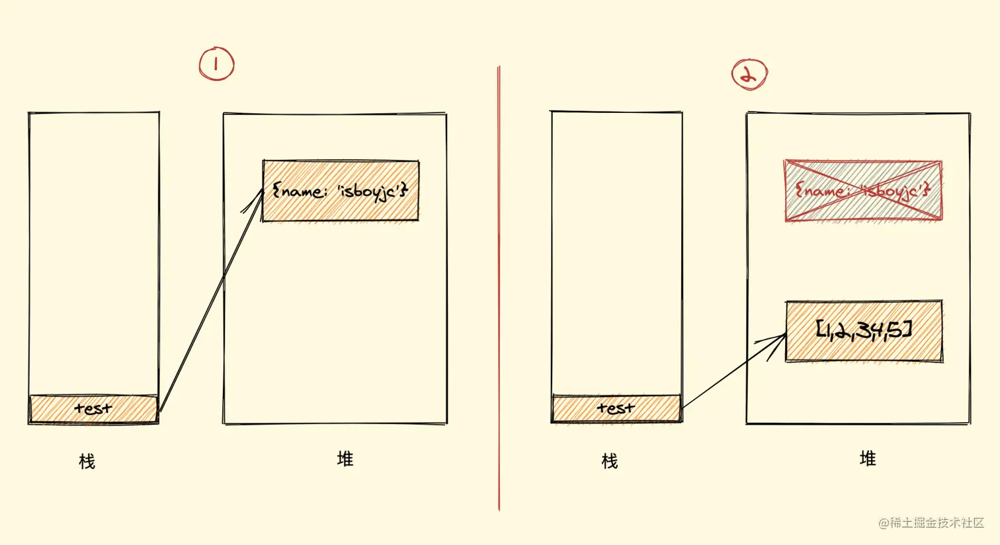
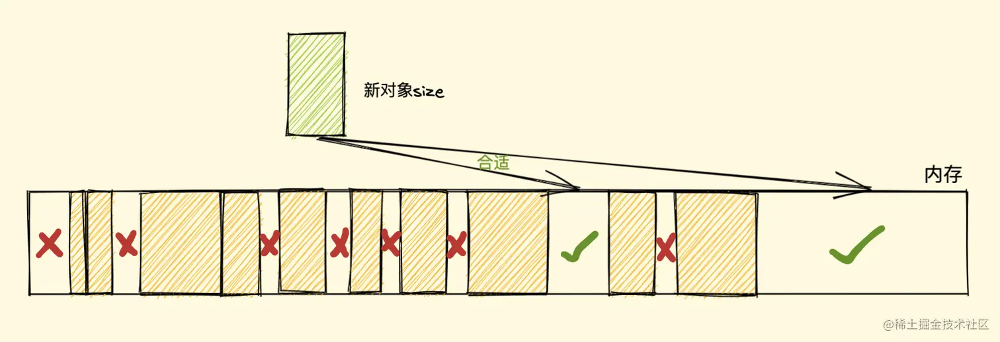
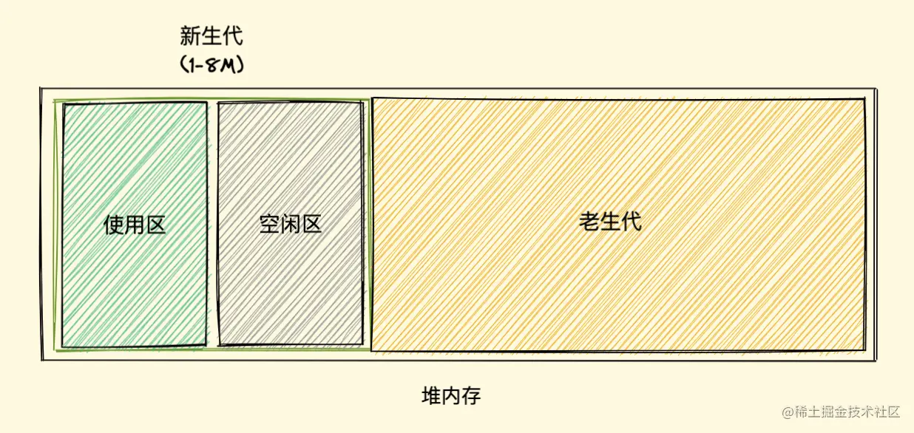
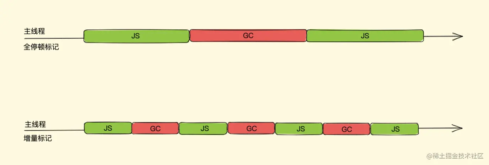

# 垃圾回收

> [讲的很全](https://juejin.cn/post/6981588276356317214#heading-4)
>
> 直接看，懒得CV了

## GC是什么

`GC` 即 `Garbage Collection` ，程序工作过程中会产生很多 `垃圾`，这些垃圾是程序不用的内存或者是之前用过了，以后不会再用的内存空间，而 `GC` 就是负责回收垃圾的，因为他工作在引擎内部，所以对于我们前端来说，`GC` 过程是相对比较无感的，这一套引擎执行而对我们又相对无感的操作也就是常说的 `垃圾回收机制` 了

当然也不是所有语言都有 `GC`，一般的高级语言里面会自带 `GC`，比如 `Java、Python、JavaScript` 等，也有无 `GC` 的语言，比如 `C、C++` 等，那这种就需要我们程序员手动管理内存了，相对比较麻烦

## 垃圾产生&为何回收

我们知道写代码时创建一个基本类型、对象、函数……都是需要占用内存的，但是我们并不关注这些，因为这是引擎为我们分配的，我们不需要显式手动的去分配内存

但是，你有没有想过，当我们不再需要某个东西时会发生什么？JavaScript 引擎又是如何发现并清理它的呢？

我们举个简单的例子

```js
js复制代码let test = {
  name: "isboyjc"
};
test = [1,2,3,4,5]
```

如上所示，我们假设它是一个完整的程序代码

我们知道 `JavaScript` 的引用数据类型是保存在堆内存中的，然后在栈内存中保存一个对堆内存中实际对象的引用，所以，`JavaScript` 中对引用数据类型的操作都是操作对象的引用而不是实际的对象。可以简单理解为，栈内存中保存了一个地址，这个地址和堆内存中的实际值是相关的

那上面代码首先我们声明了一个变量 `test`，它引用了对象 `{name: 'isboyjc'}`，接着我们把这个变量重新赋值了一个数组对象，也就变成了该变量引用了一个数组，那么之前的对象引用关系就没有了，如下图



没有了引用关系，也就是无用的对象，这个时候假如任由它搁置，一个两个还好，多了的话内存也会受不了，所以就需要被清理（回收）

用官方一点的话说，程序的运行需要内存，只要程序提出要求，操作系统或者运行时就必须提供内存，那么对于持续运行的服务进程，必须要及时释放内存，否则，内存占用越来越高，轻则影响系统性能，重则就会导致进程崩溃

## 垃圾回收策略

在 JavaScript 内存管理中有一个概念叫做 `可达性`，就是那些以某种方式可访问或者说可用的值，它们被保证存储在内存中，反之不可访问则需回收

至于如何回收，其实就是怎样发现这些不可达的对象（垃圾）它并给予清理的问题， `JavaScript` 垃圾回收机制的原理说白了也就是定期找出那些不再用到的内存（变量），然后释放其内存

你可能还会好奇为什么不是实时的找出无用内存并释放呢？其实很简单，实时开销太大了

我们都可以 Get 到这之中的重点，那就是怎样找出所谓的垃圾？

这个流程就涉及到了一些算法策略，有很多种方式，我们简单介绍两个最常见的

- 标记清除算法
- 引用计数算法

### 标记清除算法

**策略**

标记清除（Mark-Sweep），目前在 `JavaScript引擎` 里这种算法是最常用的，到目前为止的大多数浏览器的 `JavaScript引擎` 都在采用标记清除算法，只是各大浏览器厂商还对此算法进行了优化加工，且不同浏览器的 `JavaScript引擎` 在运行垃圾回收的频率上有所差异

就像它的名字一样，此算法分为 `标记` 和 `清除` 两个阶段，标记阶段即为所有活动对象做上标记，清除阶段则把没有标记（也就是非活动对象）销毁

你可能会疑惑怎么给变量加标记？其实有很多种办法，比如当变量进入执行环境时，反转某一位（通过一个二进制字符来表示标记），又或者可以维护进入环境变量和离开环境变量这样两个列表，可以自由的把变量从一个列表转移到另一个列表，当前还有很多其他办法。其实，怎样标记对我们来说并不重要，重要的是其策略

引擎在执行 GC（使用标记清除算法）时，需要从出发点去遍历内存中所有的对象去打标记，而这个出发点有很多，我们称之为一组 `根` 对象，而所谓的根对象，其实在浏览器环境中包括又不止于 `全局Window对象`、`文档DOM树` 等

整个标记清除算法大致过程就像下面这样

- 垃圾收集器在运行时会给内存中的所有变量都加上一个标记，假设内存中所有对象都是垃圾，全标记为0
- 然后从各个根对象开始遍历，把不是垃圾的节点改成1
- 清理所有标记为0的垃圾，销毁并回收它们所占用的内存空间
- 最后，把所有内存中对象标记修改为0，等待下一轮垃圾回收

**优点**

标记清除算法的优点只有一个，那就是实现比较简单，打标记也无非打与不打两种情况，这使得一位二进制位（0和1）就可以为其标记，非常简单

**缺点**

标记清除算法有一个很大的缺点，就是在清除之后，剩余的对象内存位置是不变的，也会导致空闲内存空间是不连续的，出现了 `内存碎片`（如下图），并且由于剩余空闲内存不是一整块，它是由不同大小内存组成的内存列表，这就牵扯出了内存分配的问题


假设我们新建对象分配内存时需要大小为 `size`，由于空闲内存是间断的、不连续的，则需要对空闲内存列表进行一次单向遍历找出大于等于 `size` 的块才能为其分配（如下图）



那如何找到合适的块呢？我们可以采取下面三种分配策略

- `First-fit`，找到大于等于 `size` 的块立即返回
- `Best-fit`，遍历整个空闲列表，返回大于等于 `size` 的最小分块
- `Worst-fit`，遍历整个空闲列表，找到最大的分块，然后切成两部分，一部分 `size` 大小，并将该部分返回

这三种策略里面 `Worst-fit` 的空间利用率看起来是最合理，但实际上切分之后会造成更多的小块，形成内存碎片，所以不推荐使用，对于 `First-fit` 和 `Best-fit` 来说，考虑到分配的速度和效率 `First-fit` 是更为明智的选择

综上所述，标记清除算法或者说策略就有两个很明显的缺点

- **内存碎片化**，空闲内存块是不连续的，容易出现很多空闲内存块，还可能会出现分配所需内存过大的对象时找不到合适的块
- **分配速度慢**，因为即便是使用 `First-fit` 策略，其操作仍是一个 `O(n)` 的操作，最坏情况是每次都要遍历到最后，同时因为碎片化，大对象的分配效率会更慢

**PS：标记清除算法的缺点补充**

归根结底，标记清除算法的缺点在于清除之后剩余的对象位置不变而导致的空闲内存不连续，所以只要解决这一点，两个缺点都可以完美解决了

而 **标记整理（Mark-Compact）算法** 就可以有效地解决，它的标记阶段和标记清除算法没有什么不同，只是标记结束后，标记整理算法会将活着的对象（即不需要清理的对象）向内存的一端移动，最后清理掉边界的内存（如下图）


### 引用计数算法

**策略**

引用计数（Reference Counting），这其实是早先的一种垃圾回收算法，它把 `对象是否不再需要` 简化定义为 `对象有没有其他对象引用到它`，如果没有引用指向该对象（零引用），对象将被垃圾回收机制回收，目前很少使用这种算法了，因为它的问题很多，不过我们还是需要了解一下

它的策略是跟踪记录每个变量值被使用的次数

- 当声明了一个变量并且将一个引用类型赋值给该变量的时候这个值的引用次数就为 1
- 如果同一个值又被赋给另一个变量，那么引用数加 1
- 如果该变量的值被其他的值覆盖了，则引用次数减 1
- 当这个值的引用次数变为 0 的时候，说明没有变量在使用，这个值没法被访问了，回收空间，垃圾回收器会在运行的时候清理掉引用次数为 0 的值占用的内存

如下例

```js
js复制代码let a = new Object() 	// 此对象的引用计数为 1（a引用）
let b = a 		// 此对象的引用计数是 2（a,b引用）
a = null  		// 此对象的引用计数为 1（b引用）
b = null 	 	// 此对象的引用计数为 0（无引用）
...			// GC 回收此对象
```

这种方式是不是很简单？确实很简单，不过在引用计数这种算法出现没多久，就遇到了一个很严重的问题——循环引用，即对象 A 有一个指针指向对象 B，而对象 B 也引用了对象 A ，如下面这个例子

```js
js复制代码function test(){
  let A = new Object()
  let B = new Object()
  
  A.b = B
  B.a = A
}
```

如上所示，对象 A 和 B 通过各自的属性相互引用着，按照上文的引用计数策略，它们的引用数量都是 2，但是，在函数 `test` 执行完成之后，对象 A 和 B 是要被清理的，但使用引用计数则不会被清理，因为它们的引用数量不会变成 0，假如此函数在程序中被多次调用，那么就会造成大量的内存不会被释放

我们再用标记清除的角度看一下，当函数结束后，两个对象都不在作用域中，A 和 B 都会被当作非活动对象来清除掉，相比之下，引用计数则不会释放，也就会造成大量无用内存占用，这也是后来放弃引用计数，使用标记清除的原因之一

> 在 IE8 以及更早版本的 IE 中，`BOM` 和 `DOM` 对象并非是原生 `JavaScript` 对象，它是由 `C++` 实现的 `组件对象模型对象（COM，Component Object Model）`，而 `COM` 对象使用 引用计数算法来实现垃圾回收，所以即使浏览器使用的是标记清除算法，只要涉及到 ` COM` 对象的循环引用，就还是无法被回收掉，就比如两个互相引用的 `DOM` 对象等等，而想要解决循环引用，需要将引用地址置为 `null` 来切断变量与之前引用值的关系，如下
>
> ```js
> js复制代码// COM对象
> let ele = document.getElementById("xxx")
> let obj = new Object()
> 
> // 造成循环引用
> obj.ele = ele
> ele.obj = obj
> 
> // 切断引用关系
> obj.ele = null
> ele.obj = null
> ```
>
> 不过在 IE9 及以后的 `BOM` 与 `DOM` 对象都改成了 `JavaScript` 对象，也就避免了上面的问题
>
> 此处参考 JavaScript高级程序设计 第四版 4.3.2 小节

**优点**

引用计数算法的优点我们对比标记清除来看就会清晰很多，首先引用计数在引用值为 0 时，也就是在变成垃圾的那一刻就会被回收，所以它可以立即回收垃圾

而标记清除算法需要每隔一段时间进行一次，那在应用程序（JS脚本）运行过程中线程就必须要暂停去执行一段时间的 `GC`，另外，标记清除算法需要遍历堆里的活动以及非活动对象来清除，而引用计数则只需要在引用时计数就可以了

**缺点**

引用计数的缺点想必大家也都很明朗了，首先它需要一个计数器，而此计数器需要占很大的位置，因为我们也不知道被引用数量的上限，还有就是无法解决循环引用无法回收的问题，这也是最严重的

## V8对GC的优化

我们在上面也说过，现在大多数浏览器都是基于标记清除算法，V8 亦是，当然 V8 肯定也对其进行了一些优化加工处理，那接下来我们主要就来看 V8 中对垃圾回收机制的优化

### 分代式垃圾回收

试想一下，我们上面所说的垃圾清理算法在每次垃圾回收时都要检查内存中所有的对象，这样的话对于一些大、老、存活时间长的对象来说同新、小、存活时间短的对象一个频率的检查很不好，因为前者需要时间长并且不需要频繁进行清理，后者恰好相反，怎么优化这点呢？？？分代式就来了

#### 新老生代

V8 的垃圾回收策略主要基于分代式垃圾回收机制，V8 中将堆内存分为新生代和老生代两区域，采用不同的垃圾回收器也就是不同的策略管理垃圾回收

新生代的对象为存活时间较短的对象，简单来说就是新产生的对象，通常只支持 `1～8M` 的容量，而老生代的对象为存活事件较长或常驻内存的对象，简单来说就是经历过新生代垃圾回收后还存活下来的对象，容量通常比较大

V8 整个堆内存的大小就等于新生代加上老生代的内存（如下图）


对于新老两块内存区域的垃圾回收，V8 采用了两个垃圾回收器来管控，我们暂且将管理新生代的垃圾回收器叫做新生代垃圾回收器，同样的，我们称管理老生代的垃圾回收器叫做老生代垃圾回收器好了

#### 新生代垃圾回收

新生代对象是通过一个名为 `Scavenge` 的算法进行垃圾回收，在 `Scavenge算法` 的具体实现中，主要采用了一种复制式的方法即 `Cheney算法` ，我们细细道来

`Cheney算法` 中将堆内存一分为二，一个是处于使用状态的空间我们暂且称之为 `使用区`，一个是处于闲置状态的空间我们称之为 `空闲区`，如下图所示



新加入的对象都会存放到使用区，当使用区快被写满时，就需要执行一次垃圾清理操作

当开始进行垃圾回收时，新生代垃圾回收器会对使用区中的活动对象做标记，标记完成之后将使用区的活动对象复制进空闲区并进行排序，随后进入垃圾清理阶段，即将非活动对象占用的空间清理掉。最后进行角色互换，把原来的使用区变成空闲区，把原来的空闲区变成使用区

当一个对象经过多次复制后依然存活，它将会被认为是生命周期较长的对象，随后会被移动到老生代中，采用老生代的垃圾回收策略进行管理

另外还有一种情况，如果复制一个对象到空闲区时，空闲区空间占用超过了 25%，那么这个对象会被直接晋升到老生代空间中，设置为 25% 的比例的原因是，当完成 `Scavenge` 回收后，空闲区将翻转成使用区，继续进行对象内存的分配，若占比过大，将会影响后续内存分配

#### 老生代垃圾回收

相比于新生代，老生代的垃圾回收就比较容易理解了，上面我们说过，对于大多数占用空间大、存活时间长的对象会被分配到老生代里，因为老生代中的对象通常比较大，如果再如新生代一般分区然后复制来复制去就会非常耗时，从而导致回收执行效率不高，所以老生代垃圾回收器来管理其垃圾回收执行，它的整个流程就采用的就是上文所说的标记清除算法了

首先是标记阶段，从一组根元素开始，递归遍历这组根元素，遍历过程中能到达的元素称为活动对象，没有到达的元素就可以判断为非活动对象

清除阶段老生代垃圾回收器会直接将非活动对象，也就是数据清理掉

前面我们也提过，标记清除算法在清除后会产生大量不连续的内存碎片，过多的碎片会导致大对象无法分配到足够的连续内存，而 V8 中就采用了我们上文中说的标记整理算法来解决这一问题来优化空间

#### 为什么需要分代式？

正如小标题，为什么需要分代式？这个机制有什么优点又解决了什么问题呢？

其实，它并不能说是解决了什么问题，可以说是一个优化点吧

分代式机制把一些新、小、存活时间短的对象作为新生代，采用一小块内存频率较高的快速清理，而一些大、老、存活时间长的对象作为老生代，使其很少接受检查，新老生代的回收机制及频率是不同的，可以说**此机制的出现很大程度提高了垃圾回收机制的效率**

### 并行回收(Parallel)(新生代用)

在介绍并行之前，我们先要了解一个概念 `全停顿（Stop-The-World）`，我们都知道 `JavaScript` 是一门单线程的语言，它是运行在主线程上的，那在进行垃圾回收时就会阻塞 `JavaScript` 脚本的执行，需等待垃圾回收完毕后再恢复脚本执行，我们把这种行为叫做 `全停顿`

比如一次 `GC` 需要 `60ms` ，那我们的应用逻辑就得暂停 `60ms` ，假如一次 `GC` 的时间过长，对用户来说就可能造成页面卡顿等问题

既然存在执行一次 `GC` 比较耗时的情况，考虑到一个人盖房子难，那两个人、十个人...呢？切换到程序这边，那我们可不可以引入多个辅助线程来同时处理，这样是不是就会加速垃圾回收的执行速度呢？因此 V8 团队引入了并行回收机制

所谓并行，也就是同时的意思，它指的是垃圾回收器在主线程上执行的过程中，开启多个辅助线程，同时执行同样的回收工作


简单来说，使用并行回收，假如本来是主线程一个人干活，它一个人需要 3 秒，现在叫上了 2 个辅助线程和主线程一块干活，那三个人一块干一个人干 1 秒就完事了，但是由于多人协同办公，所以需要加上一部分多人协同（同步开销）的时间我们算 0.5 秒好了，也就是说，采用并行策略后，本来要 3 秒的活现在 1.5 秒就可以干完了

不过虽然 1.5 秒就可以干完了，时间也大大缩小了，但是这 1.5 秒内，主线程还是需要让出来的，也正是因为主线程还是需要让出来，这个过程内存是静态的，不需要考虑内存中对象的引用关系改变，只需要考虑协同，实现起来也很简单

**新生代对象空间就采用并行策略，在执行垃圾回收的过程中，会启动了多个线程来负责新生代中的垃圾清理操作**，这些线程同时将对象空间中的数据移动到空闲区域，这个过程中由于数据地址会发生改变，所以还需要同步更新引用这些对象的指针，此即并行回收

### 增量标记与懒性清理(老生代用)

我们上面所说的并行策略虽然可以增加垃圾回收的效率，对于新生代垃圾回收器能够有很好的优化，但是其实它还是一种全停顿式的垃圾回收方式，对于老生代来说，它的内部存放的都是一些比较大的对象，对于这些大的对象 `GC` 时哪怕我们使用并行策略依然可能会消耗大量时间

所以为了减少全停顿的时间，在 2011 年，V8 对老生代的标记进行了优化，从全停顿标记切换到增量标记

#### 什么是增量

增量就是将一次 `GC` 标记的过程，分成了很多小步，每执行完一小步就让应用逻辑执行一会儿，这样交替多次后完成一轮 `GC` 标记（如下图）



试想一下，将一次完整的 `GC` 标记分次执行，那在每一小次 `GC` 标记执行完之后如何暂停下来去执行任务程序，而后又怎么恢复呢？那假如我们在一次完整的 `GC` 标记分块暂停后，执行任务程序时内存中标记好的对象引用关系被修改了又怎么办呢？

可以看出增量的实现要比并行复杂一点，V8 对这两个问题对应的解决方案分别是三色标记法与写屏障

#### 三色标记法(暂停与恢复)

我们知道老生代是采用标记清理算法，而上文的标记清理中我们说过，也就是在没有采用增量算法之前，单纯使用黑色和白色来标记数据就可以了，其标记流程即在执行一次完整的 `GC` 标记前，垃圾回收器会将所有的数据置为白色，然后垃圾回收器在会从一组跟对象出发，将所有能访问到的数据标记为黑色，遍历结束之后，标记为黑色的数据对象就是活动对象，剩余的白色数据对象也就是待清理的垃圾对象

如果采用非黑即白的标记策略，那在垃圾回收器执行了一段增量回收后，暂停后启用主线程去执行了应用程序中的一段 `JavaScript` 代码，随后当垃圾回收器再次被启动，这时候内存中黑白色都有，我们无法得知下一步走到哪里了

为了解决这个问题，V8 团队采用了一种特殊方式： `三色标记法`

三色标记法即使用每个对象的两个标记位和一个标记工作表来实现标记，两个标记位编码三种颜色：白、灰、黑

- 白色指的是未被标记的对象
- 灰色指自身被标记，成员变量（该对象的引用对象）未被标记
- 黑色指自身和成员变量皆被标记


如上图所示，我们用最简单的表达方式来解释这一过程，最初所有的对象都是白色，意味着回收器没有标记它们，从一组根对象开始，先将这组根对象标记为灰色并推入到标记工作表中，当回收器从标记工作表中弹出对象并访问它的引用对象时，将其自身由灰色转变成黑色，并将自身的下一个引用对象转为灰色

就这样一直往下走，直到没有可标记灰色的对象时，也就是无可达（无引用到）的对象了，那么剩下的所有白色对象都是无法到达的，即等待回收（如上图中的 `C、E` 将要等待回收）

采用三色标记法后我们在恢复执行时就好办多了，可以直接通过当前内存中有没有灰色节点来判断整个标记是否完成，如没有灰色节点，直接进入清理阶段，如还有灰色标记，恢复时直接从灰色的节点开始继续执行就可以

三色标记法的 mark 操作可以渐进执行的而不需每次都扫描整个内存空间，可以很好的配合增量回收进行暂停恢复的一些操作，从而减少 `全停顿` 的时间

#### 写屏障(增量中修改引用)

一次完整的 `GC` 标记分块暂停后，执行任务程序时内存中标记好的对象引用关系被修改了，增量中修改引用，可能不太好理解，我们举个例子（如图）


假如我们有 `A、B、C` 三个对象依次引用，在第一次增量分段中全部标记为黑色（活动对象），而后暂停开始执行应用程序也就是 JavaScript 脚本，在脚本中我们将对象 `B` 的指向由对象 `C` 改为了对象 `D` ，接着恢复执行下一次增量分段

这时其实对象 `C` 已经无引用关系了，但是目前它是黑色（代表活动对象）此一整轮 `GC` 是不会清理 `C` 的，不过我们可以不考虑这个，因为就算此轮不清理等下一轮 `GC` 也会清理，这对我们程序运行并没有太大影响

我们再看新的对象 `D` 是初始的白色，按照我们上面所说，已经没有灰色对象了，也就是全部标记完毕接下来要进行清理了，新修改的白色对象 `D` 将在次轮 `GC` 的清理阶段被回收，还有引用关系就被回收，后面我们程序里可能还会用到对象 `D` 呢，这肯定是不对的

为了解决这个问题，V8 增量回收使用 `写屏障 (Write-barrier)` 机制，即一旦有黑色对象引用白色对象，该机制会强制将引用的白色对象改为灰色，从而保证下一次增量 `GC` 标记阶段可以正确标记，这个机制也被称作 `强三色不变性`

那在我们上图的例子中，将对象 `B` 的指向由对象 `C` 改为对象 `D` 后，白色对象 `D` 会被强制改为灰色

#### 懒性清理

增量标记其实只是对活动对象和非活动对象进行标记，对于真正的清理释放内存 V8 采用的是惰性清理(Lazy Sweeping)

增量标记完成后，惰性清理就开始了。当增量标记完成后，假如当前的可用内存足以让我们快速的执行代码，其实我们是没必要立即清理内存的，可以将清理过程稍微延迟一下，让 `JavaScript` 脚本代码先执行，也无需一次性清理完所有非活动对象内存，可以按需逐一进行清理直到所有的非活动对象内存都清理完毕，后面再接着执行增量标记

#### 增量标记与惰性清理的优缺？

增量标记与惰性清理的出现，使得主线程的停顿时间大大减少了，让用户与浏览器交互的过程变得更加流畅。但是由于每个小的增量标记之间执行了 `JavaScript` 代码，堆中的对象指针可能发生了变化，需要使用写屏障技术来记录这些引用关系的变化，所以增量标记缺点也很明显：

首先是并没有减少主线程的总暂停的时间，甚至会略微增加，其次由于写屏障机制的成本，增量标记可能会降低应用程序的吞吐量（吞吐量是啥总不用说了吧）

### 并发回收(Concurrent)

前面我们说并行回收依然会阻塞主线程，增量标记同样有增加了总暂停时间、降低应用程序吞吐量两个缺点，那么怎么才能在不阻塞主线程的情况下执行垃圾回收并且与增量相比更高效呢？

这就要说到并发回收了，它指的是主线程在执行 `JavaScript` 的过程中，辅助线程能够在后台完成执行垃圾回收的操作，辅助线程在执行垃圾回收的时候，主线程也可以自由执行而不会被挂起（如下图）


辅助线程在执行垃圾回收的时候，主线程也可以自由执行而不会被挂起，这是并发的优点，但同样也是并发回收实现的难点，因为它需要考虑主线程在执行 `JavaScript ` 时，堆中的对象引用关系随时都有可能发生变化，这时辅助线程之前做的一些标记或者正在进行的标记就会要有所改变，所以它需要额外实现一些读写锁机制来控制这一点，这里我们不再细说

### 再说V8中GC优化

V8 的垃圾回收策略主要基于分代式垃圾回收机制，这我们说过，关于新生代垃圾回收器，我们说使用并行回收可以很好的增加垃圾回收的效率，那老生代垃圾回收器用的哪个策略呢？我上面说了并行回收、增量标记与惰性清理、并发回收这几种回收方式来提高效率、优化体验，看着一个比一个好，那老生代垃圾回收器到底用的哪个策略？难道是并发？？内心独白：” 好像。。貌似。。并发回收效率最高 “

其实，这三种方式各有优缺点，所以在老生代垃圾回收器中这几种策略都是融合使用的

老生代主要使用并发标记，主线程在开始执行 `JavaScript` 时，辅助线程也同时执行标记操作（标记操作全都由辅助线程完成）

标记完成之后，再执行并行清理操作（主线程在执行清理操作时，多个辅助线程也同时执行清理操作）

同时，清理的任务会采用增量的方式分批在各个 `JavaScript` 任务之间执行

## 白话总结

基础数据类型都保存在栈中，调用的函数结束之后会随着函数出栈一起被销毁。

我们创建一个变量时候，引擎会为我们自动分配内存空间，当堆中的某些对象不再需要时，就产生了内存垃圾，为了不影响性能，这些垃圾就需要一种机制来清理掉。

垃圾回收机制主要有两种策略：

- 一种是IE9之前常用的引用回收机制，一个对象被引用一次，引用数+1，取消引用一次，引用数-1，引用数为0就进行垃圾回收，这种策略需要空间来给计数器，并且最大的问题是无法解决循环引用的问题。
- 还有一种是现在常用的标记清除算法，主要策略为一开始将所有的变量都标记为0，然后从根对象开始遍历，将存活对象标记为1，然后把所有标记为0的对象全部清除，再把所有对象再标记为0，为下次清理做准备。

标记清除算法有个很大的缺点就是对象清理完之后，对象在内存中的分布是离散的，会产生很多内存碎片，当需要为新对象分配内存时候，就存在三种策略，FIRST-FIT，找到第一个满足空间的碎片块，BEST-FIT，找到满足空间的最小碎片快，WORST-FIT策略九找到最大的内存块来分配空间，一般都会采用FIRST-FIT策略。

还有一种也可以解决标记清除算法的这个缺点，就是标记整理算法，在标记结束之后把活动对象移动到内存的一端，最后回收边界的不活跃对象。

现代的V8引擎还对GC有更多的优化，比如就是用分代式回收机制，把堆内存分为新生代和老生代两个区域，使用不同的垃圾回收策略进行回收。新生代存放一些存在时间较短的需要频繁回收的对象，老生代存一些存活时间长不需要频繁回收的对象。

> 如果问到分代式解决了什么问题？
>
> 感觉不能说是解决了什么问题，应该算是一种优点，两个区域采用不同的策略和频率进行回收，可以提高垃圾回收机制的执行效率。

新生代的垃圾回收主要采用了叫`Scavenge`算法，在具体实现中使用了一种复制式`Cheney`算法，将新生代分为两个区域，一个是使用区，一个空闲区，新加入的对象分配到使用区，当使用区快满了进行垃圾回收，对使用区中的活动对象做标记，然后复制到空闲区中并且排序，再将使用区清空，再将两个区域名称互换。如果一个对象多次回收之后仍在内存里，就会转移到老生代区域中。

> 另外还有一种情况，如果复制一个对象到空闲区时，空闲区空间占用超过了 25%，那么这个对象会被直接晋升到老生代空间中，设置为 25% 的比例的原因是，当完成 `Scavenge` 回收后，空闲区将翻转成使用区，继续进行对象内存的分配，若占比过大，将会影响后续内存分配

又因为JS是单线程的语言，垃圾回收的时候就会阻碍js脚本的运行，只有垃圾回收完之后才会继续执行，这种称为全停顿的行为。但是引擎并不是单线程的，这时候就可以并行回收，多开多个辅助线程进行回收工作，可以减少全停顿的时间，新生代的垃圾回收就采用了并行回收。

因为老生代大多都是占用空间比较大的对象，就算是并行回收还是会占用大量时间，所以老生代采用增量标记和懒性清理的策略；就是将一次垃圾回收分为多次进行。再用三色标记法解决恢复现场的问题。三色标记法就是标识有三种，白灰黑，白色代表未被标记的对象，灰色代表自身被标记，成员变量没有被标记的变量，黑色代表自身和成员都被标记了的对象。通过判断内存里面有没有灰色节点来判断标识到了哪个节点。没有灰色节点就直接清理，有的话就从灰色节点开始继续执行。

还有一个写屏障，如果一个黑色对象引用一个白色对象，引擎就会强制将白色对象改为灰色，保证下一次GC可以正常的标识。

惰性清理就是如果当前的内存足够执行代码，就不着急立即清理内存，，也没必要一次性清理完所有的非活动对象，优先让JS脚本先执行

> 增量标记与惰性清理的优缺？
>
> 增量标记与惰性清理的出现，使得主线程的停顿时间大大减少了，让用户与浏览器交互的过程变得更加流畅。
>
> 但是并没有减少主线程的总暂停的时间，甚至会略微增加，其次由于写屏障机制的成本，增量标记可能会降低应用程序的吞吐量（吞吐量是啥总不用说了吧）

老生代并发标记，并行清理。