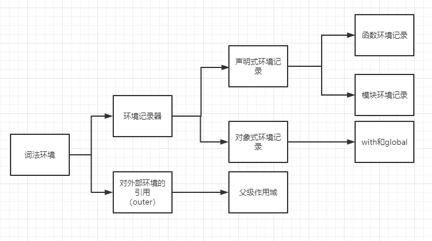
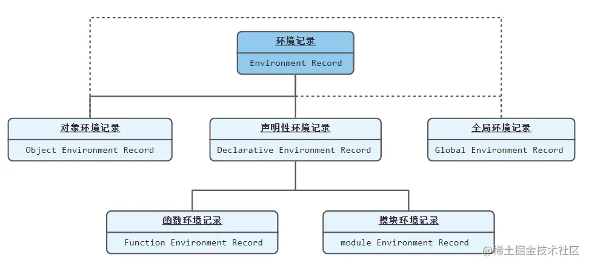
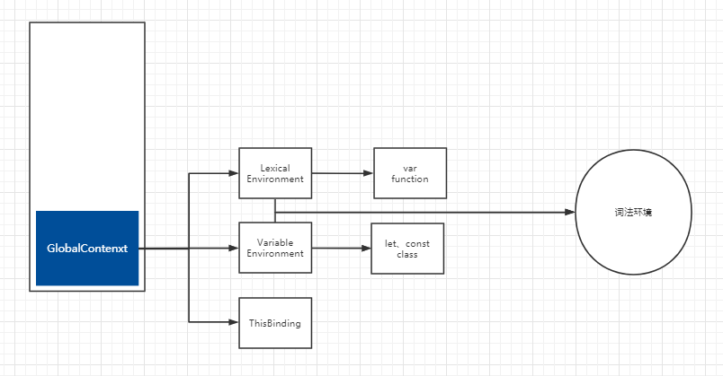

# 执行上下文

> [讲的比较全](https://juejin.cn/post/6844904158957404167#heading-6)
>
> [这个讲解ES5比较新](https://juejin.cn/post/7043408377661095967#heading-3)
>
> [词法环境](https://segmentfault.com/a/1190000042621269) [执行上下文](https://segmentfault.com/a/1190000042625485?u_atoken=06c5b57d-da82-41ca-a603-3f2fc52329ce&u_asession=01YJPq3LR_4dD8O39waiqNT3yOmQnKMgmdlrrhPetfV0FxRE_0okdaPP5Ari1HRaBYX0KNBwm7Lovlpxjd_P_q4JsKWYrT3W_NKPr8w6oU7K_tIr2p1rKh0LWpIaukbDSWp_NOnvtwKNUOZi015_LiiGBkFo3NEHBv0PZUm6pbxQU&u_asig=05vlpdZ2zPRTqXc7gG5tpHHiNaL2BTj1P3_kSGi8wDqg8zWqhY_wHC235lCGK9ce2fjUDeLH6bVWvwGl0B0uP2sGucbcW1yPVvah92v1UViYVIZL0qZvz3FYJ7UQWP4V92Hoj6A9x613ew8aSC_tofm36lmpyIixUkG-EmvEa7lf39JS7q8ZD7Xtz2Ly-b0kmuyAKRFSVJkkdwVUnyHAIJzWEat2TMn9w47VwJ4d_kxifzy3Ffhj3qBQMxFnE56ugX0gcEzNe0KdmgSj92cJkEqu3h9VXwMyh6PgyDIVSG1W95X1m2PIdk0ozQyTRYpkySVaRnIMuFyDVvuFo25tVXrnC8g--14MjG1LHsX-mCt6yVlOHK3GlHDSYrxLQXgtxVmWspDxyAEEo4kbsryBKb9Q&u_aref=sZVz4FG%2BU6%2BguL7p0DGezXT6WZo%3D)

## 什么是执行上下文

执行上下文就是一段代码执行时所带的所有信息，为我们的可执行代码块提供了执行前的必要准备工作，例如变量对象的定义、作用域链的扩展、提供调用者的对象引用等信息。

> 作用域是在函数声明的时候就确定的一套变量访问规则，而执行上下文是函数执行时才产生的一系列变量的环境。也就是说作用域定义了执行上下文中的变量的访问规则，执行上下文在这个作用域规则的前提下进行变量查找，函数引用等具体操作。

## ES3 了解即可，以ES5为准

> [具体看这个，不CV了](https://juejin.cn/post/6844904158957404167)
>
> 还有注意，ES3时期并没有let const，只有var

### 类型

- **全局执行上下文**——这是默认或者说是最基础的执行上下文，一个程序中只会存在一个全局上下文，它在整个 `javascript` 脚本的生命周期内都会存在于执行堆栈的最底部不会被栈弹出销毁。全局上下文会生成一个全局对象（以浏览器环境为例，这个全局对象是 `window`），并且将 `this` 值绑定到这个全局对象上。
- **函数执行上下文**——每当一个函数被调用时，都会创建一个新的函数执行上下文（不管这个函数是不是被重复调用的）
- **Eval函数执行上下文**—— 执行在 `eval` 函数内部的代码也会有它属于自己的执行上下文，但由于并不经常使用 `eval`，所以在这里不做分析。
- **模块执行上下文**

### 组成

#### 1.变量对象(`variable object` 简称 `VO`)

每个执行环境文都有一个表示变量的对象——**变量对象**，全局执行环境的变量对象始终存在，而函数这样局部环境的变量，只会在函数执行的过程中存在，在函数被调用时且在具体的函数代码运行之前，JS 引擎会用当前函数的**参数列表**（`arguments`）初始化一个 “变量对象” 并将当前执行上下文与之关联 ，函数代码块中声明的 **变量** 和 **函数** 将作为属性添加到这个变量对象上。

> 有一点需要注意，只有函数声明（function declaration）会被加入到变量对象中，而函数表达式（function expression）会被忽略。

全局执行上下文和函数执行上下文中的变量对象还略有不同，它们之间的差别简单来说：

1. **全局上下文中的变量对象就是全局对象**，以浏览器环境来说，就是 `window` 对象。 
2. **函数执行上下文中的变量对象内部定义的属性**，是不能被直接访问的，只有当函数被调用时，变量对象（`VO`）被激活为活动对象（`AO`）时，我们才能访问到其中的属性和方法。

#### 2.活动对象(`activation object` 简称 `AO`)

函数进入执行阶段时，原本不能访问的变量对象被激活成为一个活动对象，自此，我们可以访问到其中的各种属性。

> 其实变量对象和活动对象是一个东西，只不过处于不同的状态和阶段而已。

#### 3.作用域链(`scope chain`)

**作用域** 规定了如何查找变量，也就是确定当前执行代码对变量的访问权限。当查找变量的时候，会先从当前上下文的变量对象中查找，如果没有找到，就会从父级（词法层面上的父级）执行上下文的变量对象中查找，一直找到全局上下文的变量对象，也就是全局对象。这样由多个执行上下文的变量对象构成的链表就叫做 **作用域链**。

函数的作用域在函数创建时就已经确定了。当函数创建时，**会有一个名为 `[[scope]]` 的内部属性保存所有父级变量对象到其中**。当函数执行时，会创建一个执行环境，然后通过复制函数的 `[[scope]]`  属性中的对象构建起执行环境的作用域链，然后，变量对象 `VO` 被激活生成 `AO` 并添加到作用域链的前端，完整作用域链创建完成：

```lua
Scope = [AO].concat([[Scope]]);
```

#### 4.调用者信息(this)

如果当前函数被作为对象方法调用或使用 `bind` `call` `apply` 等 `API` 进行委托调用，则将当前代码块的调用者信息（`this value`）存入当前执行上下文，否则默认为全局对象调用。

> 谁调用就指向谁，万恶的this

#### 5.完整组成

伪代码类似如下

```js
executionContext：{
    [variable object | activation object]：{
        arguments,
        variables: [...],
        funcions: [...]
    },
    scope chain: variable object + all parents scopes
    thisValue: context object
}
```

### 生命周期

#### 1.创建

函数执行上下文的创建阶段，发生在函数调用时且在执行函数体内的具体代码之前，在创建阶段，JS 引擎会做如下操作：

- 用当前函数的**参数列表**（`arguments`）初始化一个 “变量对象” 并将当前执行上下文与之关联 ，函数代码块中声明的 **变量** 和 **函数** 将作为属性添加到这个变量对象上。**在这一阶段，会进行变量和函数的初始化声明，变量统一定义为 `undefined` 需要等到赋值时才会有确值，而函数则会直接定义**。

  > 这个操作就是变量声明提升（变量和函数声明都会提升，但是函数提升更靠前）。

- 构建作用域链（`[AO].concat([[Scope]])`）

- 确定 `this` 的值

#### 2.执行

执行阶段中，JS 代码开始逐条执行，在这个阶段，JS 引擎开始对定义的变量赋值、开始顺着作用域链访问变量、如果内部有函数调用就创建一个新的执行上下文压入执行栈并移交控制权

#### 3.销毁

一般来讲当函数执行完成后，当前执行上下文（局部环境）会被弹出执行上下文栈并且销毁，控制权被重新交给执行栈上一层的执行上下文。闭包的情况另说

### ES3总结

这一时期还没有let、const较为简单

1. 函数被调用

2. 在执行具体的函数代码之前，创建了执行上下文

3. 进入执行上下文的创建阶段：

   1. 初始化作用域链
   2. 创建 `arguments object` 检查上下文中的参数，初始化名称和值并创建引用副本
   3. 扫描上下文找到所有函数声明：
      1. 对于每个找到的函数，用它们的原生函数名，在变量对象中创建一个属性，该属性里存放的是一个指向实际内存地址的指针
      2. 如果函数名称已经存在了，属性的引用指针将会被覆盖

   4. 扫描上下文找到所有`var`的变量声明：

      1. 对于每个找到的变量声明，用它们的原生变量名，在变量对象中创建一个属性，并且使用 `undefined` 来初始化

      2. 如果变量名作为属性在变量对象中已存在，则不做任何处理并接着扫描

   5. 确定 `this` 值

4. 进入执行上下文的执行阶段：
   1. 在上下文中运行/解释函数代码，并在代码逐行执行时分配变量值。

## ES5

ES5因为增加了`let`、`const`，所以对执行上下文概念进行了修改，去除了`ES3`中变量对象和活动对象，以**词法环境组件**（**`LexicalEnvironment component`）**和**变量环境组件（** **`VariableEnvironment component`）**替代

> 可以把变量环境组件就理解为ES3的变量对象/活动对象，只不过因为增加了`let const`所以需要新增一个词法环境组件，然后协调一下，改个名改成了变量环境组件

### 一、词法环境(Lexical Environment，注意不是执行上下文里的那个词法环境组件)

> **词法环境**是一种规范类型，基于 ECMAScript 代码的词法嵌套结构来定义**标识符**和具体变量和函数的关联。一个词法环境由环境记录器和一个可能的引用**外部词法环境**的空值组成。
>
> [ES5官方文档，2011年写的，所以这时候还没有let/const](https://262.ecma-international.org/6.0/#sec-lexical-environments)

#### 1.1组成

词法环境的内部有两部分组成：**环境记录器（Environment Record）**、**对外部环境的引用（outer）**

1. 环境记录器记录存储变量、函数声明以及函数声明的形参
2. 外部环境的引用意味着它可以访问其父级词法环境（作用域）

##### 1.1.1组成一：环境记录器

环境记录器又分为两种(第三种比较特别，不算在其中)

1. **声明式环境记录（Declarative Environment Record）**：用来记录直接有标识符定义的元素，比如变量、常量、let、class、module、import 以及函数声明。这种类型的环境记录是用于存储函数和变量声明的。它们通常被用于函数作用域和块作用域。

> **声明式环境记录（Declarative Environment Record）**，又分为两种类型：
>
> - **函数环境记录（Function Environment Record）**：用于函数作用域。
> - **模块环境记录（Module Environment Record）**：模块环境记录用于体现一个模块的外部作用域，即模块 export 所在环境。

2. **对象式环境记录（Object Environment Record）**：主要用于 with 和 global 的词法环境。这种类型的环境记录基于一个实际的对象来处理。它们用于存储由`var`声明的变量和函数声明，以及全局环境中的全局对象。例如window



3. 此外，有一个比较特殊的，就是全局环境记录，同时包含了声明性环境记录和对象环境记录(**其实可以理解为对象环境记录就是全局执行上下文中的变量环境组件，声明性环境记录就是词法环境组件**)

   

##### 1.1.2组成二：对外部环境的引用outer

outer 就是指向词法环境的父级词法环境(作用域)

#### 1.2分类

> [出处](https://juejin.cn/post/7256408176412803131)

全局词法环境（Global Lexical Environment）：在全局作用域下，包含了全局变量、函数声明等。

函数词法环境（Function Lexical Environment）：在函数作用域下，包含了函数内部的变量、函数参数、内部函数声明等。

块级词法环境（Block Lexical Environment）：在块级作用域下，包含了由`let`、`const`声明的变量、块级函数声明等。

## 二、执行上下文

### 2.1 组成(ES5标准)

- 词法环境组件
- 变量环境组件
- this指向

词法环境组件和变量环境组件都是词法环境的具体实例

之所以在 `ES5` 的规范力要单独分出一个变量环境的概念是为 `ES6` 服务的： 在 `ES6` 中，**词法环境**组件和 **变量环境** 的一个不同就是**前者被用来存储函数声明和变量（`let` 和 `const`）绑定，而后者只用来存储 `var` 变量绑定。**

> JS的发展还就是填一开始设计的坑

### 2.1生命周期

这是普遍文章里出现的过程，感觉不全

1. 程序启动，全局上下文被创建

   1. 创建全局上下文的 词法环境
      1. 创建 **对象环境记录器** ，它用来定义出现在 **全局上下文** 中的变量和函数的关系（负责处理 `let` 和 `const` 定义的变量,初始化为`<uninitialized>`标志位）
      2. 创建 **外部环境引用**，值为 **`null`**

   2. 创建全局上下文的 变量环境

      1. 创建 **对象环境记录器**，它持有 **变量声明语句** 在执行上下文中创建的绑定关系（负责处理 `var` 定义的变量，初始值为 `undefined` 造成声明提升）

      2. 创建 **外部环境引用**，值为 **`null`**

   3. 确定 `this` 值为全局对象（以浏览器为例，就是 `window` ）

2. 函数被调用，函数上下文被创建

   1. 创建函数上下文的词法环境
      1. 创建  **声明式环境记录器** ，存储变量、函数和参数，它包含了一个传递给函数的 **`arguments`** 对象（此对象存储索引和参数的映射）和传递给函数的参数的 **length**。（负责处理 `let` 和 `const` 定义的变量,初始化为`<uninitialized>`标志位）
      2. 创建 **外部环境引用**，值为全局对象，或者为父级词法环境（作用域）

   2. 创建函数上下文的变量环境

      1. 创建  **声明式环境记录器** ，存储变量、函数和参数，它包含了一个传递给函数的 **`arguments`** 对象（此对象存储索引和参数的映射）和传递给函数的参数的 **length**。（负责处理 `var` 定义的变量，初始值为 `undefined` 造成声明提升）

      1. 创建 **外部环境引用**，值为全局对象，或者为父级词法环境（作用域）

   3. 确定 `this` 值

### 2.2 补充，另一种说法

> [这个文章里的](https://segmentfault.com/a/1190000042625485?u_atoken=06c5b57d-da82-41ca-a603-3f2fc52329ce&u_asession=01YJPq3LR_4dD8O39waiqNT3yOmQnKMgmdlrrhPetfV0FxRE_0okdaPP5Ari1HRaBYX0KNBwm7Lovlpxjd_P_q4JsKWYrT3W_NKPr8w6oU7K_tIr2p1rKh0LWpIaukbDSWp_NOnvtwKNUOZi015_LiiGBkFo3NEHBv0PZUm6pbxQU&u_asig=05vlpdZ2zPRTqXc7gG5tpHHiNaL2BTj1P3_kSGi8wDqg8zWqhY_wHC235lCGK9ce2fjUDeLH6bVWvwGl0B0uP2sGucbcW1yPVvah92v1UViYVIZL0qZvz3FYJ7UQWP4V92Hoj6A9x613ew8aSC_tofm36lmpyIixUkG-EmvEa7lf39JS7q8ZD7Xtz2Ly-b0kmuyAKRFSVJkkdwVUnyHAIJzWEat2TMn9w47VwJ4d_kxifzy3Ffhj3qBQMxFnE56ugX0gcEzNe0KdmgSj92cJkEqu3h9VXwMyh6PgyDIVSG1W95X1m2PIdk0ozQyTRYpkySVaRnIMuFyDVvuFo25tVXrnC8g--14MjG1LHsX-mCt6yVlOHK3GlHDSYrxLQXgtxVmWspDxyAEEo4kbsryBKb9Q&u_aref=sZVz4FG%2BU6%2BguL7p0DGezXT6WZo%3D#item-0-12)

JavaScript 引擎是按照可执行代码来执行代码的，每次执行步骤如下：

1. 创建一个新的执行上下文（Execution Context）
2. 创建一个新的词法环境（Lexical Environment）
3. 把 `LexicalEnvironment` 和 `VariableEnvironment` 指向新创建的词法环境
4. 把这个执行上下文压入执行栈并成为正在运行的执行上下文
5. 执行代码
6. 执行结束后，把这个执行上下文弹出执行栈



`LexicalEnvironment` 和 `VariableEnvironment` 则都是词法环境（Lexical Environment）。很多文章中常把 `LexicalEnvironment `理解成 [词法环境](https://segmentfault.com/a/1190000042621269)，这是不对的，`LexicalEnvironment` 是一个单词，表示执行上下文中的是标识 `let` 、`const` 、`class` 等变量声明，而 `VariableEnvironment `则是标识 `var` 、`function` 等变量声明。

如果非要用中文来表示 `LexicalEnvironment` 的话，我更愿意用 **词法环境组件** 来表示；同理，`VariableEnvironment` 则用 **变量环境组件** 来表示。

ES5.1文档中这么写的，最后，代码运行时都会生成一个新的词法环境。

```ts
Usually a Lexical Environment is associated with some specific syntactic structure of ECMAScript code such as a FunctionDeclaration, a WithStatement, or a Catch clause of a TryStatement and a new Lexical Environment is created each time such code is evaluated.
```

而且标准里也写了,一开始两个组件的值是一样的.

```js
The LexicalEnvironment and VariableEnvironment components of an execution context are always Lexical Environments. When an execution context is created its LexicalEnvironment and VariableEnvironment components initially have the same value. The value of the VariableEnvironment component never changes while the value of the LexicalEnvironment component may change during execution of code within an execution context.
```

最新的，在`stackoverflow`上找到的一段话。执行上下文的变量环境组件一直是不变的，但是词法环境组件可能会发成改变，因为要实现块级作用域。

```js
A LexicalEnvironment is a local lexical scope, e.g., for let-defined variables. If you define a variable with let in a catch block, it is only visible within the catch block, and to implement that in the spec, we use a LexicalEnvironment. VariableEnvironment is the scope for things like var-defined variables. vars can be thought of as "hoisting" to the top of the function. To implement this in the spec, we give functions a new VariableEnvironment, but say that blocks inherit the enclosing VariableEnvironment.

LexicalEnvironment 是一个局部词法范围，例如，对于 let-defined 变量。如果你在 catch 块中定义一个带有 let 的变量，它只在 catch 块中可见，为了在规范中实现它，我们使用 LexicalEnvironment。变量环境是变量定义变量等内容的范围。VaR 可以被认为是“提升”到函数的顶部。为了在规范中实现这一点，我们给函数一个新的变量环境，但说块继承了封闭的变量环境。
```

在[这篇文章]([borderlessengineer.com/post/how-js-works-lexical-environment](https://www.borderlessengineer.com/post/how-js-works-lexical-environment))中找到合适的说法了

词法环境组件和变量环境组件一开始指向同样的值，只有遇到`with` `catch`两种情况才会创建临时作用域

```js
So when a temporary scope is created the LexicalEnvironment refers to a new environment that contains the bindings of the inner scope while the VariableEnvironment stays the same and new bindings are added to the VariableEnvironment and are found even when looked up through the LexicalEnvironment.
因此，当创建临时作用域时，LexicalEnvironment 指的是包含内部作用域绑定的新词法环境，而 VariableEnvironment 保持不变，并且新绑定将添加到变量环境中，即使在通过 LexicalEnvironment 查找时也能找到。
```

按照这种说法，上面的一开始指向相同的词法环境就解释的通了，大多数情况都会是一样的。

> 2023/7/2 才想起来ES5哪来的`let/const`，ES6才推出的`let/const`....还搁那看文档看了半天，才发现是2011年的官方文档,怪不得看那么多文档绕来绕去，ES的标准太多了

### 2.3总结

> 最后找到的一个能理解的且我比较认同的[文章](https://stackoverflow.com/questions/23948198/variable-environment-vs-lexical-environment/45788048#45788048)回答

我个人比较认可的是第二种

词法环境组件和变量环境组件一开始是指向同一个词法环境，但是遇到`let/const`等可以需要块级作用域的时候就会创建一个新的词法环境，这个新的词法环境的outer就指向旧的词法环境组件，然后让当前执行上下文的词法环境组件指向这个新的词法环境。

例如

```js
0:  function do_something() {
1:     var a = 1;
2:     let b = 2;
3:     while (true) {
4:         var c = 3;
5:         let d = 4;
6:         console.log(b);
7:         break;
8:     }
9:  }
10:
11: do_something();
```

当我们调用do_somethine()，创建一个执行上下文，一开始创建两个组件都指向同一个词法环境

```js
ExecutionContext:
    LexicalEnvironment:
        a -> undefined, c -> undefined
        outer: global
    VariableEnvironment:
        a -> undefined, c -> undefined
        outer: global
    ...
```

但是有let和const变量，所以我们需要创建一个词法环境并赋值给LE

```js
ExecutionContext:
    LexicalEnvironment:
        b -> uninitialized
        outer: VariableEnvironment //here should VariableEnvironment,也就是当前执行上下文的词法环境
    VariableEnvironment:
        a -> undefined, c -> undefined
        outer: global
    ...
```

当遇到while需要创建一个块级作用域的时候,

```js
ExecutionContext:
    LexicalEnvironment:
        d -> nothing
        outer:
            LexicalEnvironment
                b -> 2
                outer: VariableEnvironment
    VariableEnvironment:
        a -> 1, c -> undefined
        outer: global
    ...
```

这样作用域链访问也是正常的，最后离开while块的时候，恢复到原来的词法环境

```js
ExecutionContext:
    LexicalEnvironment:
        b -> nothing
        outer: VariableEnvironment //here should VariableEnvironment,也就是当前执行上下文的词法环境
    VariableEnvironment:
        a -> undefined, c -> undefined
        outer: global
    ...
```

但是这样就不能解释闭包了？内部函数的词法环境outer指向外部词法环境的话，岂不是只能指向变量环境组件了，还是说词法环境中拥有所有let/const，var定义的数据，在stackoverflow上提问，有人回答我好像就是我想的这样，词法环境种拥有所有定义的数据

## 个人小总结

> 分为ES5和ES3之前，然后ES5之后的两个版本都说，个人更偏向后一个

执行上下文为代码块的执行提供了一些必要的条件和资源，通过执行上下文栈来控制，每次只有一个栈顶的执行上下文会处于运行状态。有三种执行上下文，全局执行上下文，函数执行上下文，还有eval执行上下文。

ES5之前还不存在let/const，执行上下文由变量对象，活动对象，作用域链，和调用者信息组成。创建时候，如果是函数执行上下文时候，会用argumengts对象初始化活动对象，然后是函数声明和变量提升。然后初始化作用域链，就是用函数内部的[[Scope]]创建作用域链。this就是谁调用的就指向谁。

ES5之后组成发生了变化，变量对象活动对象的概念被替换成了词法环境组件和变量环境组件，他们都是词法环境的实例，都是由环境记录`EnvironmentRecord`和outer外部引用组成。

> 如果要深究，词法环境分为全局、函数、块级词法环境，环境记录器也分为声明式环境记录器和对象式环境记录器，还有个比较特殊的全局环境记录器，它包括了前两种。

关于这两个用途我是网上看到了两种说法，一种是比较普遍的，词法环境组件用来登记`let/const`定义的函数属性，然后变量环境组件是用来登记`var`定义的属性，他们都根据函数内部的[[environment]]属性链接着上级词法环境。也对应着ES3的作用域链。

还有一种说法是我自己看了一点ES6的文档总结的。就是一开始创建一个执行上下文的时候，会创建一个词法环境保存执行上下文中的所有属性，两个组件都指向它，这点可以用ES6之后的官方文档里看到。`the lexicalEnvironment and VariableEnvironment was created with the same value.`词法环境组件可能会变化，但是变量环境组件是静态的。然后`let和const`只能在当前的词法环境组件中使用。当遇到一个内部块级作用域，比如if/while/switch，就会创建一个新的词法环境，但是执行上下文不变，让词法环境组件指向这个新创建的词法环境。我感觉这种也是说的通的。

ES6还新增了Relam，job这种概念。
