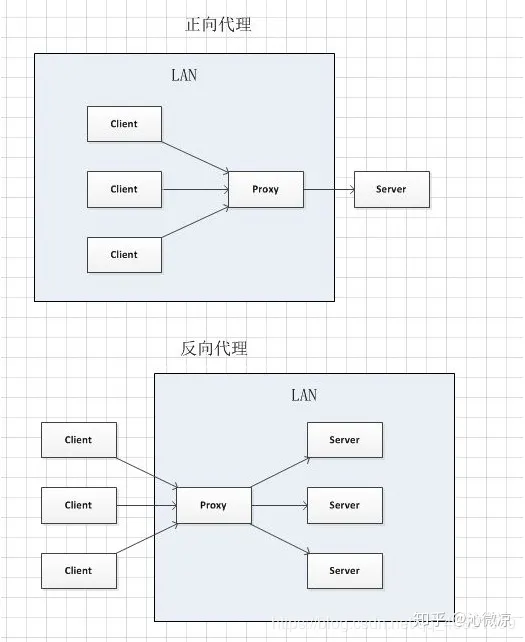

# 跨域

## 原因

> [掘金](https://juejin.cn/post/7003232769182547998)
>
> 同源策略（SOP: Same Origin Policy）是一种约定，由Netscape公司1995年引入浏览器，它是浏览器最核心也最基本的安全功能，如果缺少了同源策略，浏览器很容易受到XSS、CSFR等攻击。
>
> **同源策略**（Same Origin Policy，SOP）是一个重要的安全策略，它用于限制一个[origin](https://link.juejin.cn?target=https%3A%2F%2Fdeveloper.mozilla.org%2Fzh-CN%2Fdocs%2FGlossary%2FOrigin)的文档或者它加载的脚本如何能与另一个源的资源进行交互。浏览器的同源策略，出于防范跨站脚本的攻击，禁止客户端脚本（如 Java）对不同域的服务进行跨站调用（通常指使用请求）。它能帮助阻隔恶意文档，减少可能被攻击的媒介。这是一个用于隔离潜在恶意文件的关键的安全机制。同源策略机制是一种约定，它是浏览器最核心也是最基本的安全功能，如果缺少了同源策略。则浏览器的正常功能可能都会受到影响。可以说Web是构建在同源策略基础上的，浏览器只是针对同源策略的一种实现。

正常情况下，如果我们通过ajax去请求另一个域下的资源时是不会成功的，浏览器默认会阻止这种行为，因为它违背了浏览器的**同源策略**。

简单来说同源策略就是指 **协议 + 域名 + 端口** 三者相同，如果违背了同源策略那么以下行为将得不到浏览器的支持：

1. 获取`Cookie、LocalStorage`等
2. 获取DOM和JS对象
3. 发送 AJAX 请求

## 解决方法

> [总结1，方法比较全](https://segmentfault.com/a/1190000011145364)
>
> [这个视频讲的很清楚](https://www.bilibili.com/video/BV1Ba411M7xA/?spm_id_from=333.788&vd_source=7dcb6c648b7faefd7170d0fc0494d4ad)

### 1. `通过jsonp跨域`

通常为了减轻web服务器的负载，我们把js、css，img等静态资源分离到另一台独立域名的服务器上，在html页面中再通过相应的标签从不同域名下加载静态资源，而被浏览器允许，基于此原理，我们可以通过动态创建script，再请求一个带参网址实现跨域通信。

```js
 <script>
    var script = document.createElement('script');
    script.type = 'text/javascript';

    // 传参一个回调函数名给后端，方便后端返回时执行这个在前端定义的回调函数
    script.src = 'http://www.domain2.com:8080/login?user=admin&callback=handleCallback';
    document.head.appendChild(script);

    // 回调执行函数
    function handleCallback(res) {
        alert(JSON.stringify(res));
    }
 </script>
```

### 2.跨域资源共享（CORS)

#### 2.1简单请求和复杂请求

> [掘金帖子](https://juejin.cn/post/6844904100035821575#heading-70)

不会发起CORS预检请求的请求，称为简单请求，满足以下要求的都是简单请求

- 使用下面的请求方式
  - GET
  - POST
  - HEAD
- 请求头中只包含
  - Accept
  - Accept-Language
  - Content-Language
  - ContentType
    - text/plain
    - multipart/form-data
    - application/x-www-form-urlencoded

**除了简单请求之外的其他请求，都是复杂请求，注意ContentType为application/json时候，也是复杂请求**

复杂请求会在发送真正的请求之前发送一个OPTIONS请求，通常称为预检请求。浏览器会询问服务器是否允许当前源访问，然后再检查当前的请求方式以及请求头中的特殊字段是否被允许，只有服务器配置了允许当前源的请求以及特殊的请求头，浏览器才会发出所需的请求。

##### 简单请求

请求发出去之前，浏览器做了什么？

它会自动在请求头当中，添加一个`Origin`字段，用来说明请求来自哪个`源`。服务器拿到请求之后，在回应时对应地添加`Access-Control-Allow-Origin`字段，如果`Origin`不在这个字段的范围中，那么浏览器就会将响应拦截。

因此，`Access-Control-Allow-Origin`字段是服务器用来决定浏览器是否拦截这个响应，这是必需的字段。与此同时，其它一些可选的功能性的字段，用来描述如果不会拦截，这些字段将会发挥各自的作用。

**Access-Control-Allow-Credentials**。这个字段是一个布尔值，表示是否允许发送 Cookie，对于跨域请求，浏览器对这个字段默认值设为 false，而如果需要拿到浏览器的 Cookie，需要添加这个响应头并设为`true`, 并且在前端也需要设置`withCredentials`属性:

```ini
ini复制代码let xhr = new XMLHttpRequest();
xhr.withCredentials = true;
```

**Access-Control-Expose-Headers**。这个字段是给 XMLHttpRequest 对象赋能，让它不仅可以拿到基本的 6 个响应头字段（包括`Cache-Control`、`Content-Language`、`Content-Type`、`Expires`、`Last-Modified`和`Pragma`）, 还能拿到这个字段声明的**响应头字段**。比如这样设置:

```makefile
makefile
复制代码Access-Control-Expose-Headers: aaa
```

那么在前端可以通过 `XMLHttpRequest.getResponseHeader('aaa')` 拿到 `aaa` 这个字段的值。

##### 非简单请求

非简单请求相对而言会有些不同，体现在两个方面: **预检请求**和**响应字段**。

我们以 PUT 方法为例。

```ini
ini复制代码var url = 'http://xxx.com';
var xhr = new XMLHttpRequest();
xhr.open('PUT', url, true);
xhr.setRequestHeader('X-Custom-Header', 'xxx');
xhr.send();
```

当这段代码执行后，首先会发送**预检请求**。这个预检请求的请求行和请求体是下面这个格式:

```makefile
makefile复制代码OPTIONS / HTTP/1.1
Origin: 当前地址
Host: xxx.com
Access-Control-Request-Method: PUT
Access-Control-Request-Headers: X-Custom-Header
```

预检请求的方法是`OPTIONS`，同时会加上`Origin`源地址和`Host`目标地址，这很简单。同时也会加上两个关键的字段:

- Access-Control-Request-Method, 列出 CORS 请求用到哪个HTTP方法
- Access-Control-Request-Headers，指定 CORS 请求将要加上什么请求头

这是`预检请求`。接下来是**响应字段**，响应字段也分为两部分，一部分是对于**预检请求**的响应，一部分是对于 **CORS 请求**的响应。

**预检请求的响应**。如下面的格式:

```yaml
yaml复制代码HTTP/1.1 200 OK
Access-Control-Allow-Origin: *
Access-Control-Allow-Methods: GET, POST, PUT
Access-Control-Allow-Headers: X-Custom-Header
Access-Control-Allow-Credentials: true
Access-Control-Max-Age: 1728000
Content-Type: text/html; charset=utf-8
Content-Encoding: gzip
Content-Length: 0
```

其中有这样几个关键的**响应头字段**:

- Access-Control-Allow-Origin: 表示可以允许请求的源，可以填具体的源名，也可以填`*`表示允许任意源请求。
- Access-Control-Allow-Methods: 表示允许的请求方法列表。
- Access-Control-Allow-Credentials: 简单请求中已经介绍。
- Access-Control-Allow-Headers: 表示允许发送的请求头字段
- Access-Control-Max-Age: 预检请求的有效期，在此期间，不用发出另外一条预检请求。

在预检请求的响应返回后，如果请求不满足响应头的条件，则触发`XMLHttpRequest`的`onerror`方法，当然后面真正的**CORS请求**也不会发出去了。

**CORS 请求的响应**。绕了这么一大转，到了真正的 CORS 请求就容易多了，现在它和**简单请求**的情况是一样的。浏览器自动加上`Origin`字段，服务端响应头返回**Access-Control-Allow-Origin**。可以参考以上简单请求部分的内容。

#### 2.2具体操作

普通跨域请求：只服务端设置Access-Control-Allow-Origin即可，前端无须设置；

若要带cookie请求：前后端都需要设置。

> 原生对象就像下方 `xhr.withCredentials`，如果用的是`axios`，需要设置`axios.defaults.withCredentials = true`

前端

```js
var xhr = new XMLHttpRequest(); // IE8/9需用window.XDomainRequest兼容

// 前端设置是否带cookie
xhr.withCredentials = true;

xhr.open('post', 'http://www.domain2.com:8080/login', true);
xhr.setRequestHeader('Content-Type', 'application/x-www-form-urlencoded');
xhr.send('user=admin');

xhr.onreadystatechange = function() {
    if (xhr.readyState == 4 && xhr.status == 200) {
        alert(xhr.responseText);
    }
};
```

后端:

```js
var http = require('http');
var server = http.createServer();
var qs = require('querystring');

server.on('request', function(req, res) {
    var postData = '';
    // 数据块接收中
    req.addListener('data', function(chunk) {
        postData += chunk;
    });
    // 数据接收完毕
    req.addListener('end', function() {
        postData = qs.parse(postData);
        // 跨域后台设置
        res.writeHead(200, {
            'Access-Control-Allow-Credentials': 'true',     // 后端允许发送Cookie
            'Access-Control-Allow-Origin': 'http://www.domain1.com',    // 允许访问的域（协议+域名+端口）
            /* 
             * 此处设置的cookie还是domain2的而非domain1，因为后端也不能跨域写cookie(nginx反向代理可以实现)，
             * 但只要domain2中写入一次cookie认证，后面的跨域接口都能从domain2中获取cookie，从而实现所有的接口都能跨域访问
             */
            'Set-Cookie': 'l=a123456;Path=/;Domain=www.domain2.com;HttpOnly'  // HttpOnly的作用是让js无法读取cookie
        });

        res.write(JSON.stringify(postData));
        res.end();
    });
});
server.listen('8080');
```

### 3.`nginx代理跨域`

使用`nginx`反向代理进行跨域

跨域原理： **同源策略只是浏览器的安全策略**，不是HTTP协议的一部分。服务器端调用HTTP接口只是使用HTTP协议，不会执行JS脚本，不需要同源策略，也就不存在跨越问题。

实现思路：通过`nginx`配置一个代理服务器（域名与domain1相同，端口不同）做跳板机，反向代理访问domain2接口，并且可以顺便修改cookie中domain信息，方便当前域cookie写入，实现跨域登录。

```js
#proxy服务器
server {
    listen       81;
    server_name  www.domain1.com;

    location / {
        proxy_pass   http://www.domain2.com:8080;  #反向代理
        proxy_cookie_domain www.domain2.com www.domain1.com; #修改cookie里域名
        index  index.html index.htm;

        # 当用webpack-dev-server等中间件代理接口访问nignx时，此时无浏览器参与，故没有同源限制，下面的跨域配置可不启用
        add_header Access-Control-Allow-Origin http://www.domain1.com;  #当前端只跨域不带cookie时，可为*
        add_header Access-Control-Allow-Credentials true;
    }
}
```

前端代码：

```js
var xhr = new XMLHttpRequest();

// 前端开关：浏览器是否读写cookie
xhr.withCredentials = true;

// 访问nginx中的代理服务器
xhr.open('get', 'http://www.domain1.com:81/?user=admin', true);
xhr.send();
```

#### 3.1 正向代理和反向代理

正向代理即是客户端代理,在客户端设置,服务端不知道实际发起请求的客户端.

反向代理即是服务端代理,在服务端设置,客户端不知道实际提供服务的服务端.

正向代理和反向代理的结构是一样的，都是 client-proxy-server 的结构，它们主要的区别就在于中间这个 proxy 是哪一方设置的。在正向代理中，proxy 是 client 设置的，用来隐藏 client；而在反向代理中，proxy 是 server 设置的，用来隐藏 server。



### 4. 开发环境通过webpack或者vite进行Proxy代理(本质还是通过开启一个中转服务器，所以只在开发环境中使用，上线了之后采用CORS或者nginx代理)

在`vite.config.ts`中添加如下，请求接口的就是`axios.get('/api/...')`，脚手架会代理到target目标域

```js
	server: {
		proxy: {
			"/api": { 
				target: "http://localhost:3000", // 需要跨域的地址
				changeOrigin: true,
				// rewrite:(path)=>path.replace(/^\/api/,'')
			},
		},
	},
```

### 4.`postMessage跨域`

### 5.document.domain + iframe跨域

### 6. location.hash + iframe

### 7. window.name + iframe跨域

### 8.`WebSocket`协议跨域

### 9.nodejs中间件代理跨域

# 补充

- 二级域名向一级域名请求算跨域吗？
  - 算

- 三级域名向二级域名请求算跨域吗？
  - 算


## 个人总结

跨域主要就是是因为浏览的同源策略的影响，如果两个域的协议、域名、端口只要有一个不相同，就会触发浏览器的同源策略保护，不能跨域获取cookie、`localStorage`、获取DOM和JS对象，最重要的，AJAX请求将不被接受

> Q：为什么 Form 表单可以跨域发送请求，而 AJAX 不可以。
>  A：因为 Form 表单提交之后会刷新页面，所以即使跨域了也无法获取到数据，所以浏览器认为这个是安全的。而 AJAX 最大的优点就是在不重新加载整个页面的情况下，更新部分网页内容。如果让它跨域，则可以读取到目标 URL 的私密信息，这将会变得非常危险，所以浏览器是不允许 AJAX 跨域发送请求的。

跨域就是想办法解除绕过浏览器的同源策略，实现方式有9种，常用的我知道有：

第一个jsonp，因为script标签跨域请求浏览器没有限制，但是只能进行get请求，传给后端一个回调函数，让后端带着信息返回函数执行，就可以了。

第二种是开发环境可以使用的，就是使用脚手架进行proxy代理，比如`vite`就在`vite.config.ts`里面添加一个proxy代理，里面就可以设置target。

第三种就是后端这是跨域请求共享CORS响应头，服务器设置 Access-Control-Allow-Origin HTTP响应头之后，浏览器将会允许跨域请求。实现CORS通信的关键是服务器。只要服务器实现了CORS接口，就可以跨源通信。

第四种是运维端用`nginx`反向代理进行跨域，因为同源策略是浏览器的安全限制，不是http请求的规定，服务器之间请求没有这个限制，就可以使用反向代理服务器来进行内容的中转，实现跨域

这些是常用的几种方式，还有比如postMessageAPI来实现跨域，还有document.domain+iframe跨域，WebSocket跨域等等，不是很常见，我也只是听说过。