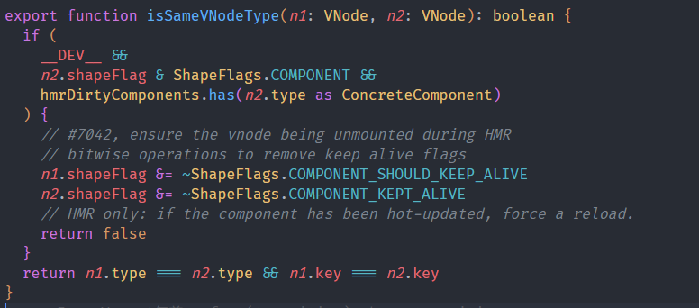

# 1.Vue2和Vue3的区别

> 被面试问到了太多次了
>
> [链接](https://juejin.cn/post/7204844328111308855#heading-1)
>
> [50道常见题](https://juejin.cn/post/7182249611350769725)

1. **数据双向绑定原理变化(`proxy`替代`defineProperty`)**

因为`defineProperty`无法监听对象或者数组新增、删除的元素，Vue2是对数组常用方法`push、pop、shift、unshift、splice、sort、reverse`进行hack处理，提供`Vue.set`来新增属性。

Vue3使用Proxy，Proxy是ES6的新特性，通过第二个参数handler拦截目标对象的行为，提供更强的响应式能力。还支持了`Map、Set、WeakMap、WeakSet`

2. **生命周期函数的更改**

生命周期整体上大部分是周期钩子上+“on”，功能上不变；

且Vue3组合式API中使用生命周期钩子需要事先引入，而Vue2可以直接使用

| Vue2           | Vue3(组合式)    |
| -------------- | --------------- |
| beforeCreate   | setup           |
| created        | setup           |
| beforeMount    | onBeforeMount   |
| mounted        | onMounted       |
| beforeUpdate   | onBeforeUpdate  |
| updated        | onUpdated       |
| breforeDestroy | onBeforeUnmount |
| destroyed      | onUnmounted     |
| activated      | onActivated     |
| deactived      | onDeactived     |
| errorCaptured  | onErrorCaptured |

3. **多根节点**

在vue2中只能使用一个根节点，而Vue3支持多个根节点，也就是fragment

4. Composition API 组合式API

Vue2是选项式API，一个逻辑会散落在文件不同位置(data、props、computed、watch、生命周期钩子)，可读性差

Vue3是组合式API解决了这个问题，可以将同一逻辑内容写到一处，增强可读性。

5. **异步组件(Suspense)**

Vue3 提供 Suspense 组件，允许程序在等待异步组件加载完成前渲染兜底的内容，如 loading ，使用户的体验更平滑。使用它，需在模板中声明，并包括两个命名插槽：default 和 fallback。Suspense 确保加载完异步内容时显示默认插槽，并将 fallback 插槽用作加载状态。

```javascript
<tempalte>
  <suspense>
    <template #default>
      <List />
    </template>
    <template #fallback>
      <div>
        Loading...      
     </div>
    </template>
  </suspense>
</template>
```

在 List 组件（有可能是异步组件，也有可能是组件内部处理逻辑或查找操作过多导致加载过慢等）未加载完成前，显示 Loading...（即 fallback 插槽内容），加载完成时显示自身（即 default 插槽内容）。

6. **Teleport**

Vue3提供了Teleport组件可将部分DOM移动到Vue app之外的位置，比如项目中常见的Dialog弹窗

```vue
<button @click=dialogVisible = true">显示弹窗</button>
<teleport to="body">
   <div v-if="dialogVisible">
	弹窗，移动到body标签下
   </div>
</teleport>
```

7. **虚拟DOM**

Vue3在虚拟DOM上增加了`patchFlag`字段类型

8. **Diff算法优化**

patchFlag 帮助 diff 时区分静态节点，以及不同类型的动态节点。一定程度地减少节点本身及其属性的比对。

9. **TS支持**

Vue3由TypeScript重写，相对比Vue2对TS有了更好的支持

10. **打包优化**

11. **传值更改**

- vue2 父传子，直接props，子传父，采用Emitting Events，this.$emit(‘事件’,参数)
- vue3 父传子，直接props，子传父，采用Emitting Events，但需要从Vue之中解构出defineEmits，再defineEmits(['事件名称‘])

## 个人总结

API方面

- composition api 组合式API
- 以及setup语法糖
- Fragment节点，多根节点
- Teleport传送门组件，还有异步组件
- 自定义渲染器
- SFC状态驱动CSS，可以在css中使用v-bind

框架方面

- 性能更快
  - 使用Proxy重写响应式机制，推出ref和reactive
  - 编译器优化：在虚拟DOM里塞入`patchFlag`来加快patch性能
- 更小：vue3将各个模块拆分，利于插件的开发，也利于tree-shaking，没使用到的模块不进行打包
- Vue整个用TS重写，对TS的支持性更好

使用方面

- 删除了一些api，比如`$children，$on`之类的
- 使用Emit触发事件需要用`defineEmits`函数
- 声明周期钩子函数名称更改，beforeCreated和created被setup取代，其他的前面都加了on，destory钩子改名为unmounted，更加形象化。
- v-model成了v-model和.sync的结合体

# 2.虚拟DOM

(Vue是数据驱动的框架，数据发生变化，会全量更新一次).Vue也是一个声明式的框架，声明式框架的更新性能消耗 = 找出差异的性能消耗 + 直接修改的性能消耗，虚拟DOM的意义就是使得找出差异的性能消耗最小以使得声明式框架的性能接近于命令式的性能消耗。采用虚拟DOM的更新技术**理论上**不可能比原生JS操作DOM性能更高。(但仅仅是理论上，因为项目一旦大起来，一直写出高效的原生JS代码太耗时了)经过可维护性和开发效率方面的考虑，虚拟DOM是一个很不错的选择。通过DIFF算法可以找出需要修改的节点再进行更新，尽可能避免多余的DOM操作，规范优化了操作DOM的方式。

第二点就是虚拟DOM可以方便跨平台应用，因为虚拟DOM就是个描述真实节点的JS对象，各个平台都能认识，再根据平台不同的渲染函数渲染成不同的真实节点。

第三点就是，Vue3是各个模块组件的有机整体，比如渲染器和编译器，虚拟DOM可以成为两个模块之间信息交流的媒介，通过往虚拟DOM里放一些属性字段来提高模块的执行效率(如果要问例子，比如一个元素标签只有class是动态的，就可以在编译阶段给虚拟DOM添加一个字段，然后渲染器就知道了，就可以省去查找变化点的计算量，提高性能)。

Vue的虚拟DOM一般包含三个子项

- type属性，标签项，也可以是一个组件，函数或者对象
- props：标签上的属性和方法
- children：子节点或者标签的内容，如果是文本节点就是字符串，如果是数组就是有子节点

像在Vue里面写的template最后被编译器编译成render函数，或者手写的render函数，最后返回的就是虚拟DOM，最后会被渲染器patch成真实DOM

# 3.DIFF算法

> 书P242

Vue是一个声明式的框架，声明式框架的更新性能消耗 = 找出差异的性能消耗 + 直接修改的性能消耗；DIFF算法的出现就是为了配合虚拟DOM使得找出差异的性能消耗降到最低。

最初Vue1.X版本时候，每个属性都有一个对应的Watcher实例，可以做到精确更新，没必要使用DIFF算法，但是这样没法承载较大的应用。Vue2之后就降低颗粒化程度，一个组件只有一个Watcher实例，这时候就需要DIFF算法了，配合DOM操作精确的找到需要变化的节点然后精确更新，减少DOM操作次数。

DIFF算法是一个深度优先，同层比较的算法。

- 首先判断两个节点是否为相同同类节点，不同则删除重新创建

- 如果双方都是文本则更新文本内容

- 如果双方都是元素节点则递归更新子元素，同时更新元素属性

- 更新子节点时又分了几种情况：

  - 新的子节点是文本，老的子节点是数组则清空，并设置文本；
  - 新的子节点是文本，老的子节点是文本则直接更新文本；
  - 新的子节点是数组，老的子节点是文本则清空文本，并创建新子节点数组中的子元素；
  - 新的子节点是数组，老的子节点也是数组，那么比较两组子节点，更新细节如下


vue2用的是双端对比算法。通过比较两组子节点的四端来进行对比，试图找到可以复用的节点。第一步是对比两个首部，第二步是两个尾部，第三步是旧节点组的首部和新节点组的尾部，第四步是旧节点组的尾部和新节点组的首部。如果对比下来没有找到，就会直接搜索旧子节点组找到对应的索引值，没找到就挂载节点到当前头部，如果找到了就打补丁然后移动到当前头部。最后再处理一下边界情况，有新元素就新增，有旧元素就卸载；

> 第一步首首成了：直接打补丁然后继续比较，因为都在首位，说明位置没变；
>
> 第二步尾尾也打个补丁然后继续比较；
>
> 第三步旧首和新尾，打补丁然后把旧首对应的真实节点移动到尾部；
>
> 第四步旧尾和新首，打补丁然后把旧尾真实节点移动到头部；

vue3采用的是快速DIFF算法，只要借鉴`ivi`和`inferno`和纯文本的diff算法；主要步骤是五个步骤

1. 预处理前置节点
2. 预处理后置节点
3. 处理仅有新增情况的节点
4. 处理仅有卸载情况的节点
5. 处理其他的混合复杂情况(新增/卸载/移动)

首先用一个变量i从前到后对比，相同节点直接打补丁patch，然后使用分别使用两个变量从后到前对比，相同节点直接打补丁patch。之后会遇到两种比较理想的情况，仅有新增节点或者仅有卸载情况，这时候只需要挂载新节点或者卸载旧节点就可以；

比较复杂的是最后一种混合情况，这时候对于不能简单处理的节点，处理规则都是

- 判断是否有节点需要移动，如何移动
- 找出需要被添加或移除的节点

首先会根据新的一组子节点构建一张索引表，用来存储节点的key和节点位置索引之间的映射。然后用这个索引表扫描一遍旧的子节点计算出一个source数组，并在这个过程中卸载掉不需要的旧节点，这个source数组里面存的是新的一组子节点在旧的一组子节点中的位置索引，再用它计算出一个最长递增子序列`seq`，用于辅助完成DOM移动的操作。最长递增子序列里面存的是对应的新节点的索引，说明新节点里对应的值不需要移动。(因为他们在旧节点组里面的相对顺序没变)

> 移动过程会使用2个索引值，s指向`seq`序列最后一个元素，i指向新节点最后一个节点，依次向上比较，新节点(source数组值为-1)挂载，i !== `seq[s]`的就需要移动，移动到下一个节点的上面，等于就直接跳过，说明是不需要移动的节点。

> 如何判断两个节点是否相等
>
> 

## 3.1 为什么双端对比算法需要先比较首尾

头尾指针比较后如果不匹配，再根据key的hash表对比，但是构建哈希表需要遍历整个对象，很多情况下如果只有key的方案，就需要遍历＋四次对比，而头尾双指针只需要四次对比。

也就是因为首尾复用的情况比较常见，综合考虑常见的情况(顺序或逆序复用)和不常见的情况(乱序复用)，所以选择优先匹配首尾指针，其次遍历匹配key的办法

# 4.响应式

数据响应式是检测数据变化并作出响应的一种机制。在Vue中需要解决的一个问题就是实现数据变化驱动视图变化，为了做到这点就需要对数据进行响应式处理。之后配合虚拟DOM和diff算法，就可以只关心数据而不用命令式的操作DOM，提高开发效率。

Vue2里响应式系统主要的核心策略就是数据拦截+观察者模式。数据拦截让我们知道数据什么时候发生变化，观察者模式实现发生变化之后执行一系列副作用函数。数据拦截使用`Object.defineProperty`方法，重写get方法来收集依赖，重写set方法触发依赖。观察者模式主要依靠三个类，Dep类和Wachter类，还有一个Observer类把这两个类串联起来。用Observer类递归data使用`defineProperty`进行数据劫持，为每一个响应式对象都创建一个Dep实例闭包，(然后在挂载组件的时候创建Watcher实例，并把`Dep.target`设为当前实例)，然后在首次渲染的时候触发相应数据的getter来进行依赖收集。之后数据数据变化触发setter，就会调用Dep实例的notify方法通知Watcher实例执行回调。但是实际使用起来也有问题，初始化递归操作造成性能损失，也无法新增和删除属性。vue2的数组也需要用API方法来进行数据添加和删除，vue2文档里也写了可以做到不用这种方法，但是性能方面就得不偿失。然后也不支持Set，Map这种新的数据结构。

Vue3核心原理和vue2差不多，也是数据劫持+依赖收集和依赖更新，不过Vue3用的是Proxy实现对整个对象的代理。响应式的核心操作是Proxy+Reflect继续数据劫持，用track函数依赖收集，用trigger函数进行依赖触发。

Vue3使用了Proxy来进行整个对象的代理，没有办法像vue2那样创建闭包来保存属性对应的Dep实例，就用了一个全局的`targetMap`依赖管理器来进行所有的依赖管理。这样做还有个好处就是Proxy类似于懒加载，不需要的数据就不添加依赖了。只有副作用函数用到的数据才进行依赖收集。之后数据变化的时候触发setter，就从targetMap全局依赖管理器里一层一层的找到依赖(首先是根据对象找到DepsMap，然后再根据属性找到对应的依赖集合，也就是一个Set集合)。

我觉得Vue3的这种机制是目前比较好的一种解决方式，缺点就是向下的兼容，Proxy是ES6才新增的属性。

(track函数收集依赖的方式和vue2差不多，会有一个全局的activeEffect属性来记录当前的副作用函数，然后从targetMap里面找到依赖集合，然后添加)。

# 5.computed和watch的区别

**对于Computed：**

- 它支持缓存，只有依赖的数据发生了变化，才会重新计算
- 不支持异步，当Computed中有异步操作时，无法监听数据的变化
- computed的值会默认走缓存，计算属性是基于它们的响应式依赖进行缓存的，也就是基于data声明过，或者父组件传递过来的props中的数据进行计算的。
- 如果一个属性是由其他属性计算而来的，这个属性依赖其他的属性，一般会使用computed
- 如果computed属性的属性值是函数，那么默认使用get方法，函数的返回值就是属性的属性值；在computed中，属性有一个get方法和一个set方法，当数据发生变化时，会调用set方法。

**对于Watch：**

- 它不支持缓存，数据变化时，它就会触发相应的操作
- 支持异步监听
- 监听的函数接收两个参数，第一个参数是最新的值，第二个是变化之前的值
- 当一个属性发生变化时，就需要执行相应的操作
- 监听数据必须是data中声明的或者父组件传递过来的props中的数据，当发生变化时，会触发其他操作，函数有两个的参数：
  - immediate：组件加载立即触发回调函数
  - deep：深度监听，发现数据内部的变化，在复杂数据类型中使用，例如数组中的对象发生变化。需要注意的是，deep无法监听到数组和对象内部的变化。

当想要执行异步或者昂贵的操作以响应不断的变化时，就需要使用watch。

**总结：**

- computed 计算属性 : 依赖其它属性值，并且 computed 的值有缓存，只有它依赖的属性值发生改变，下一次获取 computed 的值时才会重新计算 computed 的值。
- watch 侦听器 : 更多的是**观察**的作用，**无缓存性**，类似于某些数据的监听回调，每当监听的数据变化时都会执行回调进行后续操作。

## 5.1个人小总结

computed是计算属性，他的值依赖于其他的值，可以传入一个必须返回参数的函数或者一个对象设置getter和setter，不支持异步操作。且内部有一个_dirty属性来进行缓存，多次使用计算属性的时候会走缓存，只有依赖的值发生变化了才会进行更新。

watch是监听属性。监听一个属性值发生变化的时候执行回调，没有缓存性，支持异步监听，可以用deep属性设置深度监听，和immediate属性立即执行回调函数。

vue3有了功能更强大的`watchEffect`，会立即执行一遍回调函数来收集依赖。

# 6.如何实现一个vue-router

# 7. key的作用

1. key就像是虚拟节点的身份证号，作用是为了更高效的对比虚拟DOM
2. key是对比时判断两个节点是否相同的必要条件。渲染一组列表时，key往往是唯一标识，如果不定义key的话，值为undefined，vue只能是认为两个节点是同一个。就会导致更新出错。还会影响性能。
3. 实际使用渲染一组列表的时候key一定要设置，而且必须是唯一标识，也应该避免使用数组索引作为key，可能会出现一些隐蔽bug，一般可能使用后端传过来的id值什么的。

# 8.mutation和action的区别

mutation和action非常类似，mutation可以变更状态，但不能有异步操作，action可以有异步操作，但不能修改状态，需要用mutation才能更改状态。

如果在项目中使用vuex，一般调用API接口和一些复杂业务组合使用dispatch触发action，直接修改状态才用commit触发mutation。

mutation的回调函数参数是state对象，action函数参数为上下文context对象，可以结构为dispatch、commit、state方便使用。dispatch也会返回Promise实例便于使用异步结果。

commit方法相当于调用`options.mutation[type](state)`，而dispatch相当于`options.actions[type](stroe)`

在Pinia里面取消了两者的区别，合并为在一起了actions

# 9.ref和reactive的区别

1. 两者都能返回响应式对象，从语法使用上来说，一般使用ref来创建基础数据类型的响应式数据，使用reactive创建对象类型的响应式数据。ref也可以用来创建对象类型的，但是底层调的还是reactive
2. 使用的时候ref的对象需要.value使用，而reactive不需要。
3. ref返回一个设置了getter和setter的RefImpl对象，这也就是为什么需要.value使用的原因。而reactive返回的是一个Proxy代理对象。
4. ref对象收集的依赖都保存在自身`RefImpl`内部的dep属性里，所以ref有点类似于vue2的响应式原理，而reactive的依赖都保存在targetMap全局依赖管理器。需要层层找才能找到。

> 其实ref对象底层完全可以用reactive来实现，包装一下然后用reactive包装返回。但是尤大的意思是两个方法最好各司其职，ref的定义应该只暴露一个属性，就是值本身，而用reactive就会附加一些属性，违背了ref的目的:为一个内部值而服务，而不是被当做一个一般的响应式对象。还有性能问题，reactive做了很多ref里没有做的事，比如检查对象是不是有只读副本什么的，而用一个对象字面量来创建ref可以节约性能。

# 10.KeepAlive

`KeepAlive`组件本质是缓存管理+特殊的挂载/卸载逻辑；

`KeepAlive`的实现需要渲染器层面的支持，因为被KeepAlive的组件在卸载时，不是真正的卸载，而是把原容器搬运到另一个隐藏的容器中，实现假卸载。被缓存的组件内部会有标记位来辅助渲染器进行处理；当组件需要再次挂载时候，是把组件从隐藏容器中再搬运到原容器；这个两个过程对应的生命周期函数就是`activated`和`deactivated`。

默认情况下，KeepAlive组件会对所有内部组件进行缓存，但也有include和exclude用来显式的配置缓存规则。他们会根据内部组件的名称进行匹配；

KeepAlive内部缓存的逻辑简单来说就是

- 如果组件缓存存在，就继承组件实例；
- 如果不存在，就设置缓存。

为了防止缓存会占用大量内存，内部LRU 最近最少使用算法对缓存进行修剪；需要设置一个max属性设置缓存的最大数量。

然后现在也有提案允许用户自定义缓存策略，暴露一个cache接口来设置。

# 11.为什么用mutation来修改state而不是直接修改

1. 因为state是实时更新的，mutations无法进行异步操作，而如果直接修改state的话是能够异步操作的，当你异步对state进行操作时，还没执行完，这时候如果state已经在其他地方被修改了，这样就会导致程序存在问题了。所以state要同步操作，通过mutations的方式限制了不允许异步
2. 通过commit 提交 mutation 的方式来修改 state 时，vue的调试工具能够记录每一次 state 的变化，这样方便调试。但是如果是直接修改state，则没有这个记录，那样做会使状态不受我们管控。如果是多个模块需要引用一个state的，然后每个人可能由不同的人开发，如果直接修改值，可能会造成数据的混乱，Mutation 也记录不到，到时候调试会有麻烦。

# 12. 组件化和模块化的区别

不论是前端组件化还是模块化，都是前端工程化的具体体现。前端工程化是一个高层次的思想,而模块化和组件化是为工程化思想下相对较具体的开发方式。因此可以简单的认为模块化和组件化是工程化的表现形式。

- 组件是具体的：按照一些小功能的通用性和可复用性来抽象组件

对于组件而言，其目的在于提高代码的重用性，其功能相对单一或者独立。在整个项目的代码层次上位于最底层，被其他代码所依赖。页面就像是组件的容器,负责组合组件形成功能完整的界面。

- 模块是抽象的：按照项目业务划分的大模块

将同一类型的代码整合在一起（例如用户信息模块，设置模块等等），所以模块的功能相对复杂，但都同属于一个业务。不同模块之间也会存在依赖关系，但大部分都是业务性的互相跳转，从地位上来说它们都是平级的，所以说模块化是横向分块。

侧重功能的封装，主要是针对Js代码，隔离、组织复制的js代码，将它封装成一个个具有特定功能的的模块。模块可以通过传递参数的不同修改这个功能的的相关配置，每个模块都是一个单独的作用域，根据需要调用。一个模块的实现可以依赖其它模块

# 13.vue-router hash模式和history模式

Vue-Router 有三个模式，其中 history 和 hash 更为常用。两者差别主要在显示形式和部署上，

hash模式在地址栏现实的时候有一个 `#`，处在#后面的地址在发送请求的时候不会携带，这种方式使用和部署都较简单，但是不太美观。

history模式url看起来更优雅美观，但是web服务器需要做重写URL处理，否则会出现刷新页面404的问题。

在实现上 `hash`模式是监听`hashchange`事件触发路由跳转，`history`模式是监听`popstate` 事件触发路由跳转。

# 14.scoped原理

1.为组件实例生成一个唯一标识，给组件的每个标签对应的DOM元素添加一个标签属性，data-v-xxx

2. 给设置了scoped的样式的选择器最后添加一个属性选择器[data-v-xxxx]

vue2可以使用需要样式穿透的类名前面加一个`/deep/`的属性来实现穿透，vue3使用`:deep()`伪类选择器来实现

使用了样式穿透的样式不会加上属性选择器

```css
<style scoped>
.a :deep(.b) {
  /* ... */
}
</style>
```

```css
.a[data-v-f3f3eg9] .b {
  /* ... */
}
```

