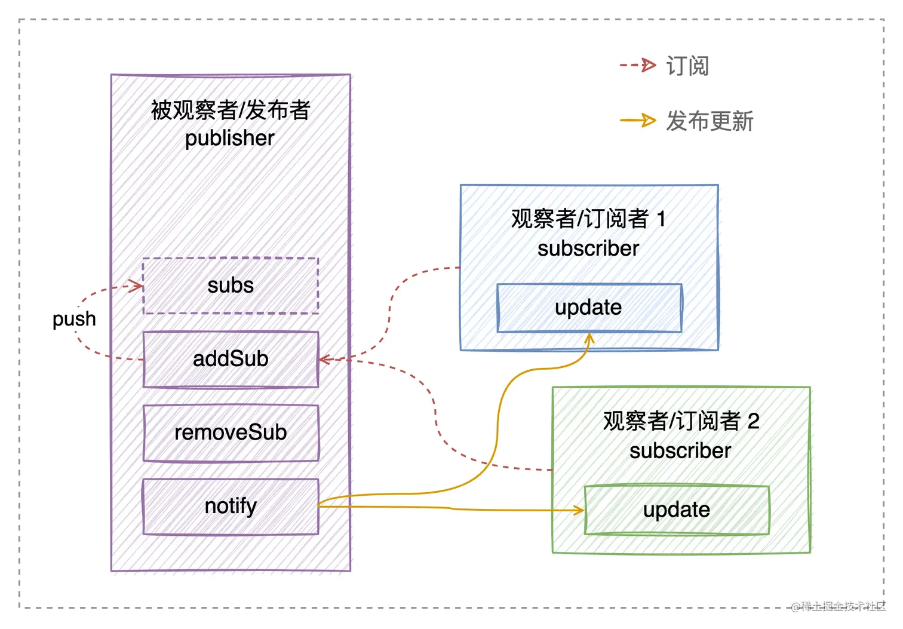

# Vue2响应式

> Vue的数据双向绑定需要做到数据变化->视图变化。视图变化->数据变化。
>
> 后者很轻松就可以做到，只需要给元素添加事件回调函数。
>
> 前者就是数据响应式，做起来比较复杂。
>
> 响应式就是数据改变可以做到视图改变。

## 总体流程

1. 从new Vue开始，首先通过Observer类来实现Data数据的数据劫持，具体实现方法就是`Object.defineProperty`。这时候也会为**每一个响应式属性都创建一个Dep实例**，用于后面收集依赖(也就是收集对应的Watcher观察者实例)
2. 编译模板，具体是在`生命周期中 beforeMount `的时期创建Watcher实例(会创建多个)，并将`Dep.target`标识为当前新创建的Watcher实例，并触发相应Data属性的`getter方法`，调用`Dep.addSub`方法收集依赖也就是`Dep.target`
3. 之后数据更新时，会触发对应属性的`setter`，调用`Dep.notify`方法通知所有的该方法的Watcher调用自身的update方法来更新DOM。

## 响应式

Vue2的响应式系统就是**数据拦截 + 观察者模式**

数据拦截的具体实现方式就是**`Object.defineProperty`**，在读取属性、修改属性的时候可以进行一些操作

观察者模式就实现了数据修改可以实现视图的修改。数据拦截就告诉Vue什么时候进行视图的修改

具体需要三个类，**Observer** + **Dep** + **Watcher**

Observer类会递归调用来实现数据拦截(根据源码看，递归一层对象，就会创建一个Observer类)和串联起Dep类和Watcher类，而Dep和Watcher就是实现观察者模式

> [帖子1](https://juejin.cn/post/7139078234905247774#heading-5)
>
> [帖子2](https://juejin.cn/post/6857669921166491662#heading-2)
>
> [蛋老师视频，为了理解容易，视频做了简易处理，可以看自己实现的代码](https://www.bilibili.com/video/BV1934y1a7MN/?spm_id_from=333.880.my_history.page.click)

## 数组

数组响应式总结：数组的依赖收集还是在`get`方法里，不过依赖的存放位置会有不同，不是在`defineReactive`方法的`dep`里，而是在`Observer`类中的`dep`里，依赖的更新是在拦截器里的数组异变方法最后手动更新的。

> [帖子](https://juejin.cn/post/6844903916954451982#heading-6)
>
> 数组并没有给每一项数组做响应式拦截，切记，源码里也是这样的
>
> 数组的Dep实例是Observer包装的时候新建的那个。
>
> 数组中所有子数组的的Dep实例收集的依赖都是同一个，也就意味着，比如
>
> `let arr = [[[1],[2]],[[3],[4]]],就算是这样，arr[0][0] = [5]`，也会重新渲染整个数组。
>
> 对象数组同理，对象数组里的对象里面的具体属性会建立响应式，但是对象本身如果整个更换了，也会重新渲染整个对象数组。

## \$set/\$delete

### $set

首先判断`target`是否是数组，是数组的话第二个参数就是长度了，设置数组的长度，然后使用`splice`这个异变方法插入`val`。 然后是判断`key`是否属于`target`，属于的话就是赋值操作了，这个会触发`set`去派发更新。接下来如果`target`并不是响应式数据，那就是普通对象，那就设置一个对应`key`吧。最后以上情况都不满足，说明是在响应式数据上新增了一个属性，把新增的属性转为响应式数据，然后通知手动依赖管理器派发更新。

```js
function set(target, key, val) {
  if(Array.isArray(target)) {  // 数组
    target.length = Math.max(target.length, key)  // 最大值为长度
    target.splice(key, 1, val)  // 移除一位，异变方法派发更新
    return val
  }
  
  if(key in target && !(key in Object.prototype)) {  // key属于target
    target[key] = val  // 赋值操作触发set
    return val
  }
  
  if(!target.__ob__) {  // 普通对象赋值操作
    target[key] = val
    return val
  }
  
  defineReactive(target.__ob__.value, key, val)  // 将新值包装为响应式
  
  target.__ob__.dep.notify()  // 手动触发通知
  
  return val
}

```

### $delete

`this.$delete`就更加简单了，首先如果是数组就使用异变方法`splice`移除指定下标值。如果`target`是对象但`key`不属于它，再见。然后删除制定`key`的值，如果`target`不是响应式对象，删除的就是普通对象一个值，删了就删了。否则通知手动依赖管理器派发更新视图。

```js
function del (target, key) {
  if (Array.isArray(target)) {  // 数组
    target.splice(key, 1)  // 移除指定下表
    return
  }
  
  if (!hasOwn(target, key)) {  // key不属于target，再见
    return
  }
  
  delete target[key]  // 删除对象指定key
  
  if (!target.__ob__) {  // 普通对象，再见
    return
  }
  target.__ob__.dep.notify()  // 手动派发更新
}

```

## 观察者模式

它就是一种行为设计模式， 允许你定义一种订阅机制，可在对象事件发生时通知多个 “观察” 该对象的其他对象。

有两个主体：被观察者和观察者(发布者和订阅者)

拥有一些值得关注状态的对象通常被称为**目标(被观察者，也就是上文的Dep类)**，由于它自身状态发生改变时需要通知其他对象，我们也将其成为**被观察者或者发布者(Dependency)**。所有希望关注发布者状态变化的其他对象被称为**观察者或者订阅者（Watcher）**。此外，发布者与所有订阅者直接仅通过接口交互，都**必须具有同样的接口**。

