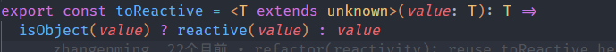
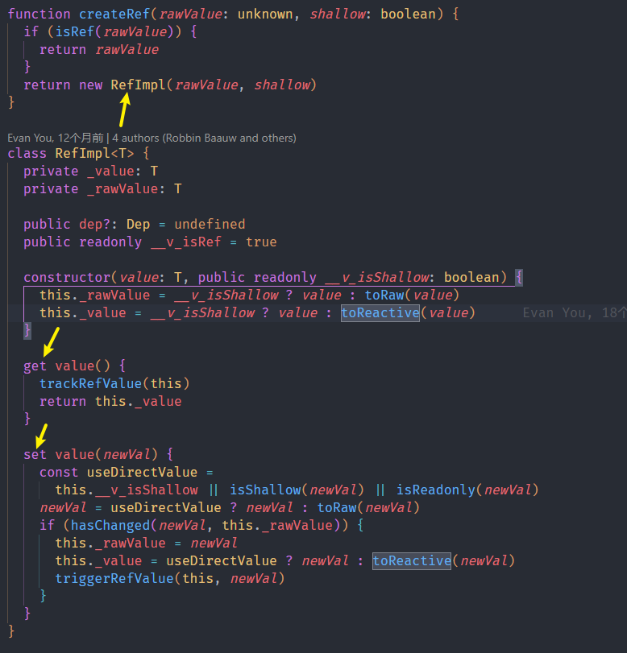
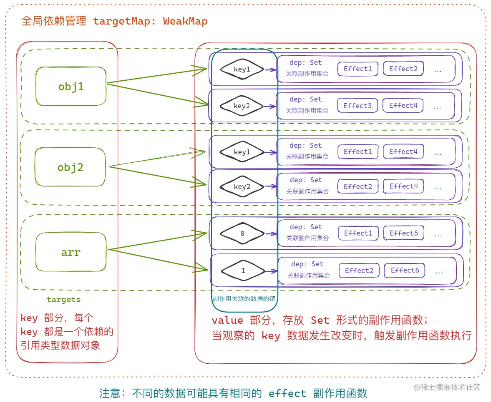
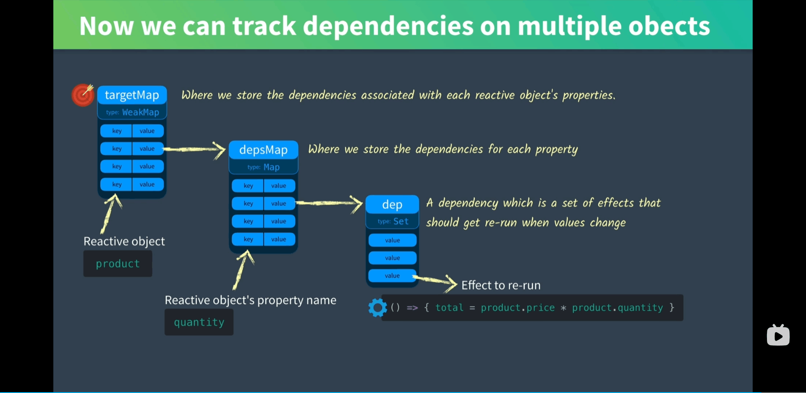
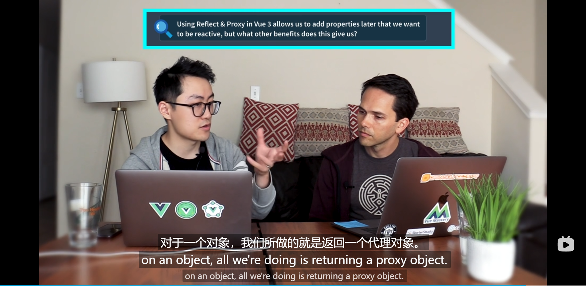
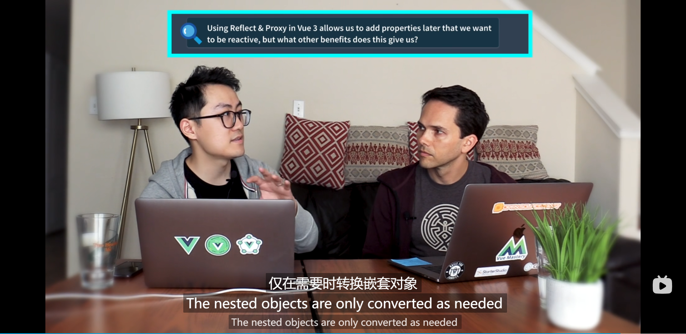
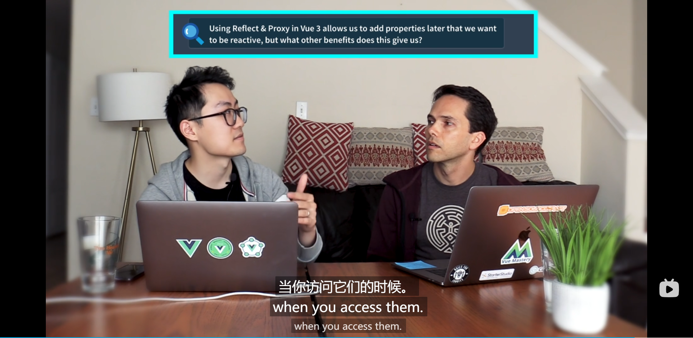
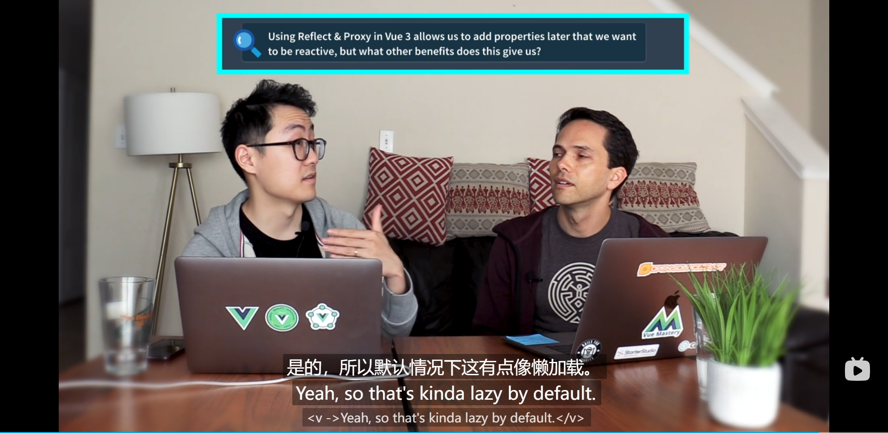

# Vue3响应式

> https://juejin.cn/post/7202454684657107005#heading-3

## 副作用函数

> 如果一个函数引用了外部的资源，这个函数会受到外部资源改变的影响，我们就说这个函数存在副作用，该函数也叫做副作用函数

副作用函数就是**引用了数据的函数**或者说**数据关联的函数**

```html
<!DOCTYPE html>
<html lang="">
<head>
    <meta charset="utf-8">
    <meta http-equiv="X-UA-Compatible" content="IE=edge">
    <meta name="viewport" content="width=device-width,initial-scale=1.0">
    <link rel="icon" href="<%= BASE_URL %>favicon.ico">
    <title><%= htmlWebpackPlugin.options.title %></title>
</head>
<body>
    <div id="app"></div>
    <script>
        const obj = {
            name: 'John',
        }
        // 副作用函数 effect
        function effect() {
            app.innerHTML = obj.name
            console.log('effect', obj.name)
        }
        effect()
        setTimeout(() => {
            obj.name = 'ming'
            // 手动执行 effect 函数
            effect()
        }, 1000);
    </script>
</body>
</html>

```

在上面例子中，`effect`函数里面引用了外部的数据`obj.name`,如果这个数据发生了改变，则会影响到这个函数，类似`effect`的这种函数就是副作用函数。

## Proxy和Reflect

`Proxy` 是 `ES6` 新增的一个构造函数，用来创建一个 **目标对象的代理对象，拦截对原对象的所有操作；用户可以通过注册相应的拦截方法来实现对象操作时的自定义行为**。

目前 `Proxy` 支持的拦截方法包含一下内容：

- `get(target, propKey, receiver)`：拦截对象属性的读取操作；
- `set(target, propKey, value, receiver)`：拦截对象属性的赋值操作；
- `apply(target, thisArg, argArray)`：拦截函数的调用操作；
- `construct(target, argArray, newTarget)`：拦截对象的实例化操作；
- `has(target, propKey)`：拦截 `in` 操作符；
- `deleteProperty(target, propKey)`：拦截 `delete` 操作符；
- `defineProperty(target, propKey, propDesc)`：拦截 `Object.defineProperty` 方法；
- `getOwnPropertyDescriptor(target, propKey)`：拦截 `Object.getOwnPropertyDescriptor` 方法；
- `getPrototypeOf(target)`：拦截 `Object.getPrototypeOf` 方法；
- `setPrototypeOf(target, proto)`：拦截 `Object.setPrototypeOf` 方法；
- `isExtensible(target)`：拦截 `Object.isExtensible` 方法；
- `preventExtensions(target)`：拦截 `Object.preventExtensions` 方法；
- `enumerate(target)`：拦截 `for...in` 循环；
- `ownKeys(target)`：拦截 `Object.getOwnPropertyNames`、`Object.getOwnPropertySymbols`、`Object.keys`、`JSON.stringify` 方法。

与 `Object,defineProperty` 比起来，有非常明显的优势：

- 拦截操作更加多样
- 拦截定义更加直接
- 性能更加高效

在 Vue 中体现最为明显的一点就是：`Proxy` 代理对象之后不仅可以拦截对象属性的读取、更新、方法调用之外，对整个对象的新增、删除、枚举等也能直接拦截，而 `Object.defineProperty` 只能针对对象的已知属性进行读取和更新的操作拦截。

> 但是 **只有通过 `proxyObj` 进行操作的时候才能通过定义的操作拦截方法进行处理，直接使用原对象则无法触发拦截器**。
>
> 这也是 Vue 3 中要求的 `reactive` 声明的对象修改原对象无法触发视图更新的原因。
>
> 并且 `Proxy` 也只针对 **引用类型数据** 才能进行代理，所以这也是 Vue 的基础数据都需要通过 `ref` 进行声明的原因，内部会建立一个新对象保存原有的基础数据值。(但并不是通过reactive来二次代理实现，尤大的原话用意是：如果用reactive来封装ref，就会给它附加一些新的属性，因为这么做就违背了Ref的目的；ref只能为封装一个内部值而服务，不应该被当做一个一般的响应式对象；还有性能问题)

## Vue3响应式

和vue2一样，核心原理都是`数据劫持+依赖收集+依赖更新`，只不过是实现数据劫持方式的差异导致了具体实现的差异

- Vue2基于`Object.defefineProperty`
- Vue3基于`Proxy`实现对整个对象的代理

### 简单使用

- `ref`：接受一个内部值，返回一个响应式的、可更改的 ref 对象，此对象只有一个指向其内部值的属性 `.value`。

  ```typescript
  function ref<T>(value: T): Ref<UnwrapRef<T>>
  interface Ref<T> {
    value: T
  }
  ```

- `shallowRef`：`ref()` 的浅层作用形式。

  ```typescript
  function shallowRef<T>(value: T): ShallowRef<T>
  interface ShallowRef<T> {
    value: T
  }
  ```

- `reactive`：返回一个对象的响应式代理。

  ```typescript
  function reactive<T extends object>(target: T): UnwrapNestedRefs<T>
  ```

- `shallowReactive`：`reactive()` 的浅层作用形式。

  ```typescript
  function shallowReactive<T extends object>(target: T): T
  ```

- `readonly`：接受一个对象 (不论是响应式还是普通的) 或是一个 [ref](https://link.juejin.cn?target=https%3A%2F%2Fcn.vuejs.org%2Fapi%2Freactivity-core.html%23ref)，返回一个原值的只读代理。

  ```typescript
  function readonly<T extends object>(target: T): DeepReadonly<UnwrapNestedRefs<T>>
  ```

- `shallowReadonly`：`readonly` 的浅层作用形式

  ```typescript
  function shallowReadonly<T extends object>(target: T): Readonly<T>
  ```

### 简单介绍

#### Ref

其中 `ref` 虽然常常有文章说一般只用来 **声明基础数据的响应式**，但是其实 **所有的数据类型声明响应式时都可以使用 `ref`**，只是内部为了同时实现基础数据的响应式处理，封装成了一个具有 `value` 属性的对象，所以我们访问时必须通过 `xxx.value` 的形式访问。**如果使用ref来声明引用类型数据的响应式，最后还是会调用reactive**，如下图所示



`ref` 函数内部执行时会创建一个 `RefImpl` 类型的实例，其中的 `_value` 就保存响应式数据，并定义了对象的 `get` 和 `set` 方法，用来收集依赖和发布更新事件。如果不是 `shallowRef` 声明的浅层响应式数据的话，其 `_value` 其实也会通过 `reactive` 方法进行深层数据处理。



#### Reactive

而 `reactive` 与 `readonly` 则比较相似，都是通过 `createReactiveObject` 方法来创建一个 `Proxy` 对象返回，只是 `readonly` 的 `set` 和 `deleteProperty` 操作会直接拦截报错，提示禁止更新。

至于 `get` 操作的拦截两者的大体思路差不多，不过 **`readonly` 因为只读的原因，数据不会发生改变，所以不会进行依赖收集操作**，如果有深层数据则会继续向内部进行同样的处理操作。

带有 `shallow` 前缀的数据声明方法，结合官方的解释其实就明白了，整个定义 **类似深拷贝与浅拷贝的区别，即只处理首层数据**。代表假设使用 `shadowRef`、`shallowReactive` 声明的对象，如果对象的某个属性也是对象，则 **只有当这个属性的引用地址发生改变时才会触发更新**；至于 `shallowReadobly` 的话，其实就是读取什么返回什么，基本没有别的处理了。

## 核心操作

Vue3的响应式核心操作是三个函数：Proxy+Reflect(进行数据劫持)、track(和effect配合进行依赖收集)、trigger(依赖触发)

> Vue2中的depend和notify的逻辑被抽离出来，到两个单独的函数：track和trigger中

### 数据劫持

#### Reactive

直接从reactive讲起，创建一个响应式reactive数据时，会调用以下方法

```ts
export function reactive(target: object) {
  // if trying to observe a readonly proxy, return the readonly version.
  if (isReadonly(target)) {
    return target
  }
  return createReactiveObject(
    target,
    false,
    mutableHandlers,
    mutableCollectionHandlers,
    reactiveMap
  )
}
function createReactiveObject(
  target: Target, // 传入的原始目标对象
  isReadonly: boolean, // 是否是只读的标识
  baseHandlers: ProxyHandler<any>, // 为普通对象(Object,Array)创建Proxy时的第二参数handler
  collectionHandlers: ProxyHandler<any>, // 为collection类(Set,Map)创建Proxy时的第二参数handler
  proxyMap: WeakMap<Target, any> // 用于缓存target和他的proxy之间的对应关系
) {
  if (!isObject(target)) {
    if (__DEV__) {
      console.warn(`value cannot be made reactive: ${String(target)}`)
    }
    return target
  }
  // target is already a Proxy, return it.
  // exception: calling readonly() on a reactive object
  if (
    target[ReactiveFlags.RAW] &&
    !(isReadonly && target[ReactiveFlags.IS_REACTIVE])
  ) {
    return target
  }
  // target already has corresponding Proxy
  const existingProxy = proxyMap.get(target)
  if (existingProxy) {
    return existingProxy
  }
  // only specific value types can be observed.
  const targetType = getTargetType(target)
  if (targetType === TargetType.INVALID) {
    return target
  }
  const proxy = new Proxy(
    target,
    targetType === TargetType.COLLECTION ? collectionHandlers : baseHandlers
  )
  proxyMap.set(target, proxy)
  return proxy
}
```

在 `createReactiveObject` 中首先判断了是否是 **保留原始数据** 和 **只读数据校验**，然后判断这个目标数据时候已经处理过，这两种情况都直接返回。然后判断全局的依赖管理器是否已经注册过target，如果是，则直接返回对应的响应式对象。

然后通过`getTargetType`判断数据类型：

```ts
function targetTypeMap(rawType: string) {
  switch (rawType) {
    case 'Object':
    case 'Array':
      return TargetType.COMMON
    case 'Map':
    case 'Set':
    case 'WeakMap':
    case 'WeakSet':
      return TargetType.COLLECTION
    default:
      return TargetType.INVALID
  }
}
```

这里将数组和对象与 `ES6` 新增的 `Set、Map` 等进行了区分，非引用类型直接返回 `invalid` 错误。

最后则是根据数据类型选择合适的处理程序进行拦截定义。

这里我们假设是一个对象或者数组，此时 `targetTypeMap` 返回`TargetType.COMMON`也就是使用上面定义的 `mutableHandlers` 进行处理。

```ts
export const mutableHandlers: ProxyHandler<object> = {
  get,
  set,
  deleteProperty,
  has,
  ownKey
}
```

在 `mutableHandlers` 定义了 `get, set, deleteProperty, has, ownKeys` 五个方法的拦截操作，其中 `set、deleteProperty` 属于数据修改操作，会改变原有数据，所以在这两个方法中 **主要进行“依赖触发”，也就是 `trigger` 方法**，而剩下的 `get、has、ownKeys` 三个方法则只会访问数据的值，不改变原数据，所以这三个方法中 **主要进行“依赖收集”， 也就是 `track` 方法**。

#### Ref

当我们使用ref()来创建一个ref响应式对象时候，会调用`createRef`方法

```ts
export function ref<T extends Ref>(value: T): T
export function ref<T>(value: T): Ref<UnwrapRef<T>>
export function ref<T = any>(): Ref<T | undefined>
export function ref(value?: unknown) {
  return createRef(value, false)
}
```

`createRef`接受两个参数，第一个是需要响应式化的数据，第二个是是否是浅层响应式，并且如果原始数据已经是一个ref响应式数据了，直接返回原响应式对象，不继续新建。**接下来的核心也是新建一个`RefImpl`对象**，为什么这里要实例化一个`RefImpl`对象呢，其目的在于 `Proxy` 代理的目标也是对象类型，无法通过为基本数据类型创建`proxy`的方式来进行数据代理。只能把基本数据类型包装为一个对象，通过自定义的 `get、set` 方法进行 **依赖收集** 和 **依赖更新**

> 当然这就是为什么我们需要.value来使用ref响应式对象的原因

```ts
function createRef(rawValue: unknown, shallow: boolean) {
  if (isRef(rawValue)) {
    return rawValue
  }
  return new RefImpl(rawValue, shallow)
}
```

RefImple的定义非常简单

- **`_value`**：用于`保存ref当前值`，如果传递的参数是**对象**，它就是用于保存经过**reactive函数转化后的值**，否则`_value`与`_rawValue`相同
- **`_rawValue`**：用于保存当前ref值对应的**原始值**，如果传递的参数是**对象**，它就是用于保存转化前的原始值，否则`_value`与`_rawValue`相同。这里`toRaw()`函数的作用就是将**的响应式对象转为普通对象**
- **`dep`**：是一个`Set`类型的数据，用来存储当前的`ref`值收集的依赖。并用Set集合来进行去重
- **`_v_isRef`** ：标记位，只要被`ref`定义了，都会标识当前数据为一个`Ref`响应式对象，也就是它的值标记为`true`

```ts
class RefImpl<T> {
  private _value: T
  private _rawValue: T

  public dep?: Dep = undefined
  public readonly __v_isRef = true

  constructor(value: T, public readonly __v_isShallow: boolean) {
    this._rawValue = __v_isShallow ? value : toRaw(value)
    this._value = __v_isShallow ? value : toReactive(value)
  }

  get value() {
    trackRefValue(this)
    return this._value
  }

  set value(newVal) {
    const useDirectValue =
      this.__v_isShallow || isShallow(newVal) || isReadonly(newVal)
    newVal = useDirectValue ? newVal : toRaw(newVal)
    if (hasChanged(newVal, this._rawValue)) {
      this._rawValue = newVal
      this._value = useDirectValue ? newVal : toReactive(newVal)
      triggerRefValue(this, newVal)
    }
  }
}
```

`RefImpl`实例关键就在于`trackRefValue(this)`和`triggerRefValue(this, newVal)`的两个函数的处理，通过源码可知**ref响应式对象的依赖并不通过全局依赖管理器`targetMap`来管理,而是自身的dep集合来管理。**

```ts
export function trackRefValue(ref: RefBase<any>) {
  if (shouldTrack && activeEffect) {
    ref = toRaw(ref)
    if (__DEV__) {
      trackEffects(ref.dep || (ref.dep = createDep()), {
        target: ref,
        type: TrackOpTypes.GET,
        key: 'value'
      })
    } else {
      trackEffects(ref.dep || (ref.dep = createDep()))
    }
  }
}
export function triggerRefValue(ref: RefBase<any>, newVal?: any) {
  ref = toRaw(ref)
  const dep = ref.dep
  if (dep) {
    if (__DEV__) {
      triggerEffects(dep, {
        target: ref,
        type: TriggerOpTypes.SET,
        key: 'value',
        newValue: newVal
      })
    } else {
      triggerEffects(dep)
    }
  }
}
```

### 依赖收集

Vue2中我们需要给每个属性都通过闭包来保存一个Dep实例来维护每个属性所关联的Watcher观察者数组，更新时进行遍历执行。

但是在Vue3中，直接通过Proxy来进行整个对象代理，可以直接拦截对象的访问和更新，无需像Vue2一样单独的为每个属性定义拦截，所以**一个引用类型数据我们只需要收集一个依赖即可，通过一个全局的变量`targetMap`来进行所有的依赖数据的依赖管理**。

```ts
const targetMap = new WeakMap(); // 全局依赖管理器!
let shouldTrack = true;
let activeEffect = null;

function track(target, type, key) {
  if (shouldTrack && activeEffect) {
    let depsMap = targetMap.get(target)
    if (!depsMap) targetMap.set(target, (depsMap = new Map()))
    let dep = depsMap.get(key)
    if (!dep) depsMap.set(key, (dep = createDep()))
    const eventInfo = { effect: activeEffect, target, type, key }
    trackEffects(dep, eventInfo)
  }
}
function trackEffects(dep, debuggerEventExtraInfo) {
  let shouldTrack2 = false;
  if (effectTrackDepth <= maxMarkerBits) {
    if (!newTracked(dep)) {
      dep.n |= trackOpBit;
      shouldTrack2 = !wasTracked(dep);
    }
  } else {
    shouldTrack2 = !dep.has(activeEffect);
  }
  if (shouldTrack) {
    dep.add(activeEffect)
    activeEffect.deps.push(dep) // 方便后续做清理工作
  }
}
```

> 大致实现原理和Vue2类似，定义一个全局属性来表示当前的具体副作用函数是哪个，通过track函数，在 `shouldTrack` 标识为 `true` 且存在激活副作用函数 `activeEffect` 时，会在 **全局的依赖管理中心 `targetMap` 中插入该数据，并为该数据添加一个 `Set` 格式的 `dep` 依赖，将激活状态的副作用 `activeEffect` 插入到 `dep` 中**
>
> 最后`activeEffect.deps.push(dep)`这个操作按理说是没有必要的，因为只需要做到属性的Set集合中能加入`activeEffect`就可以，建立这种多对多的关系尤大说是为了清理工作。

最后的效果如下





其中

- `targetMap`由 target(对象) -> Map(具体每一个属性和对应的副作用函数Set)
- Map:由 key(属性名和对应的副作用函数Set)

### 依赖触发

当数据更新时，即触发 `set、deleteProperty` 等拦截时，就需要触发相应的依赖函数执行（也就是视图更新、`watch` 执行等），其核心就是 **遍历 `targetMap` 中该数据对应的 `dep` 中的每个副作用函数执行**。

> 我们现在有了要读的对象target，有了要读的属性key，如果值改变了，那么就触发一系列effects

```ts
export function trigger(
  target: object,
  type: TriggerOpTypes,
  key?: unknown,
  newValue?: unknown,
  oldValue?: unknown,
  oldTarget?: Map<unknown, unknown> | Set<unknown>
) {
  const depsMap = targetMap.get(target)
  if (!depsMap) {
    // never been tracked
    return
  }

  let deps: (Dep | undefined)[] = []
  if (type === TriggerOpTypes.CLEAR) {
    // collection being cleared
    // trigger all effects for target
    deps = [...depsMap.values()]
  } else if (key === 'length' && isArray(target)) {
    const newLength = Number(newValue)
    depsMap.forEach((dep, key) => {
      if (key === 'length' || key >= newLength) {
        deps.push(dep)
      }
    })
  } else {
    // schedule runs for SET | ADD | DELETE
    if (key !== void 0) {
      deps.push(depsMap.get(key))
    }

    // also run for iteration key on ADD | DELETE | Map.SET
    switch (type) {
      case TriggerOpTypes.ADD:
        if (!isArray(target)) {
          deps.push(depsMap.get(ITERATE_KEY))
          if (isMap(target)) {
            deps.push(depsMap.get(MAP_KEY_ITERATE_KEY))
          }
        } else if (isIntegerKey(key)) {
          // new index added to array -> length changes
          deps.push(depsMap.get('length'))
        }
        break
      case TriggerOpTypes.DELETE:
        if (!isArray(target)) {
          deps.push(depsMap.get(ITERATE_KEY))
          if (isMap(target)) {
            deps.push(depsMap.get(MAP_KEY_ITERATE_KEY))
          }
        }
        break
      case TriggerOpTypes.SET:
        if (isMap(target)) {
          deps.push(depsMap.get(ITERATE_KEY))
        }
        break
    }
  }

  const eventInfo = __DEV__
    ? { target, type, key, newValue, oldValue, oldTarget }
    : undefined

  if (deps.length === 1) {
    if (deps[0]) {
      if (__DEV__) {
        triggerEffects(deps[0], eventInfo)
      } else {
        triggerEffects(deps[0])
      }
    }
  } else {
    const effects: ReactiveEffect[] = []
    for (const dep of deps) {
      if (dep) {
        effects.push(...dep)
      }
    }
    if (__DEV__) {
      triggerEffects(createDep(effects), eventInfo)
    } else {
      triggerEffects(createDep(effects))
    }
  }
}
```

1. 首先通过全局依赖管理器来获取到属性对应的`depsMap`
2. 定义一个临时数组deps，用来缓存接下来要执行的一系列副作用函数effects
3. 最后如果只需要执行一个副作用函数，则直接触发该副作用函数。否则，用`createDep`来去重，并调用`triggerEffects`
4. 执行需要执行的所有副作用函数

### 副作用定义

Vue3中的副作用函数称为effect，官方也提供了函数的直接调用，在执行时可以自动收集相关依赖

```ts
/**
 * Registers the given function to track reactive updates.
 *
 * The given function will be run once immediately. Every time any reactive
 * property that's accessed within it gets updated, the function will run again.
 *
 * @param fn - The function that will track reactive updates.
 * @param options - Allows to control the effect's behaviour.
 * @returns A runner that can be used to control the effect after creation.
 */
export function effect<T = any>(
  fn: () => T,
  options?: ReactiveEffectOptions
): ReactiveEffectRunner {
  if ((fn as ReactiveEffectRunner).effect) {
    fn = (fn as ReactiveEffectRunner).effect.fn
  }

  const _effect = new ReactiveEffect(fn)
  if (options) {
    extend(_effect, options)
    if (options.scope) recordEffectScope(_effect, options.scope)
  }
  if (!options || !options.lazy) {
    _effect.run()
  }
  const runner = _effect.run.bind(_effect) as ReactiveEffectRunner
  runner.effect = _effect
  return runner
}
```

它的本质呢其实就是 **返回一个绑定了新的上下文并且在其上下文内部封装过其他操作的 `fn` 函数的函数**（`render` 最终也会封装成一个 副作用函数），`effect` 函数内部的核心逻辑还是创建一个 `ReactiveEffect` 实例。

```ts
export class ReactiveEffect<T = any> {
  active = true
  deps: Dep[] = []
  parent: ReactiveEffect | undefined = undefined
  computed?: ComputedRefImpl<T>
  allowRecurse?: boolean
  private deferStop?: boolean
  onStop?: () => void
  onTrack?: (event: DebuggerEvent) => void
  onTrigger?: (event: DebuggerEvent) => void
  constructor(
    public fn: () => T,
    public scheduler: EffectScheduler | null = null,
    scope?: EffectScope
  ) {
    recordEffectScope(this, scope)
  }

  run() {
    if (!this.active) {
      return this.fn()
    }
    let parent: ReactiveEffect | undefined = activeEffect
    let lastShouldTrack = shouldTrack
    while (parent) {
      if (parent === this) {
        return
      }
      parent = parent.parent
    }
    try {
      this.parent = activeEffect
      activeEffect = this
      shouldTrack = true

      trackOpBit = 1 << ++effectTrackDepth

      if (effectTrackDepth <= maxMarkerBits) {
        initDepMarkers(this)
      } else {
        cleanupEffect(this)
      }
      return this.fn()
    } finally {
      if (effectTrackDepth <= maxMarkerBits) {
        finalizeDepMarkers(this)
      }

      trackOpBit = 1 << --effectTrackDepth

      activeEffect = this.parent
      shouldTrack = lastShouldTrack
      this.parent = undefined

      if (this.deferStop) {
        this.stop()
      }
    }
  }

  stop() {
    // stopped while running itself - defer the cleanup
    if (activeEffect === this) {
      this.deferStop = true
    } else if (this.active) {
      cleanupEffect(this)
      if (this.onStop) {
        this.onStop()
      }
      this.active = false
    }
  }
}
function cleanupEffect(effect: ReactiveEffect) {
  const { deps } = effect
  if (deps.length) {
    for (let i = 0; i < deps.length; i++) {
      deps[i].delete(effect)
    }
    deps.length = 0
  }
}
```

在上文的 `effect` 函数执行时，会调用 `ReactiveEffect` 实例的 `run` 方法，执行副作用定义的函数 `fn` 并将当前的 `activeEffect` 设置为该实例。

`fn` 函数执行时，遇到定义的响应式变量就会触发相应属性的 `get` 操作，**此时就会将当前的副作用实例（也就是新建的`ReactiveEffect` 实例）插入到该属性的`deps`Set集合中，完成依赖收集过程。**

并且 Vue 3 中的 `ReactiveEffect` 提供了一个 `stop` 方法，在调用时会清空该副作用相关的所有数据依赖，并且将 `this.active` 设置为 `false`，避免后续执行时的依赖收集。

### 🦑大话Vue

1. 使用Proxy和Reflect还有一个好处就是，有点懒加载的意思









2. ref其实可以用一个reactive对象来实现，但是并没有，而是类似于Vue2的方式

根据ref的定义，应该只暴露一个属性，就是值本身，但如果用reactive，技术上来说，会给它附加一些属性，这样就违背了Ref的目的：为了一个内部值而服务，而不应该被当作一个一般的响应式对象。此外，Vue中还有isRef检测，返回的ref对象实际上也有一些特殊属性，让Vue知道他是一个ref而不是一个reactive对象，者在很多情况下是很必要的。最后还有性能问题，reactive做了更多的事，而不仅仅是在Ref里做的事情，例如，当创建一个响应式对象时，得检查是不是他有一个只读副本，还有很多额外的工作要做。而使用一个对象字面量去创建ref可以更节省性能。

### 总结

对于**基础数据类型**只能通过`ref`来实现其响应式，核心还是将其包装成一个`RefImpl`对象，并在内部通过自定义的` get value()` 与 `set value(newVal)`实现依赖收集与依赖更新。

对于**对象类型**，`ref`与`reactive`都可以将其转化为**响应式数据**，但其在`ref`内部，最终还是会调用`reactive`函数实现转化。`reactive`函数，主要通过`创建了Proxy实例对象`，通过`Reflect`实现数据的获取与修改。