> [视频](https://www.bilibili.com/video/BV1kP41177wp/?p=16&spm_id_from=pageDriver&vd_source=7dcb6c648b7faefd7170d0fc0494d4ad)

# 模块化的发展历史

模块化是一种主流的代码组织方式，把代码根据功能的不同划分为不同的模块，单独维护，提高开发效率，降低维护成本。模块化只是一种思想，不包含具体的实现。

## Stage 1 - 文件划分方式

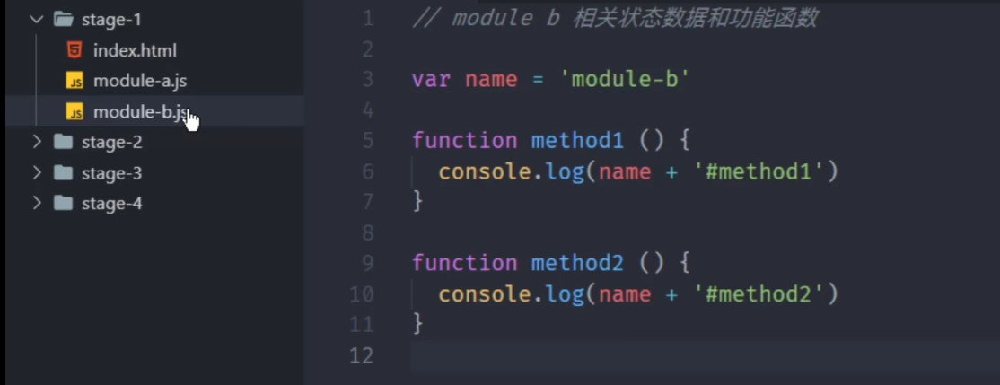

将不同功能的相关状态和数据存放到不同的文件当中，**约定，每一个单独的文件就是一个模块**,使用模块就是把模块引入到页面当中，使用就直接调用全局成员

- 所有的模块都在全局空间工作，没有私有空间，模块内部可以被外部直接修改**污染全局作用域**
- 模块一多，就会出现命名冲突
- 无法管理模块依赖关系

## Stage 2 - 命名空间方式

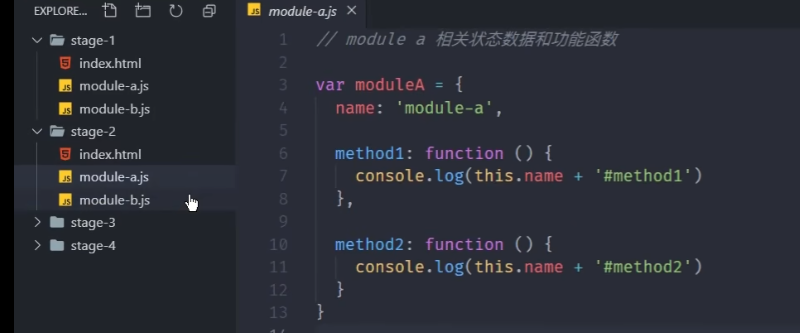

在阶段1的基础上，将每个模块包裹成全局对象的方式，有点类似于给模块内添加命名空间

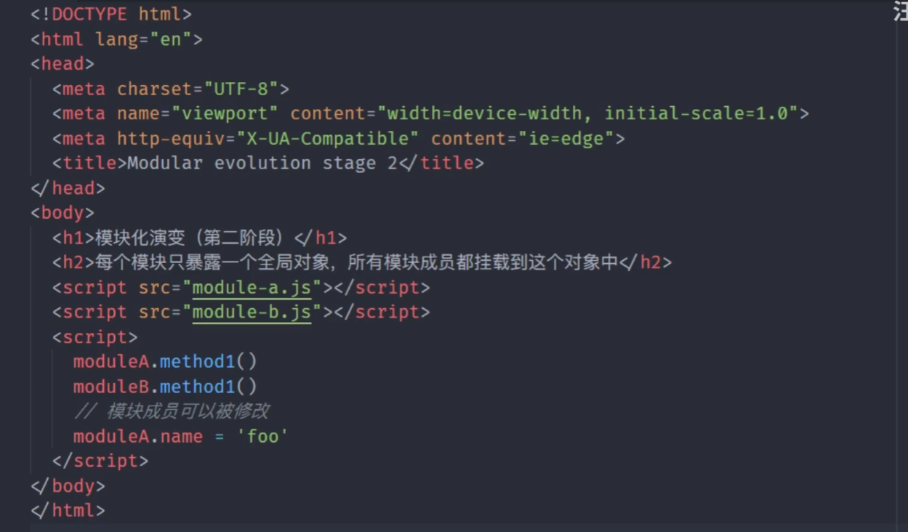

- 模块成员依然可以被外部修改
- 依赖关系依然混乱

## Stage 3 - IIFE立即执行函数

将模块的成员都放置在函数作用域中，需要暴露的成员挂载到全局对象上

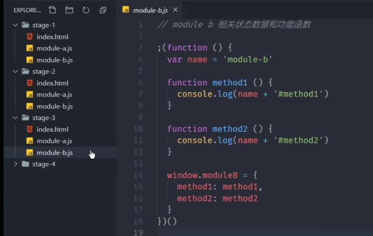

## Stage 4 - 模块化规范的出现

- 统一模块化的实现方式
- 之前的模块化都是需要script标签引入，手动控制，时间久了维护困难

为了解决上面的问题，就需要**模块化规范+模块加载器**

### 4.1 CommonJS

- 每一个文件就是一个模块
- 每个模块都有单独的作用域
- 通过`module.exports`导出成员
- 通过require函数载入模块

CommonJS是同步的方式加载代码，NodeJS的机制是启动时加载模块，运行时不需要加载，只会使用模块。在服务端使用没问题，但是在浏览器端，每次加载页面会导致大量同步模式请求出现。所以不采用CommonJS规范

### 4.2 AMD(Asynchronous Module Definition)

结合浏览器的特点出现了这个规范

同期还有`Require.js`库实现了AMD规范，规定

- 必须通过define来定义模块

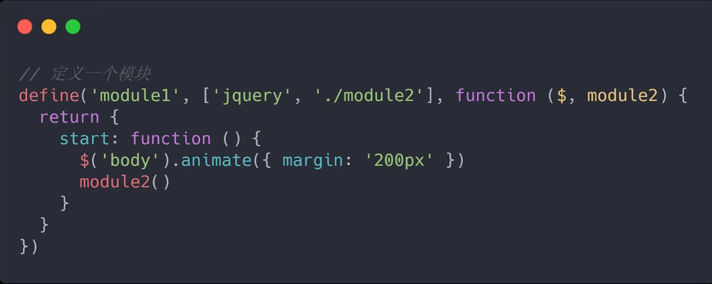

- 使用require来加载模块

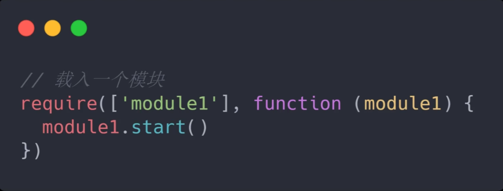

缺点是

- 需要用到大量的define、require函数，提高代码复杂度
- 如果代码模块划分细致，就会导致JS请求次数特别多，从而页面效率低下

所以AMD只是一个过渡方案，是个妥协产物

### 4.3 Sea.js + CMD(Common Module Definition)

淘宝官方推出的一个标准,类似于CommonJS，使用上和`Require.js`差不多，想法是使用CMD写出来的代码和CommonJS差不多，从而减少开发者学习成本，然后后来被`Require.js`给兼容了😂

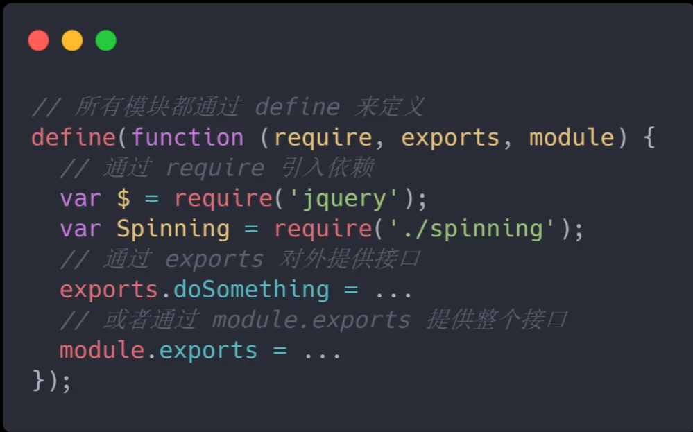

### 4.4 模块化的最佳实践方式

在浏览器中使用ESM,NodeJS环境使用CommonJS

> CommonJS in NodeJS 没问题，内置模块系统，直接使用
>
> ESM in Brower ESM在是ES6出现的


ES Module在语言层面实现了模块化

### 4.5 ES Module

#### 4.5.1 ES Module 特性

现在浏览器基本都支持ESM通过给script标签添加type = module属性，就可以用ESM的标准执行其中的JS代码，有如下特点

- ESM自动采用严格模式，忽略 `use strict`
- 每个ES Module都是运行在单独的私有作用域中
- ESM通过CORS的方式请求外部JS模块，也就是会触发跨域问题
- ESM的script标签会延迟执行脚本，相当于加了defer修饰符

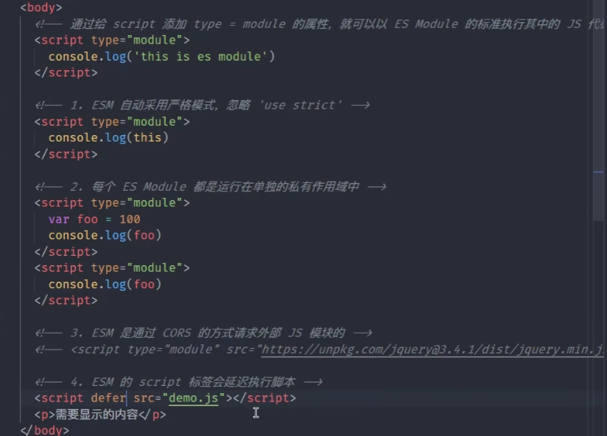

#### 4.5.2 ESM 导入导出

通过export导出，import导入

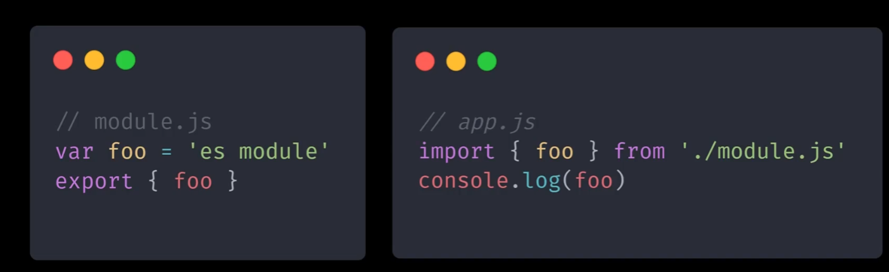

- 可以批量导出，通过固定语法export {内容}


- 也可以导出时重命名，使用as关键词


这样导入时就应该使用`fooName`来导入

```js
import {fooName} from './module.js'
```

- 当重命名为default时，导入也必须重命名

```js
export { name as default }
import {default as fooName} from './module.js'
```

```js
export default name
import fooName from './module.js'
```

#### 4.5.3 导入导出的注意事项⭐

1. **export {} / import {} 是固定用法，不是导入导出一个对象**

```js
let name = 'lsy'
var age = 18
export {name,age}

import {name,age} from './module.js'
```

**这是一个固定语法，并不是导出一个对象，并且导入也不是对对象的结构，而是固定语法！**就和声明函数之后用一个大括号包住代码块一样，就是个固定用法

如果想要导出一个对象，可以使用

```js
export default {name,age}
```

2. **import是对模块的一个只读引用**

所有对该模块的引用访问的都是同一块内存空间(不管是基础数据类型还是引用数据类型)。

并且是只读的，无法修改

```js
import {name} from './module.js'
name = 1 // 报错，无法修改
```

> 是因为ESM会开辟一块名为模块环境记录的内存空间用来实时绑定导出变量，模块环境记录中的数据是以const常量声明，无法修改值或改变内存地址。一旦导出文件修改导出变量，会删除模块环境记录中对应数据并重新生成新的常量

3. 使用import导入的路径名要完整，不能省略

```js
import {name} from './module' // 不能省略.js后缀
import {util} from './utils/index.js' // 在ESM原生环境，index.js也不能省略，CMJ环境可以省略，后期使用打包工具时可以省略
```

4. `./`也无法省略，省略的话，以字母开头，ESM会认为是在加载第三方模块

这一点与CMJ相同

```js
import {name} from 'module.js' // 被认为是在加载第三方模块
import {name} from '/test/module.js' // 也可以使用模块完整路径
import {name} from 'http://localhost:3000/test/module.js' // 也可以使用URL
```

5. 如果只是执行某个模块而不是引用某些值，可以直接引入

```js
import './module.js'
import {} from './module.js'
```

6. 也可以全体导入

必须别名

```js
import * as mod from './module.js'
console.log(mod.name)
```

7. import必须出现在代码最顶层
8. **全局import函数，动态导入模块**

有时候需要运行时才知道导入的模块，这时候需用import函数，返回一个promise

> 这是个函数！！只是和export/import的import同名而已！！！

```js
import('./module.js').then((module) => {
    
})
```

9. 模块同时有默认导出和批量导出

```js
export default hobby;
export {name,age}
```

```js
import {name,age,default as hobby} from './module.js'
// OR
import hobby,{name,age} from './module.js'
```

10. 直接导出导入的成员

用作一个跳板，常用，比如components里有一个index.js文件用来导出所有的组件，就不用一个一个再去找对应的组件文件再import

```js
export {name} from './module.js'
// 在内部无法使用name
```

例子:

```js
// c1.js
export default {
    name:'假装这是1号组件'
}
```

```js
// c2.js
export default {
    name:'假装这是2号组件'
}
```

```js
index.js
// c1.js
export {default as c1} from './c1.js' // 如果组件是默认导出，必须重命名，不然就会作为index.js的默认导出了
export {default as c2} from './c2.js'
```

### 4.6 ES Module in NodeJS⭐⭐

> 这是在NodeJS环境运行ESM，但是我们使用WebPack打包之后，并不是在NodeJS环境运行，是在浏览器环境运行
>
> 我们只是在NodeJS环境开发而不是直接运行js文件，开发的时候写了import/export语法而已

#### 4.6.1 简单使用

node8.5版本之后就实验特性的方式支持ESM，如果要在NodeJS中使用ESM，需要把js后缀改成mjs

```js
// index.mjs
import {foo,bar} from './module.mjs'
console.log(foo,bar);
```

```js
// module.mjs
export const foo = 'foo'
export const bar = 'bar'
```

之后使用命令`node --experimental-modules index.mjs`(好像现在直接node使用也行),正常使用了

也可以直接导入NodeJS原生模块或者部分第三方模块

```js
import fs from 'fs'
import {writeFileSync} from 'fs' // 也支持部分提取

import _ from 'lodash'
```

#### 4.6.2 ESM 和 CommonJS交互

1. ESM中可以导入CMJ模块

```js
//ESM.mjs
import mod from './commonjs.js' // 因为CMJ模块始终只导出一个默认成员，所以用默认导入方式
console.log(mod)
// { foo : 'commonjs values'}
```

```js
// commonjs.js
module.exports = {
    foo: 'commonjs values'
}
```

2. 在NodeJS环境，CMJ模块中不支持载入ESM
3. CMJ始终只会导出一个默认成员
4. 注意 import 不是解构导出对象

#### 4.6.3 ESM和CMJ使用差异

在ESM模块中没有CommonJS中的那些模块全局成员了

1. require/module/exports

使用import/export就可以了

2. `__filename`当前文件的绝对路径

使用import对象(注意不是导入语法，只是同名),通过`import.meta.url`可以得到当前文件的文件URL地址:`file:///d:/Ccode/MyProjet/JavaScript/m.mjs`

```js
import { fileURLToPath } from 'url';
console.log(import.meta.url); // file:///d:/Ccode/MyProjet/JavaScript/m.mjs
const __filename = fileURLToPath(import.meta.url);
console.log(__filename); // d:\Ccode\MyProjet\JavaScript\m.mjs
```

3. `__dirname`当前文件所在目录

```js
import { dirname } from 'path';
import { fileURLToPath } from 'url';
const __filename = fileURLToPath(import.meta.url);
const __dirname = dirname(__filename);
console.log(__dirname); // d:\Ccode\MyProjet\JavaScript 
```

#### 4.6.4 不使用MJS后缀⭐

在`package.json`文件中添加`"type": "module"`，所有的js文件就默认以ESM方式加载

这时候如果还想使用CommonJS模块加载文件，就需要把后缀名改成`.cjs`

### 4.7 Babel

把新版本的代码，编译成旧版本浏览器支持的代码

`pnpm add @babel/node @babel/core @babel/preset-env -D`

#### 4.7.1 简单介绍

babel是基于插件进行实现的，babel核心模块不会转化代码，对于具体特性代码，是基于插件来转换的

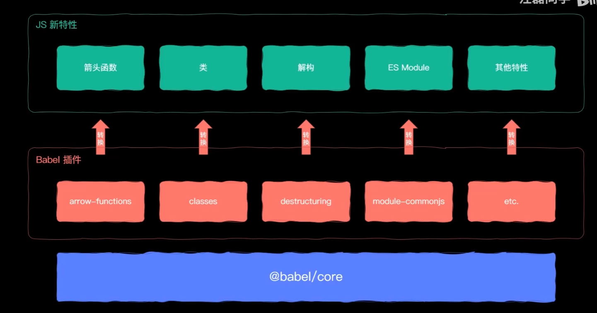

而安装的`@babel/preset-env`是一个插件的集合，包含了最新的JS版本当中的全部特性

可以新建一个`.babelrc`文件，里面设置好使用的插件集

```js
{
    "presets":["@babel/preset-env"]
}
```

> presets只是插件的集合，帮助我们整理好必要的插件而已，只要想要，可以自己一个个安装需要的插件。
>
> {
>
> ​	"plugins":[
>
> ​		"@babel/plugin-transform-modules-commonjs"
>
> ​	]
>
> }

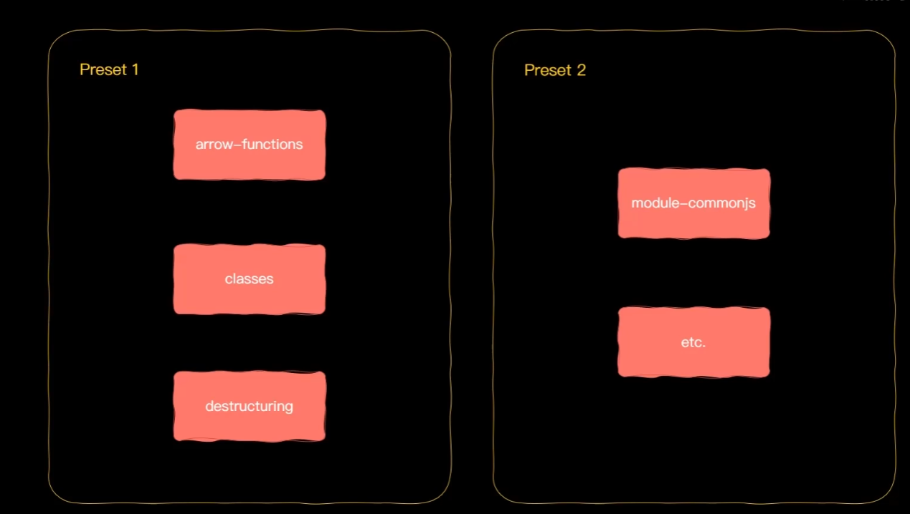

# 模块打包工具的由来

模块化很好的解决了代码开发过程中的组织问题，但是引入模块化，会出现新问题

1. ESM存在环境兼容问题
2. 模块文件较多，网络请求频繁
3. 所有前端资源都需要模块化

所以需要一种打包工具，可以让我们在开发阶段享受模块化带来的优势，又不用担心对生产环境产生的影响，下面是对这种打包工具的一些设想

1. 开发阶段使用的新特性代码转化为大多数环境都兼容的代码

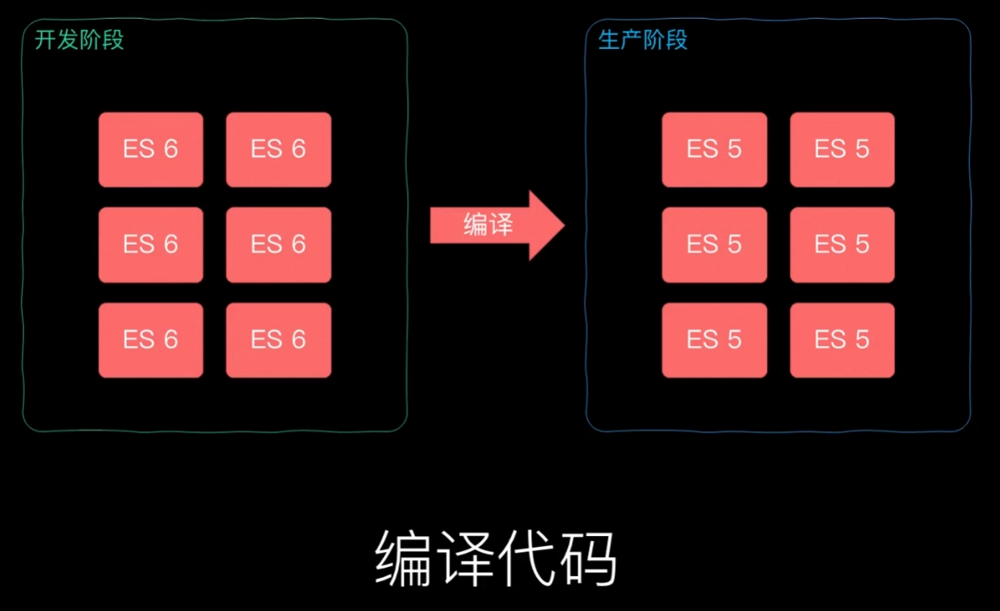

2. 可以将散落的模块打包在一起，解决浏览器频繁请求的问题

> 文件划分只是在开发阶段需要，帮助我们更好的组织代码，但对于运行环境就没有必要⭐

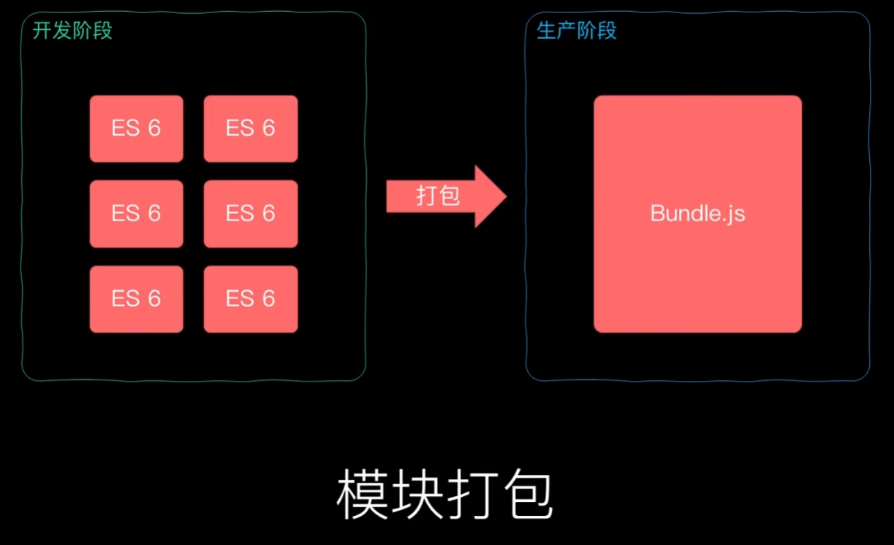

3. 支持不同种类的前端资源，把开发过程中的所有资源文件都当作模块，拥有一个统一的模块化管理方式(之前介绍的都只是局限于JS模块化方案)

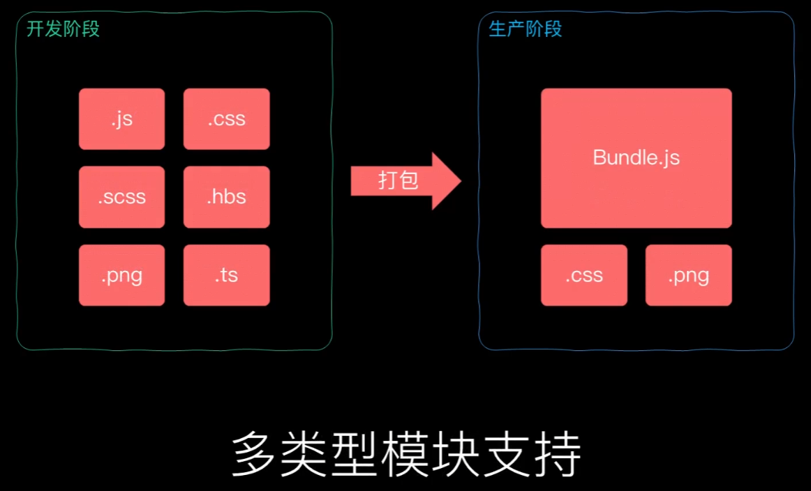

## WebPack

WebPack作为一个模块打包工具(Module bundler)可以将零散的代码打包到一个JS文件当中，对于那些有兼容性问题的代码，打包过程中通过模块加载器(Loader)对其进行编译转换，还具有代码拆分的能力(Code Splitting)，可以将应用初次运行时需要的必要代码打包在一起，其他的模块单独存放，在工作中实际需要某个模块，再异步加载，从而实现渐进加载或者增量加载。

WebPack支持在代码中以模块化方式(资源模块 Asset Module)载入任意资源文件。

打包工具解决的是前端整体的模块化，而不单指JavaScript模块化

loader是WebPack的核心，使用loader可以加载任何类型的资源

### file-loader和url-loader

图片的最佳实践是

- 小文件使用Data URLs，减少请求次数
- 大文件单独提取存放，提高加载速度

在`webpack.config.js中`

```js
modules.exports = {
    modules: {
        rules: [
            {
                test:/.png$/,
                use:{
                    loader:'url-loader',
                    options:{
                        limit: 10 * 1024 // 10KB,超过10KB会默认去调用file-loader，单位是字节
                    }
                }
                
            }
        ]
    }
}
```

需要两个loader都安装，因为url-loader超过这个限制就会去自动调用file-loader

### 常用的加载器分类

- 编译转换类

把资源模块转化为JS代码

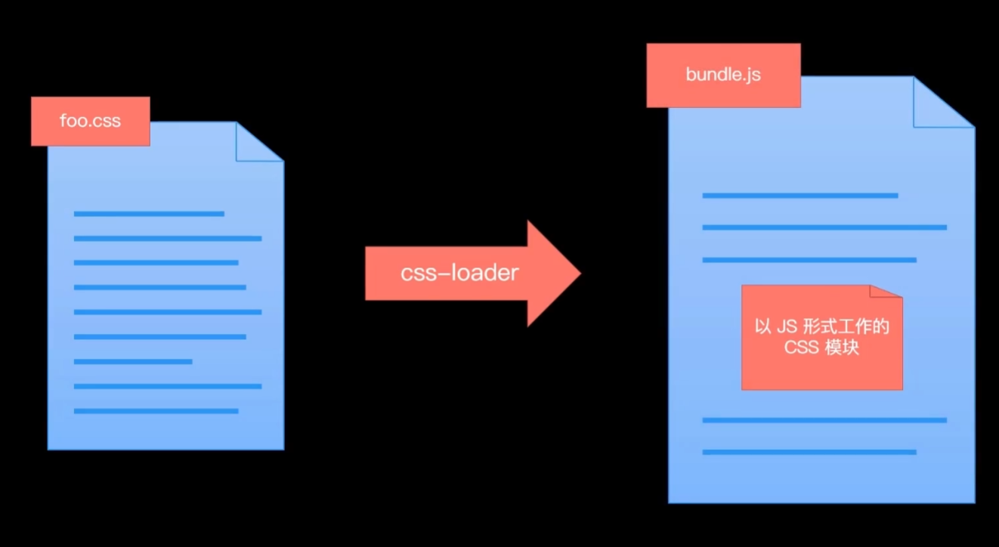

- 文件操作类

把文件拷贝到输出目录，并向外导出文件路径

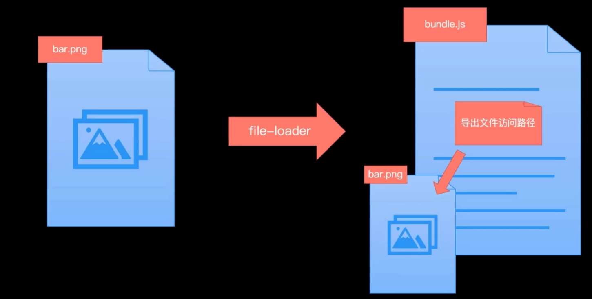

- 代码检查类

对代码风格进行校验，提高代码质量

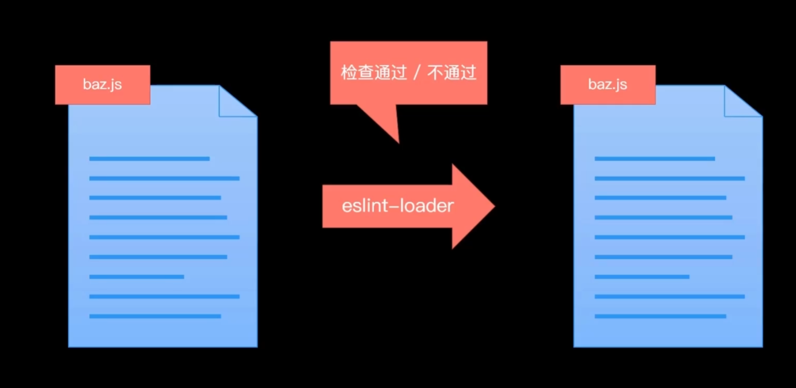

### WebPack与ES2015

- WebPack只是打包工具
- 加载器可以用来编译转化代码(特别是babel插件)

### WebPack与模块加载

import/export这么写只是触发了WebPack的模块加载，还有以下方式

- 遵循ES Module标准的import声明
- 遵循CommonJS标准的require函数

> ```
> const createHeading = require('./heading.js').default
> const icon = require('./icon.png')
> require('./main.css')
> ```

- 遵循AMD标准的define函数和require函数

- Loader加载的非JS也会触发资源加载
  - 样式代码中的@import指令和url函数
  - HTML代码中图片属性的src属性

### Loader⭐⭐

WebPack允许多段loader，但是loader的最终结果一定是JS代码(字符串类型的，最后会拼接到最终打包的js文件中)


- Loader负责资源文件从输入到输出的转换
- WebPack中对于同一个资源可以依次使用多个loader(注意，在rules中要倒序着写)

### 插件机制⭐⭐

Loader专注实现资源模块的加载，实现整体项目的打包，而**插件Plugin解决其他自动化功能，增强WebPack自动化能力**，例如在打包前清除上一次打包的结果，拷贝资源文件到打包目录(在最后的生产打包时再使用，开发使用dev开发服务器)，压缩输出代码

大多数插件导出的都是一个构造函数，需要在Plugin属性中创建一个实例对象

- 自动清除上次的打包结果`clean-webpack-plugin`

```js
const {CleanWebPackPlugin} = require('clean-webpack-plugin');
module.exports = {
    plugins:[
        new CleanWebPackPlugin()
    ]
}
```

- 拷贝资源文件到打包目录

```js
const CopyWebPackPlugin = require('copy-webpack-plugin');
module.exports = {
    plugins:[
        new CopyWebPackPlugin(['public']) //把public目录中的文件一并拷贝到输出目录
    ]
}
```

#### 自定义插件

插件的工作范围更广，几乎包含整个WebPack工作周期，实现起来是通过**钩子机制**，通过在生命周期的钩子中挂载函数实现拓展

WebPack规定插件必须是一个函数或者是一个包含apply方法的对象

这里实现一个去除打包的文件的注释符的插件

```js
class MyPlugin {
    apply(compiler) {
        compiler.hooks.emit.tap('MyPlugin', compilation => { // 挂载到emit钩子上
            for (const name in compilation.assets) { // 每一个name是打包之后的文件名
                if (name.endsWith('.js')) {
                    const contents = compilation.assets[name].source() // 获取具体文件内容
                    const withoutComments = contents.replace(/\/\*\*+\*\//g, '')
                    compilation.assets[name] = { // 覆盖内容
                        source: () => withoutComments, // 必须
                        size: () => withoutComments.length // 必须
                    }
                }
            }
        }
    }
}
```

### `webpack-web-server`

可以在`webpack.config.js`中添加contentBase,直接运行服务器会把打包后的结果直接放到内存中，`contentBase`可以额外为开发服务器指定查找资源目录

```js
module.exports = {
    devServer:{
        contentBase: './public' // ['./public','./static']
    }
}
```

### 接口代理

```js
module.exports = {
	proxy:{
        './api' :{
            // http://localhost:8080/api/users -> https://api.github.com/api/users
            target:'https://api.github.com',
            // http://localhost:8080/api/users -> https://api.github.com/users
            pathRewirte: {
                '^/api':""
            }
            // 不能使用localhost:8080 作为请求 Github 的主机名，可以修改host请求头属性为target
            changeOrigin: true,
        }
    }
}
```

### Source Map

源代码地图，用来映射源代码和转换过后的代码之间的关系，Source Map解决了源代码和运行代码不一致所产生的问题


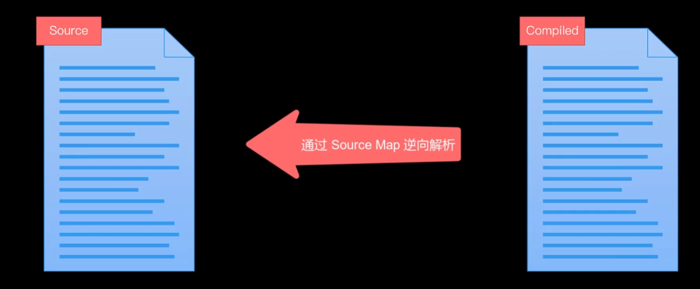

#### 十二种模式

```js
module.exports = {
	devtool:'source-map'
}
```

- eval - 是否使用eval执行模块代码
- cheap - Source Map 是否包含行信息
- module - 是否能够得到 Loader 处理之前的源代码

> 开发环境选择 `cheap-module-eval-source-map`
>
> - 使用框架之后，经过Loader转换过后差异较大
> - 首次打包速度慢无所谓，重写打包相对较快
>
> 生产环境选择 `none`
>
> - Source Map会暴露源代码

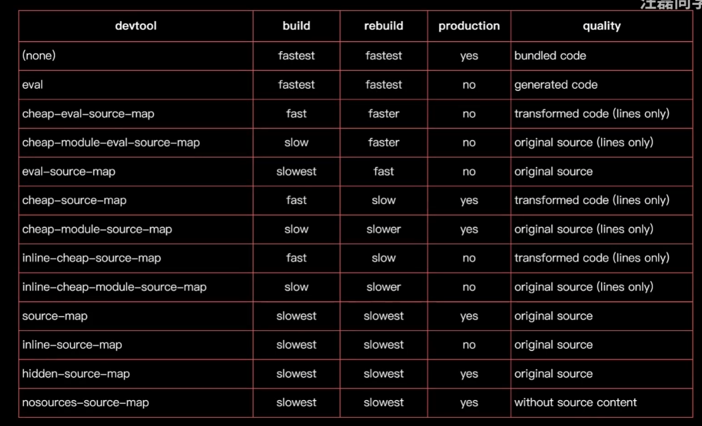

### 开发服务器自动刷新问题-HMR⭐⭐

使用`webpack-web-server`每次更新会导致页面刷新，丢失页面状态。可以使用HRM(Hot Module Replacement 模块热替换/热更新)，指的是应用运行中实时的替换某个模块，而应用运行状态不受影响。热替换只将修改的模块实时替换至应用中

两种开启方式

1. `webpack-dev-server --hot`
2. 在配置文件中修改,并添加一个插件

```js
const webpack = require('webpack')
module.exports = {
	devServer:{
        hot:true
    }
    plugins:[
    	new webpack.HotModuleReplacementPlugin()
    ]
}
```

**但是，这么配置完之后并不能做到JS的自动热替换**，因为WebPack中的HMR并不可以开箱即用，需要手动处理模块热替换逻辑

- 样式文件可以热更新开箱即用：是因为样式文件是使用Loader处理的，style-loader中已经处理了样式的热更新
- JS模块相对于样式文件没有规律可言,WebPack不知道以什么逻辑来进行热替换，无法提供一个通用的更新方案
- 框架脚手架可以热更新是因为框架开发，每个文件都是有规律的，内部已经提供了HMR方案

总之，我们需要手动处理JS模块更新后的热替换

### 不同环境的配置

- 配置文件根据不同的环境导出不同配置(适用于中小型项目)

```js
module.exports = (env,argv) => {
    // env  传递的环境名参数
    // argv 传递的所有参数
    const config = {一堆配置项}
    // pnpm webpack --env production
    if(env === 'production') {
        config.mode = 'production'
        config.devtool = falst
        config.plugins = [
            ...config.plugins,
            new CleanWebpackPlugin(),
            new CopyWebPlugin(['public'])
        ]
    }
}
```

- 一个环境对应一个配置文件

一般有三个文件：开发环境配置文件、生产环境配置文件、两者公共部分配置文件


通过`webpack-merge`第三方库函数来进行配置文件的合并

```js
// webpack.prod.js
const common = require('./webpack.common')
const merge = require('webpack-merge')
const {CleanWebpackPlugin} = require('clean-webpack-plugin')
const CopyWebpackPlugin = require('copy-webpack-plugin')
modeule.exports = merge(common,{
    mode:'production',
    plugins:[
        new CleanWebpackPlugin(),
        new CopyWebpackPlugin(['public'])
    ]
})
// pnpm webpack --config webpack.prod.js
```

### DefinePlugin

**这个插件为代码注入全局成员**，例如，这个插件在production的模式下会默认启用，为全局注入一个`process.env.NODE_ENV`，方便第三方插件判断是否打印日志等操作

```js
const webpack = require('webpack')
module.exports = {
    plugins:[
        new webpack.DefinePlugin({ // 内部的键值对会被注入到全部的代码中
            name:'"LSY"' // 正确用法是值为一段JS代码
        })
    ]
}
```

### Tree Shaking

删除未引用代码(dead-code),在生产模式会自动开启，它不是某个具体的选项，而是一组功能搭配使用后的优化效果

#### Tree Shaking&Babel

Tree Shaking的前提是使用ESM，也就是说由WebPack打包的代码必须使用ESM

babel-loader为了兼容很特性，可能会将ES Module转化为CommonJS，因此会导致Tree Shaking不生效

但是现在高版本的babel-loader中会自动关闭ESM转化为CMJ的插件

### 代码分割

因为项目代码最后都会被打包在一起，但并不是所有的模块都在启动时都是必要的，请求一个模块就需要将所有模块都引入。

合理方案是将模块分离到多个文件中，按需加载，两种方案

- 多入口打包
- 动态导入

#### 多入口打包

一般应用于多页应用程序，一个页面对应一个打包入口，页面公共部分再单独提取

```js
module.exports = {
    entry:{ // 配置为数组是将多个对象打包成一个对象
        index:'./src/index.js',
        second:'./src/second.js'
    },
    output:{
        filename:'[name].bundle.js'
    }，
    plugins:[
        new HtmlWebpackPlugin({
            title:'Multi Entry',
            template:'./src/index.html',
            filename:'index.html',
            chunks:['index']
        }),
            new HtmlWebpackPlugin({
            title:'Multi Entry',
            template:'./src/second.html',
            filename:'second.html',
            chunks:['second']
		})
    ]，
    optimization:{
        splitChunks:{
            chunks:'all' // 将所有的公共模块都提取到一个文件当中
        }
    }
}
```

#### 动态导入

运行需要某个模块时，再去加载这个模块，动态导入的模块会被自动分包

```js
import('./post.js').then(({default:post}) => {
    ....
})
```

vue-router中就可以使用这种操作

##### 魔法注释

可以再import中使用注释，给分包后的代码起名

```js
import(/* webpackChunkName: 'posts' */ './post.js').then(({default:post}) => { // 相同chunkname的最终会打包在一起
    ....
})
```

#### CSS文件按需加载

`MinissExtractPlugin`库提取CSS文件，实现CSS文件的按需加载，最后通过link引入CSS文件

> 根据经验，CSS文件如果超过了150KB，才需要提取到单独文件当中，否则优化效果适得其反

```js
const MiniCssExtractPlugin = require('mini-css-extract-plugin');
module.exports = {
    module:{
        rules:[
            {
                test:/\.css$/i,
                use:[
                    //'style-loader', // 将样式通过style 标签注入
                    MiniCssExtractPlugin.loader,
                    'css-loader'
                ]
            }
        ]
    },
    plugins:[
        new MiniCssExtractPlugin()
    ]
}
```

#### CSS压缩

使用`optimize-css-assets-webpack-plugin`来压缩样式文件

```js
const optimizeCssAssetsWebpackPlugin = require('optimize-css-assets-webpack-plugin');
const TerserWebpackPlugin = require('terser-webpack-plugin');
module.exports = {
    module:{
        rules:[
            {
                test:/\.css$/i,
                use:[
                    //'style-loader', // 将样式通过style 标签注入
                    MiniCssExtractPlugin.loader,
                    'css-loader'
                ]
            }
        ]
    },
    optimization:{
        minimizer:[
          new optimizeCssAssetsWebpackPlugin(), // 压缩类的插件建议放到minimizer中统一控制
          new TerserWebpackPlugin() // 开启这个选项，webpack认为我们手动接管代码压缩，需要把JS压缩也开一下
        ]
    }
//    plugins:[
//        new optimizeCssAssetsWebpackPlugin()
//    ]
}
```

### 打包名称哈希

部署前端资源会部署资源缓存，文件名使用哈希可以更新的时候重新请求，防止缓存导致更新不及时

- 普通hash，一个改变，全体改变

```js
module.exports = {
    output:{
        filename: '[name]-[hash].bundle.js' // 还支持hash:8 来指定hash长度
    }
}
```

- chunkhash 同一chuck拥有统一hash值

- contenthash 文件级别的hash，不同文件有不同的hash值

> chunk是WebPack内部构建过程中的一个概念，译为块，表示通过某个入口找到的所有依赖的统称。
