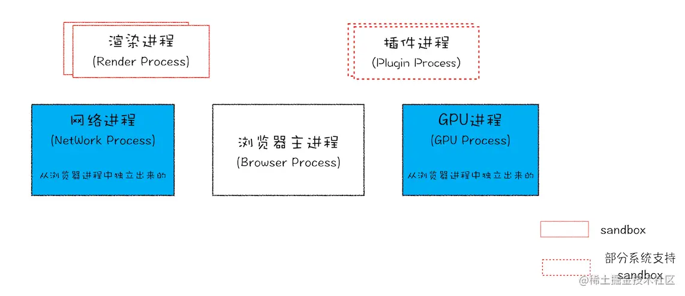

# 1.JS的预解析

当HTML解析器遇到Script标签时，因为觉得Script内的脚本可能会修改DOM，所以会停止文档的解析，脚本执行完成之后才会继续解析后续的内容。如果script标签是引用类型，那么会让网络进程去下载这段代码，并且在下载过程中，也会让HTML解析器停止解析。

而且因为下载的过程因为网络的原因可能会非常长，所以chrome会做一个优化：**预解析操作**

渲染引擎一开始收到字节流的时候，会先开启一个预解析线程，用来查找HTML文件中有关JS和CSS文件，解析到相关文件之后，预解析线程会提前进行下载

# 2.浏览器进程

**Chrome浏览器的架构图**：  从图中可以看出，最新的 Chrome 浏览器包括：

- 1 个浏览器主进程
- 1 个 GPU 进程
- 1 个网络进程
- 多个渲染进程
- 多个插件进程

这些进程的功能：

- **浏览器进程**：主要负责界面显示、用户交互、子进程管理，同时提供存储等功能。
- **渲染进程**：核心任务是将 HTML、CSS 和 JavaScript 转换为用户可以与之交互的网页，排版引擎 Blink 和 JavaScript 引擎 V8 都是运行在该进程中，默认情况下，Chrome 会为每个 Tab 标签创建一个渲染进程。出于安全考虑，渲染进程都是运行在沙箱模式下。
- **GPU 进程**：其实， GPU 的使用初衷是为了实现 3D CSS 的效果，只是随后网页、Chrome 的 UI 界面都选择采用 GPU 来绘制，这使得 GPU 成为浏览器普遍的需求。最后，Chrome 在其多进程架构上也引入了 GPU 进程。主要用来绘制网页和UI界面
- **网络进程**：主要负责页面的网络资源加载，之前是作为一个模块运行在浏览器进程里面的，直至最近才独立出来，成为一个单独的进程。
- **插件进程**：主要是负责插件的运行，因插件易崩溃，所以需要通过插件进程来隔离，以保证插件进程崩溃不会对浏览器和页面造成影响。

所以，**打开一个网页，最少需要四个进程**：1 个网络进程、1 个浏览器进程、1 个 GPU 进程以及 1 个渲染进程。如果打开的页面有运行插件的话，还需要再加上 1 个插件进程。

虽然多进程模型提升了浏览器的稳定性、流畅性和安全性，但同样不可避免地带来了一些问题：

- **更高的资源占用**：因为每个进程都会包含公共基础结构的副本（如 JavaScript 运行环境），这就意味着浏览器会消耗更多的内存资源。
- **更复杂的体系架构**：浏览器各模块之间耦合性高、扩展性差等问题，会导致现在的架构已经很难适应新的需求了。

> 在Chrome出现之前，多数浏览器都是单进程，浏览器所有的功能模块都是在同一进程中运行，通过不同线程进行工作。这样做带来的第一个问题就是不稳定，一个线程崩溃，整个进程都崩溃。第二个问题容易造成卡顿，因为所有的页面都在一个进程中操作，一个页面卡住了，整个浏览器页面都会卡住。第三点会造成内存泄漏问题，所有的页面都在一个进程中，单个页面如果代码编写有问题，导致了内存泄漏，要么页面就算关闭了，也会越用越卡。
>
> 此外，在单进程浏览器中，插件和渲染线程具有很高的权限，如果有恶意插件或者网页，就很有权限来读写本地数据，造成安全问题。
>
> Chrome就采用了多进程架构,每个页面有单独的渲染进程和插件进程,且都放置在隔离沙箱中,有关的权限问题都交给浏览器主线程进行操作.不同进程之间通过进程通信来传输数据
>
> 

