# 一、OSI七层网络模型

> 取自[小满zs](https://juejin.cn/post/7228893159069548599)[XiaoYu](https://juejin.cn/post/7229730143214895163)

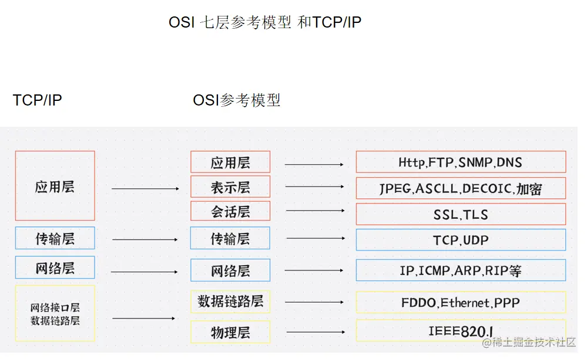

## 起源

OSI（Open Systems Interconnection）七层模型，即开放系统互联参考模型，起源于20世纪70年代和80年代。当时，随着计算机网络技术的发展和普及，不同厂商生产的计算机和网络设备之间的互操作性成为一个关键问题。为了解决这个问题，国际标准化组织（ISO）开始研究如何将各种网络设备和协议统一为一个标准框架。

1977年，国际标准化组织（ISO）成立了一项工作小组，负责研究网络互操作性的标准。1978年，ISO与国际电报电话咨询委员会（CCITT，现已成为国际电信联盟ITU的一部分）共同发布了第一版的OSI参考模型。经过数年的研究、讨论和完善，1984年，ISO正式发布了OSI七层参考模型的标准。

OSI七层模型的目的是将复杂的网络通信问题划分为更小、更容易管理的部分。它将通信过程分为七个抽象层次，从底层到顶层分别为：物理层、数据链路层、网络层、传输层、会话层、表示层和应用层。每一层都有特定的功能和职责，相互协作以实现端到端的通信。这种分层的架构使得不同层次的技术和协议能够独立地发展和更新，同时保持整个系统的互操作性。

尽管OSI七层模型在理论上得到了广泛的认可和应用，但在实际的网络实现中，它并没有得到广泛的采用。TCP/IP协议族，最早由美国国防部高级研究计划署（DARPA）在20世纪70年代开发，成为了互联网的基石。TCP/IP模型采用了一个更简化的四层架构，即：链路层、网络层、传输层和应用层。

就算如此，OSI七层模型仍然是计算机网络领域的重要**理论基础**。它有助于理解不同协议和设备如何相互协作，并为网络故障排查、性能优化等提供了有用的参考框架。

> OSI只是参考模型，具体实施还是使用TCP/IP模型

## OSI七层参考模型

1. 物理层：负责传输比特流（0和1），处理物理连接、电气特性、光缆连接等。
2. 数据链路层：负责在物理层的基础上建立数据链路，实现数据包的组织和传输，包括错误检测和流量控制。
3. 网络层：负责为数据包选择最佳路径，实现不同网络之间的通信，例如IP协议。
4. 传输层：负责端到端的通信，提供数据包的传输和错误控制，例如TCP和UDP协议。
5. 会话层：负责建立、维护和断开连接（会话）。
6. 表示层：负责数据格式转换、加密解密和压缩解压缩等功能。
7. 应用层：负责为应用程序提供网络服务，例如HTTP、FTP、SMTP等协议。

## TCP/IP模型

1. 链路层（对应OSI模型的物理层和数据链路层）：负责将数据帧在网络设备之间进行传输，处理物理地址（如MAC地址）。

- 链路层在某些情况下会被拆分为两个子层：**数据链路层和物理层**。这种拆分是为了更好地描述网络设备之间的连接和通信过程。在这种拆分下，TCP/IP模型变为五层模型
- 这种拆分在某些资料和书籍中被称为五层模型。无论是四层TCP/IP模型还是五层模型，它们的核心目的都是描述计算机网络中各个层次的功能和通信协议。不同的模型强调不同的方面，但它们都有助于更好地理解和设计计算机网络

2. 网络层（对应OSI模型的网络层）：负责将数据包在不同网络之间进行传输，处理逻辑地址（如IP地址），例如IP协议。

3. 传输层（对应OSI模型的传输层）：负责端到端的通信，提供数据包的传输和错误控制，例如TCP和UDP协议。

4. 应用层（对应OSI模型的会话层、表示层和应用层）：负责为应用程序提供网络服务，例如HTTP、FTP、SMTP等协议。

## 物理层

- 物理层直接与物理介质打交道
- 物理层的设备：网卡、网线、集线器、中继器、调制解调器
- 物理层信道(物理通信) **最重要**

物理层是网络模型中的最底层，**它负责在网络设备之间实现比特流(0/1)的传输**.物理层主要关注的是物理连接、电气特性、信号传输等方面的问题，在物理层，数据是以比特流的方式在网络设备之间传输，不涉及具体的协议和数据的组织形式。

物理层的主要功能包括：

1. 机械特性：网络设备连接时的物理接口标准，如连接器的形状、尺寸、引脚数量等
2. 电气特性：网络设备之间传输信号所使用的电压和电流范围等电气参数
3. 功能特性：物理连接的建立、维护和断开等功能
4. 规程特性：物理层按照特定顺序执行的操作过程，包括比特流的发送和接收
5. 信号传输：物理层需要确定如何在传输介质上进行信号的传输，包括信号的编码、调制等

**物理层并不关心数据的具体内容，而是关注如何在不同设备之间传输比特流，在实际应用中，物理层涉及的技术和标准有很多，如以太网、光纤、WIFI等。**这些技术和标准定义了不同类型的网络设备如何在物理层上进行通信。

### 信道分类

1. 有线信道-明线

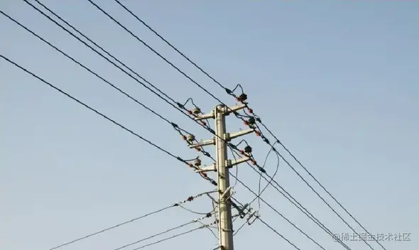

明线是电线杆上的架空线路，本身是导电裸线或者带绝缘层的导线，传输损耗低，但是易受天气和环境的影响，现在已经被电缆取代。

2. 有线信道-对称电缆

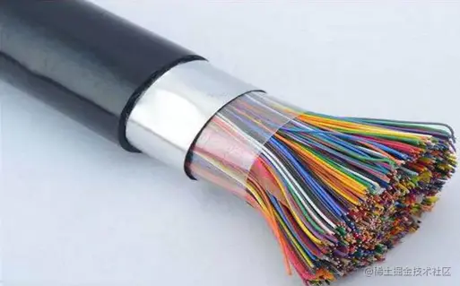

对称电缆（Twisted Pair Cable）：由一对或多对绝缘导线组成，每对导线以一定的间距紧密地绕在一起，形成双绞线。绞线的目的是减少电磁干扰和串扰。对称电缆分为屏蔽双绞线（Shielded Twisted Pair, STP）和非屏蔽双绞线（Unshielded Twisted Pair, UTP）。对称电缆被广泛应用于计算机网络，如以太网。

2. 有线信号-同轴电缆

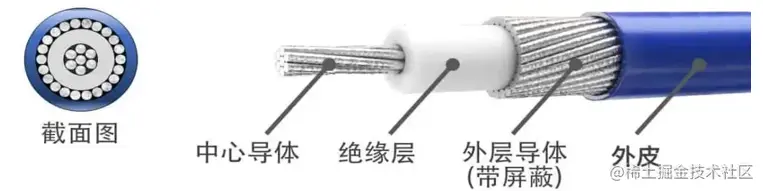

同轴电缆（Coaxial Cable）：由一个中心导体（通常是铜线）和一个外部导体组成，外部导体通常是一个金属屏蔽层，用于保护内部导体免受外部干扰。两个导体之间由一层绝缘材料隔开，以保持它们之间的距离恒定。同轴电缆的特点是具有较大的带宽、低信号损耗和良好的抗干扰性能，广泛应用于电视广播系统、长途电话传输系统等。

2. 有线信道-光纤
3. 无线信道-无线电波 

# 1.get和post区别

> [CSDN](https://blog.csdn.net/qq_42931285/article/details/119852294)

1.get请求一般是去取获取数据（其实也可以提交，但常见的是获取数据）；post请求一般是去提交数据。

2.get因为参数会放在url中，所以隐私性，安全性较差，请求的数据长度是有限制的，不同的浏览器和服务器不同，一般限制在 2~8K 之间，更加常见的是 1k 以内；post请求是没有的长度限制，请求数据是放在body中；

3.get请求刷新服务器或者回退没有影响，post请求回退时会重新提交数据请求。

4.get请求可以被缓存，post请求不会被缓存。

5.get请求会被保存在浏览器历史记录当中，post不会。get请求可以被收藏为书签，因为参数就是url中，但post不能。它的参数不在url中。

6.get请求只能进行url编码（appliacation-x-www-form-urlencoded）,post请求支持多种（multipart/form-data等）。

深入理解

1. GET 和 POST都是http请求方式， 底层都是 TCP/IP协议；通常GET 产生一个 TCP 数据包；POST 产生两个 TCP 数据包（但firefox是发送一个数据包），

2.对于 GET 方式的请求，浏览器会把 http header 和 data 一并发送出去，服务器响应 200
（返回数据）表示成功；而对于 POST，浏览器先发送 header，服务器响应 100， 浏览器再继续发送 data，服
务器响应 200 （返回数据）。

# 2.TCP三次握手

> seq(sequence number) 随机产生的序列号
>
> ack(acknowledement number) 确认好 ack = 对方的seq + 1
>
> ACK(acknowledgement) 确认序列号有效
>
> SYN(synchronous)发起新连接

- **第一次握手：** 客户端向服务端发送连接请求报文段。该报文段中包含自身的数据通讯初始序号。请求发送后，客户端便进入 SYN-SENT 状态。

- **第二次握手：** 服务端收到连接请求报文段后，如果同意连接，则会发送一个应答，该应答中也会包含自身的数据通讯初始序号，发送完成后便进入 SYN-RECEIVED 状态。

- **第三次握手：** 当客户端收到连接同意的应答后，还要向服务端发送一个确认报文。客户端发完这个报文段后便进入 ESTABLISHED 状态，服务端收到这个应答后也进入 ESTABLISHED 状态，此时连接建立成功。

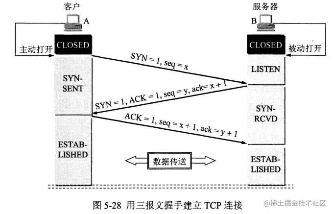

## 具体来说

- 第一次握手：客户端发送一个SYN报文,并携带随机生成的初始序列号，随后客户端进行SYN_SENT状态

> 首部的同步位SYN=1，初始序号seq=x，SYN=1的报文段不能携带数据，但要消耗掉一个序号。

- 第二次握手：服务器收到客户端的SYN报文之后，会以SYN+ACK报文回应，携带自己的序列号，和确认号ack，值为客户端序列号+1。表示接受客户端的SYN报文，此时服务器处于SYN_RCVD状态

> 在确认报文段中SYN=1，ACK=1，确认号ack=x+1，初始序号seq=y

- 第三次握手：客户端收到SYN报文之后，回复一个ACK报文。携带序列号，值为初始序列号+1,还有ack确定号，值为服务端序列号+1。发送完客户端进入ESTAB-LISHED状态，服务器接收到ACK报文后，同样进入ESTAB-LISHED状态，建立好连接。

> 确认报文段ACK=1，确认号ack=y+1，序号seq=x+1（初始为seq=x，第二个报文段所以要+1），ACK报文段可以携带数据，不携带数据则不消耗序号。

除了第一次握手和第二次握手的seq是随机数，之后的seq都等于之前的一次响应的ack

三次握手过程中ack都等于上一次响应的seq+1，三次握手之后的ack等于上一次相应的seq+len

## TCP二次握手是否可以

三次握手可以理解为了客户端和服务器互相确认对方的发送和接收能力。如果是两次握手，可以确定服务器的发送和接收能力，但只能确定客户端的发送能力，无法确认其接收能力。另外，如果是两次握手的话，可能会因为网络阻塞等原因会发送多个请求报文，延时到达的请求又会与服务器建立连接，浪费服务器的资源。

# 3.TCP四次挥手

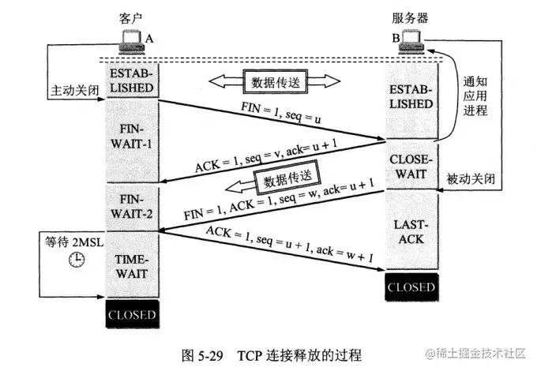

**第一次挥手：** 若客户端认为数据发送完成，则它需要向服务端发送连接释放请求。

**第二次挥手**：服务端收到连接释放请求后，会告诉应用层要释放 TCP 链接。然后会发送 ACK 包，并进入 CLOSE_WAIT 状态，此时表明客户端到服务端的连接已经释放，不再接收客户端发的数据了。但是因为 TCP 连接是双向的，所以服务端仍旧可以发送数据给客户端。

**第三次挥手**：服务端如果此时还有没发完的数据会继续发送，完毕后会向客户端发送连接释放请求，然后服务端便进入 LAST-ACK 状态。

**第四次挥手：** 客户端收到释放请求后，向服务端发送确认应答，此时客户端进入 TIME-WAIT 状态。该状态会持续 2MSL（最大段生存期，指报文段在网络中生存的时间，超时会被抛弃） 时间，若该时间段内没有服务端的重发请求的话，就进入 CLOSED 状态。当服务端收到确认应答后，也便进入 CLOSED 状态。

TCP 使用四次挥手的原因是因为 TCP 的连接是全双工的，所以需要双方分别释放到对方的连接，单独一方的连接释放，只代表不能再向对方发送数据，连接处于的是半释放的状态。

**最后客户端会进入2MSL的超时等待状态是为了防止发送给服务器的确认报文段丢失或者出错，从而导致服务器 端不能正常关闭。**

## 具体来说

- 第一次挥手： 客户端会发送一个 FIN 报文，报文中会指定一个序列号。此时客户端处于 FIN_WAIT1 状态。

> 即发出连接释放报文段（FIN=1，序号seq=u），并停止再发送数据，主动关闭TCP连接，进入FIN_WAIT1（终止等待1）状态，等待服务端的确认。

- 第二次挥手：服务端收到 FIN 之后，会发送 ACK 报文，且把客户端的序列号值 +1 作为 ACK 报文的序列号值，表明已经收到客户端的报文了，此时服务端处于 CLOSE_WAIT 状态。

> 即服务端收到连接释放报文段后即发出确认报文段（ACK=1，确认号ack=u+1，序号seq=v），服务端进入CLOSE_WAIT（关闭等待）状态，此时的TCP处于半关闭状态，客户端到服务端的连接释放。客户端收到服务端的确认后，进入FIN_WAIT2（终止等待2）状态，等待服务端发出的连接释放报文段。

- 第三次挥手：如果服务端也想断开连接了，和客户端的第一次挥手一样，发给 FIN 报文，且指定一个序列号。此时服务端处于 LAST_ACK 的状态。

> 即服务端没有要向客户端发出的数据，服务端发出连接释放报文段（FIN=1，ACK=1，序号seq=w，确认号ack=u+1），服务端进入LAST_ACK（最后确认）状态，等待客户端的确认。

- 第四次挥手：客户端收到 FIN 之后，一样发送一个 ACK 报文作为应答，且把服务端的序列号值 +1 作为自己 ACK 报文的序列号值，此时客户端处于 TIME_WAIT 状态。需要过一阵子以确保服务端收到自己的 ACK 报文之后才会进入 CLOSED 状态，服务端收到 ACK 报文之后，就处于关闭连接了，处于 CLOSED 状态。

> 即客户端收到服务端的连接释放报文段后，对此发出确认报文段（ACK=1，seq=u+1，ack=w+1），客户端进入TIME_WAIT（时间等待）状态。此时TCP未释放掉，需要经过时间等待计时器设置的时间2MSL后，客户端才进入CLOSED状态。

## 为什么需要四次握手

因为当服务端收到客户端的SYN连接请求报文后，可以直接发送SYN+ACK报文。其中ACK报文是用来应答的，SYN报文是用来同步的。但是关闭连接时，当服务端收到FIN报文时，很可能并不会立即关闭SOCKET，所以只能先回复一个ACK报文，告诉客户端，“你发的FIN报文我收到了”。只有等到我服务端所有的报文都发送完了，我才能发送FIN报文，因此不能一起发送，故需要四次挥手。

# 4.DNS

# 5.输入URL发生了什么

# 6.TCP和UDP对比

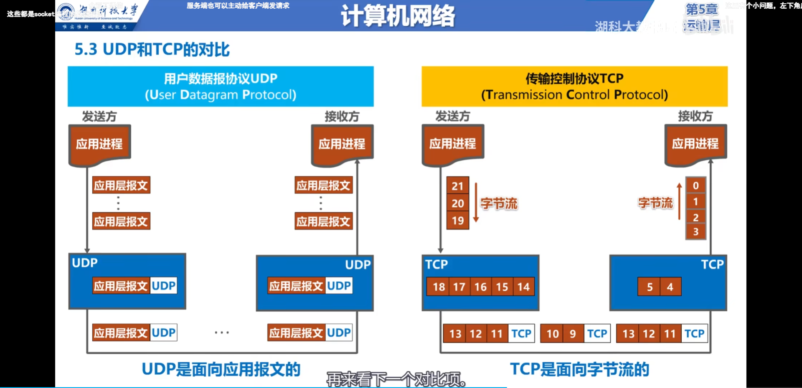

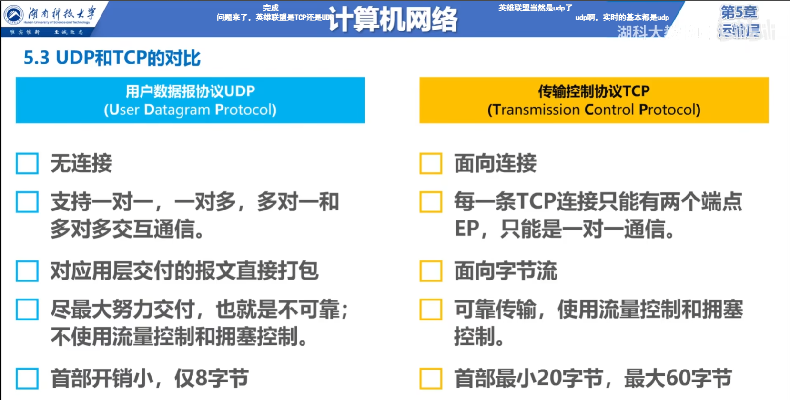

# 7.缓存

> 在HTTP规定中并没有强缓存和如弱缓存的概念，只是程序员方便记忆构建出来的
>
> 所谓的缓存是浏览器根据不同的报文字段做出不同的缓存动作
>
> 浏览器先检查强缓存再检查协商缓存，如果本地资源经过强缓存检查之后是有效的，那么直接使用本地缓存，连请求都不会发

- 强制缓存:就是给资源设置一个过期时间，每次请求资源都会看是否过期，只有过期了才会去访问服务器
  - Cache-Control:max-age
  - Expires
- 协商缓存:浏览器和服务器确定缓存资源是否可用
  - etag / if-none-match
  - last-modified / if-modified-since
  - 或者Cache-Control设置了no-cache

1. **Expires**

有些过时，表示一个绝对过期事件，再次请求这个资源时候，浏览器会比对当前系统时间是否超过这个事件，没有超过就直接状态码200返回缓存的资源，也不会发起请求。

缺点就是参照系统时间，而系统时间可以自己修改。

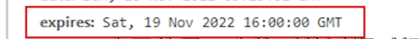

2. **Cache-Control**

属性:

- public / private

public表示资源和中间代理都能缓存，private只有浏览器能缓存，是默认值。这个值设置什么对浏览器没有影响，影响的是中间的代理服务器

- no-cache 

配合协商缓存一起使用，no-cache不是不缓存，而是跳过强缓存走协商缓存，如果没变，后端会返回304状态码，继续使用原资源，如果变化了，就正常返回，状态码200，浏览器把新的资源缓存在本地

- no-store

不走缓存，再次发起请求的时候，即使返回了Etag和Last-Modify，请求头里也不会携带这些信息

- max-age

缓存的有效时长，单位是秒。超过这个时间时候就会走协商缓存了

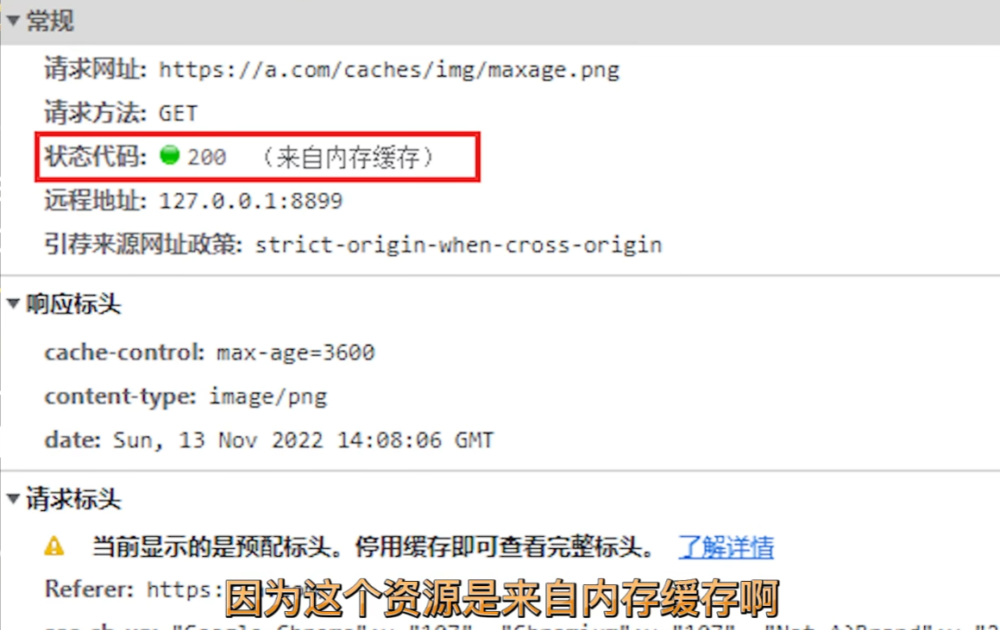

- s-magage

对于代理服务器使用，对浏览器没用

> **对于同时设置了max-age和expries，expires会失效**

3. **ETag / If-None-Match**

etag表示服务端对一个资源的唯一标识。浏览器接收到etag之后就又把他发送给服务端。

第一次请求服务端把etag发送给浏览器，再次请求资源的时候，浏览器就会在请求头的If-None-Match属性里携带这个etag。

比如网页返回了一个资源，并且设置了Cache-Control:max-age=300还给了etag,过了300秒之后，刷新页面，因为缓存过期了，所以浏览器就会向缓存服务器发送请求，这时候就会把etag赋值为if-none-match。服务器根据etag来判断资源是不是最新版本，是就返回304，不是就200正常返回新资源

4. **Last-Modified / If-Modified-Since**

 last-modified用来标识资源的最后更改时间，优先级比etag低(通常是这么约定的，也可以人为修改)

和etag类似，重新请求就会在If-Modified-Since字段携带这个值，服务器比对该值和资源最新更新时间，来决定返回200还是304

## 7.2 缓存补充

- 此外，在浏览器直接输入资源URL发起请求时候，强缓存就会失效而协商缓存还是有效的。

- 如果网页上资源是代码加载出来的，就会遵循强缓存和协商缓存的策略
- 刷新对缓存的影响
- 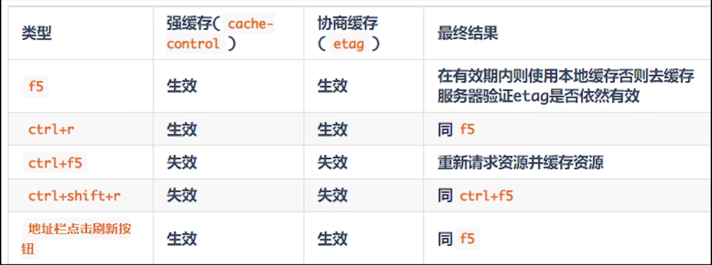

# 8.CSRF攻击

CSRF 攻击指的是**跨站请求伪造攻击**，攻击者诱导用户进入一个第三方网站，然后该网站向被攻击网站发送跨站请求。如果用户在被攻击网站中保存了登录状态，那么攻击者就可以利用这个登录状态，绕过后台的用户验证，冒充用户向服务器执行一些操作。

CSRF 攻击的**本质是利用 cookie 会在同源请求中携带发送给服务器的特点，以此来实现用户的冒充。**

解决方法:

- **进行同源检测**，服务器根据 http 请求头中 origin 或者 referer 信息来判断请求是否为允许访问的站点，从而对请求进行过滤。当 origin 或者 referer 信息都不存在的时候，直接阻止请求。这种方式的缺点是有些情况下 referer 可以被伪造，同时还会把搜索引擎的链接也给屏蔽了。所以一般网站会允许搜索引擎的页面请求，但是相应的页面请求这种请求方式也可能被攻击者给利用。（Referer 字段会告诉服务器该网页是从哪个页面链接过来的）
- **使用 CSRF Token 进行验证**，服务器向用户返回一个随机数 Token ，当网站再次发起请求时，在请求参数中加入服务器端返回的 token ，然后服务器对这个 token 进行验证。这种方法解决了使用 cookie 单一验证方式时，可能会被冒用的问题，但是这种方法存在一个缺点就是，我们需要给网站中的所有请求都添加上这个 token，操作比较繁琐。还有一个问题是一般不会只有一台网站服务器，如果请求经过负载平衡转移到了其他的服务器，但是这个服务器的 session 中没有保留这个 token 的话，就没有办法验证了。这种情况可以通过改变 token 的构建方式来解决。
- **对 Cookie 进行双重验证**，服务器在用户访问网站页面时，向请求域名注入一个Cookie，内容为随机字符串，然后当用户再次向服务器发送请求的时候，从 cookie 中取出这个字符串，添加到 URL 参数中，然后服务器通过对 cookie 中的数据和参数中的数据进行比较，来进行验证。使用这种方式是利用了攻击者只能利用 cookie，但是不能访问获取 cookie 的特点。并且这种方法比 CSRF Token 的方法更加方便，并且不涉及到分布式访问的问题。这种方法的缺点是如果网站存在 XSS 漏洞的，那么这种方式会失效。同时这种方式不能做到子域名的隔离。
- **在设置 cookie 属性的时候设置 Samesite ，限制 cookie 不能作为被第三方使用**，从而可以避免被攻击者利用。Samesite 一共有两种模式，一种是严格模式，在严格模式下 cookie 在任何情况下都不可能作为第三方 Cookie 使用，在宽松模式下，cookie 可以被请求是 GET 请求，且会发生页面跳转的请求所使用。

## 个人小总结

CSRF指的是跨站请求伪造攻击，攻击者诱导用户进入第三方网站，然后向被攻击网站发送请求，如果用户恰好保存了该网站的登陆状态，攻击者就利用这个状态冒充用户进行操作。本质是利用了cookie在同源请求里会自动携带发送给服务器的特点。通常是利用比如img标签，或者隐藏一个表单，用户进入网站自动提交。

解决方法，可以进心同源检测，检测请求头中的origin或者referer属性；

第二种方式是一些重要操作使用手机号验证机制。

第三是使用token来进行验证

第四设置cookie的samesite属性，严格限制第三方使用。

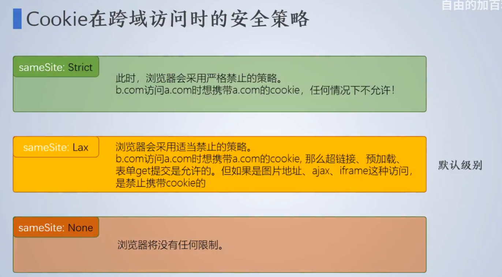

## 抵御

- 尽量使用POST
- 加入验证码机制  
- 验证请求头的中Referer字段，即来源
- 使用Token杜绝CSRF攻击
- 设置cookie的samesite属性

# 9.XSS攻击

> [讲的挺好](https://juejin.cn/post/7225787235462168635?searchId=20230808215415A058F37F557D5BD8D876)

Cross-Site Script跨域脚本攻击

跨站脚本攻击指的是自己的网站运行了别的网站里面的代码，攻击原理是原本需要接受数据但是一段脚本放置在了数据中： （黑客向html文件中或者DOM中注入恶意脚本，从而用户在浏览页面时用注入的脚本对用户实施攻击）

## 反射型

反射型 XSS 攻击是指攻击者通过向目标网站提交带有恶意脚本代码的请求，使得服务器将这些代码反射回浏览器，浏览器执行这些脚本，从而控制网页上的内容或者窃取用户的敏感信息。这种攻击方式通常利用了一些用户交互的机制，例如搜索框、评论框等。

例如，一个网站的搜索功能会将用户输入的内容作为参数传递到后端，后端会将这些参数拼接到一个 HTML 模板中返回给前端。攻击者可以通过在搜索框中输入恶意脚本代码，使得这些代码被拼接到 HTML 模板中，当其他用户访问这个页面时，这些恶意脚本代码会被执行，从而控制网页上的内容或者窃取用户的敏感信息。

## 存储型

危害最大

存储型 XSS 攻击是指攻击者将恶意脚本代码存储到目标网站的数据库中，当其他用户访问这个网站时，这些恶意脚本代码会被加载并执行，从而控制网页上的内容或者窃取用户的敏感信息。

例如，一个网站的评论功能允许用户提交评论并将评论存储到数据库中。攻击者可以通过提交带有恶意脚本代码的评论，将这些代码存储到数据库中，当其他用户访问这个页面时，这些恶意脚本代码会被加载并执行，从而控制网页上的内容或者窃取用户的敏感信息。

> 反射型与存储型本质是浏览器无条件相信并执行服务器返回的内容，而服务器对于用户提交的内容又没有任何处理，这就导致浏览器执行了危险代码

## DOM型

DOM 型 XSS 攻击是指攻击者通过在网页中注入恶意脚本代码，使得浏览器执行这些脚本，从而控制网页上的内容或者窃取用户的敏感信息。与反射型和存储型 XSS 攻击不同，DOM 型 XSS 攻击不需要向服务器提交带有恶意脚本代码的请求，攻击者直接通过修改网页的 DOM 结构，将恶意脚本代码注入到网页中。

例如，一个网站的 URL 中包含一个参数，用来指定网页上的某个元素的 ID。攻击者可以通过在 URL 中注入恶意脚本代码，使得这些代码被浏览器解析执行，从而控制网页上的内容或者窃取用户的敏感信息。

为了防范 XSS 攻击，前端开发人员可以采用以下措施：

1. 对用户输入进行过滤和验证，避免将恶意脚本代码传递到服务器端。
2. 对输出到网页的内容进行转义，避免恶意脚本代码被浏览器执行。
3. 使用 HTTP Only Cookie，避免攻击者窃取用户的会话信息。
4. 使用 Content Security Policy（CSP），限制网页中可以执行的脚本代码的来源。
5. 使用验证码、限制用户输入长度等机制，降低攻击的成功率。
6. 使用 HTTPS 协议传输敏感信息，避免信息被窃取或篡改。
7. 及时更新和修复网站漏洞，避免攻击者利用已知的漏洞进行攻击。
8. 避免使用 eval()、innerHTML 等可以执行字符串的函数，避免将恶意脚本代码注入到网页中。
9. 在编写代码时，始终保持安全意识，避免在代码中暴露敏感信息或者给攻击者留下漏洞。

## 个人小总结

XSS，cross-site script，跨站脚本攻击，就是自己的网站运行了别的网站的恶意脚本，原理就是原本应该放数据的地方执行了一段JS脚本。XSS攻击分为三类，反射型，存储型，DOM型，反射型通过向目标网站提交带有恶意脚本的请求，然后服务端如果不加以甄别就反射给客户端执行。存储型危害最大，一般是利用评论区，私信等等对内容不加以转义的漏洞，黑客将恶意代码存储到服务器后台，然后所有打开这个网页的评论，就会执行恶意代码。这两种都是因为浏览器信任并且执行了服务器返回的内容，而服务器又对内容没做任何处理导致的。第三种就是DOM型，通过通过网页的DOM结构来把恶意脚本注入到网页里，比如URL里包含参数对应网页元素ID，就在URL里注入恶意代码，使得浏览器执行了，从而发起攻击，属于前端代码的漏洞。

一般解决方法对网页的输入进行过滤，对输入到网页的内容进行转义，设置cookie的httponly，设置CSP(Content-Security-Policy，可通过meta标签或者HTTP请求头设置)限制可执行脚本的来源等等，还要避免使用innerHTML，eval等执行字符串的函数。

# 10. 即时通讯的实现方式

主要有四种方式，它们分别是`轮询`、`长轮询(comet)`、`长连接(SSE)`、`WebSocket`。它们大体可以分为两类，一种是在HTTP基础上实现的，包括短轮询、comet和SSE；另一种不是在HTTP基础上实现是，即WebSocket。

**短轮询的基本思路：** 浏览器每隔一段时间向浏览器发送 http 请求，服务器端在收到请求后，不论是否有数据更新，都直接进行响应。这种方式实现的即时通信，本质上还是浏览器发送请求，服务器接受请求的一个过程，通过让客户端不断的进行请求，使得客户端能够模拟实时地收到服务器端的数据的变化。这种方式的优点是比较简单，易于理解。缺点是这种方式由于需要不断的建立 http 连接，严重浪费了服务器端和客户端的资源。当用户增加时，服务器端的压力就会变大，这是很不合理的。

**长轮询的基本思路：** 首先由客户端向服务器发起请求，当服务器收到客户端发来的请求后，服务器端不会直接进行响应，而是先将这个请求挂起，然后判断服务器端数据是否有更新。如果有更新，则进行响应，如果一直没有数据，则到达一定的时间限制才返回。客户端 JavaScript 响应处理函数会在处理完服务器返回的信息后，再次发出请求，重新建立连接。长轮询和短轮询比起来，它的优点是明显减少了很多不必要的 http 请求次数，相比之下节约了资源。长轮询的缺点在于，连接挂起也会导致资源的浪费。

**SSE 的基本思想：** 服务器使用流信息向服务器推送信息。严格地说，http 协议无法做到服务器主动推送信息。但是，有一种变通方法，就是服务器向客户端声明，接下来要发送的是流信息。也就是说，发送的不是一次性的数据包，而是一个数据流，会连续不断地发送过来。这时，客户端不会关闭连接，会一直等着服务器发过来的新的数据流，视频播放就是这样的例子。SSE 就是利用这种机制，使用流信息向浏览器推送信息。它基于 http 协议，目前除了 IE/Edge，其他浏览器都支持。它相对于前面两种方式来说，不需要建立过多的 http 请求，相比之下节约了资源。

**WebSocket** 是 HTML5 定义的一个新协议议，与传统的 http 协议不同，该协议允许由服务器主动的向客户端推送信息。使用 WebSocket 协议的缺点是在服务器端的配置比较复杂。WebSocket 是一个全双工的协议，也就是通信双方是平等的，可以相互发送消息，而 SSE 的方式是单向通信的，只能由服务器端向客户端推送信息，如果客户端需要发送信息就是属于下一个 http 请求了。

**上面的四个通信协议，前三个都是基于HTTP协议的。**

对于这四种即使通信协议，从性能的角度来看： **WebSocket > 长连接（SEE） > 长轮询 > 短轮询** 但是，我们如果考虑浏览器的兼容性问题，顺序就恰恰相反了： **短轮询 > 长轮询 > 长连接（SEE） > WebSocket** 所以，还是要根据具体的使用场景来判断使用哪种方式。

# 11. HTTP1.0和HTTP1.1

