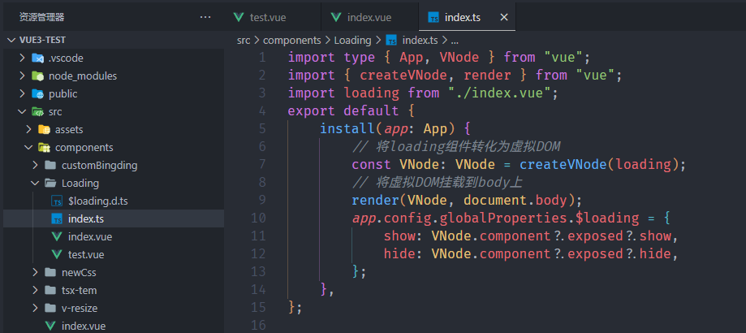
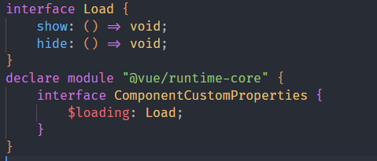
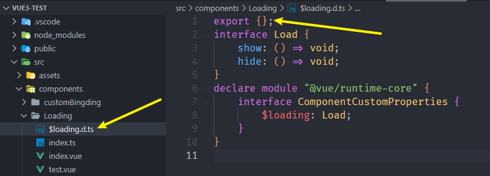
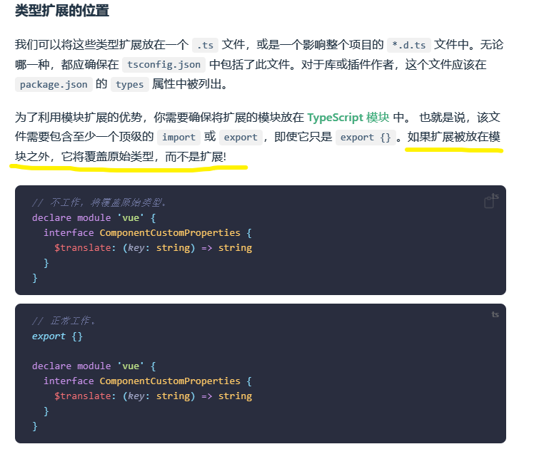

给Vue增加一个全局的$loading方法来展示一个全局loading框

插件如下

然后声明文件`loading.d.ts`中是这么写的(错误写法)

一直报错，什么Vue没有导出App之类的

最后

1. 安装这个库，`$ npm install -D @vue/runtime-core`
2. 改成这样`$loading.d.ts`，ts会自动寻找同名的声明文件，这里应该是$loading
3. 并且代码里还要加一个`export {}`

