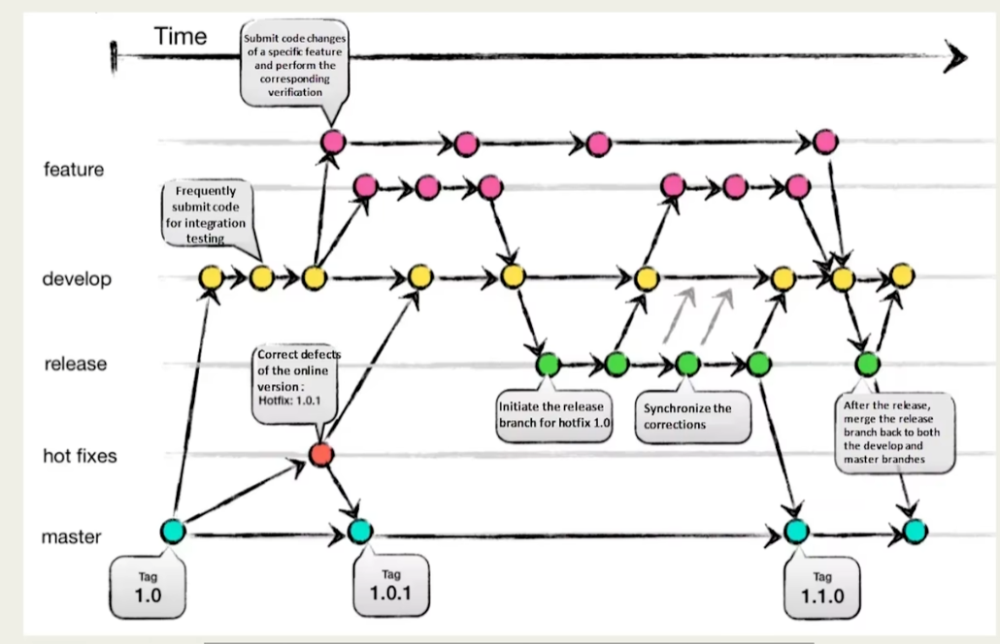

# Git

## 经典Git模型



经典的Git工作流模型中，**master**分支代表发布版本，是最稳定的分支。开发新特性时，需要在**feature**分支上进行开发，可以有多个并行的feature分支。完成开发后，feature分支会合并到**develop**分支，develop分支用于整合和测试所有新特性。

一旦所有特性在develop分支上测试通过，便可以创建一个**release**分支来准备发布新版本。新版本发布并验证无误后，release分支会合并回master分支和develop分支。**hotfixes**分支专用于修复紧急问题，当发现发布版本中的bug时，hotfixes分支会从master分支分出，修复完成后再合并回master和develop分支。

## git rebase

翻译为变基，可以理解为搬家。

现在在feature分支，执行`git rebase main`

1. main分支不变，main分支的历史不会改变。
2. feature分支的历史会变，会被重新定位到main分支的最新提交之后

最终被修改的是feature分支，而不是main分支

假如，**main**分支如下

```js
A---B---C---D  (main)
```

**feature**分支如下

```js
A - B - E - F (feature1)
```

在feature分支上执行`git rebase main`

```js
A---B---C---D  (main)
               \
                E'---F'(feature1)
```

`feature1` 分支的提交 `E`、`F` 和 `G` 被重新应用到 `D` 之后，变成了新的提交 `E'`、`F'` 和 `G'`。

这样，`feature1` 分支保持了最新的 `main` 分支上的更改，同时自己的更改也重新应用了一遍。