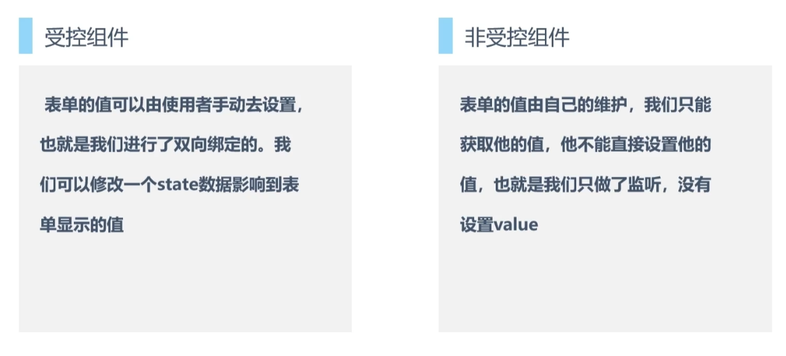
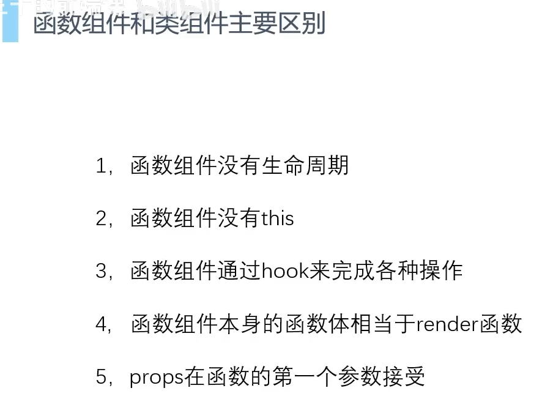
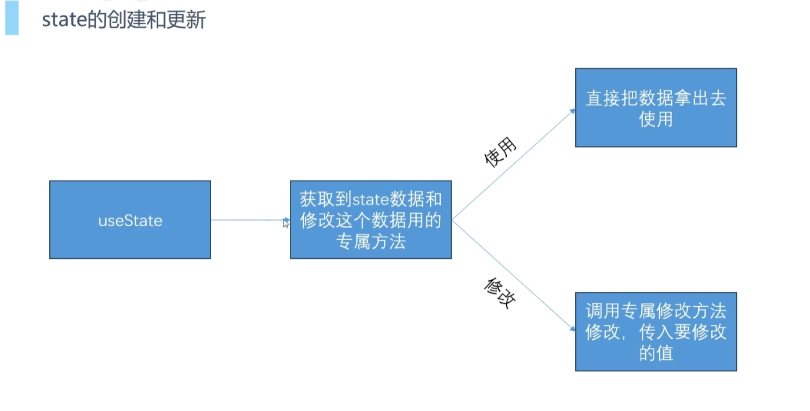
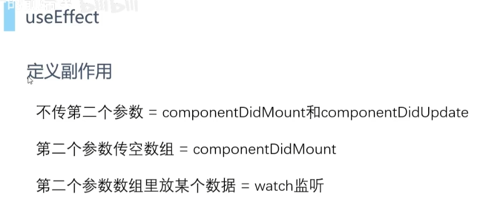
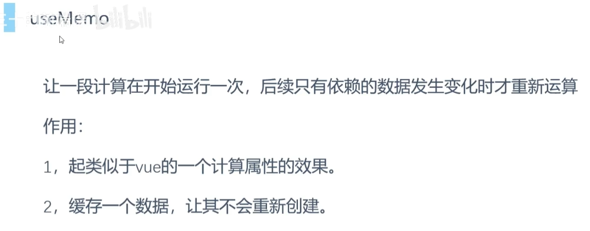

# 受控组件和非受控组件

> 受控组件类似于Vue里面的v-model双向绑定 视图变化->数据变化 + 数据变化->视图更新
>
> 非受控组件类似于v-bind，视图变化->数据变化

# 类组件和函数组件

函数return出来的东西就相当于HTML

# HOOKS

## useState

> 不要在最外层函数中，直接修改state数据

## useEffect

> - 监听某个数据会一开始就执行一次

## useMemo（useMemory)

> 第一个参数是个函数，返回一个值。第二个参数传空数组或者放某个数据，效果类似于useEffect

## useCallBack

> 第二个参数传空数组或者放某个数据，效果类似于useEffect

# 优化相关

Vue因为有依赖收集，会做到最小的组件更新。React更新是调用方法时触发的，没有依赖收集的过程，所以会更新整个组件树，会把子组件一起更新，即使更新的数据和子组件没有任何关系。

> React最大的性能问题就是->React某个组件的更新，会连带子组件一起更新。
>
> - 源码上，React更新时会有很长的diff算法对比和计算工作，会有白屏问题，React源码采用**时间切片**策略更新，先计算一部分更新，然后让渡给渲染进程渲染，然后再进行下一步更新。
> - 自己优化
>   - 避免state同样的值产生更新(PureComponent,函数组件使用Hooks本身就会判断)
>   - Props，如果组件使用了`PureComponent`或者`React.Memo`，虽然做到了传入的props不改变，子组件就不会更新，**但是要注意传入的方法，对象等引用数据类型**
>     - 使用useCallback包裹传递给子组件的方法
>     - 非state对象，数组数据，使用useMemo包裹起来

## 关于直接调用函数和组件调用

**直接调用函数（`A()`）**：适用于简单的、无状态的纯函数组件。不能利用 React 的生命周期和状态管理。

**使用 JSX 语法（`<A />`）**：适用于需要利用 React 状态和生命周期管理的组件。由 React 完整地管理组件的生命周期。

[React官方文档推荐不要直接调用组件函数](https://zh-hans.react.dev/reference/rules/react-calls-components-and-hooks#never-call-component-functions-directly)

# 还有一件事

- 函数通过副作用来与外界进行交流

- 纯函数：

> 有些 JavaScript 函数是 **纯粹** 的。纯函数的基本定义：
>
> - **只负责自己的任务**。 它不会更改在该函数调用前就已存在的对象或变量。
> - **输入相同，输出也相同**。 在输入相同的情况下，对纯函数来说应总是返回相同的结果。

- [youtube教程](https://www.youtube.com/watch?v=jLS0TkAHvRg)
  - React只是个JavaScript库，不是框架，只专注于一件事，构建用户界面。
  - React只用于构建用户界面，并不关注应用的其他方面，比如路由、网络请求。他只负责构建丰富的用户界面。
  - React有丰富的生态，相配合可以构建企业级的Web应用程序。
