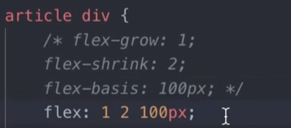
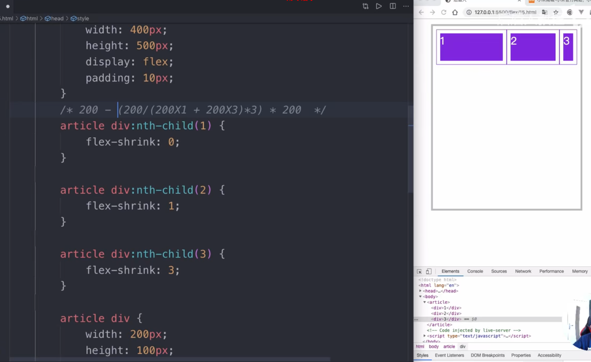

## 2023-3-4 Acro Design Pro

写SAAS平台，头像想要不压缩的塞进img中，可以使用`object-fit`[命令](https://developer.mozilla.org/zh-CN/docs/Web/CSS/object-fit)，取值为cover-

- contain

被替换的内容将被缩放，以在填充元素的内容框时保持其宽高比。整个对象在填充盒子的同时保留其长宽比，因此如果宽高比与框的宽高比不匹配，该对象将被添加“[黑边](https://zh.wikipedia.org/wiki/黑邊)”。

- cover

被替换的内容在保持其宽高比的同时填充元素的整个内容框。如果对象的宽高比与内容框不相匹配，该对象将被剪裁以适应内容框。

- fill

被替换的内容正好填充元素的内容框。整个对象将完全填充此框。如果对象的宽高比与内容框不相匹配，那么该对象将被拉伸以适应内容框。

- none

被替换的内容将保持其原有的尺寸。

- scale-down

内容的尺寸与 `none` 或 `contain` 中的一个相同，取决于它们两个之间谁得到的对象尺寸会更小一些。

## 3-4 Flex

flex布局的子元素的`flex:1`是缩写，具体如下图，是上面三个的缩写



- [flex-grow](https://developer.mozilla.org/zh-CN/docs/Web/CSS/flex-grow)

对flex容器中分配**剩余空间**的相对比例。例如父元素宽400px，有两个子元素，每个宽100px，也就多了200px，两个子元素都有个`flex-grow:1`，那么多出来的200px就分成2份加给两个子元素。如果其中一个`flex-grow:1`，另一个`flex-grow:3`，那么就分成4份，1份给第一个，3份加给第二个。

flex-grow的属性规定为一个 `<number>`

- [flex-shrink](https://developer.mozilla.org/zh-CN/docs/Web/CSS/flex-shrink)

制定了flex元素缩放的规则flex 元素仅在默认宽度之和大于容器的时候才会发生收缩，其收缩的大小是依据 flex-shrink 的值。flex-shrink属性只能是一个 `<number>`

例如父元素宽400px，三个子元素每个200px，是总共600px，缺少200px的空间，`flex-shrink:0`表示不缩放。其中`flex-shrink:3`的计算公式如下`200 - (200/(200 * 1 + 200 * 3)) * 3 * 200`,中间(200/(200 * 1 + 200 * 3)) * 3计算的就是最后要减去的比例。



- [flex-basis](https://developer.mozilla.org/zh-CN/docs/Web/CSS/flex-basis)

指定了 flex 元素在主轴方向上的初始大小。如果不使用 [`box-sizing`](https://developer.mozilla.org/zh-CN/docs/Web/CSS/box-sizing) 改变盒模型的话，那么这个属性就决定了 flex 元素的内容盒（content-box）的尺寸。

> **注意：** 当一个元素同时被设置了 `flex-basis` (除值为 `auto` 外) 和 `width` (或者在 `flex-direction: column` 情况下设置了`height`) , `flex-basis` 具有更高的优先级。

这个 `flex-basis` 属性 被指定为关键词 [`content`](https://developer.mozilla.org/zh-CN/docs/Web/CSS/flex-basis#content) 或者 [`<'width'>`](https://developer.mozilla.org/zh-CN/docs/Web/CSS/flex-basis#<'width'>).

```css
/* 指定<'width'> */
flex-basis: 10em;
flex-basis: 3px;
flex-basis: auto;

/* 固有的尺寸关键词 */
flex-basis: fill;
flex-basis: max-content;
flex-basis: min-content;
flex-basis: fit-content;

/* 在 flex item 内容上的自动尺寸 */
flex-basis: content; //基于 flex 的元素的内容自动调整大小。

/* 全局数值 */
flex-basis: inherit;
flex-basis: initial;
flex-basis: unset;
```

