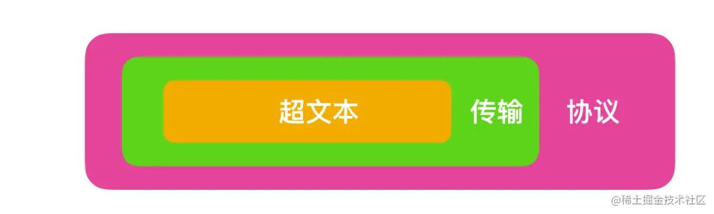

# Http

> 取自 [掘金文章](https://juejin.cn/post/6844904045572800525#comment) [掘金文章](https://juejin.cn/post/7079936383925616653)

## 一、什么是HTTP

HTTP是一种**超文本传输协议**，可以分为**超文本(Hypertext)**、**传输(Transfer)**、**协议(Protocol)**，关系如下

按照范围大小 协议 > 传输 > 超文本

### 1.1 超文本

互联网早期，信息大多数以**文本**即简单字符的形式存储在本地。文本是一种能够被计算解析的有意义的二进制数据包。随着互联网发展，人们需要能够传输图片、音频、视频甚至点击文字或者图片能够进行超链接的跳转，此时文本的语义就被扩大化了，扩大化语义后的文本就叫为超文本。

总之就是文字、图片、音频、视频等格式的数据。

### 1.2 传输

两台计算机之间会形成互联关系进行通信，我们存储的超文本会被解析成为二进制数据包，由传输载体（例如同轴电缆，电话线，光缆）负责把二进制数据包由计算机终端传输到另一个终端的过程称为`传输(transfer)`。

### 1.3 协议

先说协议，日常生活中也存在协议，双方约定在哪里见面，这种约定就是一种协议，它规定了双方约定地点、约定时间、约定事件等等；企业会和你签订劳动合同，这种雇佣关系也是一种协议，规定了工作内容，工作时间、工作地点等等信息。**注意，自己一个人对自己的约定不能成为协议，协议的前提条件就是多人约定。**

网络协议就是网络中传递、管理信息的一些规范，就像社会中办事需要遵循一定的规则，计算机之间的互相通信也需要共同遵守一定的规则，这些规则就称为**网络协议**。

> 总结：**HTTP 是一个在计算机世界里专门在两点之间传输文字、图片、音频、视频等超文本数据的约定和规范**

## 二、HTTP/0.9

## 三、HTTP/1.0

## 四、HTTP/1.1

## 五、SPDY:HTTP1.X的优化

## 六、HTTP2

## 七、HTTP/3

