# 2022/10/24看项目视频 
Vuex中的数据，刷新页面就会重新初始化，导致数据丢失。因为 Vuex 里的数据是保存在运行内存中的，当页面刷新时，页面会重新加载 vue 实例，Vuex 里面的数据就会被清空。但是可以通过插件等一些方法持久化数据，还是有解决方法的，后续用到的时候再学 
# 2022/10/24看项目视频
**Vue3的setup()内部无法使用this**,官方解释是：this不会是该活跃实例的引用（即不指向vue实例），因为 setup() 是在解析其它组件选项之前被调用的，所以 setup() 内部的 this 的行为与其它选项中的 this 完全不同。这在和其它选项式 API 一起使用 setup() 时可能会导致混淆。因此所以setup函数中不能使用this，Vue直接将setup函数中的this改为了undefined。个人理解是：setup是在beforecreate和created之前，这时候vue对象还没被创建，所以没法使用this
# 2022/10/28看项目视频
watch要监视对象中的某个具体属性，必须watch(()=>demo.name,(newValue,oldValue)=>{}); 第一个参数必须是一个箭头函数，方法规定就是如此，更深层的要看Vue3源码了
# 2022/10/29看项目视频
Vue跨组件传值真得注意拷贝的问题，JS传对象、数组过去，不注意拷贝，很容易把原对象给改了，然后就传值乱套了，这就不是我们希望的了

# 2022/11/12写GBA游戏重置

可以通过@contextmenu.prevent.stop来禁用浏览器长按右键功能

# 2022/11/13写GBA游戏最快大脑关卡

audio播放音频，用ref获取元素，play()控制播放，pause()暂停，currentTime = 0.0 来控制从头播放

# 2022/11/29邵宇涵写项目
Vue中父子组件生命周期执行顺序：
`父beforeCreate-> 父create -> 子beforeCreate-> 子created -> 子mounted -> 父mounted`
所以子组件挂载完成时父组件还未挂载，所以组件数据回显的时候，在父组件mounted中获取api的数据，子组件的mounted是拿不到的。
解决方案为：在created中发起请求获取数据，依次在子组件的created或者mounted中会接收到这个数据。

# 2022-12-18SASS前端

el-icon如何和文本对齐，加一个属性 vertical-align:-10%;

# 2023-1-4写SASS前端

el-table-column如何得到相应行的数据，可以这么干，使用作用域插槽，这里是结构出了$index得到了索引值，然后就可以通过索引值得到数据了

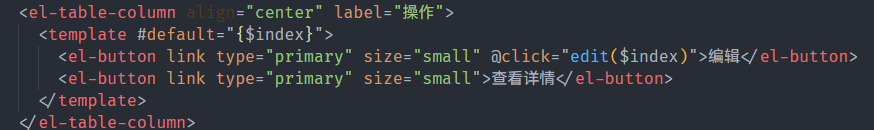

# 2023-1-4写SASS前端

​	根据瑾知的代码，学到了`Object.assign(对象1，对象2...)`方法，可以将对象2的值浅拷贝到对象1，这是浅拷贝
​	通过扩展运算符`a = {...b}` 也是浅拷贝

# 2023-1-7

1. 子组件直接修改父组件**普通**数据

​	使用v-model语法，代替了vue2的.sync修饰符

​	1.父组件定义一个普通数据为响应式变量，例如`const test = ref('parent')`

​	2.父组件用v-model将数据绑定到子组件上

```vue
<ChildComponent v-model:test="test"/>
```

​	其实它是以下代码的简写

```vue
<ChildComponent :test="test" @update:test="test = $event"/>
```

​	3.子组件使用emit修改父组件数据

```vue
	//ChildComponent
	<script setup>
		const props = defineProps({
			test:{
				type:String
			}
		})
		const emit = defineEmits(['update:test'])
		emit('update:test','child')
	</script>
```

> 所以一开始我就想错了，子修改props里的值，一开始就得通过emit自定义事件来实现，所谓的简化是上面的第2步稍微简化了一丢丢

2. 修改复杂数据类型，还是得靠emit自定义事件来实现，但是我发现了一个好玩的事情，文档里写着的，可以更改对象或者数组内部的值，但是不推荐这么做，但是这解决了我看代码的一个小小的问题

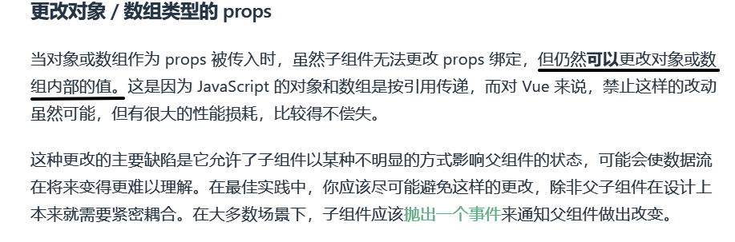

### 3-7日补充

对组件进行二次封装，传值问题，如图，<change-pwd>是自己的组件，这个组件看图二，是进行了二次封装，需要进行visible的传值，需要basic-setting传值给<change-pwd>再传给<a-modal>。

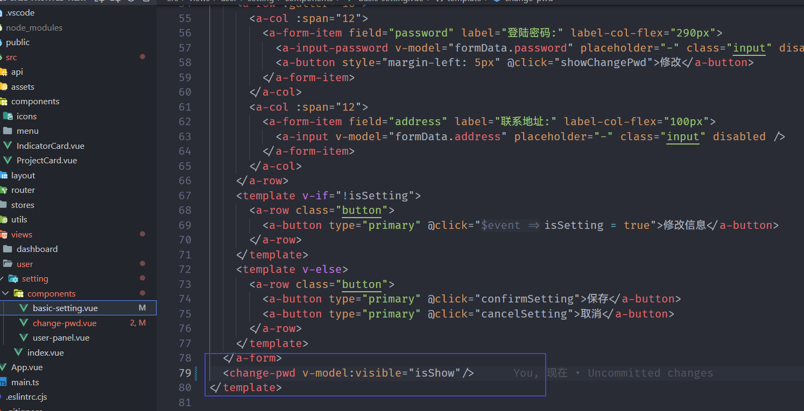

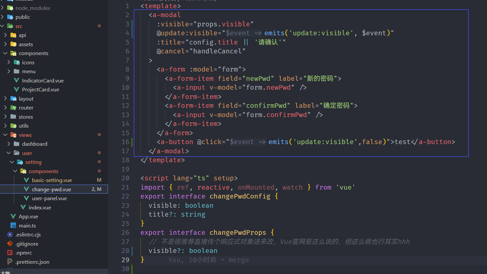

v-model本质上就如上面第二点，只是一个缩写，在<basic-setting>中完整版就是

```typescript
<change-pwd :visible="isShow" @update:visible="$event => isShow = $event">
```

那么想要在子组件中修改值，就需要

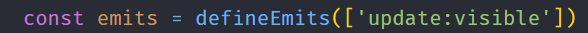

然后`emits('update:visible',false/true)`就可以修改了。那么同理，想要让<a-modal>修改爷爷组件，那么就如图上所示

```typescript
  <a-modal
    :visible="props.visible"
    @update:visible="emits('update:visible', $event)"
  >
```

还有，不要搞混了这个`@update:visible`，我改一下Props的值，emits也要改

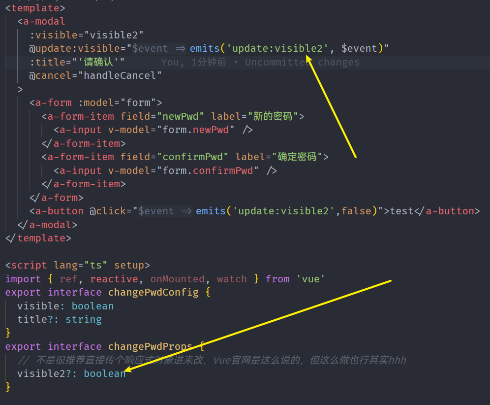

而在父组件里，这里就变成了

```typescript
<change-pwd :visible2="isShow" @update:visible2="$event => isShow = $event"
```

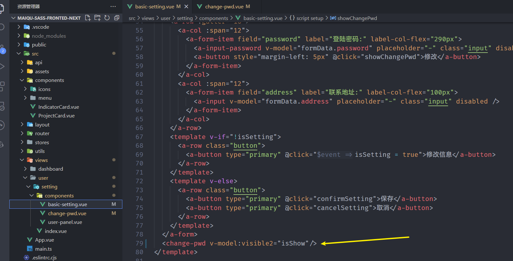

### 额外

但我这里采取的是另一种方法，是传了个对象进去，如图在父组件

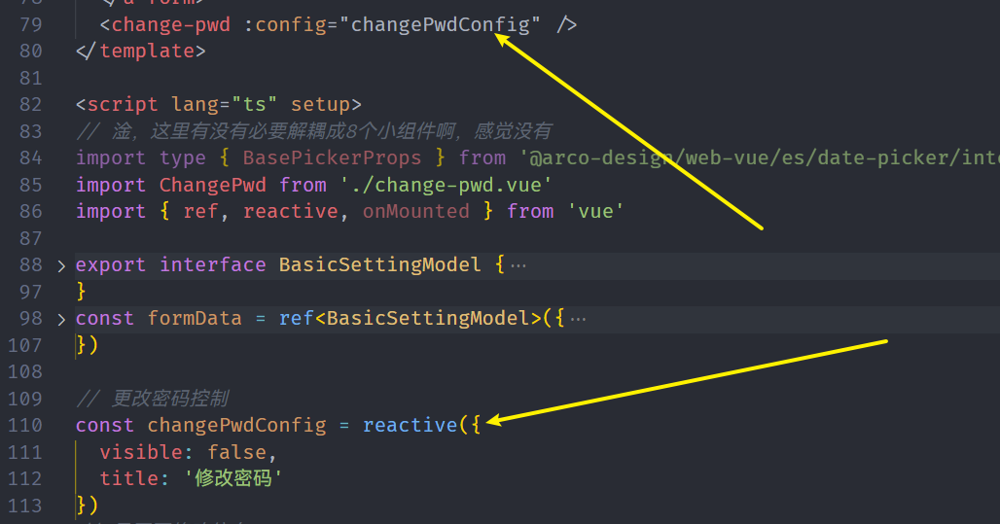

在子组件中，使用一个reactive来接，而reactive不会二次封装一个reactive对象，只会得到自身，那么<a-modal>的修改会直接修改父组件的这个值，对象是引用数据结构，**可以这么干，Vue3官网有，但是不推荐这么干**

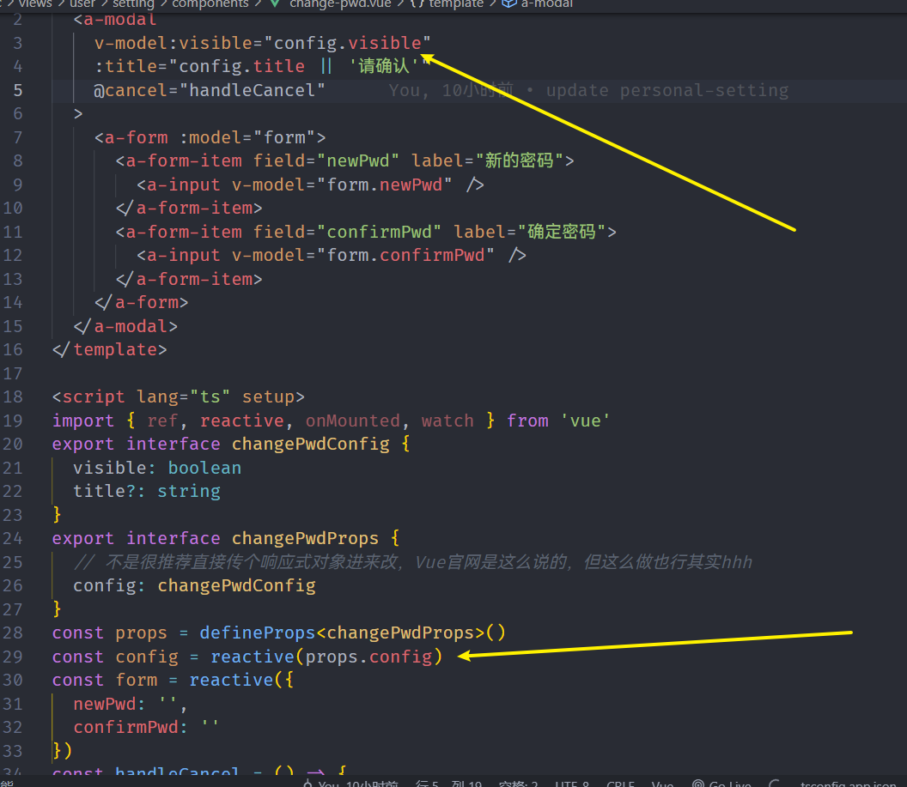

# 2023-1-7

文档里写的着，对一个已经存在的代理对象使用reactive()会返回其本身，结合上面那个，可以修改props传过来的对象数组内部的值，当我reactive()接收props传过来的reactive()对象，我修改内部值，最后改的就直接是父组件的值

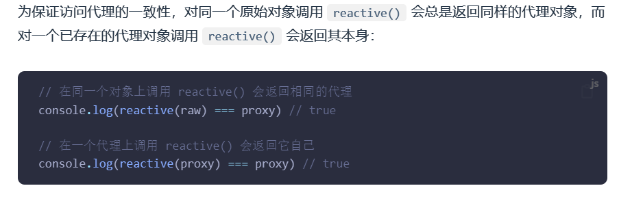

SASS项目里，写用户列表那个弹出框，子组件代码如下，我就说，我在子组件里更改控制这个弹出框dialog是否出现的值为啥可以不出错一直生效，因为我传进去的是一个reactive代理对象，我用reactive()接，根据上面规则，得到的就是原本的这个代理对象，然后修改，就是改的父组件中这个对象的内部值

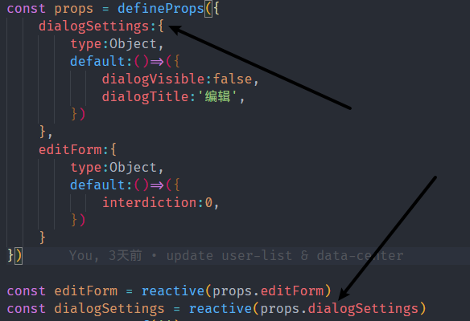
发现一篇[文档](https://developer.aliyun.com/article/875725)，确实讲的很清楚了，其实这种Proxy拦截的方式也是一种数据的单向流通

# 2023-1-18

`Object.entries()`方法，返回给定对象的键值对信息，可以这么来用

```javascript
    const object1 = {
      a: 'somestring',
      b: 42
    };

    for (const [key, value] of Object.entries(object1)) {
      console.log(`${key}: ${value}`);
    }
    // "a: somestring"
    // "b: 42"
```

# 2023-2-16

```javascript
const str = "abcd"
str.charAt(0) //a
str[0] // a

str.charAt(4) // 空字符串
str[4] // undefined
```

- `[]`不兼容IE6-8
- charAt兼容任意版本

总结：

- 在遇到字符串尽量使用`charAt`，遇到数组使用[]
- 在遇到不存在的值时，`charAt`返回空值，`[]`返回undefined

# 2023-2-16

```js
	let vivisted:boolean[][] = new Array(m).fill(0).map(()=>new Array(n));
```

用这个方法来新建一个 m x n 的二维矩阵，为什么要fill(0)呢，不然undefined没法使用map方法

# 2023-2-17 LeetCode

将一个数组的值深层复制给另一个数组

如果是

```js
	let arr = [1,2,3]
    let newArr = new Array(...arr)
```

这种方法可以是可以，但是如果`arr`只有一个数字，那么`new Array(n)`就是生成一个n个元素的空数组，这时候深度拷贝就出错了，可以用

```js
	let newArr = new Array().concat(arr)
```

`concat`方法会返回一个新的数组

# LeetCode

TS中`string`转为`number`

1. 使用Number构造函数(推荐)

```typescript
	let x = Number('1234') // 1234
    let nan = Number('abcd') // NaN
```

2. **+号操作符** (主要是为了记这个)

```typescript
	let x = +'1234'    // ---> 1234
	let nan = +'abcd'     // ---> NaN
```

3. parseInt

```typescript
	let x = parseInt('1234') // 1234
	let nan = parseInt('abcd') // NaN
	let y = parseInt('123abc') // 123
```

## LeetCode-快排

> 剑指Offer 40 最小的K个数

优雅的交换数组的值，使用ES6的解构赋值

```typescript
    function swap(arr: number[], idxA: number, idxB: number) {
        [arr[idxA], arr[idxB]] = [arr[idxB], arr[idxA]];
    }
```

附带一提：快排的i和j最后停下来会是同一个

## LeetCode-二分

> 剑指Offer 41 数据流中的中位数

二分查找到最后，条件如果是while(left < right) 最后left === right，如果是while(left <= right) 最后left = right + 1, 因为最后一定会二分到[x]只有一个数字的数组，此时left = right，第一种情况就会结束，第二种情况，无论如何最后两者相差为1

## MDX文件

[blockquote](https://developer.mozilla.org/zh-CN/docs/Web/HTML/Element/blockquote)

**HTML `<blockquote>` 元素**（或者 HTML 块级引用元素），代表其中的文字是引用内容。和markdown中的`>`差不多效果

# 父子路由关系

Acro Design Pro里的路由关系，父路由决定了子路由在哪个router-view里面出现

# 隐藏滚动条
```javascript
    &::-webkit-scrollbar {
       display: none;
   	}
```

谷歌浏览器是这样的

# setup语法糖async await问题

在setup语法糖里面，可以直接使用awiat而不需要再使用async，因为 setup 会自动变成 async setup

# 箭头函数问题

箭头函数没有自己的this和arguments，在定义函数时绑定外层的this和arguments

# Vue-Router问题

在学习公司代码时，发现一个事情，有些路由是这样的

```js
{
    path:"/home"
    component:()=>一个包含router-view的基础组件，所有的其他组件都在这个组件上显示
    children:[
        {
            path:"/home",
            componet:()=>真正的home组件
        }
    ]
}
```

子路由的path里面写有'/'，就代表严格匹配'/path'，如果不写'/'，就是'/home/home'

此外，只要路径匹配成功，子路由组件就会在父路由组件里通过router-view来显示出来，而且只有这一种方法。**而父子路由之间其实是相对独立的，只要匹配到，就会在router-view中显示出来**，所以子路由的`path:'/home'`写成空效果也一样

# .native问题

以前都是给div原生元素加@click，所以没注意，如果是给自定义组件@click，vue2则需要加.native，而vue3取消了这个，需要在组件内指定emit

有了.native就不会触发emit

# Vue2响应式问题

一个数组，如果用一个新的数组覆盖掉值，还是可以保持响应式，`tableData=[]`还是可以触发响应式，`tableData[1]=1`这种就不可以，因为`tableData`这个指针修改是可以触发set的，而数组某一项，不能确定是否存在，所以没有响应式，要通过splice方法来改

# 更新问题

还记得那个消息全选功能吗？会一个个的变成已读状态，因为API只能传单个信息，我采用的方法是传一个就更新一个，其实可以这么干，直接替换掉整个对象，就可以快速更新了

```javascript
    expandChange(row, status) { // 控制每次只展开一行数据
      let data = _.cloneDeep(this.tableData);
      if (status) {
        for (let i = 0; i < data.length; i++) {
          if (row.featureCode === data[i].featureCode) {
            data[i]._expanded = true;
          } else {
            data[i]._expanded = false;
          }
        }
        this.tableData = data;
      }
    },
```

# 分页问题

```type
  pageIndexChange() {
    this.queryTable();
  },
  pageSizeChange(value) {
    this.pageConfig.pageSize = value;
    this.queryTable();
  },
```

当处于最后一页(比如120页)，并且将页面大小拉到最大(比如100条/页)，就会出现更新两次的事情，因为会发送两次请求，第一次是

```
pageIndex: 120
pageSize: 100
```

然后page组件会自动把Index设置为1，这时候又会触发pageIndex改变事件，又会触发一次请求

```js
pageIndex: 1
pageSize: 100
```

所以可以进行上面代码的修改,增加一个判断

```js
  pageIndexChange() {
    this.queryTable();
  },
  pageSizeChange(value) {
    this.pageConfig.pageSize = value;
    if (value * this.pageConfig.pageIndex > this.pageConfig.total) {
      return;
    }
    this.queryTable();
  },
```

