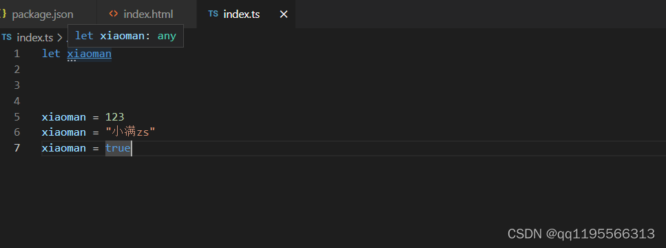

# 元组类型

**元组是数组的变种**，元组Tuple是固定数量的不同类型的元素的组合。

元组与集合的不同之处在于，元组中的元素类型可以是不同的，而且数量固定。元组的好处在于可以把多个元素作为一个单元传递。如果一个方法需要返回多个值，可以把这多个值作为元组返回，而不需要创建额外的类来表示.

```ts
let arr:[number,string] = [1,'string']
// arr2不可修改
let arr2: readonly [number,boolean,string,undefined] = [1,true,'sring',undefined]
```

当赋值或访问一个已知索引的元素时，会得到正确的类型：

```ts
let arr:[number,string] = [1,'string']
arr[0].length //error 数字类型没有length属性
arr[1].length //6
```

## 可选类型

元组类型还可以支持自定义名称和变为可选的

```ts
let a:[x:number,y?:boolean] = [1]
```

## 越界元素

```ts
let arr:[number,string] = [1,'string']
 
arr.push(true)//error，因为元组类型中没有boolean类型
```

对于越界的元素他的类型被限制为 联合类型（就是你在元组中定义的类型）如下图



## 使用场景

定义excel返回的数据

```ts
let excel: [string, string, number, string][] = [
    ['title', 'name', 1, '123'],
    ['title', 'name', 1, '123'],
    ['title', 'name', 1, '123'],
    ['title', 'name', 1, '123'],
    ['title', 'name', 1, '123'],
]
```

