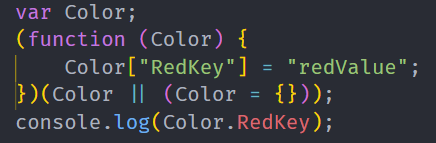
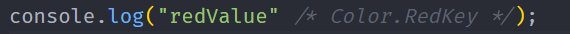

# 枚举类型

使用**`enum`**关键词来定义枚举类型

## 基础枚举

例如 红绿蓝 Red = 0 Green = 1 Blue= 2 分别代表红色0 绿色为1 蓝色为2

```ts
enum Types{
   Red,
   Green,
   BLue
}
```

这样写就可以实现，因为ts定义的枚举中的每一个组员默认都是从0开始的所以也就是

```ts
enum Types{
   Red = 0,
   Green = 1,
   BLue = 2
}
//默认就是从0开始的 可以不写值
```

## 增长枚举

我们定义了一个数字枚举， Red使用初始化为`1`。 其余的成员会从`1`开始自动增长。 换句话说，Type`.Red`的值为 `1`，`Green`为`2`，`Blue`为`3`。

```ts
enum Types{
   Red = 1,
   Green,
   BLue
}
```

## 字符串枚举

字符串枚举的概念很简单。 在一个字符串枚举里，每个成员都必须用字符串字面量

```ts
enum Types{
   Red = 'red',
   Green = 'green',
   BLue = 'blue'
}
```

由于字符串枚举没有自增长的行为，字符串枚举可以很好的序列化。 换句话说，如果你正在调试并且必须要读一个数字枚举的运行时的值，这个值通常是很难读的 - 它并不能表达有用的信息，字符串枚举允许你提供一个运行时有意义的并且可读的值，独立于枚举成员的名字。

## 异构枚举

枚举可以混合字符串和数字成员

```ts
enum Types{
   No = "No",
   Yes = 1,
}
```

## 接口枚举

定义一个枚举Types 定义一个接口A 他有一个属性red 值为Types.yyds

声明对象的时候要遵循这个规则

```ts
   enum Types {
      yyds,
      dddd
   }
   interface A {
      red:Types.yyds
   }
 
   let obj:A = {
      red:Types.yyds
   }
```

## const枚举

let  和 var 都是不允许的声明只能使用const

大多数情况下，枚举是十分有效的方案。 然而在某些情况下需求很严格。为了避免在额外生成的代码上的开销和额外的非直接的对枚举成员的访问，我们可以使用`const`枚举。常量枚举通过在枚举上使用`const`修饰符来定义

普通声明的枚举编译完后是个对象

```ts
enum Color {
    RedKey='redValue'
}
console.log(Color.RedKey);
```

编译后



`const`声明的枚举会被编译成常量，可以看下图，直接将值进行替换，没有进行对象的声明

```ts
const enum Color {
    RedKey='redValue'
}
console.log(Color.RedKey);  
```

编译后



## 反向映射

枚举映射包含了正向映射（ `name` -> `value`）和反向映射（ `value` -> `name`）

**注意：不可为字符串枚举成员生成反向映射。(TS就是这么规定的)**

```ts
enum Color {
    RedKey=1
}
let value:number = Color.RedKey;
let key = Color[value];
console.log(`key:${key},value:${value}`);
```

编译后，可见是给对象新增了两个属性

