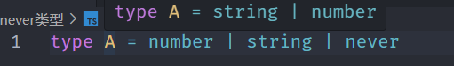
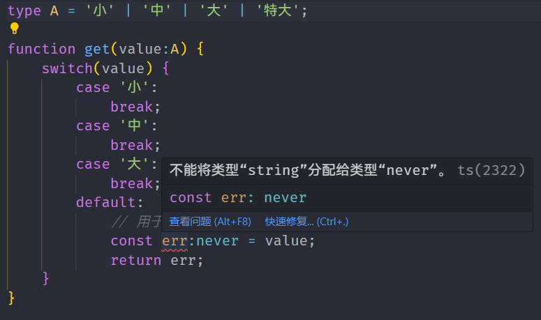

# never类型

TypeScript将使用 never 类型来表示不应该存在的状态

```ts
// 返回never的函数必须存在无法达到的终点
// 因为必定抛出异常，所以 error 将不会有返回值
function error(message: string): never {
    throw new Error(message);
}
// 因为存在死循环，所以 loop 将不会有返回值
function loop(): never {
    while (true) {
    }
}
```

## nerver和void的区别

1. void类型只是没有返回值 但本身不会出错

```ts
	function Void():void {
        console.log(1);
    }
 
    //只会抛出异常没有返回值，因为抛出异常之后就结束了，根本不会返回值
    function Never():never {
    	throw new Error('aaa')
    }
```

2. 当我们鼠标移上去的时候会发现 只有void和number，never在联合类型中会被直接移除



## 简单的应用场景

```ts
type A = '小' | '中' | '大';	
function get(value:A) {
    switch(value) {
        case '小':
            break;
        case '中':
            break;
        case '大':
            break;
        default:
            // 用于兜底逻辑
            const err:never = value;
            return err;
    }
}
```

如果在A中新增一个类型，由于任何类型都不能赋值给 `never` 类型的变量，所以当存在进入 `default` 分支的可能性时，TS的类型检查会及时帮我们发现这个问题(图中新增特大)

