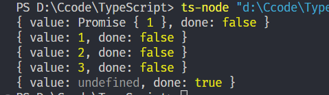
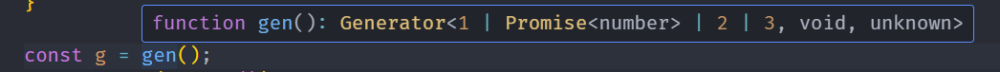
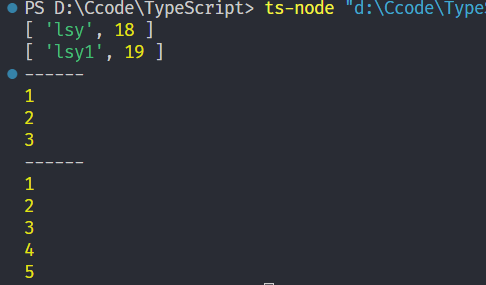
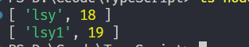
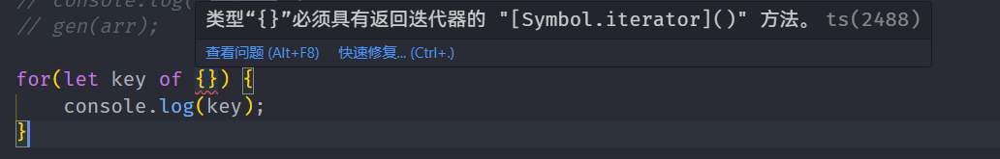
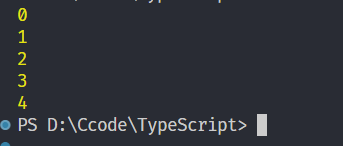

# Symbol和迭代器、生成器

## Symbol

自ECMAScript 2015起，`symbol`成为了一种新的原生类型，就像`number`和`string`一样。

`symbol`类型的值是通过`Symbol`构造函数创建的。

可以传递参做为唯一标识 只支持string和number类型的参数

```ts
let sym1 = Symbol();
let sym2 = Symbol("key"); // 可选的字符串key
```

### Symbol的值是唯一的

```ts
const s1 = Symbol(1)
const s2 = Symbol(1)
// s1 === s2 =>false
```

> 邪招，可以让两个Symbol相等为true
>
> console.log(Symbol.for('lsy') === Symbol.for('lsy'));//true
>
> 使用for会全局搜索有没有注册过这个key，如果有就拿来用，如果没有再新建

### 使用场景

用作对象独一无二的属性

```ts
let sym = Symbol();
let obj = {
    [sym]: "value"
};
console.log(obj[sym]); // "value"
```

### 遍历Symbol

```ts
const key1 = Symbol(1);
const key2 = Symbol(1);
const obj = {
    [key1]: 'key1',
    [key2]: 'key2',
    name: 'lsy'
}
```

**以下方式无法取到Symbol**

1. for...in

```ts
for(const key in obj) {
    console.log(key); // name
}
```

2. Object.keys

```ts
console.log(Object.keys(obj)); // [ 'name' ]
```

3. Object.getOwnProtertyNames

```ts
console.log(Object.getOwnPropertyNames(obj)); // [ 'name' ]
```

4. JSON.stringfy

```ts
console.log(JSON.stringify(obj)); // {"name":"lsy"}
```

想拿到，以下方法

- 使用Object.getOwnPropertySymbols()拿到具体的Symbol属性

```
console.log(Object.getOwnPropertySymbols(obj)); // [ Symbol(1), Symbol(1) ]
```

- 使用ES6的Reflect.onKeys拿到所有属性

```ts
console.log(Reflect.ownKeys(obj)); // [ 'name', Symbol(1), Symbol(1) ]
```

## 生成器

```ts
function* gen() {
    yield Promise.resolve(1); // yield后面加同步/异步都是按顺序执行
    yield 1;
    yield 2;
    yield 3;
}

const g = gen();
console.log(g.next());
console.log(g.next());
console.log(g.next());
console.log(g.next());
console.log(g.next());
```



使用gen()返回一个generator生成器，使用next()方法来一步步获取值，一直到返回的对象done为true



## Iterator迭代器

> 数组的解构就是调用迭代器
>
> let [a,b,c] = [1,2,3];
>
> let arr = [...arr2];

### 简单使用

数组、伪数组，set、map都有一个Symbol.iterator属性，是一个函数，返回对应的迭代器，使用迭代器类似于上面的生成器可以获取值

```ts
var arr = [1,2,3,4];
let iterator = arr[Symbol.iterator]();
 
console.log(iterator.next());  //{ value: 1, done: false }
console.log(iterator.next());  //{ value: 2, done: false }
console.log(iterator.next());  //{ value: 3, done: false }
console.log(iterator.next());  //{ value: 4, done: false }
console.log(iterator.next());  //{ value: undefined, done: true }
```

其他的map、set、arr都可以使用

```ts
const map: Map<string, number> = new Map();
map.set("lsy", 18);
map.set("lsy1", 19);
const set: Set<number> = new Set([1, 2, 3, 3, 3]);
const arr: number[] = [1, 2, 3, 4, 5];
// 伪数组：const divs = document.querySelectorAll('div');
const gen = (value: any): void => {
	let it: Iterator<any> = value[Symbol.iterator]();
	let next: IteratorResult<any> = { value: "", done: false };
	while (!next.done) {
		next = it.next();
		if (!next.done) {
			console.log(next.value);
		}
	}
};

gen(map);
console.log("------");
gen(set);
console.log("------");
gen(arr);
```

最后结果



### 语法糖

上面的遍历函数代码太多，平时使用语法糖`for of`

```ts
for (let value of map) {
    console.log(value)
}
```



### 拓展，对象支持for of

for of语法糖不能对对象使用，因为对象没有迭代器



```ts
let obj = {
	a: 1,
	b: 2,
	max: 5,
	current: 0,
	[Symbol.iterator]() {
		// 返回一个迭代器
		return {
			max: this.max,
			current: this.current,
			next() {
				if (this.current === this.max) {
					return {
						value: void 0,
						done: true,
					};
				} else {
					return {
						value: this.current++,
						done: false,
					};
				}
			},
		};
	},
};

for (const value of obj) {
	console.log(value);
}
```

最后结果

