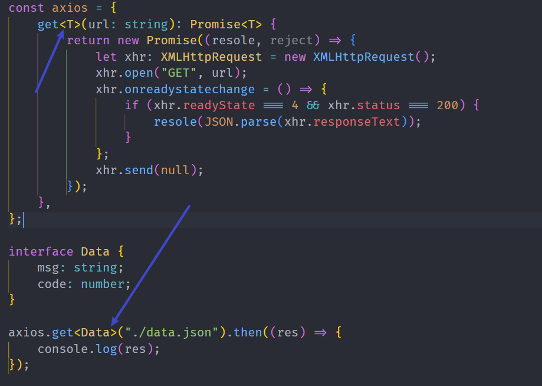
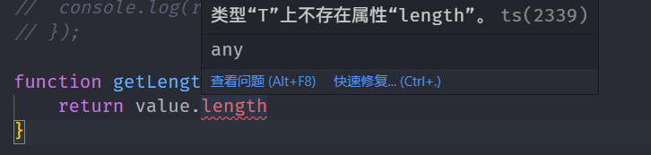
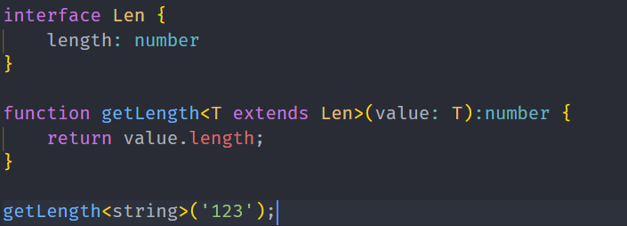
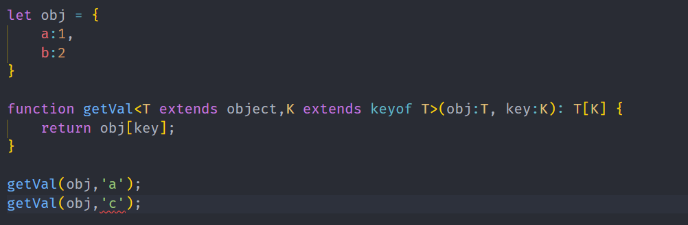
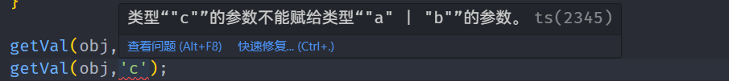
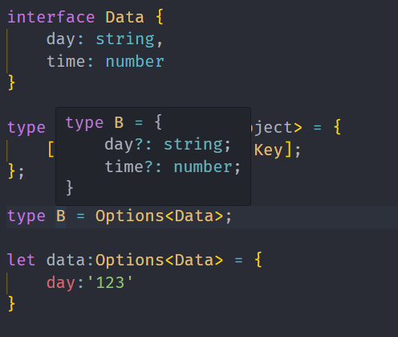

# 泛型(动态类型)

> 个人理解，泛型更像是一种约束，用来约束函数体内某些变量的类型需要保持一致或者有某种关系，而约束是不需要有具体类型的，是动态类型，而TS又会自己推断类型，所以这种约束也十分的灵活
>
> 在定义的时候不明确类型，在调用的再明确类型

## 函数泛型

下面两个函数功能一致，只是参数类型不同，就可以使用泛型

```ts
function num (a:number,b:number) : Array<number> {
    return [a ,b];
}
num(1,2)
function str (a:string,b:string) : Array<string> {
    return [a ,b];
}
str('独孤','求败')
```

使用泛型优化

```ts
function all<T>(a: T, b: T): Array<T>  {
    return [a,b]
}
all<number>(1,2) // <number>可以不写，TS可以自行推断
all<string>('1','2')
```

我们也可以使用不同的泛型参数名，只要在数量上和使用方式上能对应上就可以。

也可以设置默认值，如下文的T，默认类型为number

```ts
function Sub<T = number,U>(a:T,b:U):Array<T|U> {
    const params:Array<T|U> = [a,b]
    return params
}
Sub<Boolean,number>(false,1)
```

## 泛型接口

```ts
type A<T> = number | T
interface B<T> {
    msg: T
}
```

## 简单使用场景



## 泛型约束

### extends

比如写一个函数求length，但是有的数据类型是没有length属性的

```ts
function getLength<T>(value: T):number {
    return value.length 
}
```



这时候就可以使用泛型约束，关键词extends



### keyof

首先定义了T类型并使用extends关键字继承object类型，使得T类型必须为引用类型。

然后使用`keyof`操作符获取T类型的所有键，它的返回类型是联合类型，最后利用extends关键字约束，K类型必须为T类型的成员类型





#### 一个高级用法

使得interface里的所有属性都变得可选的

```ts
interface Data {
	day: string;
	time: number;
}

type Options<T extends object> = {
	[Key in keyof T]?: T[Key];
};

let data:Options<Data> = {
    day:'123'
}
```

不会报错，因为Options里的参数都变得可选了，实际就等于

```ts
type Options = {
    day?: string
    time?: number
}
```



又或者变得都只读

```ts
type Options<T extends object> = {
	readonly [Key in keyof T]: T[Key];
};
```

