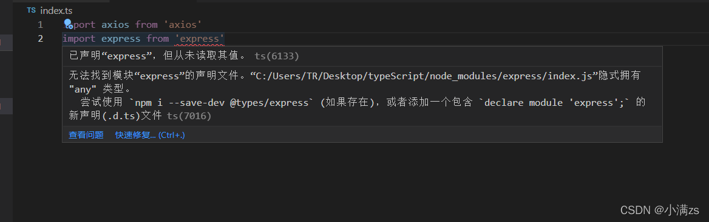
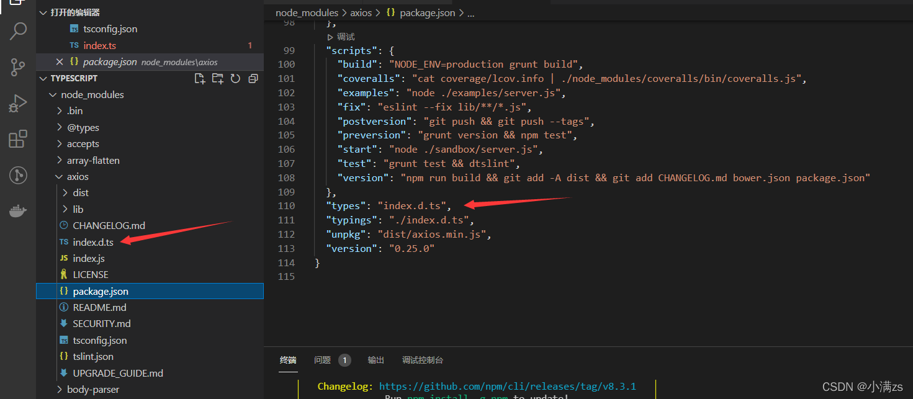

# 声明文件declare

> 第三方库用TS编写，最后都会编译成JS代码，而TS才能提供类型，才有了代码提示和类型保护等机制。声明文件就是为JS代码提供类型信息。这样在TS编译环境下就不会提示js文件"缺少类型".
>
> `.d.ts`文件是只包含类型信息的类型声明文件，不会生成JS文件，仅用于提供类型信息，为JS代码提供类型信息
>
> 在导入.js文件时，TS会自动加载与.js同名的.d.ts文件，以提供类型声明。

当使用第三方库时，我们需要引用它的声明文件，才能获得对应的代码补全、接口提示等功能。

declare关键词：用于类型声明，为其他地方(比如，.js文件)已存在的变量声明类型，而不是创建一个新的变量

```ts
declare var 声明全局变量
declare function 声明全局方法
declare class 声明全局类
declare enum 声明全局枚举类型
declare namespace 声明（含有子属性的）全局对象
interface 和 type 声明全局类型
/// <reference /> 三斜线指令
```

## 例子

`express`和`axios`库，`express`库就会报错，因为`express`是用js写的，没有声明文件，提示需要额外下载声明文件

`npm install @types/node -D`(有个规定，下载声明文件都是@types/库名称)



而`axios`得package包里已经指定了声明文件，所以不报错可以直接用，还可以有代码补全提示



一些第三方包可能没有声明文件，需要我们自己去定义，方法就是新建一个`包名字.d.ts`文件去声明

## 自定义声明文件

`express.d.ts`

```ts
declare module 'express' {
    interface Router {
        get(path: string, cb: (req: any, res: any) => void): void
    }
    interface App {
        use(path: string, router: any): void
        listen(port: number, cb?: () => void): void
    }
    interface Express {
        (): App
        Router(): Router
 
    }
    declare const express: Express // 加了declare，不是初始化，因为d.ts文件只是提供声明，并不是真的使用
    export default express
}
```

## 注意点

1. 对于type、interface等这些明确就是TS类型的(只能在TS中使用的)，可以省略declare关键字
2. 对于let、function等具有双重含义(在TS、JS中都能使用),应该使用declare关键词，明确指定此处用于类型声明
3. 类型提供好之后，需要使用模块化方案中提供的模块化语法，来导出声明好的类型，然后才能在其他的.ts文件中使用

