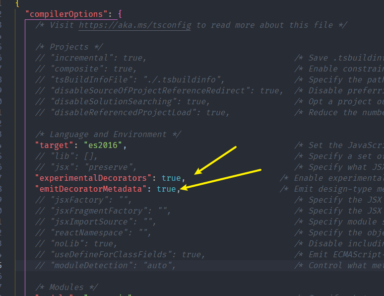
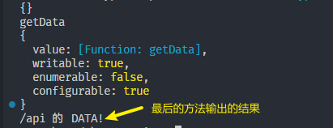
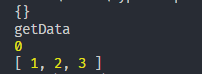
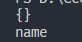

# 装饰器/修饰器

*装饰器*是一种特殊类型的声明，它能够被附加到[类声明](https://www.tslang.cn/docs/handbook/decorators.html#class-decorators)，[方法](https://www.tslang.cn/docs/handbook/decorators.html#method-decorators)， [访问符](https://www.tslang.cn/docs/handbook/decorators.html#accessor-decorators)，[属性](https://www.tslang.cn/docs/handbook/decorators.html#property-decorators)或[参数](https://www.tslang.cn/docs/handbook/decorators.html#parameter-decorators)上。

Decorator 装饰器是一项实验性特性，在未来的版本中可能会发生改变

它们不仅增加了代码的可读性，清晰地表达了意图，而且提供一种方便的手段，增加或修改类的功能

若要启用实验性的装饰器特性，你必须在命令行或`tsconfig.json`里启用编译器选项



## 类装饰器ClassDecorator

首先定义一个类

```ts
class A {
    constructor() {
 
    }
}
```

定义一个类装饰器函数 他会把ClassA的构造函数传入你的watcher函数当做第一个参数

```ts
const watcher: ClassDecorator = (target: Function) => {
    target.prototype.getParams = <T>(params: T):T => {
        return params
    }
}
```

使用的时候 直接通过@函数名使用

```ts
@watcher
class A {
    constructor() {
 
    }
}
```

验证

```ts
const a = new A();
console.log((a as any).getParams('123')); // 123
```

## 装饰器工厂

就是函数的柯里化，外层的函数接收值，里层的函数最终接受类的构造函数

```ts
const watcher = (name: string): ClassDecorator => {
    return (target: Function) => {
        target.prototype.getParams = <T>(params: T): T => {
            return params
        }
        target.prototype.getOptions = (): string => {
            return name
        }
    }
}
@watcher('name')
class A {
    constructor() {
 
    }
}
const a = new A();
console.log((a as any).getParams('123'));
```

## 方法装饰器

例子，实现一个简单的GET请求

```ts
const Get = (url:string):MethodDecorator => {
	return (target:any, key:string, descriptor:PropertyDescriptor) => {
		console.log(target,key,descriptor);
		// 通过descriptor.value获取到原来的方法
		// 假装调用了axios的get方法
		new Promise((resolve,reject) => {
			resolve(`${url} 的 DATA!`);
		}).then(res => {
			descriptor.value(res);
		});
	}
}

@Base('123')
class BaseClass {
	@Get('/api')
	getData(data:any) {
		console.log(data);
	}
}
```

有三个参数：

1. 对于静态成员来说是类的构造函数，对于实例成员来说是类的原型对象
2. 成员的名字
3. 成员的**属性修饰符**,通过.value方法就可以获取到对应的函数



## 参数装饰器

紧接着上个例子，通过与`Reflect.defineMeteda`配合，可以实现不用手动来.result来取api结果

属性修饰器先于方法装饰器运行

> 元数据存储
>
> ```ts
> import 'reflect-metadata'
> ```
>
> 可以快速存储元数据然后在用到的地方取出来 defineMetadata getMetadata

```ts
const Get = (url: string): MethodDecorator => {
	return (target: any, key: string, descriptor: PropertyDescriptor) => {
		// 通过descriptor.value获取到原来的方法
		// 假装调用了axios的get方法
		const ResultKey = Reflect.getMetadata("key", target);
		new Promise((resolve, reject) => {
			resolve({
				status: 200,
				result: [1, 2, 3],
			});
		}).then((res) => {
			descriptor.value(ResultKey ? res[ResultKey] : res);
		});
	};
};

const Result = (): ParameterDecorator => {
	return (target: any, key: string, index) => {
		// 这个先执行
		Reflect.defineMetadata("key", "result", target);
		console.log(target);
		console.log(key);
		console.log(index);
	};
};

@Base("123")
class BaseClass {
	@Get("/api")
	getData(@Result() data: any) {
		console.log(data);
	}
}
```

有三个参数

1. 对于静态成员来说是类的构造函数，对于实例成员是类的原型对象。
2. 函数名字
3. 参数在函数里所在的位置，这个是0，因为在函数`getData()`中，data属性是第一位



## 属性装饰器

```ts
const Name: PropertyDecorator = (target: any, key: string) => {
	console.log(target);
	console.log(key);
}
class BaseClass {
	@Name
	name: string;
}
```

两个属性

1. 对于静态成员来说是类的构造函数，对于实例成员来说是类的原型对象
2. 属性的名字



