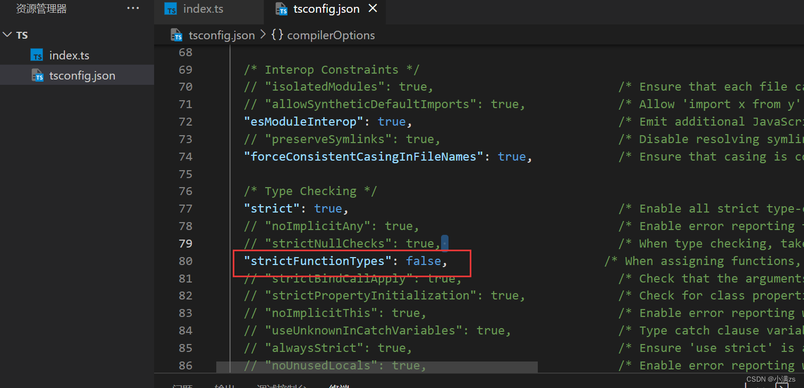
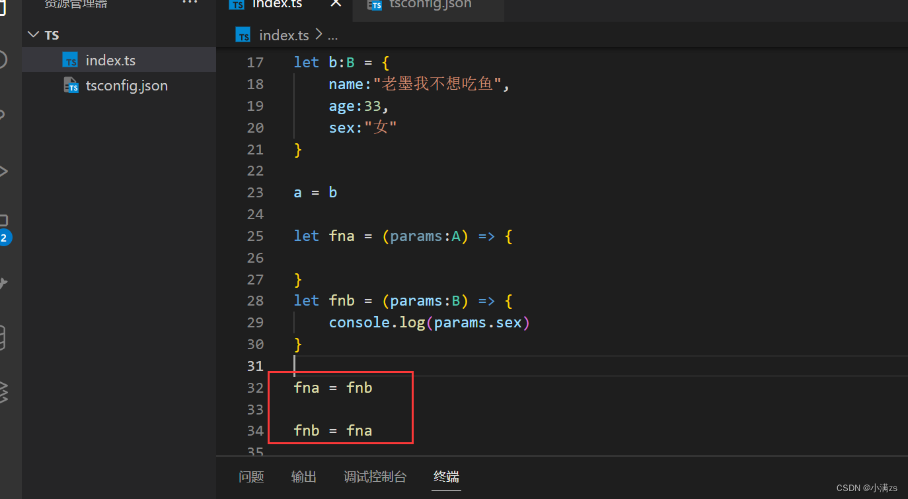

# 进阶类型兼容

所谓的类型兼容性，就是用于确定一个类型是否能赋值给其他的类型。TypeScript中的类型兼容性是基于**结构类型**的（也就是形状），如果A要兼容B 那么A至少具有B相同的属性。

## 协变

也叫鸭子类型，什么是鸭子类型

一只鸟 走路像鸭子 ，游泳也像，做什么都像，那么这只鸟就可以成为鸭子类型。

```ts
// 父类型
interface A {
    name:string
    age:number
}
// 子类型
interface B {
    name:string
    age:number
    sex:string
}
 
let a:A = {
    name:"老墨我想吃鱼了",
    age:33,
}
 
let b:B = {
    name:"老墨我不想吃鱼",
    age:33,
    sex:"女"
}
 
a = b
```

A B两个类型完全不同但是竟然可以赋值并无报错。B类型充当A类型的子类型，当子类型里面的属性可以覆盖A类型的所有属性就可以进行赋值，也就是说不能少可以多，这就是协变。

## 逆变

一般发生在函数的参数上

```ts
interface A {
    name:string
    age:number
}
 
interface B {
    name:string
    age:number
    sex:string
}
 
let a:A = {
    name:"老墨我想吃鱼了",
    age:33,
}
 
let b:B = {
    name:"老墨我不想吃鱼",
    age:33,
    sex:"女"
}
 
a = b
 
let fna = (params:A) => {
 
}
let fnb = (params:B) => {
    
}
 
fna = fnb //错误
 
fnb = fna //正确
```

我们将`fnb`赋值给`fna`，最后执行`fna`的时候执行的还是`fnb`，当我们`fna(params:A)`的时候就相当于`fnb(params:A)`,就相当于我们将A类型的值赋值给B类型，这么做是肯定不行的，因为A类型不能全覆盖B类型的属性，少了一个`sex`属性，是不安全的。

反之`fna`赋值给`fnb`就是成立的

## 双向协变

tsconfig strictFunctionTypes 设置为false 支持双向协变 fna fnb 随便可以来回赋值



