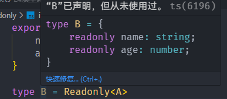

# Record & Readonly

## Readonly

和Partial原理类似,将接口所有属性变为只读属性

### 源码

```ts
type Readonly<T> = {
    readonly [P in keyof T]: T[P];
};
```

### 使用

```ts
export interface A {
    name:string
    age:number
}

type B = Readonly<A>
```



### Record

### 原理

```ts
type Record<K extends keyof any, T> = {
    [P in K]: T;
};
```

1. keyof any 返回 string|number|symbol 的联合类型
2. extends来约束我们的类型，K只能是string | number | symbol

3. in 我们可以理解成for in，就是遍历K类型的每一项

4. T直接返回类型

### 使用

既约束了类型，又约束了属性

`obj`对象只能是A、B、C三个属性，且都是Person类型

```ts
type A = "A" | "B" | "C";
interface Person {
	name: string;
	age: number;
}
type B = Record<A, Person>;

let obj: B = {
	A: {
		name: "A",
		age: 1,
	},
	B: {
		name: "B",
		age: 2,
	},
	C: {
		name: "C",
		age: 3,
	},
};
```

