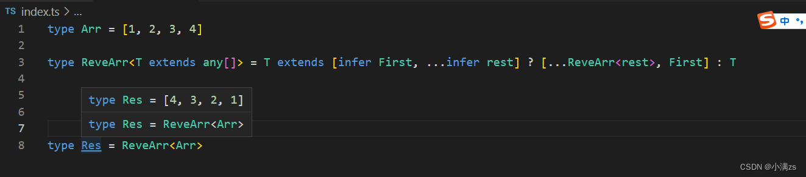

# infer

## 基础使用

infer 是TypeScript新增到的关键字 充当占位符

我们来实现一个条件类型推断的例子

定义一个类型 如果是数组类型 就返回 数组元素的类型 否则 就传入什么类型 就返回什么类型

> 个人理解：因为数组是{1:类型，2:类型...}这样的对象，所以T[number]可以取出每一个元素的属性，也就是数组的属性

```ts
type Infer<T> = T extends Array<any> ? T[number] : T
 
type A = Infer<(boolean | string)[]>

type B = Infer<null>
```

使用inter 修改

```ts
type Infer<T> = T extends Array<infer U> ? U : T
 
type A = Infer<(string | Symbol)[]>
```

例子2配合**tuple** 转换 **union** 联合类型

```ts
type TupleToUni<T> = T extends Array<infer E> ? E : never
 
type TTuple = [string, number];
 
type ToUnion = TupleToUni<TTuple>; // string | number
```

## 进阶使用

1. 提取头部元素

```ts
type arr = ['a','b','c'];

type First<T extends any[]> = T extends [infer F, ...any[]] ? F : [];

type a = First<arr>
```

2. 提取尾部元素

```ts
type Last<T extends any[]> = T extends [...any[], infer Last] ? Last : [];
```

3. 删除第一个元素shift

```ts
type shift<T extends any[]> = T extends [infer F, ...infer Rest] ? Rest : [];
```

4. 删除最后一个元素pop

```ts
type pop<T extends any[]> = T extends [...infer Rest, infer L] ? Rest : [];
```

infer就是个占位的作用，不用管具体到底是什么属性

### 递归使用

有这么一个类型

```TypeScript
type Arr = [1, 2, 3, 4]
```

希望通过一个 ts 工具变成

```TypeScript
type Arr = [4,3,2,1]
```

 具体思路 首先使用泛型约束,约束只能传入数组类型的东西,然后从数组中提取第一个,放入新数组的末尾,反复此操作,形成递归,满足结束条件返回该类型

代码

````ts
type Arr = [1, 2, 3, 4]
 
type ReveArr<T extends any[]> = T extends [infer First, ...infer rest] ? [...ReveArr<rest>, First] : T
 
type Res = ReveArr<Arr>
````

