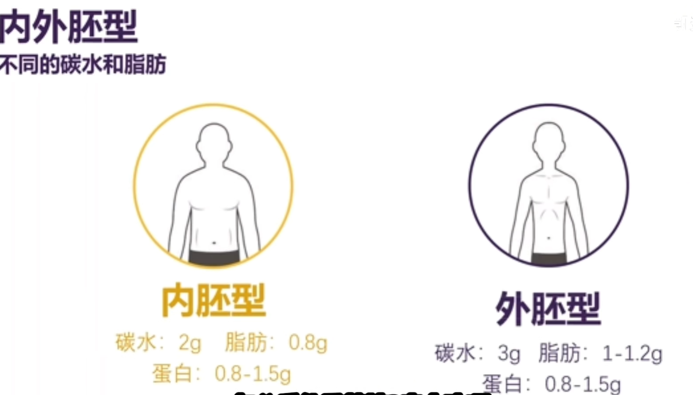
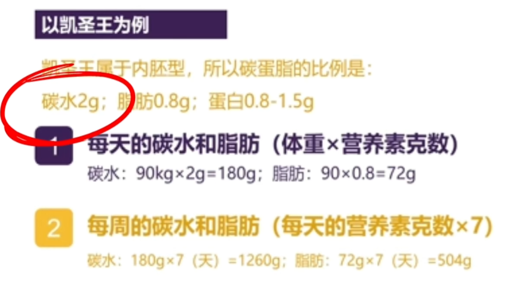
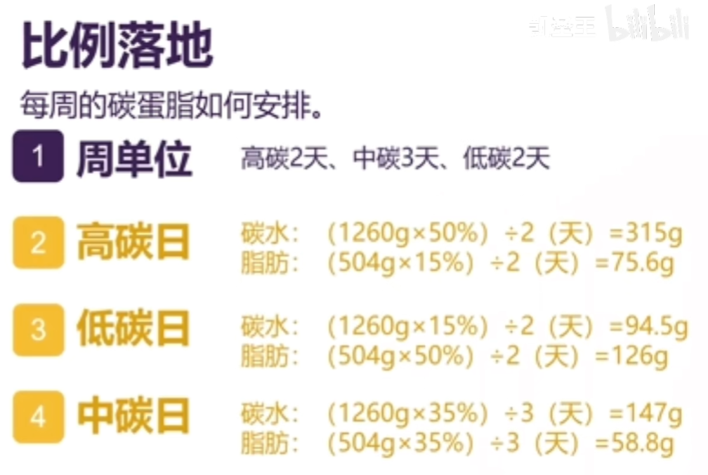
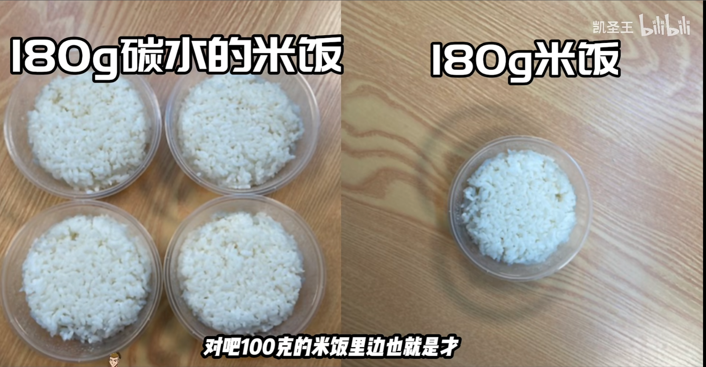

# 减脂篇

## 1.碳水循环

> [视频1](https://www.bilibili.com/video/BV1YS4y1Y7fn/?spm_id_from=333.788&vd_source=7dcb6c648b7faefd7170d0fc0494d4ad)
>
> [详细讲碳水循环上](https://www.bilibili.com/video/BV1Gh411479A/?vd_source=7dcb6c648b7faefd7170d0fc0494d4ad)
>
> [详细讲碳水循环下]

一直低碳不太好，有瓶颈期，最常规的碳水循环是三天低碳，一天高碳(视频一观点)

### 1.1 什么是碳水循环

增肌/减脂都很适合碳水循环；所有的饮食方式都先让身体产生一个适应性，然后在这个适应性上再微调，让身体给予一个反馈；

**在计划碳水循环的饮食计划时，高中低碳日热量接近**。

#### 一、改变计算方式

在传统分餐计算方式中，以热量为单位，以热量计算碳蛋脂比例，通常情况下是碳水50% 蛋白质25% 脂肪25%

而在碳水循环计划中，**从热量计算改为体重计算(每公斤体重吃多少克的碳水)**。

根据自身不同的内外胚型来选择碳蛋脂；内胚型容易长胖的类型，外胚型不太容易长胖；

内胚型:碳水2g 脂肪0.8g 蛋白质0.8~1.5g

外胚型:碳水3g 脂肪1~1.2g 蛋白质0.8~1.5g

这是一个起点，根据增肌/减脂进行调整，调整方式非常重要；依据这个起点，根据晨脉、体重、腰围、臂围进行调整并且与运动强度进行结合、碳水前置后置进行匹配。

#### 二、比例落地

以周为计算单位，然后得出每周要吃的碳水总和，再分为高中低碳三种(碳水循环初期并不计算零碳日，这是后期调整的一种手段)

具体例子如下

然后两天高碳日要吃掉总碳水量的50%

**不仅碳水要波动，脂肪也要波动**，在高碳日的时候就要低脂，低碳日的时候高脂。因为

- 1g碳水 = 4大卡
- 1g蛋白 = 4大卡
- 1g脂肪 = 9大卡

在低碳日增加脂肪，可以把热量拉一拉，造成地毯日和高碳日的热量差不是很大。

蛋白质要摄入优质蛋白质:豆蛋奶鱼，并且要分餐吃，人体吸收蛋白质的速率是10g/小时，最好是分三次以上，每隔2、3个小时吃一次

#### 三、实操误区

- 高碳日要吃一些好消化吸收的碳水。

- 低碳日尽量让自己不要那么饿，吃一些粗纤维的食物

- 运动营养灵活性很强，并不是只有鸡胸肉、红薯米饭

#### 补充

1. 碳水重量 !== 食物重量

2. 高蛋白饮食不可取

如果是健身初期/减脂初期，训练强度不大，蛋白质0.8\~1g就足够了。健身强度上来了，按1.2g\~1.5g吃也没问题

3. 高碳日的意义

如果一直创造热量赤字，身体会进入代谢补偿，代谢补偿是身体的保护机制，是身体为了适应热量不足降低热量消耗的过程，因为**身体机制是确保我们活下去而不是变好看。**最后导致体重下降的速度减慢甚至停滞

4. 中碳日的意义

给我们足够的，对等的热量，给予我们热量去完成运动

5. 基础代谢的计算值

BMR(男) = (13.7 * 体重(公斤)) + (5.0 * 身高(公分)) - (6.8 * 年龄) + 66

### 1.2 与锻炼配合

碳水循环如果不是专业的健美运动员，没必要折磨自己，想吃拉面高碳日就能吃拉面，想吃烧烤，低碳日就能吃烧烤。我们只需要知道我们什么时候摄入高碳，什么时候摄入低碳。

碳水循环更加适合有训练习惯的人；

强度越高的运动，身体消耗糖的比例就越高；强度越低的运动，身体消耗脂肪的比例就越高

#### 一、高碳

1. 消除代谢补偿
2. 延续减脂的惯性
3. 糖原补充

最好放在腿背的那一天。(如果没有运动，可以砍掉高碳日，维持身体健康)

摄入的碳水会优先糖原的补充，当糖原充足时，碳水会向脂肪转化；而当我们运动后糖原亏空时，所摄入的碳水会优先补充肌糖原(运动前的碳水大部分转化为脂肪，运动后的碳水大部分转化为糖原)

注意：

- 吃一些比较好消化吸收的，因为要吃的碳水较多，馒头、面条、米饭这种，运动饮料，水果都算碳水，很多元化

#### 二、低碳

1. 利用惯性减脂
2. 恢复激素

最好放在休息日、练手、练肩的那一天。

注意：

- 可以吃一些粗粮，土豆、芋头不推荐经常拿红薯来当主食来源，因为对肠胃不好

#### 三、中碳

1. 给予身体足够对等的热量
2. 让身体有一个不错的运动状态

放在练胸、练背、练肩的那一天都可以

#### 补充

- 实际操作时候有两个数值可以参考

1. 晨脉

早上起来之后测一下晨脉，如果在日常平均数值基础上突然高出8以上，可能是休息恢复不够，可以增加碳水避免代谢补偿

2. 精神状态和食欲

如果精神状态差或食欲低下，这一天可以把热量拉高，**可以在运动后/早餐加碳水**，不推荐加在睡前

- 体重每周下降0.5\~1.5kg较为合适，具体情况因人而异

3. 食堂粗略计算，一份炒菜按脂肪5-10g计算

4. 常见食物碳水含量

| 食物       | 碳水含量/100g | 膳食纤维含量/100g |
| ---------- | ------------- | ----------------- |
| 米饭       | 25.9          | 0.3               |
| 红薯       | 20.1          | 3                 |
| 紫薯       | 31.7          | 2.5               |
| 黄南瓜     | 5.3           | 0.8               |
| 莲藕       | 11.5          | 2.2               |
| 山药       | 12.4          | 0.8               |
| 芋头       | 12.7          | 1                 |
| 马铃薯     | 17.8          | 1.1               |
| 荔浦芋头   | 19.7          | 1.1               |
| 贝贝南瓜   | 20.6          | 3.5               |
| 鲜豌豆     | 21.2          | 3                 |
| 玉米       | 22.8          | 2.9               |
| 全麦面包   | 43.1          | 6                 |
| 白馒头     | 47            | 1.3               |
| 绿豆(生)   | 62            | 6.4               |
| 白面条(生) | 65.6          | 0.8               |
| 生米       | 77.2          | 0.6               |

### 1.4 实际执行计划(暂定)

基础代谢:(13.7 * 75) + (5 * 173) - (6.8 * 21) + 66 = 1815.7

