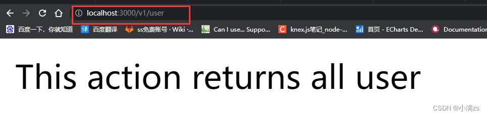

# RESTful风格

> [CSDN](https://xiaoman.blog.csdn.net/article/details/126256102)

RESTful 是一种风格，在RESTful中，一切都被认为是资源，每个资源有对应的URL标识.

不是标准也不是协议，只是一种风格。当然你也可以不按照他的风格去写。

1.接口url
传统接口

http://localhost:8080/api/get_list?id=1

http://localhost:8080/api/delete_list?id=1

http://localhost:8080/api/update_list?id=1

RESTful接口

http://localhost:8080/api/get_list/1 查询 删除 更新

RESTful 风格一个接口就会完成 增删改差 他是通过不同的请求方式来区分的

查询GET

提交POST

更新 PUT PATCH

删除 DELETE


#### 2.RESTful 版本控制 

一共有三种我们一般用第一种 更加语义化

|                         | 具体含义                          |
| ----------------------- | --------------------------------- |
| `URI Versioning`        | 版本将在请求的 URI 中传递（默认） |
| `Header Versioning`     | 自定义请求标头将指定版本          |
| `Media Type Versioning` | 请求的`Accept`标头将指定版本      |

首先在`main.ts`中开启版本控制

```ts
import { NestFactory } from '@nestjs/core';
import { VersioningType } from '@nestjs/common';
import { AppModule } from './app.module';
 
async function bootstrap() {
  const app = await NestFactory.create(AppModule);
  app.enableVersioning({
    type: VersioningType.URI,
  })
  await app.listen(3000);
}
bootstrap();
```

然后在user.controller 配置版本

Controller 变成一个对象 通过version 配置版本

```typescript
import { Controller, Get, Post, Body, Patch, Param, Delete, Version } from '@nestjs/common';
import { UserService } from './user.service';
import { CreateUserDto } from './dto/create-user.dto';
import { UpdateUserDto } from './dto/update-user.dto';
 
@Controller({
  path:"user",
  version:'1'
})
export class UserController {
  constructor(private readonly userService: UserService) {}
 
  @Post()
  create(@Body() createUserDto: CreateUserDto) {
    return this.userService.create(createUserDto);
  }
 
  @Get()
  // @Version('1')
  findAll() {
    return this.userService.findAll();
  }
 
  @Get(':id')
  findOne(@Param('id') id: string) {
    return this.userService.findOne(+id);
  }
 
  @Patch(':id')
  update(@Param('id') id: string, @Body() updateUserDto: UpdateUserDto) {
    return this.userService.update(+id, updateUserDto);
  }
}
```

最后结果



 3.Code码规范

| 状态码 | 含义                                     |
| ------ | ---------------------------------------- |
| 200    | OK                                       |
| 304    | Not Modified 协商缓存                    |
| 400    | Bad Request 参数错误                     |
| 401    | Internal Server Error 服务端错误         |
| 403    | Forbidden referer origin 验证失败        |
| 404    | Not Found 接口不存在                     |
| 500    | Internal Server Error 服务端错误         |
| 502    | Bad Gateway 上游接口有问题或者服务器问题 |