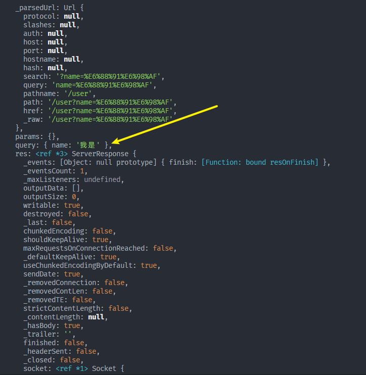

# 控制器

> [CSDN](https://xiaoman.blog.csdn.net/article/details/126324056)

## Controller Request （获取前端传过来的参数）

nestjs 提供了方法参数装饰器 用来帮助我们快速获取参数 如下

## 1.获取get请求参数

1. 使用`@Request`

可以获取完整的请求信息，会有非常多的内容，里面可以通过`req.query`获取query传参

```ts
@Controller('user')
export class UserController {
  constructor(private readonly userService: UserService) {}

  @Get()
  requestTest(@Request() req) {
    console.log(req.query);
    return {
      code: 200,
    };
  }
}
```



2. 直接使用`@Query`

省的还要多一层

```ts
  @Get('query')
  queryTest(@Query() query) {
    console.log(query);
    return {
      code: 200,
      content: query,
    };
  }
```

还可以在控制器中直接指明要使用的参数

```ts
  @Get('query')
  queryTest(@Query('name') query) {
    console.log(query);
    return {
      code: 200,
      content: query,
    };
  }
```

## 2.post请求获取参数值

1. 使用`@Request`

然后从body从读取数据

```ts
  @Post('postRequest')
  postRequestTest(@Request() req) {
    console.log(req.body);
    return {
      code: 200,
      content: req.body,
    };
  }
```

2. 使用`@Body`控制器

```ts
  @Post('postBody')
  postBodyTest(@Body() body) {
    console.log(body);
    return {
      code: 200,
      content: body,
    };
  }
```

还可以在控制器中直接指明要使用的参数

```ts
  @Post('postBody')
  postBodyTest(@Body('age') body) {
    console.log(body);
    return {
      code: 200,
      content: body,
    };
  }
```

## 3.动态参数

1. 使用类似于`:id`占位符

```ts
  @Get('list/:id')
  dymasticTest(@Request() req) {
    console.log(req.params);
    return {
      code: 200,
      content: req.params,
    };
  }
```

2. 直接使用`@Param`

## 4. 请求头信息

1. 使用`@Headers`控制器

```ts
  @Get('headersTest')
  headersTest(@Headers() req) {
    console.log(req);
    return {
      code: 200,
      content: req,
    };
  }
```

